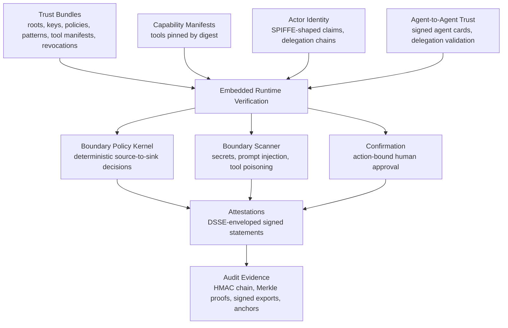
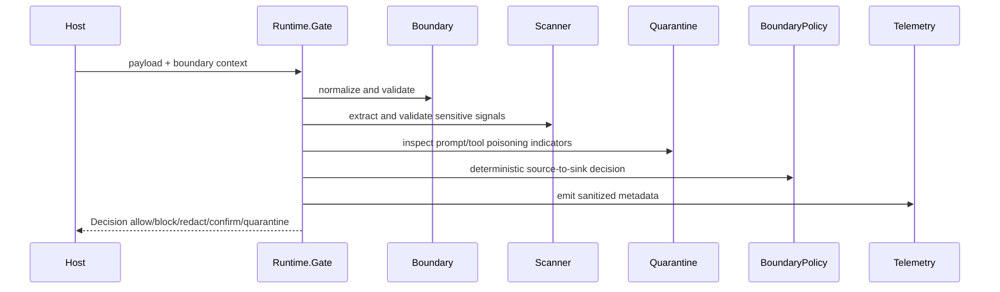
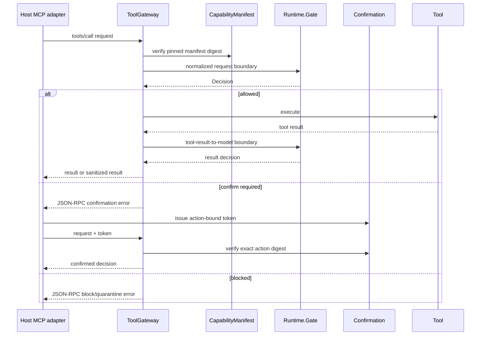
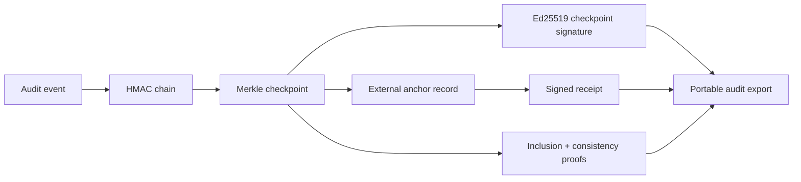

# SigilGuard Architecture

SigilGuard is an embedded native-Elixir security runtime for MCP and agent-tool
boundaries. It runs in-process on the BEAM and depends on no hosted registry,
no Rust/NIF backend, and no network call on the decision path. This document
maps its architecture: the component layers, the module topology, and the
runtime, MCP, and audit-evidence flows.

The architecture is the **Agent Trust Profile**: signed local trust bundles,
canonical agent and MCP attestations, a deterministic boundary policy kernel,
staged scanning with quarantine, and exportable tamper-evident audit evidence.

## Component Layers

Trust material and capability manifests are verified offline and feed a
deterministic runtime that emits typed attestations and signed evidence.

## Module Topology

The public facade over the internal modules, grouped by responsibility.

```mermaid
flowchart TD
    API[SigilGuard<br/>scan · guard · policy_verdict]

    API --> Profile[Trust Profile]
    Profile --> TrustProfile[TrustProfile]
    Profile --> Attestation[Attestation]
    Attestation --> Statement[Attestation.Statement]
    Attestation --> Digest[Attestation.Digest]
    Attestation --> Envelope[Attestation.Envelope]
    Profile --> JCS[Canonical.JCS]

    API --> Bundle[TrustBundle]
    Bundle --> BundleVerify[TrustBundle.Verify]
    Bundle --> BundleSchema[TrustBundle.Schema]
    Bundle --> BundleCache[TrustBundle.Cache]
    Bundle --> BundleQuar[TrustBundle.Quarantine]
    Bundle --> PatternSets[PatternSets]

    API --> Gateway[Tool Gateway]
    Gateway --> ToolGateway[ToolGateway]
    ToolGateway --> ToolGatewayBase[ToolGateway.Base]
    Gateway --> Manifest[CapabilityManifest]
    Gateway --> MCP[MCP.Gateway facade]
    Gateway --> Confirmation[Confirmation]

    API --> Runtime[Boundary Runtime]
    Runtime --> Boundary[Boundary]
    Runtime --> BoundaryPolicy[BoundaryPolicy]
    BoundaryPolicy --> PolicyFile[BoundaryPolicy.File]
    BoundaryPolicy --> PolicyContract[BoundaryPolicy.Contract]
    Runtime --> Gate[Runtime.Gate]
    Runtime --> Stream[Runtime.Stream]
    Runtime --> Scanner[Scanner]
    Scanner --> ScannerPipeline[Scanner.Pipeline]
    Runtime --> Quarantine[Quarantine]
    Runtime --> Hooks[Hooks]
    Runtime --> RepoPolicy[RepoPolicy]

    API --> Audit[Audit]
    Audit --> Event[Audit.Event]
    Audit --> Checkpoint[Audit.Checkpoint]
    Audit --> Proof[Audit.Proof]
    Audit --> Evidence[Audit.Evidence]
    Audit --> Witness[Audit.Witness]
    Audit --> CloudEvents[Audit.CloudEvents]
    Audit --> Anchor[Audit.Anchor + Store]
    Audit --> Export[Audit.Export]

    API --> Peers[AgentCard]
    Peers --> AgentTrust[AgentTrust]

    API --> Host[Host Behaviours]
    Host --> Signer[Signer / Signer.Ed25519]
    Host --> Vault[Vault]
    Host --> IdentityB[Identity]
    Host --> HTTPClient[HTTPClient]

    API --> Infra[Caller-supervised Runtime · Config · Telemetry · ReplayStore]
```

## Boundary Flows

### Runtime Gate

A payload and its boundary context become a deterministic decision. No external
sink is allowed unless an explicit source-to-sink rule permits it.

### MCP And Tool Gateway

Tool requests and results are bound to a pinned capability manifest and a
signed attestation. Confirmation is bound to the exact action digest.

### Audit Evidence

Every decision links into a tamper-evident chain with signed checkpoints,
inclusion and consistency proofs, and portable exports for external anchoring.

## Components

| Component | Responsibility |
|-----------|----------------|
| Trust Profile | Profile constants, canonical encoding (DSSE over JCS), and signed attestations over action, payload, context, and manifest digests. |
| Trust Bundles | Offline load, verification, caching, and quarantine of signed trust material with TUF-style roles, thresholds, expiry, and revocation. |
| Tool Gateway | Transport-neutral request and result guards, capability-manifest digest pinning, and action-bound confirmation tokens. |
| Boundary Runtime | The deterministic gate, boundary normalization, source-to-sink policy, staged scanner, quarantine, lifecycle hooks, and streaming sanitizer. |
| Audit | HMAC-linked event chains, Merkle checkpoints with proofs, external anchor stores, and portable signed exports. |
| Agent-to-Agent Trust | Signed agent cards and delegation-chain validation for inter-agent calls. |
| Host Behaviours | Signing, vault, identity, audit persistence, and outbound HTTP, supplied by the host application. |
| Infrastructure | Configuration, telemetry with OpenTelemetry attribute mapping, and replay protection. |

## Non-Goals

- No public hosted registry dependency.
- No Rust or NIF backend path.
- No remote network trust in core decision paths by default.
- No ML model weights in core; adaptive detection is an optional behaviour with
  a deterministic nil-path.
