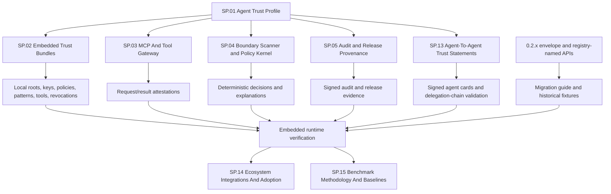
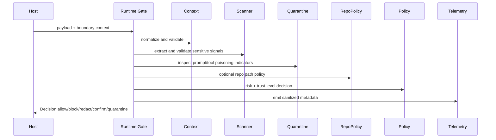
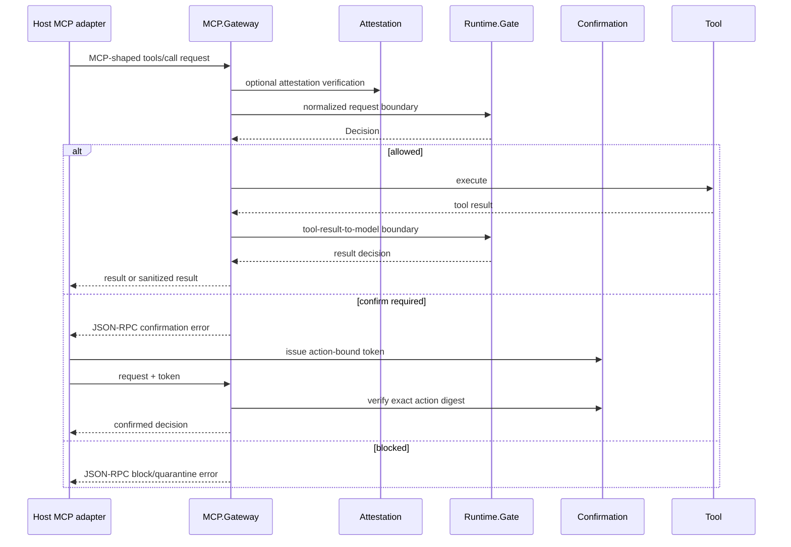
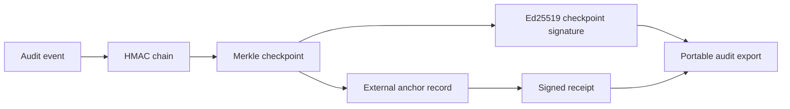
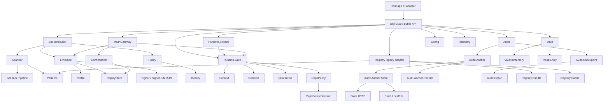
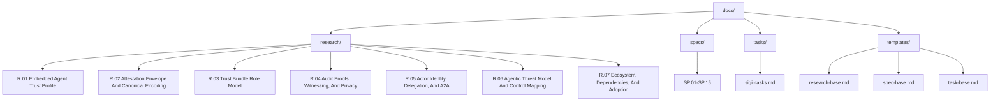

# SigilGuard Architecture Index

This is the canonical codebase and planning map. The root `README.md` is the
quickstart and package overview; this file owns the target architecture, the
current implementation, the boundary flows, and the documentation index.

## Reading Order

| Need | Start Here |
|------|------------|
| Building out v3 (read first) | [`tasks/sigil-tasks.md`](tasks/sigil-tasks.md) (Orientation, then M1) |
| Product overview and examples | [`../README.md`](../README.md) |
| Target architecture | [Agent Trust Profile](#agent-trust-profile) |
| Runtime and MCP flow | [Boundary Flows](#boundary-flows) |
| Current implementation map | [Current Implementation (0.2.x)](#current-implementation-02x) |
| Research rationale | [`research/README.md`](research/README.md) (R.01 strategy, R.02-R.07 decisions) |
| Implementable specs | [Spec Catalogue](#spec-catalogue) |

## Design Position

SigilGuard is an embedded native-Elixir security runtime for MCP and agent-tool
boundaries. It depends on no hosted registry, no Rust/NIF backend, and no live
upstream protocol service. Its architecture is the **SigilGuard Agent Trust
Profile**: local signed trust bundles, canonical agent/MCP attestations,
deterministic boundary policy, staged scanning, quarantine, and exportable
audit evidence.

That profile is the target the v3 specs (`SP.01`-`SP.15`) define and the task
list executes. The released 0.2.x code is the foundation being rewritten into
it: it still carries SIGIL-shaped wire fields and registry-named modules, which
v3 removes with documented migration. The Agent Trust Profile is the headline
below; the [current 0.2.x map](#current-implementation-02x) follows as a
transition reference.

## Agent Trust Profile

The v3 architecture keeps the useful native-Elixir foundations and replaces the
legacy public protocol surfaces with signed trust material, typed attestations,
a deterministic policy kernel, and exportable evidence.

### Delivery Tracks

| Track | Goal | Spec |
|-------|------|------|
| Agent Trust Profile | Define the SigilGuard-owned profile, vocabulary, canonical statements, breaking boundary, and migration target. | [`SP.01`](specs/SP.01-sigilguard-trust-profile.md) |
| Embedded Trust Bundles | Replace registry-first vocabulary with signed local bundle load/verify/cache/quarantine APIs and no network core. | [`SP.02`](specs/SP.02-embedded-trust-bundles.md) |
| Agent/MCP Attestations | Bind actors, tools, schemas, inputs, outputs, audiences, resources, manifests, and decisions. | [`SP.03`](specs/SP.03-mcp-attestation-gateway.md) |
| Boundary Scanner And Policy | Expand staged scanning, lifecycle phases, sandbox identity, output contracts, and deterministic source-to-sink policy. | [`SP.04`](specs/SP.04-boundary-scanner-and-policy-kernel.md) |
| Audit And Release Provenance | Add OTel attributes, signed evidence, inclusion/consistency proofs, witness cosigning, audit exports, release SBOM, and provenance. | [`SP.05`](specs/SP.05-audit-and-release-provenance.md) |
| Agent-To-Agent Trust | Sign and verify agent cards, agent request/response statements, and delegation chains. | [`SP.13`](specs/SP.13-agent-to-agent-trust-statements.md) |
| Ecosystem Integrations And Adoption | Ship integration contracts, cheatsheets, livebooks, security posture artifacts, and the announcement plan. | [`SP.14`](specs/SP.14-ecosystem-integrations-and-adoption.md) |
| Benchmarks And Baselines | Define the benchmark scenario matrix, regression gates, comparison rules, and SLO ratification. | [`SP.15`](specs/SP.15-benchmark-methodology-and-baselines.md) |

## Boundary Flows

The runtime decision, MCP gateway, and audit-evidence flows. The shapes are
stable across the 0.2.x foundation and the v3 rewrite; v3 adds signed
attestations, capability-manifest binding, and inclusion/consistency proofs.

### Runtime Gate

### MCP Gateway

### Audit Evidence

## Current Implementation (0.2.x)

The released code being rewritten into the Agent Trust Profile, and the specs
that own each contract. The `Registry`, `Envelope`, and `Profile` surfaces are
removed in v3 (`SP.12`); the rest is reused and extended.

### Module Groups And Contract Specs

| Group | Modules | Contract Spec |
|-------|---------|---------------|
| Native backend and envelopes | `SigilGuard`, `Backend`, `Backend.Elixir`, `Envelope`, `Profile`, `ReplayStore`, `Signer` | [`SP.06`](specs/SP.06-envelope-and-native-backend-contracts.md) |
| Runtime boundary checks | `Context`, `Decision`, `Runtime.Gate`, `Runtime.Stream`, `Scanner`, `Scanner.Pipeline`, `Quarantine` | [`SP.07`](specs/SP.07-runtime-gate-and-streaming-contracts.md) |
| MCP and approvals | `MCP.Gateway`, `Confirmation` | [`SP.08`](specs/SP.08-mcp-gateway-and-confirmation-contracts.md) |
| Audit evidence | `Audit`, `Audit.Checkpoint`, `Audit.Anchor`, `Audit.Anchor.Store`, `Audit.Export` | [`SP.09`](specs/SP.09-audit-chain-and-anchor-contracts.md) |
| Vault and identity | `Vault`, `Vault.InMemory`, `Vault.Entry`, `Identity`, `Identity.Binding` | [`SP.10`](specs/SP.10-vault-and-identity-contracts.md) |
| Repo policy | `RepoPolicy`, `RepoPolicy.Decision` | [`SP.11`](specs/SP.11-repo-policy-kernel-contracts.md) |
| Legacy remote removal | `Registry`, `Registry.Bundle`, `Registry.Cache` | [`SP.12`](specs/SP.12-legacy-remote-bundle-adapter-contracts.md) |

## Spec Catalogue

| ID | Status | Purpose |
|----|--------|---------|
| [`SP.01`](specs/SP.01-sigilguard-trust-profile.md) | planned | Agent Trust Profile. |
| [`SP.02`](specs/SP.02-embedded-trust-bundles.md) | planned | Embedded trust bundles. |
| [`SP.03`](specs/SP.03-mcp-attestation-gateway.md) | planned | MCP/tool attestations and capability manifests. |
| [`SP.04`](specs/SP.04-boundary-scanner-and-policy-kernel.md) | planned | Boundary-aware scanner and policy kernel. |
| [`SP.05`](specs/SP.05-audit-and-release-provenance.md) | planned | Audit and release provenance. |
| [`SP.06`](specs/SP.06-envelope-and-native-backend-contracts.md) | implemented/transition | Envelope and native backend transition contracts. |
| [`SP.07`](specs/SP.07-runtime-gate-and-streaming-contracts.md) | implemented | Runtime gate and streaming contracts. |
| [`SP.08`](specs/SP.08-mcp-gateway-and-confirmation-contracts.md) | implemented | MCP gateway and confirmation contracts. |
| [`SP.09`](specs/SP.09-audit-chain-and-anchor-contracts.md) | implemented | Audit chain and anchor contracts. |
| [`SP.10`](specs/SP.10-vault-and-identity-contracts.md) | implemented | Vault and identity contracts. |
| [`SP.11`](specs/SP.11-repo-policy-kernel-contracts.md) | implemented | Repo policy kernel contracts. |
| [`SP.12`](specs/SP.12-legacy-remote-bundle-adapter-contracts.md) | planned/removal | Legacy remote-bundle removal plan. |
| [`SP.13`](specs/SP.13-agent-to-agent-trust-statements.md) | planned | Agent cards and agent-to-agent trust statements. |
| [`SP.14`](specs/SP.14-ecosystem-integrations-and-adoption.md) | planned | Ecosystem integrations and adoption artifacts. |
| [`SP.15`](specs/SP.15-benchmark-methodology-and-baselines.md) | planned | Benchmark methodology and baselines. |

Statuses reflect implementation state, not design maturity: every spec is a
finalized, research-backed contract. "planned" means the code is not yet built;
"implemented" means the 0.2.x foundation already provides it and v3 extends it.

## Documentation Tree

## Non-Goals

- No public hosted registry dependency.
- No Rust or NIF backend path.
- No remote network trust in core decision paths by default.
- No direct integration with outside inspiration projects.
- No legacy SIGIL runtime adapter as the v3 product center.
- No ML model weights in core; adaptive detection stays an optional
  behaviour with a deterministic nil-path.
