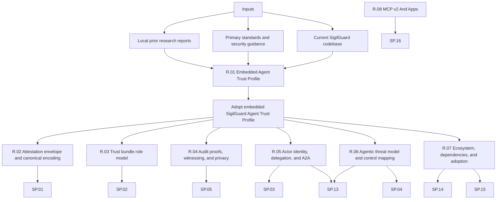

# SigilGuard Research Index

Research notes justify architecture decisions before broad implementation. A
research note is not a task list; it records the question, methodology,
evidence, comparison, recommendation, and impact on specs.

## Decision Flow

## Current Research Notes

| ID | Status | Decision | Feeds | Summary |
|----|--------|----------|-------|---------|
| [`R.01`](R.01-embedded-mcp-trust-profile.md) | complete | adopted | [`SP.01`](../specs/SP.01-sigilguard-trust-profile.md), [`SP.02`](../specs/SP.02-embedded-trust-bundles.md), [`SP.03`](../specs/SP.03-mcp-attestation-gateway.md), [`SP.04`](../specs/SP.04-boundary-scanner-and-policy-kernel.md), [`SP.05`](../specs/SP.05-audit-and-release-provenance.md) | SigilGuard should treat the old upstream protocol as historical compatibility and move to an embedded Agent Trust Profile with local bundles, typed attestations, deterministic policy, staged scanning, and exportable evidence. |
| [`R.02`](R.02-attestation-envelope-and-canonical-encoding.md) | complete | adopted | [`SP.01`](../specs/SP.01-sigilguard-trust-profile.md), [`SP.02`](../specs/SP.02-embedded-trust-bundles.md), [`SP.05`](../specs/SP.05-audit-and-release-provenance.md), [`SP.13`](../specs/SP.13-agent-to-agent-trust-statements.md) | All v3 signed artifacts use a DSSE envelope over a JCS-canonical in-toto-style Statement; JCS pitfalls are normative; COSE and JCS-only signing are rejected. |
| [`R.03`](R.03-trust-bundle-role-model.md) | complete | adopted | [`SP.02`](../specs/SP.02-embedded-trust-bundles.md), [`SP.12`](../specs/SP.12-legacy-remote-bundle-adapter-contracts.md) | Trust bundles adopt a TUF role subset: root plus delegated signer roles, threshold schema, expiry, sequence floors, revocations, and a documented emergency rotation ceremony. |
| [`R.04`](R.04-audit-proofs-witnessing-and-privacy.md) | complete | adopted | [`SP.05`](../specs/SP.05-audit-and-release-provenance.md), [`SP.09`](../specs/SP.09-audit-chain-and-anchor-contracts.md) | Audit checkpoints gain RFC 9162-style inclusion and consistency proofs and optional witness cosigning; audit fields carry clear/hashed/redacted/omitted privacy classes with a digest-first GDPR stance; SCITT stays an optional post-GA adapter. |
| [`R.05`](R.05-actor-identity-delegation-and-a2a.md) | complete | adopted | [`SP.01`](../specs/SP.01-sigilguard-trust-profile.md), [`SP.03`](../specs/SP.03-mcp-attestation-gateway.md), [`SP.10`](../specs/SP.10-vault-and-identity-contracts.md), [`SP.13`](../specs/SP.13-agent-to-agent-trust-statements.md) | Actor and issuer identities are SPIFFE-shaped strings carried opaquely, with optional did:key acceptance, RFC 8693 act-claim delegation chains, and host-owned OAuth at the MCP layer. |
| [`R.06`](R.06-agentic-threat-model-and-control-mapping.md) | complete | adopted | [`SP.03`](../specs/SP.03-mcp-attestation-gateway.md), [`SP.04`](../specs/SP.04-boundary-scanner-and-policy-kernel.md), [`SP.13`](../specs/SP.13-agent-to-agent-trust-statements.md), [`SP.14`](../specs/SP.14-ecosystem-integrations-and-adoption.md) | The normative threat model maps OWASP Agentic Top 10 2026 classes and named MCP attacks to SigilGuard controls with mitigates/detects/out-of-scope claims and TM.01-TM.12 test families. |
| [`R.07`](R.07-ecosystem-positioning-dependencies-and-adoption.md) | complete | adopted | [`SP.05`](../specs/SP.05-audit-and-release-provenance.md), [`SP.12`](../specs/SP.12-legacy-remote-bundle-adapter-contracts.md), [`SP.14`](../specs/SP.14-ecosystem-integrations-and-adoption.md), [`SP.15`](../specs/SP.15-benchmark-methodology-and-baselines.md) | V3 keeps a minimal, individually justified runtime dependency set (telemetry, nimble_options, jason — not zero), adaptive detection stays a behaviour with an optional post-GA package, no compatibility namespace ships, and the release sequence and adoption playbook are fixed. |
| [`R.08`](R.08-mcp-2026-07-28-and-apps-security.md) | complete | adopted | [`SP.03`](../specs/SP.03-mcp-attestation-gateway.md), [`SP.08`](../specs/SP.08-mcp-gateway-and-confirmation-contracts.md), [`SP.16`](../specs/SP.16-mcp-2026-07-28-and-apps-contracts.md) | MCP v2 (`2026-07-28`) requires structured MRTR-aware action binding, application-defined error codes outside reserved ranges, result discriminators, expanded manifest coverage, and optional MCP Apps boundary controls while transport and rendering remain host-owned. |

## Evidence Map

| Evidence Area | Why It Matters | Consumed By |
|---------------|----------------|-------------|
| MCP authorization and resource metadata | Actor/tool decisions must bind to server/resource/audience context. | `R.05`, `SP.03`, `SP.04` |
| Tool poisoning and prompt-injection guidance | Tool descriptions, schemas, annotations, and outputs are untrusted supply-chain inputs. | `R.06`, `SP.03`, `SP.04` |
| TUF-style signed metadata | Local trust bundles need root keys, expiry, rollback protection, revocation, and quarantine. | `R.03`, `SP.02` |
| JCS, DSSE, and in-toto statements | Attestations need typed canonical bytes and signed evidence, not ad hoc map signing. | `R.02`, `SP.01`, `SP.03`, `SP.05` |
| Certificate-transparency-style Merkle logs | Audit checkpoints should support export, inclusion, consistency, and external anchoring. | `R.04`, `SP.05`, `SP.09` |
| Workload and agent identity standards | Actor, issuer, and delegation claims need portable shapes without network resolution. | `R.05`, `SP.10`, `SP.13` |
| Elixir ecosystem integration surfaces | Adoption depends on MCP SDK interceptors, agent frameworks, and observability norms. | `R.07`, `SP.14`, `SP.15` |
| Existing SigilGuard implementation | Compatibility contracts must be preserved while terminology moves forward. | `SP.06` through `SP.12` |
| MCP v2 (`2026-07-28`) and MCP Apps | Stateless requests, MRTR, result discrimination, error allocation, and embedded UI introduce new security boundaries. | `R.08`, `SP.16` |

## Resolved Backlog

Every former backlog item has been promoted to a numbered research note or a
spec-owned section. Do not reopen these without a superseding research note.

| Former Candidate | Resolution |
|------------------|------------|
| Canonical bytes | Resolved by [`R.02`](R.02-attestation-envelope-and-canonical-encoding.md): DSSE envelope over JCS-canonical Statement payloads with golden-vector requirements. |
| Trust-bundle signatures | Resolved by [`R.03`](R.03-trust-bundle-role-model.md): threshold schema with v1 enforcing threshold 1; verification rules and quarantine matrix land in `SP.02`. |
| MCP transport binding | Resolved at spec level: `SP.03` owns the transport-neutral context schema for HTTP, stdio, and in-process MCP. |
| Streaming scanner guarantees | Resolved at spec level: `SP.04` owns the streaming holdback property-test plan and split-secret vectors. |
| Audit privacy model | Resolved by [`R.04`](R.04-audit-proofs-witnessing-and-privacy.md): per-field clear/hashed/redacted/omitted classes; normative tables land in `SP.05`. |
| Release provenance | Resolved at spec level: `SP.05` owns SLSA L3 provenance, the SPDX SBOM task, and CI verification examples. |

## Quality Bar

- Prefer primary standards, specifications, and maintained security guidance.
- Separate findings from recommendations.
- Name affected modules and specs.
- Include sources directly in the research note.
- Do not use a research note to smuggle implementation tasks; link to
  [`../tasks/sigil-tasks.md`](../tasks/sigil-tasks.md) instead.
