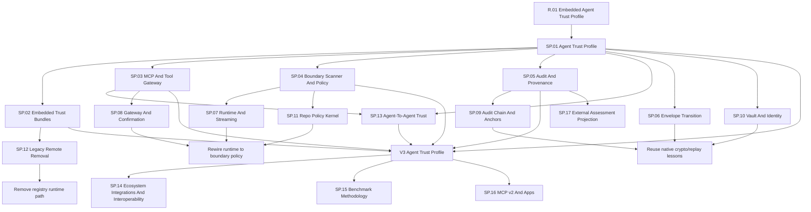

# SigilGuard Spec Index

Specs are implementation contracts. For v3 they define the Agent Trust Profile
end state, the current native-Elixir foundation to reuse, and the legacy public
surfaces to remove or migrate.

Use this index when deciding where a change belongs. Use
[`../tasks/sigil-tasks.md`](../tasks/sigil-tasks.md) when turning a spec into
checkbox work.

## Spec Topology

## V3 Agent Trust Profile Specs

These specs define the next major product shape. They intentionally allow
breaking changes; migration belongs in changelog and migration docs, not hidden
compatibility shims.

| Spec | Status | Owns | Primary Tests |
|------|--------|------|---------------|
| [`SP.01`](SP.01-sigilguard-trust-profile.md) | implemented | Agent Trust vocabulary, breaking boundary, `_agent_trust`, DSSE envelope over JCS Statement payloads, digest computation, error taxonomy. | Profile validation, canonical vectors, replay and digest mismatch. |
| [`SP.02`](SP.02-embedded-trust-bundles.md) | implemented | Local signed bundles, roots, revocations, sequence/expiry, quarantine, no network core. | Valid bundle, malformed bundle, rollback, expired bundle, revoked key, no-network tests. |
| [`SP.03`](SP.03-mcp-attestation-gateway.md) | implemented | Capability manifests, request/result attestations, audience/resource binding. | Tool digest drift, schema drift, wrong audience, token passthrough, poisoned result. |
| [`SP.04`](SP.04-boundary-scanner-and-policy-kernel.md) | implemented | Boundary policy input, lifecycle hooks, trust zones, sandbox identity, deterministic explanations. | Split secrets, validation confidence, hook phases, sandbox mismatch, path policy. |
| [`SP.05`](SP.05-audit-and-release-provenance.md) | implemented | Signed audit events, OTel attributes, Merkle proofs, witness cosigning, privacy classes, anchors, SBOM/release provenance, `HTTPClient` behaviour. | Signed exports, inclusion/consistency proofs, anchor verification, telemetry privacy, provenance docs. |
| [`SP.13`](SP.13-agent-to-agent-trust-statements.md) | implemented | Agent cards, `agent_request`/`agent_response` predicates, delegation-chain validation, peer trust. | Card tamper, unknown-agent quarantine, chain reorder/depth, trust-min derivation. |
| [`SP.14`](SP.14-ecosystem-integrations-and-interoperability.md) | implemented | Integration contracts (hermes_mcp, Jido, LangChain, Tidewave), cheatsheets, livebooks, SECURITY.md, and maintainer-owned adoption handoff. | Livebook execution, guide compile checks, docs coverage. |
| [`SP.15`](SP.15-benchmark-methodology-and-baselines.md) | implemented | Benchmark scenario matrix, environment disclosure, CI regression thresholds, llm-guard comparison rules, SLO ratification. | Bench harness smoke test, baseline regression gates. |
| [`SP.16`](SP.16-mcp-2026-07-28-and-apps-contracts.md) | implemented | MCP v2 structured action binding, MRTR/result discrimination, application-defined JSON-RPC codes, manifest v2, and MCP Apps boundary helpers. | Structured tamper, exact-version response, manifest header/icon/UI drift, app visibility, and UI-resource tests. |
| [`SP.17`](SP.17-external-assessment-projection.md) | implemented | Host-context OSCAL Assessment Results v1.2.3 observation projection with pinned evidence digests and no inferred findings. | Schema-conformant golden output, digest tamper, malformed context, time/scope, privacy, and export compatibility. |

## Foundation And Transition Specs

These specs capture current behavior that v3 should reuse, rewire, or remove.

| Spec | Status | Code Surface | V3 Role |
|------|--------|--------------|---------|
| [`SP.06`](SP.06-envelope-and-native-backend-contracts.md) | implemented/transition | `SigilGuard`, `Backend`, `ReplayStore`, `Signer`; removed `Envelope`/`Profile`. | Reuse native crypto/replay lessons; replace public envelopes with attestations. |
| [`SP.07`](SP.07-runtime-gate-and-streaming-contracts.md) | implemented | `Context`, `Decision`, `Runtime.Gate`, `Runtime.Stream`, `Scanner`, `Quarantine`. | Rewire to `Boundary` and `BoundaryPolicy`. |
| [`SP.08`](SP.08-mcp-gateway-and-confirmation-contracts.md) | implemented | `MCP.Gateway`, `Confirmation`. | Rewire to `_agent_trust`, `_agent_confirmation`, `ToolGateway`, and attestations. |
| [`SP.09`](SP.09-audit-chain-and-anchor-contracts.md) | implemented | `Audit`, `Audit.Checkpoint`, `Audit.Anchor`, `Audit.Export`. | Extend into signed evidence exports and OTel attributes. |
| [`SP.10`](SP.10-vault-and-identity-contracts.md) | implemented | `Vault`, `Vault.InMemory`, `Vault.Entry`, `Identity`, `Identity.Binding`. | Reuse host extension behaviours and local development vault semantics. |
| [`SP.11`](SP.11-repo-policy-kernel-contracts.md) | implemented | `RepoPolicy`, `RepoPolicy.Decision`. | Rewire as policy facts under `BoundaryPolicy`; rename old policy filenames. |
| [`SP.12`](SP.12-legacy-remote-bundle-adapter-contracts.md) | implemented/removal | Removed `Registry`, `Registry.Bundle`, `Registry.Cache`; replacement `TrustBundle`. | Remove public runtime path; replace with `TrustBundle` and migration docs. |

## Ownership Rules

- Agent Trust vocabulary belongs in `SP.01` before it appears in public docs.
- Bundle format, signatures, revocations, and local loading belong in `SP.02`.
- MCP and transport-neutral actor/tool/request/result binding belongs in
  `SP.03`.
- Scanner stages, source-to-sink context, lifecycle phases, sandbox identity,
  trust zones, and deterministic policy inputs belong in `SP.04`.
- Audit exports, OTel attributes, Merkle proofs, anchor receipts, SBOM, and
  release provenance belong in `SP.05`.
- Agent cards, agent-to-agent statement predicates, and delegation-chain
  validation belong in `SP.13`.
- Ecosystem integration contracts and adoption artifacts belong in `SP.14`.
- Benchmark methodology, baselines, and SLO ratification belong in `SP.15`.
- MCP protocol-revision compatibility and MCP Apps security belong in `SP.16`.
- External assessment projections and their authority boundary belong in
  `SP.17`; native audit evidence remains owned by `SP.05`.
- Old SIGIL wire fields, registry-named modules, old profile names, and Rust
  vectors belong only in migration docs or historical fixtures.

## Gate Before Merging Spec Changes

- Every spec has front matter with `id`, `title`, `status`, `priority`, and
  `depends_on`.
- Any future planned spec has matching tasks in
  [`../tasks/sigil-tasks.md`](../tasks/sigil-tasks.md).
- Every implemented or transition spec names concrete modules and tests.
- `mix docs` renders links without warnings.
- Local scans find no dead hosted protocol or registry URLs.
- Local scans find no old public vocabulary in v3 examples except migration
  docs and historical fixtures.
