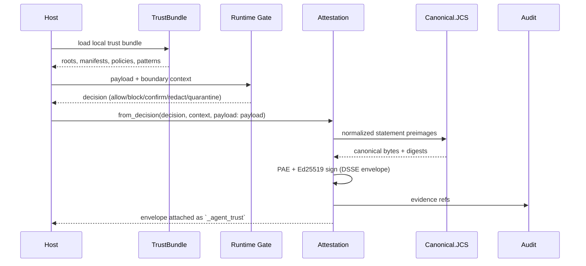

---
sigil_guard:
  id: "SP.01"
  title: "Agent Trust Profile"
  domain: security
  status: implemented
  priority: critical
  created: "2026-07-01"
  updated: "2026-07-07"
  tags: ["agent-trust", "attestation", "dsse", "jcs", "v3", "breaking-change"]
  depends_on: ["R.01", "R.02", "R.05", "R.06", "R.07"]
---

# SP.01 - Agent Trust Profile

## Executive Summary

SigilGuard v3 is a deliberate breaking release built around a SigilGuard-owned
Agent Trust Profile: DSSE-enveloped, JCS-canonical, in-toto-style statements
signed over action, payload, context, and manifest digests. This spec is the
normative pillar every other v3 spec references. It fixes the envelope and
canonical encoding (R.02), the statement type registry, the exact digest
field lists per statement type, the golden-vector fixtures, the public API
sketches, the final v3 configuration surface, the profile-wide error
taxonomy, the replay and expiry defaults, and the Envelope-to-Attestation
migration mapping. The old upstream protocol remains historical input only.

## Business Value

- **Problem:** Carrying compatibility with an abandoned protocol keeps the
  wrong abstractions in the public API, and ad hoc canonical bytes couple
  signature validity to JSON serialization details.
- **Solution:** One profile, one encoding, one verification code path, one
  shared error taxonomy, and a mechanical migration table.
- **Beneficiary:** Host applications embedding SigilGuard in MCP servers,
  gateways, CI, repo automation, and agent runtimes, including the
  reference consumer.
- **Impact:** Cleaner API, interoperable evidence (cosign/Rekor/GUAC-legible),
  zero canonicalization attack surface in the trust path, and a migration
  story documented once in `MIGRATING-1.0.md` instead of encoded forever.

## V3 Position

| Area | V2/Foundation | V3 End State |
|------|---------------|--------------|
| Public protocol center | SIGIL compatibility idiom | Agent Trust Profile |
| Wire metadata | `_sigil`, `_sigil_confirmation` | `_agent_trust`, `_agent_confirmation` |
| Canonical encoding | Ad hoc compact JSON, embedded signature | DSSE envelope + JCS payload + in-toto Statement |
| Remote discovery | Registry-named compatibility modules | No remote trust by default |
| Tool trust | Optional pattern bundle data | Signed capability manifests |
| Signing | Envelope verdict signing | Typed attestations over action/payload/context/manifest digests |
| Scanning | Regex/staged scanner | Boundary-aware source-to-sink policy pipeline |
| Audit | HMAC chain/checkpoint foundation | Signed evidence exports with Merkle roots |
| Configuration | Open key set, registry/backend keys | Validated closed key set, fail-closed at boot |
| Migration | Runtime compatibility | `MIGRATING-1.0.md` field-by-field mapping |

## Technical Architecture

### Profile Layers

1. **Trust material:** local signed bundles with roots, delegated keys,
   revocations, sequence numbers, and expiry (SP.02).
2. **Capability material:** signed tool manifests with schemas, descriptions,
   annotations, side effects, scopes, and sandbox identity (SP.03).
3. **Runtime binding:** canonical action, payload, context, and manifest
   digests over normalized boundary vocabulary (this spec).
4. **Decision kernel:** deterministic allow/block/confirm/redact/quarantine
   verdicts with matched-rule explanations (SP.04, SP.07).
5. **Evidence:** signed attestations, audit events, checkpoints, exports,
   and optional external anchors (SP.05).

### Data Flow



### Architectural Patterns

| Pattern | Used | Justification |
|---------|------|---------------|
| GenServer | no | Sign/verify are pure functions; no process state. |
| Behaviour | yes | `SigilGuard.Signer` supplies Ed25519 signing. |
| ETS | yes | `SigilGuard.ReplayStore` (`:sigil_guard_replay`) for replay scope. |
| Telemetry | yes | Span events around sign and verify. |

## Attestation Envelope And Canonical Encoding

This section is normative. Its constants are defined once in R.02 and copied
here exactly; SP.02, SP.05, and SP.13 reference this section instead of
restating it. Every externally signed v3 artifact - runtime attestation,
trust bundle, audit checkpoint, audit export - MUST be a DSSE envelope
wrapping a JCS-canonical Statement, verified through one shared code path.

### DSSE Envelope

| Field | Type | Content |
|-------|------|---------|
| `payload` | string | base64url (no padding) of the serialized Statement bytes. |
| `payloadType` | string | Exactly `application/vnd.sigilguard+json`. |
| `signatures` | list | One or more `{"keyid": string, "sig": string}` maps. |

- Emission MUST use base64url without padding for `payload` and `sig`;
  parsing tolerates both base64 alphabets, per the DSSE specification.
- Envelopes containing duplicate `keyid` values in `signatures` MUST be
  rejected with `{:error, :duplicate_keyid}`.
- `keyid` is an unauthenticated hint; verifiers MUST resolve keys through
  trust material (never by trusting the `keyid` itself). SigilGuard emits
  `keyid` as `"sha256:" <> hex`, the lowercase-hex SHA-256 of the raw
  32-byte Ed25519 public key. This is a deliberate SigilGuard-local
  convention chosen for simplicity; it is NOT an ecosystem standard and
  differs from TUF, which computes keyids over the canonical-JSON encoding
  of the key object. Because a `keyid` is only a hint, this divergence never
  affects verification — a bundle's key set is authoritative.
- Signatures are Ed25519 via OTP `:crypto` over the PAE bytes below (RFC
  8032 EdDSA; a fixed 32-byte seed yields deterministic signatures, which is
  what makes the golden vectors reproducible). Role thresholds (m-of-n) over
  the `signatures` array are owned by SP.02.

### Pre-Authentication Encoding (PAE)

The signature is never computed over the payload directly and never over the
envelope JSON. It is computed over:

```
PAE(type, body) = "DSSEv1" SP len(type) SP type SP len(body) SP body
```

where `SP` is a single space (0x20) and `len(...)` is the ASCII decimal byte
count of the following field. For SigilGuard's payload type (31 bytes) and an
illustrative 7-byte body `{"x":1}`:

```
DSSEv1 31 application/vnd.sigilguard+json 7 {"x":1}
```

Verifiers MUST base64url-decode `payload`, build PAE from the received
bytes, and verify signatures over those exact bytes. Verifiers MUST NOT
re-serialize or re-canonicalize the payload before signature verification.
The envelope itself MAY be re-serialized in transit.

### Statement Shape

The payload is an in-toto-style Statement:

```json
{
  "_type": "https://in-toto.io/Statement/v1",
  "subject": [
    {"name": "action", "digest": {"sha256": "<lowercase-hex-64>"}},
    {"name": "payload", "digest": {"sha256": "<lowercase-hex-64>"}},
    {"name": "context", "digest": {"sha256": "<lowercase-hex-64>"}},
    {"name": "manifest", "digest": {"sha256": "<lowercase-hex-64>"}}
  ],
  "predicateType": "https://sigilguard.dev/attestation/<statement-type>/v1",
  "predicate": {"profile": "sigil_guard_agent_trust/v1", "...": "..."}
}
```

- `_type` MUST be exactly `https://in-toto.io/Statement/v1`.
- `subject` MUST contain exactly `action`, `payload`, and `context` in that
  order, then `manifest` when a manifest digest applies (see Digest
  Computation). No other names are permitted. The digest algorithm key MUST
  be exactly `sha256` with a lowercase-hex 64-character value. Violations
  fail with `{:error, :invalid_profile}`.
- `predicateType` MUST be a registered URI from the Statement Type Registry;
  unknown URIs fail with `{:error, :unknown_statement_type}`, as does a
  `predicate.statement_type` that differs from the `predicateType` segment.
- `predicate.profile` MUST be exactly `sigil_guard_agent_trust/v1`. A
  matching stem with another version fails with
  `{:error, :unsupported_profile_version}`; anything else with
  `{:error, :invalid_profile}`.

Interoperability note: SigilGuard's `subject` entries are LOGICAL digests
(action/payload/context/manifest), not file artifacts. This is permitted by
the in-toto Statement spec, which leaves subject-name semantics to the
producer and consumer, but generic in-toto or cosign tooling that assumes
file/artifact subjects may not interpret these names. A verifier MUST be
SigilGuard-profile-aware (keyed off `predicateType` under
`https://sigilguard.dev/`) before evaluating a SigilGuard attestation; the
DSSE envelope and Ed25519 signature remain verifiable by any DSSE-conformant
tool regardless.

### JCS Constraints (Normative)

Payloads are canonicalized at emission with RFC 8785 (JCS). JCS provides
determinism at emission; DSSE provides integrity at verification, so
signature validity never depends on JCS correctness. Rules for the
`SigilGuard.Canonical.JCS` implementer:

- **Integer range.** Integers outside `[-(2^53 - 1), 2^53 - 1]` MUST be
  carried as JSON strings. The encoder MUST return
  `{:error, :unsupported_number_range}` for integers outside that range
  instead of emitting a lossy double. Schema fields that can grow (sequence
  numbers, sizes, counters) MUST be defined as strings.
- **Key ordering is by UTF-16 code units**, not code points and not UTF-8
  bytes. Converting each key with
  `:unicode.characters_to_binary(key, :utf8, {:utf16, :big})` and comparing
  byte-wise is correct. For ASCII-only keys this equals byte order.
- **No Unicode normalization.** The encoder MUST NOT apply NFC/NFD to keys
  or values; NFC/NFD twin keys are distinct properties and MAY coexist.
- **Number serialization** follows ECMA-262 `Number::toString`: shortest
  round-trip form, `1.0` emits `1`, `-0` emits `0`, exponent form `e+`/`e-`
  starting at `1e+21`.
- **Non-finite numbers are rejected.** BEAM floats are always finite, so the
  Elixir encoder cannot receive `NaN`/`Infinity`; ports of this profile MUST
  reject them with `{:error, :unsupported_number_range}`, never `null`.
- **String escaping is minimal** per RFC 8785: `\"`, `\\`, the control
  shorthands, remaining controls below U+0020 as lowercase `\uXXXX`; all
  other characters emit literally as UTF-8.
- **Decode-side strictness.** Parsing uses the configured JSON library
  (`jason` by default; the stdlib `JSON` module is an acceptable
  alternative); decoders MUST reject duplicate object keys and malformed
  UTF-8.

## Statement Type Registry

The registry is a closed set; verifiers dispatch on `predicateType` with a
closed map. The profile id is `sigil_guard_agent_trust/v1`.

| Statement type | `predicateType` URI | Purpose | Predicate owner |
|----------------|---------------------|---------|-----------------|
| `tool_request` | `https://sigilguard.dev/attestation/tool_request/v1` | Guard a tool/MCP invocation before it executes. | SP.03 |
| `tool_result` | `https://sigilguard.dev/attestation/tool_result/v1` | Guard tool output before it re-enters host or model context. | SP.03 |
| `model_ingress` | `https://sigilguard.dev/attestation/model_ingress/v1` | Guard content entering model context (user input, memory, resources). | SP.04 |
| `model_egress` | `https://sigilguard.dev/attestation/model_egress/v1` | Guard model output leaving toward a sink. | SP.04 |
| `repo_change` | `https://sigilguard.dev/attestation/repo_change/v1` | Guard repository mutations under repo policy. | SP.11 |
| `release` | `https://sigilguard.dev/attestation/release/v1` | Bind release artifacts, SBOM, and provenance to a verdict. | SP.05 |
| `agent_request` | `https://sigilguard.dev/attestation/agent_request/v1` | Guard an outbound agent-to-agent request. | SP.13 |
| `agent_response` | `https://sigilguard.dev/attestation/agent_response/v1` | Guard an inbound agent-to-agent response. | SP.13 |

Two additional predicate types are registered for non-statement artifacts:
`https://sigilguard.dev/trust-bundle-state/v1`, owned by SP.02, and
`https://sigilguard.dev/audit-checkpoint-state/v1`, owned by SP.05. SP.01
owns the Statement layer, the digest rules, and this registry; predicate
owners define full predicate schemas without changing the digest inputs
below.

## Data Model

### Agent Trust Predicate (Core Fields)

The four digests are carried in the Statement `subject`, not the predicate.
Predicate boundary/actor/tool fields are informational mirrors for human and
audit consumption; the DSSE signature covers the whole Statement, so mirrors
cannot be tampered after signing. `sign/3` and `from_decision/3` MUST
populate mirrors from the same normalized values that feed the digests.

| Field | Type | Required | Description |
|-------|------|----------|-------------|
| `profile` | string | yes | Exactly `sigil_guard_agent_trust/v1`. |
| `statement_type` | string | yes | Equals the `predicateType` type segment. |
| `actor` | map | yes | `{"id": string, "trust_level": string}`. SPIFFE-shaped ids recommended, opaque strings accepted (R.05). |
| `tool` | map | no | `{"name": string, "mcp_server": string}`; keys omitted when absent. |
| `resource` | map | no | `{"uri": string, "audience": string, "scope": string}`; keys omitted when absent. |
| `boundary` | map | yes | Mirror of context digest fields: `phase`, `origin`, `sink`, `trust_zone`, `intended_audience` required; `source`, `sandbox_id`, `isolation_level` omitted when absent. |
| `verdict` | string | yes | `allow`, `block`, `confirm`, `redact`, or `quarantine` (enum owned by SP.07). |
| `matched_rules` | list | yes | `[{"id": string, "explanation": string}]`; MAY be empty. |
| `nonce` | string | yes | 16 random bytes, lowercase hex (32 characters). |
| `issued_at` | string | yes | ISO 8601 UTC with millisecond precision, e.g. `2026-07-02T12:00:00.000Z`. |
| `expires_at` | string | yes | Same format; MUST be later than `issued_at`, else `{:error, :invalid_payload}`. |
| `evidence` | list | no | Audit references `[{"kind": "checkpoint" \| "export" \| "anchor", "ref": string}]`. |

`agent_request`/`agent_response` predicates extend this core with SP.13-owned
fields (delegation chain, peer trust) without removing or retyping any core
field.

## Digest Computation (Normative)

This section fixes exactly which bytes each digest covers. All digests are
lowercase-hex SHA-256. Except for the binary payload class below, every
digest is computed over the JCS-canonical bytes of a normalized preimage map.

### Normalization Rules

1. Atom keys and atom values (except `true`, `false`, `nil`) convert to
   strings via `Atom.to_string/1`. Booleans stay JSON booleans.
2. Absent or `nil`-valued optional fields are omitted from the preimage,
   never emitted as `null`. A missing or `nil` required field fails with
   `{:error, :invalid_payload}`.
3. A key collision after normalization (an atom key and a string key
   normalizing to the same string) makes the JCS encoder return
   `{:error, :invalid_map}`, surfaced by `SigilGuard.Attestation` as
   `{:error, :invalid_payload}`; `:unsupported_number_range` passes through.
4. `action_digest` and `context_digest` preimages include a
   `statement_type` key as a domain separator, so identical content under
   two statement types can never produce colliding digests.
5. Payload key lookup happens after normalization, by string key only.

### Metadata Strip Rule

Before any digest computation and before action-argument extraction, the
following six keys MUST be removed from (a) the payload top level and (b)
the map under the payload's `params` key when present:

`:_agent_trust`, `"_agent_trust"`, `:_agent_confirmation`,
`"_agent_confirmation"`, `:confirmation_token`, `"confirmation_token"`

This mirrors the v2 gateway's `_sigil`/`_sigil_confirmation`/
`confirmation_token` strip. Deeper nesting (for example inside
`params.arguments`) is user content and is never stripped. A digest computed
with and without attached metadata MUST be identical.

### Context Digest (All Statement Types)

The `context_digest` preimage is the same field list for all eight types,
sourced from the normalized `SigilGuard.Context`:

| Preimage key | Source | Presence |
|--------------|--------|----------|
| `statement_type` | statement type being attested | required |
| `actor` | `context.actor` | omitted when `nil` |
| `identity` | `context.identity` | omitted when `nil` |
| `trust_level` | `context.trust_level` | required (defaults `:low`) |
| `phase` | `context.phase` | required |
| `origin` | `context.origin` | required |
| `source` | `context.source` | omitted when `nil` |
| `sink` | `context.sink` | required |
| `trust_zone` | `context.trust_zone` | required |
| `mcp_server` | `context.mcp_server` | omitted when `nil` |
| `tool` | `context.tool` | omitted when `nil` |
| `resource_uri` | `context.resource_uri` | omitted when `nil` |
| `intended_audience` | `context.intended_audience` | required |
| `sandbox_id` | `context.sandbox_id` (v3 field, SP.04) | omitted when `nil` |
| `isolation_level` | `context.isolation_level` (v3 closed enum, SP.04) | omitted when `nil` |

Sandbox identity is normatively part of the context digest: an attestation
or approval bound to one sandbox can never be replayed against another
(R.06 rows 11 and 21). An omitted `isolation_level` is byte-distinct from
`"none"`; SP.04 policy treats both as untrusted. Two context fields are
normatively excluded: `action` (bound through `action_digest`) and
`metadata` (host-private, unbounded, non-canonical; hosts that need metadata
bound into evidence MUST place it in the payload).

### Payload Digest (All Statement Types)

`payload_digest` binds the full guarded payload. Input classes are
disambiguated by the JSON data model (string, object, and array are
mutually distinguishable), so no class prefix is needed:

| Payload class | Digest input |
|---------------|--------------|
| map | strip rule, then normalization, then JCS bytes |
| UTF-8 binary | the raw bytes of the binary, hashed directly (no JCS) |
| list | each map element gets the strip rule at its top level, then normalization, then JCS bytes of the list |
| any other term (tuples, pids, non-UTF-8 binaries, functions) | `{:error, :invalid_payload}` |

### Action Digest (Per Statement Type)

The `action_digest` preimage captures intent. Every preimage contains
`statement_type` plus the fields below. Fields marked `r` are required;
unmarked fields are omitted when absent. `arguments` values receive the
strip rule at their top level.

| Statement type | Preimage fields beyond `statement_type` |
|----------------|------------------------------------------|
| `tool_request` | `tool` (`context.tool`, else payload `params.name`, else payload `name`; r), `method` (payload `method`), `arguments` (payload `params.arguments`, else payload `arguments`) |
| `tool_result` | `tool` (`context.tool`), `method` (payload `method`), `request_action_digest` (opts `:request_action_digest`; the SP.03 gateway MUST set it) |
| `model_ingress` | `origin` (`context.origin`; r), `source` (`context.source`), `resource_uri` (`context.resource_uri`) |
| `model_egress` | `sink` (`context.sink`; r), `intended_audience` (`context.intended_audience`; r), `resource_uri` (`context.resource_uri`) |
| `repo_change` | `repository` (payload `repository`; r), `ref` (payload `ref`), `operation` (payload `operation`; r), `paths` (payload `paths`, list of strings sorted ascending by raw byte comparison; r, MAY be empty) |
| `release` | `package` (payload `package`; r), `version` (payload `version`; r), `artifacts` (payload `artifacts` as `{"name", "sha256"}` maps sorted ascending by `name` byte comparison; r, MUST be non-empty) |
| `agent_request` | `peer_agent` (payload `peer_agent`; r), `capability` (payload `capability`; r), `arguments` (payload `arguments`) |
| `agent_response` | `peer_agent` (payload `peer_agent`; r), `capability` (payload `capability`; r), `request_action_digest` (opts; the SP.13 flow MUST set it) |

A missing required field fails with `{:error, :invalid_payload}`; there is
no fallback default action name in v3.

### Manifest Digest (Applicability)

| Statement type | `manifest_digest` |
|----------------|-------------------|
| `tool_request`, `tool_result` | Capability-manifest digest; the manifest field list is owned by SP.03 and hashed as JCS bytes of its normalized canonical form. |
| `agent_request`, `agent_response` | Agent-card digest; field list owned by SP.13. |
| `model_ingress`, `model_egress`, `repo_change`, `release` | Not applicable; the `manifest` subject entry is omitted. |

When a manifest applies but no verified manifest is available, the subject
entry is omitted; whether that is acceptable for a phase is an SP.04 policy
decision (quarantine default for untrusted origins). Manifest-entry mismatch
at verification fails with `{:error, :manifest_digest_mismatch}`;
action/payload/context mismatches fail with `{:error, :digest_mismatch}`.

## Canonical Example And Golden Vectors

One complete worked `tool_request` attestation. Fixed test vector inputs:

- Ed25519 seed: the 32 bytes `0x01, 0x02, ..., 0x20`, i.e. hex
  `0102030405060708090a0b0c0d0e0f101112131415161718191a1b1c1d1e1f20`.
- `issued_at` `2026-07-02T12:00:00.000Z`; `expires_at` +300 s, i.e.
  `2026-07-02T12:05:00.000Z`; nonce `000102030405060708090a0b0c0d0e0f`;
  `keyid` per the `"sha256:" <> hex` convention above.

Every `<computed: ...>` value below is produced at fixture-generation time
and stored under `test/fixtures/agent_trust/`; the surrounding JSON
structure is exact and normative. Examples are pretty-printed with keys
already in JCS order (all keys are ASCII, so JCS order equals byte order);
fixtures store the compact, whitespace-free form.

Guarded payload (an MCP `tools/call` writing a repo file):

```json
{
  "id": 42,
  "jsonrpc": "2.0",
  "method": "tools/call",
  "params": {
    "arguments": {"content": "## 1.0.0\n", "path": "docs/CHANGELOG.md"},
    "name": "repo_file_write"
  }
}
```

Context digest preimage (normalized context; `resource_uri` is `nil` and
therefore omitted):

```json
{
  "actor": "spiffe://prod.example.org/agents/release-bot",
  "identity": "spiffe://prod.example.org/agents/release-bot",
  "intended_audience": "internal", "isolation_level": "container",
  "mcp_server": "repo-mcp", "origin": "user", "phase": "tool_request",
  "sandbox_id": "sbx-9c2e4d10", "sink": "repo", "source": "session-7f3acb12",
  "statement_type": "tool_request", "tool": "repo_file_write",
  "trust_level": "medium", "trust_zone": "semi_trusted"
}
```

Action digest preimage:

```json
{
  "arguments": {"content": "## 1.0.0\n", "path": "docs/CHANGELOG.md"},
  "method": "tools/call",
  "statement_type": "tool_request",
  "tool": "repo_file_write"
}
```

Decoded Statement (the DSSE payload before base64url encoding). The
`manifest` digest is the digest of the SP.03 `repo_file_write`
capability-manifest fixture:

```json
{
  "_type": "https://in-toto.io/Statement/v1",
  "predicate": {
    "actor": {"id": "spiffe://prod.example.org/agents/release-bot", "trust_level": "medium"},
    "boundary": {
      "intended_audience": "internal", "isolation_level": "container",
      "origin": "user", "phase": "tool_request", "sandbox_id": "sbx-9c2e4d10",
      "sink": "repo", "source": "session-7f3acb12", "trust_zone": "semi_trusted"
    },
    "expires_at": "2026-07-02T12:05:00.000Z",
    "issued_at": "2026-07-02T12:00:00.000Z",
    "matched_rules": [
      {"explanation": "repo write within approved path set", "id": "repo.write.allow"}
    ],
    "nonce": "000102030405060708090a0b0c0d0e0f",
    "profile": "sigil_guard_agent_trust/v1",
    "statement_type": "tool_request",
    "tool": {"mcp_server": "repo-mcp", "name": "repo_file_write"},
    "verdict": "allow"
  },
  "predicateType": "https://sigilguard.dev/attestation/tool_request/v1",
  "subject": [
    {"digest": {"sha256": "<computed: action_digest>"}, "name": "action"},
    {"digest": {"sha256": "<computed: payload_digest>"}, "name": "payload"},
    {"digest": {"sha256": "<computed: context_digest>"}, "name": "context"},
    {"digest": {"sha256": "<computed: manifest_digest>"}, "name": "manifest"}
  ]
}
```

DSSE envelope around it:

```json
{
  "payload": "<computed: base64url of the compact JCS Statement bytes>",
  "payloadType": "application/vnd.sigilguard+json",
  "signatures": [
    {"keyid": "<computed: sha256:...>", "sig": "<computed: base64url Ed25519 over PAE>"}
  ]
}
```

### Fixture File Set

Each statement type gets one directory; `tool_request` is the worked vector
above and the remaining seven are generated mechanically from the same rules
in milestone M1:

```
test/fixtures/agent_trust/<statement_type>/
  statement.json   # the exact compact JCS payload bytes
  envelope.json    # the DSSE envelope, compact, keys in JCS order
  expected.json    # inputs and expected values (below)
```

`expected.json` fields: `inputs` (source payload, context map, and sign opts
including seed hex, timestamps, nonce), `public_key_hex`, `keyid`,
`action_digest`, `payload_digest`, `context_digest`, `manifest_digest`
(when applicable), `statement_sha256` (SHA-256 of `statement.json` bytes),
`pae_sha256` (SHA-256 of the PAE bytes), and `signature` (base64url). DSSE
does not require envelope canonicalization, but `envelope.json` is stored
compact in JCS key order so fixtures are byte-stable. The generator MUST be
deterministic: regenerating MUST produce byte-identical files. Committed
fixtures are a frozen contract; changing their bytes requires a new
`predicateType` version.

## Public API Sketch

Return-type unions name every error atom; the atoms are defined in the
Error Handling taxonomy below.

```elixir
defmodule SigilGuard.TrustProfile do
  @type statement_type ::
          :tool_request | :tool_result | :model_ingress | :model_egress
          | :repo_change | :release | :agent_request | :agent_response

  @type validate_error ::
          :invalid_profile | :unsupported_profile_version
          | :unknown_statement_type | :invalid_payload

  @spec profile_id() :: String.t()
  # "sigil_guard_agent_trust/v1"

  @spec statement_types() :: [statement_type()]
  # Fixed order: [:tool_request, :tool_result, :model_ingress,
  #  :model_egress, :repo_change, :release, :agent_request, :agent_response]

  @spec predicate_type(statement_type()) ::
          {:ok, String.t()} | {:error, :unknown_statement_type}

  @spec validate(map()) :: {:ok, statement :: map()} | {:error, validate_error()}
  # Structural validation of a decoded Statement: _type, subject names and
  # order, predicateType registry membership, predicate.profile, and the
  # required predicate fields for the statement type.
end
```

```elixir
defmodule SigilGuard.Attestation do
  @type sign_error ::
          :invalid_profile | :unknown_statement_type | :invalid_payload
          | :unsupported_number_range | :invalid_signer

  @type verify_error ::
          :invalid_envelope | :invalid_payload_type | :invalid_base64
          | :duplicate_keyid | :missing_trust_bundle | :unknown_key_id
          | :invalid_signature | :pae_mismatch | :invalid_profile
          | :unsupported_profile_version | :unknown_statement_type
          | :digest_mismatch | :manifest_digest_mismatch | :unknown_manifest
          | :expired_attestation | :replay_detected

  @type from_decision_error ::
          :unknown_statement_type | :invalid_payload | :invalid_context
          | :invalid_phase | :invalid_sink | :invalid_origin
          | :invalid_trust_level | :invalid_trust_zone | :invalid_audience
          | :invalid_metadata

  @spec sign(statement :: map(), signer :: module(), opts :: keyword()) ::
          {:ok, envelope :: map()} | {:error, sign_error()}
  # signer implements SigilGuard.Signer. opts: :keyid (defaults to the
  # derived "sha256:<hex>" form), :now and :nonce for deterministic tests.

  @spec verify(
          envelope :: map(),
          trust_material :: %{optional(String.t()) => binary()} | SigilGuard.TrustBundle.t(),
          opts :: keyword()
        ) :: {:ok, statement :: map()} | {:error, verify_error()}
  # trust_material maps keyid to a raw or base64url Ed25519 public key, or
  # is a TrustBundle (SP.02). opts: :payload / :context / :manifest for
  # digest recomputation, :require_manifest (default false), :max_skew_ms,
  # :replay (default false), :replay_ttl_ms, :expected_payload_sha256, :now.

  @spec from_decision(
          SigilGuard.Decision.t(),
          SigilGuard.Context.t() | map() | keyword(),
          opts :: keyword()
        ) :: {:ok, statement :: map()} | {:error, from_decision_error()}
  # opts: :payload (required), :statement_type (required when the phase does
  # not determine it), :ttl_ms, :now, :nonce, :request_action_digest,
  # :manifest, :evidence.

  @spec attach(payload :: map(), envelope :: map()) :: map()
  # Puts the envelope under "_agent_trust". Raises ArgumentError on non-maps.

  @spec fetch(payload :: map()) :: {:ok, envelope :: map()} | :error
  # Reads "_agent_trust" (atom or string key); :error when absent/not a map.

  @spec attach_confirmation(payload :: map(), token :: String.t()) :: map()
  # Puts the confirmation token under "_agent_confirmation".

  @spec fetch_confirmation(payload :: map()) :: {:ok, String.t()} | :error
end
```

```elixir
defmodule SigilGuard.Canonical.JCS do
  @spec encode(term()) ::
          {:ok, binary()} | {:error, :unsupported_number_range | :invalid_map}
  # :invalid_map covers non-JSON-representable terms (tuples, pids,
  # references, functions), non-string-convertible keys, and key collisions
  # after atom-to-string normalization.
end
```

`from_decision/3` derives the statement type from `context.phase` with a
closed map: `:inbound_user -> :model_ingress`, `:tool_request ->
:tool_request`, `:tool_result -> :tool_result`, `:outbound_model ->
:model_egress`, `:repo_change -> :repo_change`. The types `:release`,
`:agent_request`, and `:agent_response` have no phase and require an
explicit `:statement_type` option, which always wins when provided.
`predicate.actor.id` is `context.actor`, falling back to
`context.identity`; both absent fails with `{:error, :invalid_payload}`.

Verification order is normative: envelope structure, `payloadType`, base64
decode, duplicate-keyid check, `:expected_payload_sha256` check, keyid
resolution, Ed25519 over PAE, Statement parse, `TrustProfile.validate/1`,
digest recomputation from opts, freshness, replay. At least one envelope
`keyid` MUST resolve in the trust material (else `:unknown_key_id`; empty
trust material fails earlier with `:missing_trust_bundle`); every signature
whose keyid resolves MUST verify (any resolved-but-invalid signature fails
with `:invalid_signature`); unresolved keyids are tolerated to support
witness cosigning (R.02). Role thresholds are owned by SP.02.

## Public API Surface

### New Public Modules

| Module | Purpose |
|--------|---------|
| `SigilGuard.TrustProfile` | Profile id, statement type registry, statement validation. |
| `SigilGuard.TrustBundle` | Load, validate, verify, inspect, and cache local bundles (SP.02). |
| `SigilGuard.CapabilityManifest` | Canonical tool/agent capability manifests (SP.03). |
| `SigilGuard.Attestation` | DSSE sign, verify, `from_decision`, `_agent_*` metadata helpers. |
| `SigilGuard.Canonical.JCS` | RFC 8785 encoder with the adversarial corpus. |
| `SigilGuard.Boundary` | Normalize source/sink/phase/actor/tool context (SP.04). |
| `SigilGuard.BoundaryPolicy` | Deterministic source-to-sink policy decisions (SP.04). |

### Public Modules Removed In V3

Removal mechanics and sequencing are owned by SP.12; the replacements are
fixed here. All removals are deletions, not hidden shims; `MIGRATING-1.0.md`
carries the 1:1 mapping.

| Current Surface | V3 Action |
|-----------------|-----------|
| `SigilGuard.Registry` | Deleted; replaced by `SigilGuard.TrustBundle` (SP.02). |
| `SigilGuard.Registry.Bundle` | Deleted; provenance checks move into `TrustBundle` verification (SP.02). |
| `SigilGuard.Registry.Cache` | Deleted; replaced by `TrustBundle.Cache` (SP.02). |
| `SigilGuard.Profile` | Deleted; replaced by `SigilGuard.TrustProfile`. |
| `SigilGuard.Envelope` | Deleted; replaced by `SigilGuard.Attestation` (mapping table in Migration). |
| Legacy config keys | Removed per the V3 Configuration Surface tables below. |

### Module Map

| Path | Purpose |
|------|---------|
| `lib/sigil_guard/trust_profile.ex` | Registry constants and statement validation. |
| `lib/sigil_guard/attestation.ex` | Public sign/verify/from_decision/attach/fetch. |
| `lib/sigil_guard/attestation/envelope.ex` | DSSE envelope encode/decode and PAE. |
| `lib/sigil_guard/attestation/statement.ex` | Statement build/parse and subject rules. |
| `lib/sigil_guard/attestation/digest.ex` | Normalization, strip rule, digest computation. |
| `lib/sigil_guard/canonical/jcs.ex` | RFC 8785 encoder. |
| `lib/sigil_guard/config.ex` | Closed key set validation, `SigilGuard.ConfigError`. |
| `test/sigil_guard/trust_profile_test.exs` | Registry and validation tests. |
| `test/sigil_guard/attestation_test.exs` | Sign/verify, tamper, replay, expiry tests. |
| `test/sigil_guard/canonical/jcs_test.exs` | RFC 8785 appendix and adversarial corpus. |
| `test/fixtures/agent_trust/` | Golden vectors for all eight statement types. |

## V3 Configuration Surface

Exactly one `SigilGuard.Runtime` MUST own the default rate, replay, and
trust-bundle ETS tables. The library application starts it automatically by
default because unstable ownership would weaken replay and rollback protection.
A host MAY set `runtime: false` and supervise `SigilGuard.Runtime` itself to
control failure placement. The runtime accepts explicit configuration through
its `:config` option; when omitted, it reads the `:sigil_guard` application
environment.

`SigilGuard.Config.validate!/1` (or `validate!/0` for the environment fallback)
runs during runtime initialization and fails closed: malformed or non-keyword
input and any key outside the kept set below raise `SigilGuard.ConfigError`
whose message names the offending key and points at `MIGRATING-1.0.md`,
with reason `:legacy_contract_removed` for removed keys and
`:unknown_config_key` for unrecognized keys.

### Kept And New Keys

| Key | Type | Default | Validation |
|-----|------|---------|------------|
| `:runtime` | `boolean()` | `true` | `false` disables automatic startup so the host can supervise `SigilGuard.Runtime`. |
| `:trust_bundle` | `SigilGuard.TrustBundle.source()` | `:none` | Closed constructor set owned by SP.02; invalid source raises `SigilGuard.ConfigError`. |
| `:scanner_patterns` | `:built_in \| :bundle` | `:built_in` | `:bundle` requires `:trust_bundle` other than `:none`; `:registry` raises with reason `:legacy_contract_removed`. |
| `:http_client` | `module() \| nil` | `nil` | When set, MUST implement `SigilGuard.HTTPClient` (SP.05). Sole consumer: the audit anchor HTTP store. `nil` disables it; local file anchors are unaffected. |
| `:attestation_ttl_ms` | `pos_integer()` | `300_000` | Non-positive or non-integer raises. |
| `:max_skew_ms` | `non_neg_integer()` | `60_000` | Negative or non-integer raises. |
| `:replay_ttl_ms` | `pos_integer()` | `300_000` | Non-positive or non-integer raises. |
| `:vault_master_key` | `binary() \| nil` | `nil` | Consumed by `SigilGuard.Vault.InMemory`; semantics owned by SP.10. |

Core runtime dependencies are minimal and individually justified, not zero
(D9, R.07): `:telemetry`, `:nimble_options`, and a JSON library (`jason`).
`nimble_options` supplies validated config/option schemas (see below); `jason`
stays (ubiquitous and already present in consumers), with the stdlib `JSON`
module an acceptable but not required alternative; `finch` is removed because
its only consumer, the legacy remote bundle path, is deleted, so the only
sanctioned HTTP seam is the `SigilGuard.HTTPClient` behaviour (a security and
host-owns-transport decision, not dependency avoidance). The Elixir floor is
`~> 1.18`, justified by OTP 27 crypto and set-theoretic types. Test and dev
dependencies are exempt from the runtime rule.

Configuration and option validation MUST use NimbleOptions schemas rather
than hand-rolled checks. `SigilGuard.Config` declares the closed key set
below as a NimbleOptions schema; unknown keys, wrong types, and removed
legacy keys are rejected fail-closed as `SigilGuard.ConfigError` per the
error taxonomy, and the schema doubles as the generated configuration
documentation.

### Removed Keys

Each raises `SigilGuard.ConfigError` (reason `:legacy_contract_removed`) at
boot, naming the key and `MIGRATING-1.0.md`.

| Removed key | Replacement |
|-------------|-------------|
| `:backend` | None; the native Elixir backend is the only backend. |
| `:protocol_profile` | None; v3 has one profile, `sigil_guard_agent_trust/v1`. |
| `:registry_url`, `:registry_ttl_ms`, `:registry_timeout_ms`, `:registry_retry_ms` | `:trust_bundle` local sources (SP.02). |
| `:registry_enabled` | None; no registry runtime path exists. |
| `:registry_require_signed_bundles`, `:registry_bundle_public_keys` | Bundle roots and thresholds inside the trust bundle (SP.02). |
| `:registry_bundle_max_age_seconds`, `:registry_bundle_clock_skew_seconds` | Bundle expiry and skew fields inside the trust bundle (SP.02). |
| `scanner_patterns: :registry` (value) | `scanner_patterns: :bundle`. |

## Replay And Expiry Semantics

Defaults are configuration, not hardcoded constants. Resolution order is
per-call option, then application env key, then the default below.

| Setting | Default | Semantics |
|---------|---------|-----------|
| Attestation TTL | `300_000` ms | `sign`/`from_decision` derive `expires_at = issued_at + ttl` from `:ttl_ms`, else `:attestation_ttl_ms`. |
| Max clock skew | `60_000` ms | From `:max_skew_ms` opt, else config. Matches the v2 envelope `max_skew_ms` convention. |
| Replay protection | off | Opt-in per verify call with `replay: true`, exactly as today. |
| Replay scope | `{identity, nonce}` | Key is `{"attestation:" <> predicate.actor.id, nonce}` in `SigilGuard.ReplayStore.check_and_put/3` on the existing `:sigil_guard_replay` ETS table. |
| Replay entry TTL | remaining lifetime | `max(expires_at - now, 1)` ms, overridable with `:replay_ttl_ms`. |

Freshness rules, evaluated with `now` (or the `:now` opt) and skew `S`:
`now > expires_at + S` fails with `{:error, :expired_attestation}`;
`issued_at > now + S` (future-dated) also fails with
`{:error, :expired_attestation}`; `issued_at >= expires_at` is structurally
invalid and fails with `{:error, :invalid_payload}` at sign and validate
time. A second `verify` with `replay: true` for a live `{actor, nonce}`
pair fails with `{:error, :replay_detected}`.

### Operational Defaults Rationale (Normative Anchor)

These cross-cutting default values are chosen against established norms, not
arbitrarily; the owning specs reference this table rather than re-justifying.
All are configuration (overridable), never hardcoded.

| Default | Value | Rationale / norm | Owner |
|---------|-------|------------------|-------|
| Attestation TTL | `300_000` ms (5 min) | Short-lived like an OAuth authorization code (single-use, ≤10 min per RFC 6749); a tool call's approval window is minutes, not hours. | SP.01 |
| Max clock skew | `60_000` ms (60 s) | The conventional JWT/`nbf`/`exp` leeway (RFC 7519 practice); tolerates NTP drift without widening the replay window meaningfully. | SP.01 |
| Replay entry TTL | remaining lifetime | Bounded by attestation TTL (`max(expires_at - now, 1)`), so a replay record never outlives the credential it protects — replay TTL ≤ attestation TTL by construction. | SP.01 |
| Confirmation TTL | `300_000` ms (5 min) | Same as attestation TTL; a human approval window (SP.03). | SP.03 |
| Hook timeout | `5_000` ms (5 s) | Conservative synchronous-call budget (HTTP client norm); on a blockable phase a timeout fails closed (blocks). | SP.04 |
| Delegation max depth | `8` | Pragmatic bound (no RFC standard); deeper agent-delegation chains are treated as abuse (`:delegation_too_deep`). | SP.13 |

Replay-store key prefixes (`"attestation:"`, `"confirmation:"`) and audit
hash prefixes (`"fh1:"` for HMAC field hashes, `"redacted-v1"` for redaction
placeholders, SP.05) are deliberately versioned so future encodings
(`"fh2:"`, `"redacted-v2"`) can be introduced without ambiguity. They share
one `SigilGuard.ReplayStore` ETS table, and the distinct prefixes keep the
attestation and confirmation namespaces from colliding.

## Migration: Envelope To Attestation

This table feeds `MIGRATING-1.0.md` mechanically and MUST be reproduced
there 1:1. The v2 verdict mapping is `:allowed -> "allow"`,
`:blocked -> "block"`, and `:scanned -> "allow"` (v2 `:scanned` was
advisory; v3 records scanner evidence in `matched_rules` instead).

| V2 Envelope surface | V3 Attestation surface |
|---------------------|------------------------|
| `identity` | `predicate.actor.id` (issuer is the resolved signing key via `keyid`). |
| `verdict` (`allowed`/`blocked`/`scanned`) | `predicate.verdict` per the mapping above. |
| `timestamp` | `predicate.issued_at` (`expires_at` is new and required). |
| `nonce` (16-byte hex) | `predicate.nonce`, same format. |
| `signature` (single base64url string) | `signatures[0].sig` in the DSSE envelope, plus new `keyid`. |
| `reason` | `predicate.matched_rules[].explanation`. |
| Canonical bytes `{identity,nonce,timestamp,verdict}` | PAE over the base64url DSSE payload. |
| `profile:`/`wire_verdict_format:` options | Removed; one profile, one wire form. |
| `Envelope.sign(identity, verdict, opts)` | `Attestation.from_decision/3` + `Attestation.sign/3`. |
| `Envelope.verify(envelope, public_key_b64u, opts)` | `Attestation.verify(envelope, trust_material, opts)`. |
| `_sigil` | `_agent_trust` (`Attestation.attach/2`, `fetch/1`). |
| `_sigil_confirmation` | `_agent_confirmation` (`attach_confirmation/2`, `fetch_confirmation/1`). |
| Legacy envelope fixtures | Moved to `test/fixtures/historical/` (SP.06). |

## Integration Points

| System | Integration | Direction | Protocol |
|--------|-------------|-----------|----------|
| Host app | `attach`/`fetch`, `sign`/`verify`, `from_decision` | inbound | Elixir API |
| MCP gateway (SP.03) | digest computation, request/result binding | internal | Elixir API |
| TrustBundle (SP.02) | keyid resolution, role thresholds | internal | Elixir API |
| Audit (SP.05) | evidence refs; checkpoints/exports as DSSE envelopes | internal | Elixir API |

## Telemetry And Observability

| Event | Type | Metadata | Purpose |
|-------|------|----------|---------|
| `[:sigil_guard, :attestation, :sign, :start \| :stop \| :exception]` | span | `%{statement_type: atom(), result: :ok \| :error}` | Signing latency and outcome. |
| `[:sigil_guard, :attestation, :verify, :start \| :stop \| :exception]` | span | `%{statement_type: atom(), result: :ok \| :error, error: atom() \| nil}` | Verification latency and failure class. |

Events use the existing span helper. OpenTelemetry attribute-prefix
reconciliation (D16) is owned by SP.05.

## Error Handling

This table is the profile-wide shared taxonomy; SP.02-SP.13 reference these
atoms instead of inventing artifact-specific ones.

| Error | Trigger | Recovery | User Impact |
|-------|---------|----------|-------------|
| `:invalid_profile` | `predicate.profile` stem unrecognized; `_type` not the Statement URI; payload bytes not a Statement-shaped JSON object; subject names/order violated | reject | no trust decision emitted |
| `:unsupported_profile_version` | profile stem matches, version segment is not `v1` | upgrade SigilGuard or re-issue at `v1` | statement rejected |
| `:unknown_statement_type` | `predicateType` not in the registry, or `statement_type` field mismatch | use a registered type | statement rejected |
| `:invalid_envelope` | envelope not a map; `payload`/`payloadType` not strings; `signatures` not a non-empty list of `{keyid, sig}` string maps | fix producer | envelope rejected |
| `:invalid_payload_type` | `payloadType` differs from `application/vnd.sigilguard+json` | re-emit with the exact constant | envelope rejected |
| `:invalid_base64` | `payload` or a `sig` is not decodable base64/base64url | fix producer | envelope rejected |
| `:duplicate_keyid` | two `signatures` entries share a `keyid` | re-issue the envelope | envelope rejected |
| `:missing_trust_bundle` | verify called with empty/absent trust material | configure `:trust_bundle` or pass material | host decides |
| `:unknown_key_id` | no envelope `keyid` resolves in the trust material | update bundle or present the right material | verification fails closed |
| `:invalid_signature` | Ed25519 verification fails for a resolved keyid, or a signature is not 64 bytes | re-sign; investigate tamper | request blocked |
| `:pae_mismatch` | decoded payload bytes differ from the caller-supplied `:expected_payload_sha256` (conformance and cross-artifact checks) | reject the substituted payload; regenerate fixtures | verification fails |
| `:digest_mismatch` | recomputed action/payload/context digest differs from its subject entry | reject | tamper detected |
| `:manifest_digest_mismatch` | recomputed manifest digest differs from the `manifest` subject entry | refresh and re-sign the manifest | request blocked |
| `:unknown_manifest` | `:require_manifest` set but no manifest entry or manifest material present | load a signed manifest | request blocked |
| `:expired_attestation` | `now > expires_at + skew`, or `issued_at > now + skew` | re-issue a fresh attestation | request blocked |
| `:replay_detected` | `{actor, nonce}` already live in `SigilGuard.ReplayStore` | re-issue with a fresh nonce | request blocked |
| `:unsupported_number_range` | integer outside `[-(2^53 - 1), 2^53 - 1]` reached the JCS encoder | carry the value as a string | encoding rejected |
| `:invalid_map` | JCS input not JSON-representable, or key collision after normalization | fix the input map | encoding rejected (surfaced as `:invalid_payload` by `Attestation`) |
| `:invalid_payload` | payload/context cannot produce digest preimages; required action field missing; `issued_at >= expires_at`; actor id unresolvable | supply the required fields | no attestation emitted |
| `:invalid_signer` | signer module does not export `sign/1` or returned a non-64-byte signature | implement `SigilGuard.Signer` | signing fails |
| `:legacy_contract_removed` | removed v2 API or config key used | follow `MIGRATING-1.0.md` | boot/call fails with a migration pointer |
| `:unknown_config_key` | unrecognized `:sigil_guard` key at boot | remove or fix the key per `MIGRATING-1.0.md` | boot fails closed |

## Security Considerations

- No live public discovery in the default path; trust material is local and
  signed (SP.02). No registry-named modules exist in v3.
- Canonicalization is out of the trust path: verifiers check signatures over
  received PAE bytes and never re-canonicalize (R.02). A JCS bug can break
  vector stability but can never make a forged artifact verify.
- Every digest preimage is domain-separated by `statement_type`, and the
  metadata strip rule guarantees attached evidence never perturbs digests.
- Sandbox identity (`sandbox_id`, `isolation_level`) is inside the context
  digest, so approvals and attestations cannot cross sandboxes (R.06).
- Tool metadata is untrusted until signed or bundle-bound; manifest digests
  bind descriptions and schemas against poisoning, drift, and rug pulls
  (R.06 rows 2-5).
- Replay protection binds `{actor, nonce}` with the remaining attestation
  lifetime; confirmation tokens additionally bind exact action digests.
- Legacy fixtures live in `test/fixtures/historical/` and MUST NOT pass
  Agent Trust Profile checks.

## Testing Strategy

| Test | Module | What It Verifies |
|------|--------|------------------|
| golden vectors | `AttestationTest` + conformance suite | All eight fixture sets round-trip byte-identically: `statement.json` signs to `envelope.json` and verifies back. |
| digest tamper | `AttestationTest` | Flipping action/payload/context bytes yields `:digest_mismatch`; manifest yields `:manifest_digest_mismatch`. |
| envelope tamper | `AttestationTest` | Wrong `payloadType`, duplicate keyid, unresolvable keyid, corrupted signature, malformed base64 each yield their named atom. |
| strip rule | `AttestationTest` | Digests identical with and without the six stripped keys attached. |
| replay | `AttestationTest` | Nonce reuse with `replay: true` yields `:replay_detected`. |
| expiry and skew | `AttestationTest` | Expired and future-dated statements yield `:expired_attestation` exactly at the skew boundaries. |
| malformed JCS inputs | `Canonical.JCSTest` | RFC 8785 appendix vectors, surrogate-pair keys, NFC/NFD twins, `-0`, `1e+21`, integers at and beyond the range bound, duplicate-key rejection, encode-decode-encode property. |
| statement validation | `TrustProfileTest` | Unknown types, wrong profile/version, subject order violations fail with named atoms. |
| legacy removal | `ConfigTest` + migration tests | Removed keys/APIs raise `SigilGuard.ConfigError`/`:legacy_contract_removed` naming `MIGRATING-1.0.md`. |

## Acceptance Criteria

- [x] `TrustProfile.profile_id/0` returns `"sigil_guard_agent_trust/v1"`;
      `statement_types/0` returns the eight types in the fixed order.
- [x] All 8 statement types validate and round-trip golden vectors
      byte-identically from `test/fixtures/agent_trust/`.
- [x] Verification rejects each tampered digest class with its named atom
      (`:digest_mismatch` x3 classes, `:manifest_digest_mismatch`).
- [x] Envelope negatives produce `:invalid_payload_type`, `:duplicate_keyid`,
      `:unknown_key_id`, `:invalid_signature`, `:invalid_base64`,
      `:invalid_envelope`.
- [x] The JCS encoder passes the RFC 8785 appendix vectors and adversarial
      corpus; out-of-range integers return `:unsupported_number_range`.
- [x] Digest equality is proven with and without `_agent_trust`,
      `_agent_confirmation`, and `confirmation_token` keys present.
- [x] Replay reuse yields `:replay_detected`; expiry and future-dating
      beyond skew yield `:expired_attestation`.
- [x] Configuration and option validation is done through NimbleOptions
      schemas; unknown/wrong-type/removed keys fail closed as
      `SigilGuard.ConfigError`.
- [x] Runtime dependency set is `:telemetry`, `:nimble_options`, and `jason`;
      Elixir floor `~> 1.18`.
- [x] Removed config keys raise typed errors naming `MIGRATING-1.0.md`;
      unknown keys fail boot with `:unknown_config_key`.
- [x] The Envelope-to-Attestation table is reproduced 1:1 in `MIGRATING-1.0.md`.
- [x] Every error atom in this spec's taxonomy is produced by at least one test.

## Implementation Roadmap

Aligned with task milestones (the task list owns task IDs): encoding and
statement work lands in M1; legacy removal and config enforcement land in
M6 per SP.12.

- [x] M1: adopt `:nimble_options`; keep `jason` as the JSON library.
- [x] M1: `SigilGuard.Canonical.JCS` with RFC 8785 appendix vectors and the
      adversarial corpus.
- [x] M1: DSSE envelope encode/decode, PAE, multi-signature verification.
- [x] M1: Statement builder, `TrustProfile` registry, structural validation.
- [x] M1: digest computation for all eight statement types with the strip
      and normalization rules.
- [x] M1: generate and commit golden vectors under `test/fixtures/agent_trust/`.
- [x] M1: `_agent_trust`/`_agent_confirmation` attach and fetch helpers.
- [x] M6: closed config key set with `SigilGuard.ConfigError`; delete
      `SigilGuard.Envelope`/`Profile`/`Registry.*` per SP.12 and
      `MIGRATING-1.0.md`.

## Success Metrics

| Metric | Target | Measurement |
|--------|--------|-------------|
| Coverage | >= 95% | `mix test --cover`. |
| Golden vectors | byte-stable across OTP/Elixir releases | conformance suite in CI matrix. |
| Runtime dependencies | `:telemetry`, `:nimble_options`, `jason` | dependency-set assertion test. |
| Config validation | NimbleOptions schema, fail-closed | `ConfigTest`. |
| Legacy public names | zero in v3 public docs | local scan. |
| Migration table | reproduced 1:1 in `MIGRATING-1.0.md` | completeness script (M6). |
| Error taxonomy | every atom exercised by a test | coverage review. |

## Sources

- [R.01 - Embedded Agent Trust Profile](../research/R.01-embedded-mcp-trust-profile.md)
- [R.02 - Attestation Envelope And Canonical Encoding](../research/R.02-attestation-envelope-and-canonical-encoding.md)
- [R.05 - Actor Identity, Delegation, And A2A](../research/R.05-actor-identity-delegation-and-a2a.md)
- [R.06 - Agentic Threat Model And Control Mapping](../research/R.06-agentic-threat-model-and-control-mapping.md)
- [R.07 - Ecosystem Positioning, Dependencies, And Adoption](../research/R.07-ecosystem-positioning-dependencies-and-adoption.md)
- [DSSE Protocol Specification v1.0](https://github.com/secure-systems-lab/dsse/blob/master/protocol.md)
- [RFC 8785 - JSON Canonicalization Scheme](https://www.rfc-editor.org/info/rfc8785)
- [in-toto Statement v1 Specification](https://github.com/in-toto/attestation/blob/main/spec/v1/statement.md)
- [in-toto Attestation Framework](https://github.com/in-toto/attestation)
