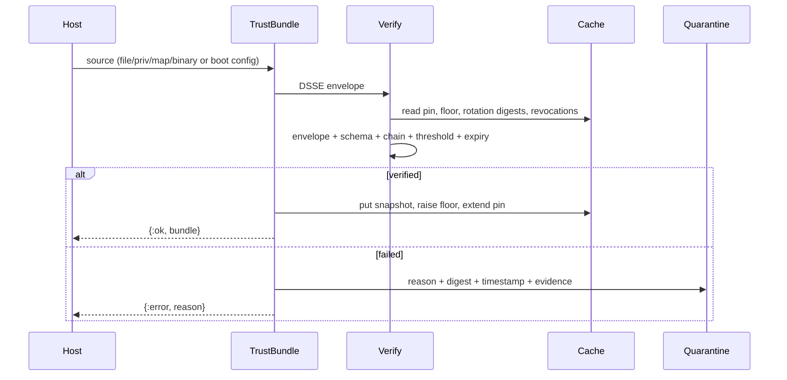

---
sigil_guard:
  id: "SP.02"
  title: "Embedded Trust Bundles"
  domain: security
  status: planned
  priority: critical
  created: "2026-07-01"
  updated: "2026-07-02"
  tags: ["trust-bundles", "tuf", "roles", "rotation", "dsse", "quarantine", "v3"]
  depends_on: ["R.01", "R.02", "R.03", "R.07", "SP.01"]
---

# SP.02 - Embedded Trust Bundles

## Executive Summary

V3 trust material is embedded and signed. There is no registry runtime
model. A trust bundle is one local, DSSE-signed JSON document carrying
roots, delegated signer roles, keys, tool manifests, policies, scanner
patterns, identity issuers, revocations, sequence numbers, and provenance.
The role model is the TUF subset adopted in R.03: root plus delegated
signer roles, m-of-n thresholds always carried in the schema, per-role
expiry, monotonic sequences with rollback floors, revocation by list and by
omission, and a cross-signed emergency rotation chain walked from a pinned
genesis root. Remote loading is not part of the v3 core; hosts that want
remote distribution own that transport and pass verified bytes in.

## Business Value

- **Problem:** Registry vocabulary implies a web dependency, and the v2
  single-signature bundle has no answer to a leaked signer key (R.03).
- **Solution:** A local signed-bundle API with roles, thresholds, rotation,
  revocation, and rollback protection, verified entirely offline.
- **Beneficiary:** Embedded and CI users needing deterministic offline
  trust; the reference consumer, which needs a library-mode bootstrap
  (R.07).
- **Impact:** Signer-compromise survivability, rollback rejection, and a
  network-free trust path that a test enforces.

## Technical Architecture

### Overview

A bundle is loaded atomically as one DSSE envelope whose payload is the
JCS-canonical bundle document. Verification reuses the shared SP.01 code
path (`SigilGuard.Attestation.Envelope` for DSSE/PAE plus
`SigilGuard.Canonical.JCS`); this spec adds no bundle-local
canonicalization or signature code. TUF's snapshot and timestamp roles are
rejected (R.03): they defend live repository serving, which does not exist
here; freshness is bounded by per-role expiry plus the rollback floor. The
cache is a per-boot ETS table; the durable cross-boot floor is the signed
`rollback_floor` inside the embedded bundle itself.

### Verification Pipeline



Verification order is normative; the first failure wins: (1) SP.01 envelope
checks (`:invalid_envelope`, `:invalid_payload_type`, `:invalid_base64`,
`:duplicate_keyid`); (2) strict JSON parse of the decoded payload, then
document schema validation; (3) rotation chain walk from the pinned genesis
root; (4) signing-role resolution; (5) revocation strike, Ed25519-over-PAE
verification, threshold count; (6) role and document expiry; (7) sequence
and floor comparison.

### Architectural Patterns

| Pattern | Used | Justification |
|---------|------|---------------|
| GenServer | no | No fetch loop exists; verification is pure functions. |
| Behaviour | yes | `SigilGuard.Signer` signs dev bundles and fixtures. |
| ETS | yes | `:sigil_guard_trust_bundle`, created at application boot. |
| Telemetry | yes | Load/verify spans and a quarantine event. |

## Role Model And Thresholds

This section is normative and implements R.03.

**Roles.** The root role declares and changes key sets; only a root
threshold can alter `roles` or `keys`, and only via rotation documents.
Delegated signer roles sign content. Every bundle document MUST declare a
delegate role named `"bundle"`; only that role's keys authorize bundle
documents, and root keys count toward its threshold only when also listed
in its `keyids`. A document without a `"bundle"` delegate fails with
`{:error, :unknown_role}`, as does a rotation document without a root role.

**Thresholds.** Every role declares `keyids` (n = list length) and an
integer `threshold` m, `1 <= m <= n`. The schema ALWAYS carries m and n.
The v1 runtime normatively enforces an effective threshold of 1 on bundle
documents: at least one signature from an authorized, unrevoked key MUST
verify. The `enforce_declared_threshold: true` option raises enforcement to
the declared m; raising the default later is a runtime change with no
wire-format change. Counting follows SP.01: duplicate keyids fail
`:duplicate_keyid`; unresolved keyids are tolerated (witness cosigning) but
never count; no resolvable keyid fails `:unknown_key_id`; a resolved keyid
whose signature fails yields `:invalid_signature`; fewer distinct valid
authorized signatures than the enforced threshold yields
`:threshold_not_met`. Rotation documents are the exception: they ALWAYS
enforce the full declared thresholds of both root generations (below).

**Per-role expiry.** Every role carries `expires_at`. A bundle signed by an
expired `"bundle"` role, or whose current root role is expired, fails with
`{:error, :role_expired}`. Document `expires_at`, and future-dated
`issued_at` beyond skew, fail with `{:error, :bundle_expired}`; freshness
uses `:now` and `:max_skew_ms` exactly as SP.01 defines them. Root expiry
is long because ceremonies are expensive; delegate expiry is shorter.

**Monotonic sequence and rollback floor.** `sequence` and `rollback_floor`
are wire strings matching `^[1-9][0-9]*$`, per SP.01's JCS rule that
growing schema fields MUST be strings; the runtime parses them to
`pos_integer()` and compares numerically. Per `bundle_id`, the cache
accepts only a sequence strictly greater than the cached one (re-putting
the byte-identical bundle is an idempotent no-op) and not below the floor;
on acceptance the floor becomes `max(floor, rollback_floor, sequence)`.
Violations fail with `{:error, :sequence_below_floor}` (renamed from the
v2 draft's `:rollback_detected`; see Error Handling).

**Revocation by list and by omission.** Both are required. An explicit
`revocations` entry of kind `"key"` kills a keyid immediately, mid-cycle,
regardless of unexpired signatures: revoked keyids are struck from every
role before threshold counting, and an envelope signature by a revoked
keyid fails hard with `{:error, :revoked_key}`. The cache retains the union
of revocations accepted this boot; revocation is irreversible within a
boot. Omission is structural: a keyid absent from the current document's
`keys` and role `keyids` counts toward no threshold, so forgotten legacy
keys cannot retain authority. The list handles emergencies; omission from
the next root document guarantees the steady state.

## Emergency Rotation Ceremony

The operational procedure for signer compromise, up to and including root
keys. The six steps are normative (R.03) and belong in host incident
runbooks:

1. A quorum of the remaining root keyholders convenes. The root threshold m
   MUST be chosen so the expected worst-case compromise leaves at least m
   holders uncompromised (Sigstore practice: three of five).
2. New root keys are generated offline, during the ceremony, on hardware
   that never touches the network.
3. The new root document is cross-signed by the old root threshold AND the
   new keys: verifiers accept root version N+1 only when it carries at
   least the old declared threshold of signatures valid under version N's
   keys and at least the new declared threshold valid under its own keys.
   Missing either quorum fails with `{:error, :rotation_below_threshold}`,
   even under v1's threshold-1 bundle enforcement.
4. The new `rollback_floor` is bumped strictly above the previous floor so
   every prior bundle is invalidated, including bundles carrying unexpired
   signatures from the compromised keys.
5. Distribution happens through the host's normal release channel. There is
   no emergency side channel; adding one would recreate the live serving
   path this model rejects.
6. Explicit `revocations` entries for the compromised keys take effect
   immediately regardless of role expiry, covering hosts that load the new
   root while older signer material still circulates.

**Chain walk.** Verifiers walk the rotation chain from their pinned genesis
root: pin, then each cross-signed successor in `rotation_chain` in strictly
ascending order (each `root_version` exactly previous + 1), ending at a
root descriptor identical to the bundle's `roles.root`. Any gap, duplicate
version, or terminal mismatch is equivocation. Signature checks on
historical entries ignore expiry (the TUF root-update rule); only the
current bundle and its declared roles are freshness-checked.

**Pinning.** An explicit `:genesis_root` option (`%{version:
pos_integer(), threshold: pos_integer(), keyids: [String.t()], keys:
%{String.t() => binary()}}`) always wins; otherwise the cached pin is used.
When neither exists, the first successfully verified bundle establishes the
pin at its own root - embedding the artifact in the release IS the pinning
act (R.01 local-first) - and its chain entries' digests are recorded per
version so later forks are detectable.

**Forks.** Two distinct children of one root version MUST be rejected with
`{:error, :forked_root_chain}` - whether both appear in one chain or an
incoming rotation for version N differs from the digest already accepted
for N. A fork is evidence of key compromise or issuer equivocation; a
verifier never picks a branch.

**Rotation replay.** Step 4 raises the floor above every sequence issued
under the old root, so any replayed pre-rotation bundle fails with
`{:error, :sequence_below_floor}`; a root version below the accepted one
fails the same way as a backstop.

## Data Model

### Bundle Document

The bundle document is the DSSE payload. It contains no signature material
- signatures live only in the envelope - so unlike the v2 `Registry.Bundle`
there is no metadata strip rule. Optional fields follow SP.01
normalization: absent fields are omitted, never emitted as `null`. Unknown
top-level fields fail with `{:error, :invalid_bundle_format}`.

| Field | Type | Required | Constraints |
|-------|------|----------|-------------|
| `profile` | string | yes | Exactly `sigil_guard_trust_bundle/v1`. Matching stem, other version fails `:unsupported_profile_version`; anything else `:invalid_bundle_format`. |
| `bundle_id` | string | yes | Non-empty; stable across sequences of one bundle family. |
| `sequence` | string | yes | `^[1-9][0-9]*$`; positive monotonic integer per `bundle_id`. |
| `issued_at` | string | yes | ISO 8601 UTC, millisecond precision (SP.01 format). |
| `expires_at` | string | yes | Same format; MUST be later than `issued_at`. |
| `roles` | map | yes | Exactly the keys `root` and `delegates`. |
| `roles.root` | map | yes | `{"keyids": [string], "threshold": integer, "version": string, "expires_at": string}`; `version` matches `^[1-9][0-9]*$`. |
| `roles.delegates` | list | yes | Entries `{"name": string, "keyids": [string], "threshold": integer, "expires_at": string}`; names unique; MUST include `"bundle"`. A delegate role named `"agent_card"` authorizes agent-card issuance (SP.13); its keyids are the trusted card signers. |
| `keys` | map | yes | keyid to `{"alg": "ed25519", "public_key": string}`; `public_key` is base64url (no padding) of a 32-byte Ed25519 key; keyid MUST equal `"sha256:" <> hex` of the raw key (SP.01 convention). |
| `tools` | list | no | Capability manifests or `{"name": string, "manifest_digest": string}` refs; entry shape owned by SP.03. |
| `policies` | list | no | Boundary and repo policy rules; shapes owned by SP.04 and SP.11. |
| `patterns` | list | no | Scanner pattern sets; shape owned by SP.04. |
| `identity_issuers` | list | no | Trusted actor/issuer id strings for per-actor trust-level resolution (R.05, SP.10); distinct from the `"agent_card"` card-signing role above. |
| `revocations` | list | no | Entries `{"kind": "key" \| "bundle" \| "manifest" \| "actor", "id": string, "revoked_at": string}`; closed `kind` set. |
| `rollback_floor` | string | yes | `^[1-9][0-9]*$`; MUST be `<= sequence`. |
| `rotation_chain` | list | no | DSSE envelopes of root rotation documents, ascending `root_version`. |
| `provenance` | map | no | Informational build/source data and the dev marker; never a trust input. |

Role integrity constraints, each violation failing `:invalid_bundle_format`:
`1 <= threshold <= length(keyids)`; keyids within a role distinct; every
role keyid present in `keys`; `alg` exactly `"ed25519"`.

### Root Rotation Document

Also a DSSE payload with the same `payloadType`; dispatch is on `profile`.
Its envelope MUST satisfy the outgoing root's declared threshold under the
outgoing keys AND the incoming root's declared threshold under its own
`keys`, else `{:error, :rotation_below_threshold}`.

| Field | Type | Required | Constraints |
|-------|------|----------|-------------|
| `profile` | string | yes | Exactly `sigil_guard_root_rotation/v1`. |
| `bundle_id` | string | yes | The bundle family it governs. |
| `root_version` | string | yes | `^[1-9][0-9]*$`; exactly the previous root version + 1. |
| `roles.root` | map | yes | New root descriptor; its `version` MUST equal `root_version`. |
| `keys` | map | yes | The new root keys only; same shape and keyid rule as above. |
| `rollback_floor` | string | yes | MUST be strictly greater than the previous root document's floor. |
| `issued_at` | string | yes | ISO 8601 UTC ms; historical entries are not freshness-checked. |

## Signing And Canonical Form

Bundle and rotation documents are signed exactly like every other v3
artifact (SP.01, "Attestation Envelope And Canonical Encoding" -
referenced, not restated): the document's JCS bytes are the DSSE payload,
base64url without padding; `payloadType` is exactly
`application/vnd.sigilguard+json`; signatures are Ed25519 over the PAE
bytes; verifiers never re-canonicalize - PAE is built from the received,
decoded payload bytes. Bundle documents are DSSE payloads directly, NOT
wrapped in in-toto Statements (R.03); the Statement form below is for
evidence about bundles.

**`bundle_digest`** is the lowercase-hex SHA-256 over the JCS bytes of the
bundle document - byte-for-byte the base64url-decoded DSSE `payload`. The
digest field list is every present field of the Bundle Document table (the
entire document); nothing is excluded, because the document carries no
envelope or signature fields. The same rule digests rotation documents.

### Canonical Example And Golden Vectors

Fixed vector inputs per the SP.01 fixture convention: root seed = 32 bytes
of `0xAA`; `"bundle"` signer seed = 32 bytes of `0xBB`; keyids per the
`"sha256:" <> hex` convention. Every `<computed: ...>` value is produced at
fixture-generation time and stored under `test/fixtures/trust_bundle/`; the
surrounding structure is exact and normative. Keys are shown in JCS order
(all ASCII, so byte order); the two `keys` entries sort by their computed
keyid strings. Fixtures store the compact, whitespace-free form.

Minimal valid bundle document (optional sections omitted):

```json
{
  "bundle_id": "example-org-trust",
  "expires_at": "2026-08-01T12:00:00.000Z",
  "issued_at": "2026-07-02T12:00:00.000Z",
  "keys": {
    "<computed: root keyid>": {"alg": "ed25519", "public_key": "<computed>"},
    "<computed: bundle keyid>": {"alg": "ed25519", "public_key": "<computed>"}
  },
  "profile": "sigil_guard_trust_bundle/v1",
  "roles": {
    "delegates": [{"expires_at": "2026-10-01T12:00:00.000Z",
                   "keyids": ["<computed: bundle keyid>"],
                   "name": "bundle", "threshold": 1}],
    "root": {"expires_at": "2027-07-02T12:00:00.000Z",
             "keyids": ["<computed: root keyid>"],
             "threshold": 1, "version": "1"}
  },
  "rollback_floor": "1",
  "sequence": "1"
}
```

Its DSSE envelope, signed by the `"bundle"` delegate key:

```json
{
  "payload": "<computed: base64url of the compact JCS document bytes>",
  "payloadType": "application/vnd.sigilguard+json",
  "signatures": [
    {"keyid": "<computed: bundle keyid>", "sig": "<computed: Ed25519 over PAE>"}
  ]
}
```

Fixture set (deterministic generator; committed fixtures are a frozen
contract, as in SP.01). `expected.json` stores inputs (document, seeds hex,
timestamps), keyids, public keys, `bundle_digest`, `pae_sha256`, and
signatures:

```
test/fixtures/trust_bundle/
  minimal/{bundle,envelope,expected}.json   # the worked vector above
  multisig/...                              # 2-of-3 "bundle" role, 3 sigs
  rotation/genesis.json                     # root v1 bundle envelope
  rotation/rotation-2.json                  # cross-signed v1 -> v2 rotation
  rotation/successor.json                   # root v2 bundle, floor bumped
  rotation/forked-2.json                    # conflicting v2 (MUST reject)
  rotation/expected.json
```

### Bundle-State Statement (Optional Evidence)

Hosts MAY record bundle lifecycle facts as in-toto-style Statements with
predicateType `https://sigilguard.dev/trust-bundle-state/v1` (registered in
SP.01, owned here). They bypass `TrustProfile.validate/1`'s eight-type
subject rule; this spec fixes their shape: exactly one subject named
`"bundle"` whose digest is the `bundle_digest`; predicate fields `profile`
(`sigil_guard_agent_trust/v1`), `bundle_id`, `sequence`, `root_version`,
`observed_at` (ISO 8601 UTC ms), `issuer_class` (`"release"` or `"dev"`),
and `event` from the closed set `"loaded" | "quarantined" | "rotated" |
"floor_bumped"`; `"quarantined"` adds `reason` (the error atom as a
string). Signing and verification go through `SigilGuard.Attestation`.

## Loading Sources

`SigilGuard.TrustBundle.source()` is the closed constructor set referenced
by SP.01's `:trust_bundle` config key:

| Source | Semantics |
|--------|-----------|
| `:none` | Config default: nothing configured; boot skips loading. Passed to `load/1,2` it fails `{:error, :invalid_source}`. |
| `{:file, path}` | Read the envelope JSON file at `path` at load time. |
| `{:priv, app, rel}` | Release resource: `Application.app_dir(app, Path.join("priv", rel))`, then as `{:file, _}`. |
| `{:map, map}` | Already-decoded envelope map, handed to `verify/2` directly. |
| `{:binary, bin}` | In-memory envelope JSON bytes; hosts that fetch remotely pass verified bytes here. |

An unreadable file or priv resource, a non-JSON binary, or an unrecognized
constructor fails with `{:error, :invalid_source}` before verification.

**Precedence.** Exactly one source per load call; sources never merge. A
source passed to `load/1,2` always wins over configuration. The
`:trust_bundle` env key (SP.01 configuration table) is read once by the
application boot path: when not `:none`, boot loads and caches it, and any
failure raises `SigilGuard.ConfigError` naming the error atom -
configuration fails closed, per SP.01.

**No-network guarantee.** `load/1,2`, `verify/2`, and `dev_bundle/1` MUST
perform zero network operations: no HTTP, no DNS, no socket opens, and no
references to `:httpc`, `:gen_tcp`, `:ssl`, or `SigilGuard.HTTPClient` in
their code paths. A test asserts `Port.list()` is unchanged across load and
verify for every source class. Public registry discovery, implicit HTTP
fetch, network DID/key lookup, and unsigned remote pattern import remain
unsupported in core.

## Library-Mode Bootstrap

`SigilGuard.TrustBundle.dev_bundle/1` unblocks library-mode adopters
(R.07): it generates a throwaway root and `"bundle"` signer, builds and
signs a minimal valid bundle, verifies and caches it, and returns
`{:ok, t()}`. Options: `:patterns`, `:policies`, `:tools`,
`:identity_issuers` (content sections), `:seed` (32-byte binary; root key
from `seed`, signer key from `:crypto.hash(:sha256, seed)`, for
deterministic tests), `:now`, and `:ttl_ms` (default `3_600_000` - one
hour, so a leaked dev bundle dies fast). Sequence, floor, and root version
are all `"1"`.

**Boundary (normative):** development and test only. A dev bundle MUST NOT
ship in production configuration, and production documentation and config
examples MUST NOT reference `dev_bundle/1`. Hosts SHOULD alert on the dev
marker in production audit streams.

**Recognizability in evidence:** the generated document carries
`provenance: {"builder": "SigilGuard.TrustBundle.dev_bundle/1",
"issuer_class": "dev"}`; the loaded struct sets `dev?: true` and
`source: :dev`; telemetry metadata carries `dev: true`; every bundle-state
Statement for it carries `issuer_class: "dev"`.

## Public API Sketch

Return-type unions name every error atom; atoms are defined in Error
Handling below or in SP.01's shared taxonomy.

```elixir
defmodule SigilGuard.TrustBundle do
  @type source ::
          :none | {:file, Path.t()} | {:priv, atom(), String.t()}
          | {:map, map()} | {:binary, binary()}

  @type shared_envelope_error ::   # SP.01 taxonomy, by reference
          :invalid_envelope | :invalid_payload_type | :invalid_base64
          | :duplicate_keyid

  @type verify_error ::
          shared_envelope_error()
          | :invalid_bundle_format | :unsupported_profile_version
          | :unknown_role | :unknown_key_id | :invalid_signature
          | :threshold_not_met | :bundle_expired | :role_expired
          | :revoked_key | :sequence_below_floor | :forked_root_chain
          | :rotation_below_threshold

  @type load_error :: verify_error() | :invalid_source

  @type t :: %__MODULE__{
          bundle_id: String.t(), sequence: pos_integer(),
          root_version: pos_integer(), digest: String.t(),
          document: map(), envelope: map(),
          dev?: boolean(), source: source() | :dev
        }

  @spec load(source()) :: {:ok, t()} | {:error, load_error()}
  @spec load(source(), keyword()) :: {:ok, t()} | {:error, load_error()}
  # Reads the source, runs verify/2 with the same opts, then Cache.put/1.
  # Failures write a Quarantine record. opts: :genesis_root, :now,
  # :max_skew_ms, :enforce_declared_threshold (default false),
  # :cache (default true), :quarantine (default true).

  @spec verify(envelope :: map(), opts :: keyword()) ::
          {:ok, t()} | {:error, verify_error()}
  # Runs the normative verification order. Reads the Cache (pin, floor,
  # rotation digests, revocation union) but never writes it.

  @spec dev_bundle(keyword()) :: {:ok, t()} | {:error, load_error()}

  # Section accessors patterns/1, policies/1, tools/1, identity_issuers/1
  # return the verified section lists; [] when the section is absent.
end

defmodule SigilGuard.TrustBundle.Cache do
  # ETS :sigil_guard_trust_bundle, created by SigilGuard.Application,
  # keyed by bundle_id. Per-boot state only.

  @spec get(bundle_id :: String.t()) ::
          {:ok, SigilGuard.TrustBundle.t()} | :error

  @spec put(SigilGuard.TrustBundle.t()) ::
          {:ok, SigilGuard.TrustBundle.t()}
          | {:error, :sequence_below_floor | :forked_root_chain}
  # Accepts only sequence > cached and >= floor; re-putting the
  # byte-identical bundle is an accepted no-op. On accept: floor :=
  # max(floor, rollback_floor, sequence); the root pin, per-version
  # rotation digests, and revocation union are extended.

  @spec floor(bundle_id :: String.t()) :: non_neg_integer()
  # Highest of accepted sequences and signed rollback floors this boot;
  # 0 for an unknown bundle_id.
end

defmodule SigilGuard.TrustBundle.Quarantine do
  @type record :: %{
          reason: SigilGuard.TrustBundle.load_error(),
          bundle_id: String.t() | nil,
          bundle_digest: String.t() | nil,
          sequence: pos_integer() | nil,
          quarantined_at: String.t(),
          evidence: [%{kind: String.t(), ref: String.t()}]
        }
  # bundle_digest: SHA-256 of the decoded payload bytes when they decode,
  # nil otherwise. quarantined_at: ISO 8601 UTC ms. evidence entries use
  # SP.01's evidence shape (kind: checkpoint/export/anchor); [] when none.

  @spec record(reason :: atom(), info :: map()) :: record()
  @spec list() :: [record()]
  @spec list(bundle_id :: String.t()) :: [record()]
end
```

## Module Map

| Module | Purpose |
|--------|---------|
| `lib/sigil_guard/trust_bundle.ex` | Public load/verify/dev_bundle/accessors. |
| `lib/sigil_guard/trust_bundle/schema.ex` | Bundle and rotation document validation. |
| `lib/sigil_guard/trust_bundle/verify.ex` | Roles, thresholds, expiry, revocation, chain walk, floors. |
| `lib/sigil_guard/trust_bundle/cache.ex` | ETS snapshot, floor, pin, rotation digests. |
| `lib/sigil_guard/trust_bundle/quarantine.ex` | Failure records. |
| `test/sigil_guard/trust_bundle_test.exs` | Sources, vectors, no-network, dev bundle. |
| `test/sigil_guard/trust_bundle/{verify,cache,quarantine}_test.exs` | Negative matrix, floors, records. |
| `test/fixtures/trust_bundle/` | Golden vectors (minimal, multisig, rotation). |

## Removed V3 Surfaces

Removal mechanics and sequencing are owned by SP.12; boot-time typed errors
for removed `registry_*` config keys are owned by SP.01.

| Removed Surface | Replacement |
|-----------------|-------------|
| `SigilGuard.Registry.fetch_bundle/1` | `SigilGuard.TrustBundle.load/1,2`. |
| `SigilGuard.Registry.resolve_did/2` | Host identity resolver or bundle `identity_issuers`. |
| `SigilGuard.Registry.resolve_key/2` | `keys` lookup on a verified bundle. |
| `SigilGuard.Registry.fetch_policies/1` | Bundle `policies` section. |
| `SigilGuard.Registry.Bundle` | `TrustBundle` verification (DSSE roles/thresholds). |
| `SigilGuard.Registry.Cache` | `SigilGuard.TrustBundle.Cache`. |

## Integration Points

| System | Integration | Direction | Protocol |
|--------|-------------|-----------|----------|
| Host app | `load/1,2`, `verify/2`, `dev_bundle/1`, accessors | inbound | Elixir API |
| Attestation (SP.01) | `Attestation.verify/3` accepts `t()` as trust material; keyids resolve against `keys` minus revocations | internal | Elixir API |
| Gateway (SP.03) | verified capability manifests from `tools` | internal | Elixir API |
| Scanner/policy (SP.04, SP.11) | `patterns` and `policies` sections | internal | Elixir API |
| Identity (SP.10) | `identity_issuers` trust input | internal | Elixir API |
| Audit (SP.05) | bundle-state Statements; quarantine evidence refs | internal | Elixir API |

## Telemetry And Observability

| Event | Type | Metadata | Purpose |
|-------|------|----------|---------|
| `[:sigil_guard, :trust_bundle, :load, :start \| :stop \| :exception]` | span | `%{source: :file \| :priv \| :map \| :binary \| :dev, bundle_id: String.t() \| nil, result: :ok \| :error, error: atom() \| nil, dev: boolean()}` | Load latency and outcome. |
| `[:sigil_guard, :trust_bundle, :verify, :start \| :stop \| :exception]` | span | `%{bundle_id: String.t() \| nil, sequence: pos_integer() \| nil, root_version: pos_integer() \| nil, result: :ok \| :error, error: atom() \| nil}` | Verification latency and failure class. |
| `[:sigil_guard, :trust_bundle, :quarantine]` | event | `%{reason: atom(), bundle_id: String.t() \| nil, bundle_digest: String.t() \| nil, dev: boolean()}` | Every quarantine record, for host alerting. |

Events use the existing span helper; metadata never carries key material or
section bodies.

## Error Handling

Naming is reconciled here, once. The v2 draft and `Registry.Bundle` atoms
map as follows: `:rollback_detected` becomes `:sequence_below_floor` (names
the signed field, not the attack); `:expired_bundle` becomes
`:bundle_expired` (parallel to `:role_expired`); `:unknown_issuer` becomes
`:unknown_key_id` (SP.01 shared atom); `:invalid_schema` and
`:invalid_bundle` become `:invalid_bundle_format`; `:missing_signature` and
`:unsigned_bundle` become `:invalid_envelope` (unsigned bundles do not
exist in v3; a DSSE envelope without signatures is structurally invalid per
SP.01). Shared SP.01 atoms (`:invalid_envelope`, `:invalid_payload_type`,
`:invalid_base64`, `:duplicate_keyid`, `:unsupported_profile_version`) are
reused by reference, never redefined.

| Error | Trigger | Recovery | User Impact |
|-------|---------|----------|-------------|
| `:invalid_source` | missing file/priv resource; non-JSON binary; `:none` or unrecognized constructor passed to `load` | fix the path or configuration | bundle not loaded |
| `:invalid_bundle_format` | payload not strict JSON; required field missing/mistyped; unknown top-level field; sequence/floor/version regex violation; `rollback_floor > sequence`; threshold outside `1..n`; duplicate role keyids; role keyid absent from `keys`; keyid not the SHA-256 of its key; `alg` not `"ed25519"`; key not 32 bytes | fix and re-sign the document | bundle quarantined |
| `:unsupported_profile_version` | profile stem matches, version segment is not `v1` | upgrade SigilGuard or re-issue at `v1` | bundle quarantined |
| `:unknown_role` | no `"bundle"` delegate declared; rotation document without a root role | declare the required role and re-sign | bundle quarantined |
| `:unknown_key_id` | no envelope signature keyid resolves to an authorized key of the signing role | sign with an authorized key; update the bundle | bundle quarantined |
| `:invalid_signature` | a resolved keyid's Ed25519 signature fails over the PAE bytes | re-sign; investigate tamper | bundle quarantined |
| `:threshold_not_met` | fewer distinct valid authorized signatures than the enforced threshold (v1 default 1; declared m under `enforce_declared_threshold: true`) | collect the remaining quorum signatures | bundle quarantined |
| `:bundle_expired` | `now > expires_at + skew`, or `issued_at > now + skew` | issue a fresh bundle | bundle quarantined |
| `:role_expired` | the `"bundle"` role or current root role is past its `expires_at` | rotate or re-declare the role | bundle quarantined |
| `:revoked_key` | an envelope signature keyid is in the document's or the cached revocation union | rotate keys; re-sign with unrevoked keys | bundle quarantined |
| `:sequence_below_floor` | sequence below the floor; sequence not above the cached sequence with a different digest; root version below the accepted root version | ship a bundle with a higher sequence | stale bundle rejected; last verified snapshot kept |
| `:forked_root_chain` | two distinct rotation documents for one root version, in-chain or against the cached accepted digest; chain gap or terminal root mismatch | treat as compromise; run the rotation ceremony | bundle quarantined; incident response |
| `:rotation_below_threshold` | a rotation document missing the full declared old-root or new-root quorum | complete the ceremony with quorum | rotation rejected |

## Security Considerations

- No unsigned trust material exists in v3; verification is network-free and
  a test enforces it.
- Only a root threshold can change `roles` or `keys`, and only through
  cross-signed rotation; a compromised delegate key cannot launder itself
  into the trust anchor (R.03).
- Rotation always enforces full declared thresholds, even while v1 bundle
  verification enforces threshold 1.
- The floor, pinned root, and per-version rotation digests make validly
  signed history unreplayable; forks are compromise evidence, not a choice.
- Quarantine records and telemetry expose reasons and digests only - never
  key material, patterns, or policy bodies.
- Dev bundles are marked in provenance, struct, telemetry, and evidence;
  their one-hour default expiry bounds accidental production use.
- Verifiers never re-canonicalize (SP.01): a JCS bug can break vector
  stability but cannot make a forged bundle verify.

## Testing Strategy

| Test | Module | What It Verifies |
|------|--------|------------------|
| golden vectors | `TrustBundleTest` | `minimal` and `multisig` fixtures verify and regenerate byte-identically; accessors expose sections. |
| malformed document | `VerifyTest` | every `:invalid_bundle_format` trigger class in the table rejects with that atom. |
| tamper | `VerifyTest` | flipped payload byte fails `:invalid_signature`; wrong `payloadType`, duplicate keyid, bad base64 fail with SP.01 atoms. |
| expiry | `VerifyTest` | document expiry and future-dating fail `:bundle_expired` at skew boundaries; expired roles fail `:role_expired`. |
| threshold | `VerifyTest` | 2-of-3 fixture verifies with two signatures; one signature under `enforce_declared_threshold: true` fails `:threshold_not_met`; unresolved keyids never count. |
| unknown issuer/key | `VerifyTest` | unauthorized signer fails `:unknown_key_id`; missing `"bundle"` role fails `:unknown_role`. |
| revocation | `VerifyTest` | revoked keyid fails `:revoked_key`, including via the cached mid-cycle union; struck keys never satisfy thresholds. |
| rollback | `CacheTest` | lower or duplicate-with-different-digest sequence fails `:sequence_below_floor`; floor rises with `rollback_floor`; identical re-put is a no-op. |
| rotation | `VerifyTest` | valid chain accepted; below-threshold fails `:rotation_below_threshold`; fork fails `:forked_root_chain`; replayed pre-rotation bundle fails `:sequence_below_floor`. |
| no network | `TrustBundleTest` | `Port.list()` unchanged across load and verify for every source class. |
| dev bundle | `TrustBundleTest` | `dev_bundle/1` loads, is marked dev everywhere, expires at `:ttl_ms`. |
| quarantine | `QuarantineTest` | each failure class writes a record with reason, digest, timestamp, evidence refs. |

## Acceptance Criteria

- [ ] Golden vectors under `test/fixtures/trust_bundle/` verify and
      regenerate byte-identically (`minimal`, `multisig`, `rotation`).
- [ ] Every role in every fixture carries `threshold` and `keyids`; v1
      verification accepts one valid authorized signature by default, and
      `enforce_declared_threshold: true` makes a 2-of-3 bundle with one
      signature fail `:threshold_not_met`.
- [ ] Valid rotation: the successor bundle verifies from the pinned genesis
      root through its cross-signed `rotation_chain`.
- [ ] Below-threshold rotation: a rotation missing either the old-root or
      new-root declared quorum fails `:rotation_below_threshold`, including
      under v1 default enforcement.
- [ ] Forked chain: two distinct rotation documents for one root version
      fail `:forked_root_chain`, in-chain and against the cached digest.
- [ ] Rotation replay: every pre-rotation bundle fails
      `:sequence_below_floor` after the floor bump; a lower root version
      fails the same way.
- [ ] Rollback: `Cache.put/1` rejects non-monotonic sequences, accepts the
      byte-identical re-put as a no-op, and `floor/1` reflects
      `max(floor, rollback_floor, sequence)`.
- [ ] Revoked keys never satisfy a threshold and fail `:revoked_key` when
      used, including after the revoking bundle is replaced within a boot.
- [ ] No-network: `Port.list()` is unchanged across `load` and `verify` for
      all four source classes and `dev_bundle/1`; the trust-bundle code
      path references no HTTP or socket module.
- [ ] `dev_bundle/1` output carries `issuer_class: "dev"` in provenance and
      bundle-state Statements, `dev?: true` in the struct, and `dev: true`
      in telemetry; no production doc or config example references it.
- [ ] Boot with an invalid configured `:trust_bundle` raises
      `SigilGuard.ConfigError` naming the verify error atom.
- [ ] Every error atom in this spec's taxonomy is produced by at least one
      test.

## Implementation Roadmap

Aligned with milestone M2 (the task list owns task IDs); SP.01's M1 JCS and
DSSE work is a prerequisite, and legacy removal lands in M6 per SP.12.

- [ ] M2: bundle and rotation document schemas over the shared JCS/DSSE
      code from SP.01 - no bundle-local canonicalization.
- [ ] M2: verification pipeline - roles, thresholds (v1 default plus
      declared-m option), expiry, revocation union, `bundle_digest`.
- [ ] M2: rotation chain walk from the pinned genesis root, fork rejection,
      floor bump semantics.
- [ ] M2: `Cache` (ETS at boot) and `Quarantine` records.
- [ ] M2: four load sources plus `:trust_bundle` boot wiring with
      fail-closed `SigilGuard.ConfigError`.
- [ ] M2: `dev_bundle/1` with a doctest demonstrating library-mode
      bootstrap.
- [ ] M2: golden vectors, negative matrix, and the no-network test.
- [ ] M2: `[:sigil_guard, :trust_bundle, ...]` telemetry events.
- [ ] M6: delete `SigilGuard.Registry.*` and `registry_*` config per SP.12;
      map the v2 surface in `MIGRATING-1.0.md`.

## Success Metrics

| Metric | Target | Measurement |
|--------|--------|-------------|
| Remote default | impossible | no registry config/API in v3; no-network test. |
| Bundle rollback | rejected | cache and rotation-replay tests. |
| Signer compromise | survivable | rotation fixture family verifies; forks rejected. |
| Coverage | >= 95% | `mix test --cover`. |
| Error taxonomy | every atom exercised | coverage review. |

## Sources

- [R.01 - Embedded Agent Trust Profile](../research/R.01-embedded-mcp-trust-profile.md)
- [R.02 - Attestation Envelope And Canonical Encoding](../research/R.02-attestation-envelope-and-canonical-encoding.md)
- [R.03 - Trust Bundle Role Model](../research/R.03-trust-bundle-role-model.md)
- [R.07 - Ecosystem Positioning, Dependencies, And Adoption](../research/R.07-ecosystem-positioning-dependencies-and-adoption.md)
- [The Update Framework Specification](https://theupdateframework.github.io/specification/latest/)
- [TAP 8 - Key rotation and explicit self-revocation](https://github.com/theupdateframework/taps/blob/master/tap8.md)
- [Sigstore root-signing ceremonies](https://github.com/sigstore/root-signing)
- [DSSE Protocol Specification v1.0](https://github.com/secure-systems-lab/dsse/blob/master/protocol.md)
- [RFC 8785 - JSON Canonicalization Scheme](https://www.rfc-editor.org/info/rfc8785)
- [in-toto Statement v1 Specification](https://github.com/in-toto/attestation/blob/main/spec/v1/statement.md)
