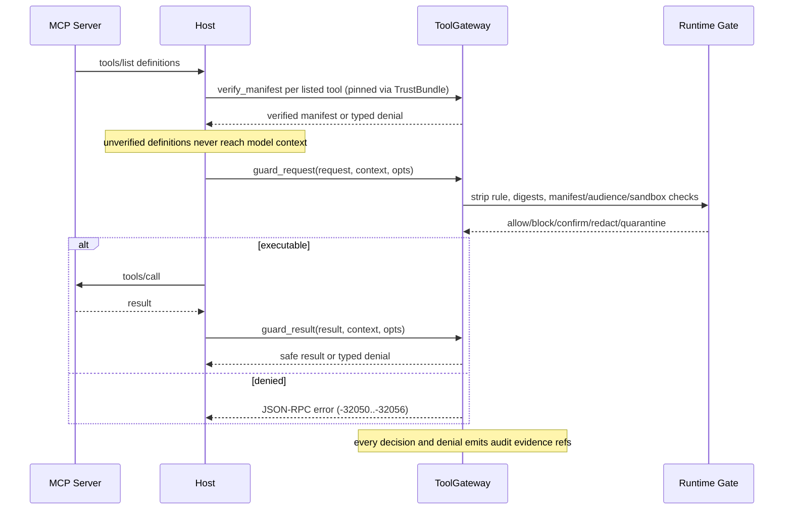

---
sigil_guard:
  id: "SP.03"
  title: "MCP And Tool Attestation Gateway"
  domain: security
  status: planned
  priority: critical
  created: "2026-07-01"
  updated: "2026-07-02"
  tags:
    ["mcp", "attestation", "capability-manifest", "confirmation", "json-rpc",
     "oauth", "v3"]
  depends_on: ["R.01", "R.02", "R.05", "R.06", "SP.01", "SP.02"]
---

# SP.03 - MCP And Tool Attestation Gateway

## Executive Summary

V3 turns the current MCP helpers into a first-class, transport-neutral tool
gateway. This spec is normative for four artifacts: the CapabilityManifest
canonical form and its `manifest_digest` field list (referenced but not
defined by SP.01), the `tool_request`/`tool_result` predicate bindings, the
confirmation-token lifecycle, and the JSON-RPC error registry. MCP is the
first adapter target; the same contract serves HTTP MCP, stdio MCP, and
in-process tool runners. `SigilGuard.MCP.Gateway` remains permanently as a
thin facade over `SigilGuard.ToolGateway` (D14).

## Business Value

- **Problem:** Tool calls are poisoned through descriptions, schemas,
  annotations, arguments, results, token passthrough, and audience
  confusion (R.06 rows 2-8) - mostly before any content scanner runs.
- **Solution:** Pin every tool to a signed capability-manifest digest, bind
  requests and results to the SP.01 digest set, gate approvals through
  digest-bound single-use tokens, and deny drift deterministically.
- **Beneficiary:** Hosts exposing or consuming MCP tools and local agent
  runtimes, including the reference consumer.
- **Impact:** Tamper-resistant tool-call verification with no adapter
  lock-in and typed, wire-ready denial responses.

## Technical Architecture

### Overview

Four verified surfaces: the capability manifest (canonical form below,
verified at `tools/list` time and re-checked at every guarded request);
the `tool_request` attestation over the SP.01 action, payload, context,
and manifest digests; the `tool_result` attestation binding result digest,
output-schema digest, quarantine status, scanner summary, evidence refs,
and the request back-reference; and the confirmation token, an
exact-action approval bound to the action, payload, context (including
`sandbox_id`), and manifest digests.

### Data Flow



### Architectural Patterns

| Pattern | Used | Justification |
|---------|------|---------------|
| GenServer | no | Guard calls are pure; pinned manifests come from the bundle or host. |
| Behaviour | no | `ToolGateway` is concrete; transports adapt by shaping maps. |
| ETS | yes | `SigilGuard.ReplayStore` consumes single-use confirmation nonces. |
| Telemetry | yes | Request, result, and manifest verification events. |

## CapabilityManifest Canonical Form

This section is this spec's data model and the normative owner of the
`manifest_digest` referenced by SP.01's Digest Computation section.

### Digest Field List (Normative)

The preimage field list is exact and closed. Table order is canonical
(JCS) key order, which for these ASCII keys equals byte order.
Normalization follows SP.01 (atoms to strings, omit absent/`nil` optional
fields, never emit `null`). All digests are lowercase-hex SHA-256.

| Field | Type | Required | Rule |
|-------|------|----------|------|
| `allowed_sink_zones` | list | no | Sink trust zones the tool's output may reach; sorted ascending by byte order; consumed by SP.04 output contracts. Omitted = unrestricted, delegated to SP.04 policy. |
| `allowed_source_zones` | list | no | Trust zones allowed to invoke the tool; sorted ascending; omitted = delegated to SP.04 policy. |
| `annotations_sha256` | string | no | SHA-256 of the JCS bytes of the normalized annotations map; omitted when no annotations are declared. |
| `audience` | list | no | RFC 8707-style audience/resource identifiers the tool's upstream credentials are minted for; sorted ascending; omitted when the tool uses no upstream credentials. |
| `description_sha256` | string | yes | SHA-256 of the raw UTF-8 description bytes (SP.01 binary payload class; no JCS). |
| `expires_at` | string | yes | ISO 8601 UTC with millisecond precision, per SP.01. |
| `input_schema_sha256` | string | yes | SHA-256 of the JCS bytes of the JSON Schema document. |
| `input_sensitivity` | string | yes | Closed: `public`, `internal`, `private`. |
| `issuer_keyid` | string | yes | `"sha256:" <> hex` per SP.01's keyid rule; MUST name a bundle-declared issuer (SP.02). |
| `manifest_format` | string | yes | Constant `sigil_guard_capability_manifest/v1`; the digest domain separator. |
| `name` | string | yes | Tool name; MUST be byte-equal to the `tools/list` name. |
| `network_access` | string | yes | Closed: `none`, `outbound`, `bidirectional`. |
| `output_schema_sha256` | string | no | SHA-256 of the JCS bytes of the output schema; omitted when none is declared. |
| `output_sensitivity` | string | yes | Closed: `public`, `internal`, `private`. |
| `reversibility` | string | yes | Closed: `reversible`, `irreversible`. |
| `sandbox` | map | yes | `{"required": boolean}`, plus `{"min_isolation": "container" \| "vm" \| "remote_attested"}` exactly when `required` is `true`. Level ordering is owned by SP.04. |
| `scopes` | list | no | Required OAuth/local scopes; sorted ascending; omitted when none. |
| `server` | string | yes | Canonical MCP server URI for network transports; host-assigned local runner id for stdio and in-process tools. |
| `side_effects` | list | yes | Closed: `none`, `read`, `write`, `delete`, `execute`, `privileged`; sorted ascending; non-empty; `none` MUST be the sole element when present. |
| `suspicious_params` | list | yes | Recomputable disclosure list (next subsection); MAY be empty; deduplicated, sorted ascending. |
| `version` | string | yes | Tool implementation version being pinned. |

`manifest_digest` is the lowercase-hex SHA-256 over the compact JCS bytes
of this preimage map; it fills the `manifest` subject entry of
`tool_request` and `tool_result` statements (SP.01 Digest Computation).

Sandbox identity binding: the manifest declares the requirement; the
concrete `sandbox_id` and `isolation_level` bind per-execution inside the
SP.01 context digest. When `sandbox.required` is `true`, a request whose
context lacks `sandbox_id` or sits below `min_isolation` MUST be denied
with `:sandbox_required`.

Carried form: the distributed document carries `description`,
`annotations`, `input_schema`, and `output_schema` in full; normalization
substitutes the `*_sha256` preimage fields. Carried `*_sha256` fields MUST
match recomputation, else `{:error, :invalid_manifest}`. Manifests are
trusted only through a verified trust bundle's `tools` entries (SP.02);
standalone manifest signing is not a v3 surface.

### Suspicious Required Parameters

Schema-injection defense (R.06 row 4, TM.04) binds indicators into the
signed digest. `suspicious_params` is computed deterministically from the
input schema: collect every string element of every list found under a map
key exactly equal to `"required"`, at any depth; lowercase each name and
replace `-` with `_`; a name is suspicious when the normalized form
contains any substring from the closed built-in set `suspicious-params-v1`:

```
access_key, api_key, apikey, authorization, bearer, cookie, credential,
passwd, password, private_key, secret, session_id, token
```

The field records the original schema-declared names. Verifiers MUST
recompute the set from the carried schema with this built-in set only;
bundle pattern extensions feed SP.04 policy indicators, never this field.
A mismatch fails with `{:error, :suspicious_required_param}` (the manifest
lies about its own schema). A matching, non-empty disclosure forces a
`{:confirm, _}` verdict at `guard_request` unless boundary policy
explicitly allows it.

### Canonical Example

The `repo_file_write` manifest referenced by SP.01's worked `tool_request`
vector, pretty-printed with keys in JCS order (fixtures store compact
bytes). `audience` and `output_schema` are absent, therefore omitted:

```json
{
  "allowed_sink_zones": ["semi_trusted", "trusted"],
  "allowed_source_zones": ["semi_trusted", "trusted"],
  "annotations": {"destructiveHint": false, "title": "Repo File Write"},
  "description": "Write one UTF-8 text file inside the repository working tree.",
  "expires_at": "2027-01-01T00:00:00.000Z",
  "input_schema": {
    "$schema": "https://json-schema.org/draft/2020-12/schema",
    "additionalProperties": false,
    "properties": {"content": {"type": "string"}, "path": {"type": "string"}},
    "required": ["content", "path"],
    "type": "object"
  },
  "input_sensitivity": "internal",
  "issuer_keyid": "sha256:<computed: issuer public key digest>",
  "manifest_format": "sigil_guard_capability_manifest/v1",
  "name": "repo_file_write",
  "network_access": "none",
  "output_sensitivity": "internal",
  "reversibility": "reversible",
  "sandbox": {"min_isolation": "container", "required": true},
  "scopes": ["repo:write"],
  "server": "repo-mcp",
  "side_effects": ["write"],
  "suspicious_params": [],
  "version": "1.4.2"
}
```

The digest preimage is this document with `annotations`, `description`,
and `input_schema` replaced by `annotations_sha256`, `description_sha256`,
and `input_schema_sha256`; all other fields are unchanged. Fixture
convention, mirroring SP.01's generator rules (deterministic,
byte-identical on regeneration, frozen once committed):

```
test/fixtures/capability_manifest/<name>/
  manifest.json   # carried form, compact, keys in JCS order
  preimage.json   # normalized digest preimage, exact compact JCS bytes
  expected.json   # description/annotations/input_schema/output_schema
                  # digests, suspicious_params, manifest_digest
```

`repo_file_write` is the first fixture; its `manifest_digest` is the value
SP.01's `tool_request` golden vector carries in its `manifest` subject.

## Request And Result Attestation Binding

Subject digests (action, payload, context, manifest) follow SP.01's Digest
Computation exactly, including the per-type action-digest preimages and
the metadata strip rule. The tables fix where each bound item lives.

### tool_request Binding

`tool_request` predicates use the SP.01 core fields unchanged; no
extension fields are defined. Granted scopes bind as the ascending-sorted,
single-space-joined string in `resource.scope`.

| Bound item | Where it binds |
|------------|----------------|
| Actor | `predicate.actor.id` + `actor` key of the context digest. |
| Tool identity (tool digest) | `manifest` subject entry = `manifest_digest`; `predicate.tool` mirror. |
| Action (tool, method, arguments) | `action` subject entry (SP.01 `tool_request` preimage). |
| Full guarded payload | `payload` subject entry. |
| Boundary context incl. `sandbox_id` | `context` subject entry (SP.01 field list). |
| Resource / audience | `predicate.resource` `{"uri", "audience", "scope"}`. |
| Scopes | `predicate.resource.scope`, joined as above. |
| Nonce | `predicate.nonce` (16-byte lowercase hex). |
| Expiry | `predicate.expires_at` (TTL default per SP.01). |

### tool_result Binding

The last four rows are the SP.03-owned `tool_result` predicate extension
fields, additive to the SP.01 core.

| Bound item | Where it binds |
|------------|----------------|
| Result content (result digest) | `payload` subject entry over the stripped result. |
| Sink | `sink` key of the context digest + `predicate.boundary.sink`. |
| Evidence refs | `predicate.evidence` (SP.01 shape). |
| Manifest | `manifest` subject entry; same digest as the paired request. |
| Request back-reference | `predicate.request_action_digest` (string, required) mirroring the `request_action_digest` inside the action-digest preimage (SP.01; the gateway MUST set it). |
| Output schema digest | `predicate.output_schema_sha256` (string; omitted when the manifest declares none; MUST equal the manifest field otherwise). |
| Quarantine status | `predicate.quarantine` (map, required): `{"status": "none" \| "quarantined" \| "released_sanitized", "indicator_ids": [string]}`. |
| Scanner summary | `predicate.scanner` (map, required): `{"hit_count": integer, "redacted": boolean}`; summary only, never raw content. |

## Confirmation Lifecycle

Normative resolution of the v2 open lifecycle questions. Tokens are
HMAC-SHA256, host-internal, and never cross a trust boundary; DSSE is not
used here. The token body is the base64url (no padding) of the compact JCS
bytes of the claims map; the MAC is computed over those same JCS bytes;
the token is `body <> "." <> base64url(mac)`.

### Claims (Authoritative v3 List)

This table is the complete, authoritative v3 confirmation-token claim set;
SP.08 references it and never restates it. The token wire-format version
stays `2` (`v: 2`, `typ: "sigil_guard.confirmation.v2"`) - v3 keeps the HMAC
format and adds the `manifest_digest` and sandbox-aware `context_digest`
bindings below.

| Claim | Value |
|-------|-------|
| `v` / `typ` / `alg` | `2`, `"sigil_guard.confirmation.v2"`, `"HS256"`. |
| `actor` | Approving actor id; defaults to context actor, then identity. |
| `action_digest` | SP.01 action digest for the guarded direction. |
| `payload_digest` | SP.01 payload digest. |
| `context_digest` | SP.01 context digest; `sandbox_id` and `isolation_level` are inside it, so a changed sandbox invalidates the token. |
| `manifest_digest` | Pinned manifest digest; omitted only when no manifest applies, so a drifted or re-listed manifest invalidates the token. |
| `decision` / `action` / `reason` | `"confirm"`; the gate action string; the decision reason (MAY be empty). |
| `issued_at` / `expires_at` | ISO 8601 UTC ms; `expires_at` later than `issued_at`. |
| `nonce` | 16 random bytes, lowercase hex. |

### Defaults And Rules

- **TTL:** default `300_000` ms via `:ttl_ms`; no application env key (the
  closed v3 config surface is owned by SP.01).
- **Single-use by default:** verification consumes the nonce through
  `SigilGuard.ReplayStore` (key `"confirmation:" <> actor`, TTL = the
  remaining token lifetime); a second verification fails with
  `:replay_detected`. Pass `consume: false` for stateless verification.
- **Digest recomputation:** verification recomputes all bound digests from
  the live request, context, and pinned manifest. Any change - arguments,
  sink, actor, `sandbox_id`, `isolation_level`, or manifest - fails with
  `:digest_mismatch` or `:manifest_digest_mismatch`. Tokens are never
  renewed; any change or expiry requires re-issue.
- **Strip rule:** exactly SP.01's six keys, removed from the payload top
  level and from the map under `params` before digest computation:
  `:_agent_trust`, `"_agent_trust"`, `:_agent_confirmation`,
  `"_agent_confirmation"`, `:confirmation_token`, `"confirmation_token"`.
  Tokens travel under `_agent_confirmation` (root or `params`) or the
  `:confirmation_token` option.

### Multi-Step Approval Flow

1. `guard_request/3` returns a `{:confirm, reason}` decision.
2. Host calls `ToolGateway.issue_confirmation/5`; the token binds the four
   digests above.
3. Host renders its approval UI from the matched rules and
   `action_digest`; raw payload display is host policy, never required.
4. The approver accepts; the host re-submits the identical request with
   the token under `_agent_confirmation`.
5. `guard_request/3` (with `:confirmation_key`) verifies and consumes the
   token; the decision upgrades to allowed. Confirmed quarantined results
   release only as sanitized text, never raw output.
6. Any change since issuance fails verification, blocks the request, and
   requires a fresh gate pass plus re-issue.

## Threat Coverage And Host-Owned Exclusions

Rows align 1:1 with R.06's control mapping; `TM.xx` names the M5 test
family that MUST be green before 3.0.0.

| Attack (R.06 row) | SP.03 control | Family |
|-------------------|---------------|--------|
| Tool poisoning via descriptions/metadata (2) | Manifest digest pinning over description, annotations, and schema digests; drift denies. | TM.02 |
| Line jumping (3) | `verify_manifest/2` at `tools/list` time, BEFORE any definition enters model context and before any invocation. | TM.03 |
| Schema injection (4) | Schema digests inside the manifest digest + `suspicious_params` disclosure bound into the signed digest and recomputed at verify. | TM.04 |
| Rug pull / TOFU drift (5) | Drift rejection; `tools/list_changed` forces full re-verification, and re-listed manifests invalidate cached approvals because tokens bind `manifest_digest`. | TM.05 |
| Confused deputy incl. consent replay (6) | Audience/resource binding into attestations and manifests; nonce + expiry on tokens and statements. OAuth consent itself is host-owned. | TM.06 |
| Token passthrough (7) | Explicit deny: a credential whose audience is the host itself is never forwarded upstream (`:token_passthrough_denied`). | TM.07 |
| Session hijacking via resumable streams + `list_changed` (8) | Host-owned transport; SigilGuard assists with per-action nonce/replay scope and `list_changed` re-verification. | TM.07 |

Host-owned exclusions (R.06): OAuth flows, token issuance, and consent
storage; TLS, session, and stream-resumption security; sandbox creation
and escape-hardening; model behavior. SigilGuard binds the results
(audience, resource, sandbox identity) and records evidence; it never
runs these systems.

## Public API Sketch

Return-type unions name every error atom; spec-local atoms are defined in
Error Handling below, shared atoms in SP.01.

```elixir
defmodule SigilGuard.ToolGateway do
  @type ctx :: SigilGuard.Context.t() | map() | keyword()

  @type manifest_deny ::
          :unknown_manifest | :manifest_digest_mismatch
          | :schema_digest_mismatch | :manifest_expired
          | :suspicious_required_param | :invalid_manifest

  @type attest_error ::
          SigilGuard.Attestation.from_decision_error()
          | SigilGuard.Attestation.sign_error()

  @spec guard_request(term(), ctx(), keyword()) :: SigilGuard.Decision.t()
  # opts: :manifests (%{name => manifest}) | :trust_bundle,
  #  :require_manifest (default true when either is given, else false),
  #  :attestation (:off | :optional | :required, default :off),
  #  :trust_material (SP.01), :confirmation (:honor | :off, default
  #  :honor), :confirmation_key, :confirmation_token, :consume_confirmation
  #  (default true), :audience, :resource, :self_resource, :now,
  #  :max_skew_ms. Denials are block decisions carrying the deny atom in
  #  reason and audit_metadata.

  @spec guard_result(term(), ctx(), keyword()) :: SigilGuard.Decision.t()
  # Same opts plus :request_action_digest (result binding).

  # guarded_request/3 and guarded_result/3 wrap the same guards in the v2
  # wire shapes: {:ok, decision} | {:error, response, decision} and
  # {:ok, response, decision} | {:error, response, decision}. The stream
  # trio (stream_result/2, guarded_result_chunk/3,
  # finish_guarded_result_stream/2) and response_for_decision/3 keep their
  # v2 signatures over Runtime.Stream.

  @spec verify_manifest(observed :: map(), opts :: keyword()) ::
          {:ok, SigilGuard.CapabilityManifest.t()}
          | {:error, manifest_deny()}
  # observed: one tools/list entry (string keys "name", "description",
  # "inputSchema", "outputSchema", "annotations"; snake_case twins are
  # accepted) or a carried manifest map. opts: :manifests | :trust_bundle
  # (one required), :server (required), :now, :max_skew_ms.

  @spec attest_request(SigilGuard.Decision.t(), ctx(), keyword()) ::
          {:ok, envelope :: map()} | {:error, attest_error()}
  # opts: :payload (required), :signer (required), :manifest, :ttl_ms,
  # :now, :nonce, :evidence. Builds and signs a tool_request statement via
  # Attestation.from_decision/3 + Attestation.sign/3 (SP.01).

  @spec attest_result(SigilGuard.Decision.t(), ctx(), keyword()) ::
          {:ok, envelope :: map()} | {:error, attest_error()}
  # As attest_request/3 plus required :request_action_digest (missing
  # fails with {:error, :invalid_payload}).

  @spec issue_confirmation(term(), ctx(), SigilGuard.Decision.t(),
          key :: binary(), keyword()) ::
          {:ok, String.t()}
          | {:error, :invalid_key | :not_confirmable | :invalid_ttl
             | :invalid_actor | :invalid_nonce | :invalid_now
             | :invalid_payload}
  # opts: :direction (:request | :result, default :request), :manifest,
  # :actor, :ttl_ms (default 300_000), :now, :nonce.
end

defmodule SigilGuard.CapabilityManifest do
  @type t :: %__MODULE__{}  # one struct field per canonical-form row

  @spec new(map()) ::
          {:ok, t()}
          | {:error, :invalid_manifest | :suspicious_required_param
             | :unsupported_number_range}
  # Validates required fields, closed enums, and list sorting; computes
  # inner digests and suspicious_params from carried documents; checks
  # caller-supplied *_sha256 and suspicious_params against recomputation.

  @spec digest(t() | map()) ::
          {:ok, String.t()}
          | {:error, :invalid_manifest | :unsupported_number_range}
  # manifest_digest over the compact JCS bytes of the normalized preimage.

  @spec verify(pinned :: t(), observed :: map()) ::
          :ok
          | {:error, :manifest_digest_mismatch | :schema_digest_mismatch
             | :suspicious_required_param | :invalid_manifest}
  # Pure comparison; trust resolution and expiry live in
  # ToolGateway.verify_manifest/2.
end
```

Check order inside `guard_request/3` is normative: (1) strip rule and
digest computation; (2) manifest resolution and verification when
required; (3) passthrough, resource, audience checks -
`:token_passthrough_denied` when `opts[:audience] == opts[:self_resource]`,
`:resource_mismatch` when `opts[:resource]` differs from the manifest
`server`, `:audience_mismatch` when `opts[:audience]` matches neither the
manifest `server` nor any `audience` entry; (4) sandbox requirement; (5)
inbound attestation verification per `:attestation`; (6) runtime gate
evaluation (SP.04, SP.07); (7) confirmation application. The first failing
step denies.

### MCP.Gateway Facade (D14)

`SigilGuard.MCP.Gateway` REMAINS in v3 as a permanent thin facade over
`ToolGateway` - not deprecated (D14). It stays the discoverable MCP entry
point and keeps the JSON-RPC shaping. Every current helper is kept with an
identical return shape:

| Facade function (kept) | V3 delegation target |
|------------------------|----------------------|
| `guard_request/3` | `ToolGateway.guard_request/3` with `confirmation: :off`. |
| `guarded_request/3` | `ToolGateway.guarded_request/3` with `confirmation: :off`. |
| `guard_confirmed_request/3` | `ToolGateway.guard_request/3`. |
| `guarded_confirmed_request/3` | `ToolGateway.guarded_request/3`. |
| `guard_signed_request/3` | `ToolGateway.guard_request/3` with `attestation: :required`, `confirmation: :off`. |
| `guarded_signed_request/3` | `ToolGateway.guarded_request/3` with `attestation: :required`, `confirmation: :off`. |
| `guard_signed_confirmed_request/3` | `ToolGateway.guard_request/3` with `attestation: :required`. |
| `guarded_signed_confirmed_request/3` | `ToolGateway.guarded_request/3` with `attestation: :required`. |
| `verify_request_envelope/2` | `Attestation.fetch/1` + `Attestation.verify/3` (SP.01). |
| `issue_confirmation_token/5` | `ToolGateway.issue_confirmation/5` (`direction: :request`). |
| `issue_signed_confirmation_token/5` | Attestation verify, then `ToolGateway.issue_confirmation/5`. |
| `issue_result_confirmation_token/5` | `ToolGateway.issue_confirmation/5` (`direction: :result`). |
| `guard_result/3` | `ToolGateway.guard_result/3` with `confirmation: :off`. |
| `guarded_result/3` | `ToolGateway.guarded_result/3` with `confirmation: :off`. |
| `guard_confirmed_result/3` | `ToolGateway.guard_result/3`. |
| `guarded_confirmed_result/3` | `ToolGateway.guarded_result/3`. |
| `stream_result/2` | `ToolGateway.stream_result/2`. |
| `guarded_result_chunk/3` | `ToolGateway.guarded_result_chunk/3`. |
| `finish_guarded_result_stream/2` | `ToolGateway.finish_guarded_result_stream/2`. |
| `response_for_decision/3` | `ToolGateway.response_for_decision/3`. |

## JSON-RPC Error Registry

Codes sit in the implementation-defined server-error range. `data` is a
string-keyed map; `nil`-valued fields are omitted. Common `data` fields for
every code: `status`, `action`, `reason`, `phase`, `risk_level`,
`trust_level`, `hit_count`, `indicator_ids`, `content_hash`,
`action_digest`, and `evidence` (list of `{"kind", "ref"}` maps, SP.01
evidence shape).

SigilGuard uses -32050..-32056 (a clean sub-range of JSON-RPC's
implementation-defined -32000..-32099 band). It deliberately avoids
-3200x, which MCP SDKs use for transport-level errors, and -32042
(`URL_ELICITATION_REQUIRED`, MCP 2025-11-25). This is a v3 change from
v0.2's -32001..-32003 (Decision D19).

| Code | `data.status` | Trigger | Additional `data` fields |
|------|---------------|---------|--------------------------|
| `-32050` | `"blocked"` | Any block verdict, including `:audience_mismatch`, `:resource_mismatch`, `:token_passthrough_denied` (named in `reason`). | `scanner_error`, `confirmation_status`, `confirmation_reason`. |
| `-32051` | `"confirmation_required"` | `{:confirm, _}` without a valid token. | `confirmation_status`, `confirmation_reason`. |
| `-32052` | `"quarantined"` | Quarantine action on request or result. | `sanitized_text` only when `include_sanitized: true`. |
| `-32053` | `"manifest_drift"` | `:manifest_digest_mismatch`, `:schema_digest_mismatch`, `:suspicious_required_param`. | `tool`, `server`, `expected_manifest_digest`, `received_manifest_digest`, `drifted_fields` (preimage keys that differ). |
| `-32054` | `"unknown_manifest"` | `:unknown_manifest`, `:manifest_expired`. | `tool`, `server`, `manifest_status` (`"unknown"` \| `"expired"`), `expires_at` when expired. |
| `-32055` | `"invalid_attestation"` | `attestation: :required` with a missing envelope, or any SP.01 `verify_error`. | `attestation_error` (SP.01 atom as string). |
| `-32056` | `"sandbox_required"` | `:sandbox_required`. | `tool`, `required_isolation`, `received_isolation`, `sandbox_id_present` (boolean). |

## Agent-To-Agent Pointer

This spec is tool-focused. The `agent_request`/`agent_response` statement
types, agent cards (the capability-manifest analog, sharing the
manifest-digest family), delegation-chain validation, and peer trust rules
live in SP.13 on the R.05 groundwork. `ToolGateway` does not accept agent
statements.

## Module Map

| Module | Purpose |
|--------|---------|
| `lib/sigil_guard/tool_gateway.ex` | Transport-neutral guard, manifest verification, attest helpers. |
| `lib/sigil_guard/capability_manifest.ex` | Canonical form, inner digests, `manifest_digest`, verify. |
| `lib/sigil_guard/mcp/gateway.ex` | Permanent MCP facade (D14) and JSON-RPC shaping. |
| `lib/sigil_guard/confirmation.ex` | v2 claims, four-digest binding, single-use default. |
| `test/sigil_guard/tool_gateway_test.exs` | Guard, drift, audience, sandbox, ordering tests. |
| `test/sigil_guard/capability_manifest_test.exs` | Canonical form, digest, suspicious-param tests. |
| `test/sigil_guard/mcp/gateway_test.exs` | Facade parity and JSON-RPC registry tests. |
| `test/fixtures/capability_manifest/` | Golden manifest vectors (first: `repo_file_write`). |

## Integration Points

| System | Integration | Direction | Protocol |
|--------|-------------|-----------|----------|
| Host MCP adapter | `tools/list` verification, guarded calls/results | inbound | Elixir API |
| Runtime gate (SP.04, SP.07) | boundary decisions | internal | Elixir API |
| Attestation (SP.01) | digests, sign/verify, `_agent_*` helpers | internal | Elixir API |
| TrustBundle (SP.02) | pinned manifests, issuer keys | internal | Elixir API |
| Audit (SP.05) | evidence refs on every denial and release | internal | Elixir API |

## Telemetry And Observability

| Event | Type | Metadata | Purpose |
|-------|------|----------|---------|
| `[:sigil_guard, :tool_gateway, :manifest]` | event | `%{status: :verified \| :unknown \| :drift \| :expired \| :suspicious, tool: String.t() \| nil, server: String.t() \| nil}` | Listing-time verification outcomes. |
| `[:sigil_guard, :tool_gateway, :request]` | event | `%{verdict, action, tool, mcp_server, manifest_status, attestation_status, confirmation_status}` | Request decisions. |
| `[:sigil_guard, :tool_gateway, :result]` | event | request metadata plus `quarantine_status` | Result decisions. |

Events supersede the v2 `[:sigil_guard, :mcp, :request]` event and use the
existing emit helper with `%{system_time: System.system_time()}`. Prefix
reconciliation (D16) is owned by SP.05.

## Error Handling

Spec-local atoms. Shared atoms (`:digest_mismatch`, `:expired_attestation`,
`:replay_detected`, `:invalid_signature`, `:unknown_key_id`,
`:invalid_payload`, and the rest of SP.01's taxonomy) are reused unchanged.

| Error | Trigger | Recovery | User Impact |
|-------|---------|----------|-------------|
| `:unknown_manifest` | Manifest required and no pinned manifest exists for `(server, name)` (gateway trigger for the SP.01 shared atom) | load a signed bundle carrying the manifest | request blocked; definition withheld |
| `:manifest_digest_mismatch` | Recomputed preimage digest differs from the pinned digest, the attestation `manifest` subject, or the token `manifest_digest` claim | re-verify listing; re-sign the manifest deliberately | request blocked; approvals invalidated |
| `:schema_digest_mismatch` | Observed input/output schema JCS digest differs from the pinned `*_sha256` field | treat as drift; re-sign deliberately | request blocked |
| `:manifest_expired` | `now > expires_at + max_skew_ms` for the pinned manifest | issue a manifest with a fresh expiry | request blocked |
| `:suspicious_required_param` | Recomputed suspicious set differs from the signed `suspicious_params` field | fix or honestly disclose the schema | manifest rejected |
| `:invalid_manifest` | Missing required field, unknown enum value, unsorted list, or carried digest that fails recomputation | fix the manifest document | manifest rejected |
| `:audience_mismatch` | Supplied credential audience matches neither the manifest `server` nor any `audience` entry | acquire a credential for the right audience | request blocked |
| `:resource_mismatch` | RFC 8707 resource indicator differs from the manifest `server` | request tokens with the correct resource | request blocked |
| `:token_passthrough_denied` | Attached credential audience equals `:self_resource` - an inbound token forwarded upstream | run a proper OAuth flow for the upstream | request blocked |
| `:sandbox_required` | `sandbox.required` and the context lacks `sandbox_id` or `isolation_level` is below `min_isolation` | execute in a compliant sandbox and bind its identity | request blocked |

## Security Considerations

- Tool descriptions, schemas, and annotations are supply-chain material:
  digest-verified before entering model context, policy inputs only, and
  trusted solely through verified bundles (SP.02); unknown or unverifiable
  definitions MUST be withheld from model context.
- `tools/list_changed` MUST trigger full re-verification; cached approvals
  die structurally because tokens bind `manifest_digest`.
- Token passthrough is forbidden by the MCP specification; the gateway
  enforces the deny deterministically rather than trusting servers.
- Confirmation tokens cannot approve changed arguments, sinks, actors,
  sandboxes, manifests, or contexts; single-use is the default.
- Privileged tools fail closed without required sandbox identity; tool
  output is untrusted until scanned and source-to-sink policy allows it
  (SP.04); quarantined output releases only as sanitized text.

## Testing Strategy

| Test | Module | What It Verifies |
|------|--------|------------------|
| manifest golden vector | `CapabilityManifestTest` | `repo_file_write` fixture digests reproduce byte-identically. |
| drift matrix | `ToolGatewayTest` | Changed name, description, annotations, scopes, `side_effects`, `network_access` each fail `:manifest_digest_mismatch`; changed input/output schema fails `:schema_digest_mismatch` (TM.02, TM.05). |
| list-before-invoke | `ToolGatewayTest` | Verification at `tools/list` time rejects a poisoned listing before any `guard_request` (TM.03). |
| suspicious params | `CapabilityManifestTest` | Undisclosed suspicious required param fails `:suspicious_required_param`; disclosed non-empty set forces confirm (TM.04). |
| list_changed | `ToolGatewayTest` | Post-`list_changed` drift invalidates prior verification and outstanding tokens (TM.05). |
| wrong audience/resource | `ToolGatewayTest` | `:audience_mismatch` and `:resource_mismatch` block (TM.06). |
| token passthrough | `ToolGatewayTest` | Audience equal to `:self_resource` blocks with `:token_passthrough_denied` (TM.07). |
| unsandboxed privileged tool | `ToolGatewayTest` | Missing/insufficient sandbox blocks with `:sandbox_required` (TM.09). |
| poisoned result | `ToolGatewayTest` | Injected result content quarantines; release is sanitized-only (TM.01). |
| confirmation binding | `ConfirmationTest` | Token cannot approve a changed action, payload, context (incl. `sandbox_id`), or manifest; second use fails `:replay_detected`; expiry honored (TM.06). |
| facade parity | `MCP.GatewayTest` | Every facade helper delegates per the mapping table with identical return shapes and JSON-RPC codes. |

Every module includes negative, tamper, replay, expiration, and
malformed-input cases per repository rule 9.

## Acceptance Criteria

- [ ] `CapabilityManifest.digest/1` reproduces the committed
      `repo_file_write` golden vector; SP.01's `tool_request` vector
      references that exact digest.
- [ ] Every drift-matrix mutation is rejected with its named atom; none
      falls through to a generic error.
- [ ] `tools/list` verification runs before any definition reaches model
      context; `list_changed` forces re-verification and invalidates
      outstanding tokens via `manifest_digest`.
- [ ] `suspicious_params` recomputation uses only `suspicious-params-v1`;
      a lying manifest fails `:suspicious_required_param`; a disclosed
      non-empty set forces confirm by default.
- [ ] Passthrough, audience, resource, and sandbox denials produce their
      named atoms and documented JSON-RPC codes.
- [ ] Confirmation tokens: `300_000` ms default TTL, single-use by
      default, four-digest binding, re-issue required on any change.
- [ ] Codes `-32050..-32056` emit exactly the documented `data` shapes
      with `nil` fields omitted.
- [ ] Every `MCP.Gateway` helper delegates per the facade table with an
      identical return shape (parity tests).
- [ ] Digests are identical with and without the six stripped keys present
      at root and under `params`.
- [ ] Every spec-local error atom is produced by at least one test.

## Implementation Roadmap

Aligned with the task milestones (the task list owns task IDs): gateway
and manifest work lands in M3; the threat suite lands in M5; legacy strip
removal lands in M6.

- [ ] M3: `SigilGuard.CapabilityManifest` canonical form, inner digests,
      and the `repo_file_write` golden fixture.
- [ ] M3: `suspicious-params-v1` extraction in creation and verification.
- [ ] M3: `verify_manifest/2` with the `tools/list`-time flow and
      `list_changed` re-verification.
- [ ] M3: `guard_request/3` and `guard_result/3` with the normative check
      order and deny atoms.
- [ ] M3: `attest_request/3` and `attest_result/3` over SP.01 Attestation.
- [ ] M3: confirmation v2 claims, single-use default; transition
      dual-strips `_sigil*` alongside `_agent_*`.
- [ ] M3: JSON-RPC codes `-32050..-32056` and `data` shapes.
- [ ] M3: `MCP.Gateway` rewired as the permanent facade per the table.
- [ ] M5: threat-model modules for the TM rows owned here.
- [ ] M6: remove `_sigil*` reading; the strip rule reduces to SP.01's six
      keys.

## Success Metrics

| Metric | Target | Measurement |
|--------|--------|-------------|
| Tamper rejection | 100% of drift/tamper vectors | gateway and manifest tamper tests. |
| Facade parity | 100% of helpers delegate identically | parity test suite. |
| Golden vectors | byte-stable across releases | conformance suite in CI. |
| Transport lock-in | none | no required MCP adapter dependency. |
| Coverage | >= 95% | `mix test --cover`. |

## Sources

- [R.01 - Embedded Agent Trust Profile](../research/R.01-embedded-mcp-trust-profile.md)
- [R.02 - Attestation Envelope And Canonical Encoding](../research/R.02-attestation-envelope-and-canonical-encoding.md)
- [R.05 - Actor Identity, Delegation, And A2A](../research/R.05-actor-identity-delegation-and-a2a.md)
- [R.06 - Agentic Threat Model And Control Mapping](../research/R.06-agentic-threat-model-and-control-mapping.md)
- [MCP Authorization (2025-11-25)](https://modelcontextprotocol.io/specification/2025-11-25/basic/authorization)
- [MCP Security Best Practices](https://modelcontextprotocol.io/docs/tutorials/security/security_best_practices)
- [RFC 8707 - Resource Indicators for OAuth 2.0](https://www.rfc-editor.org/info/rfc8707)
- [RFC 9728 - OAuth 2.0 Protected Resource Metadata](https://datatracker.ietf.org/doc/html/rfc9728)
- [RFC 8785 - JSON Canonicalization Scheme](https://www.rfc-editor.org/info/rfc8785)
- [JSON Schema 2020-12](https://json-schema.org/specification)
