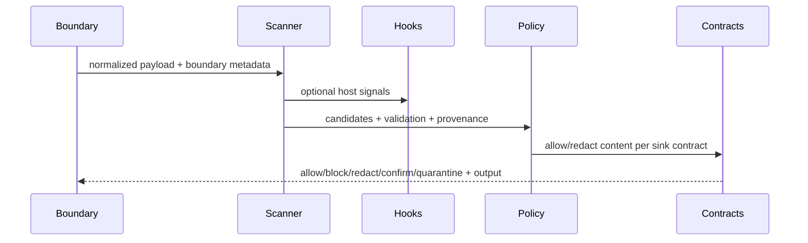

---
sigil_guard:
  id: "SP.04"
  title: "Boundary Scanner And Policy Kernel"
  domain: security
  status: planned
  priority: critical
  created: "2026-07-01"
  updated: "2026-07-02"
  tags:
    ["scanner", "policy", "boundary", "lifecycle", "output-contracts",
     "sandbox", "hooks", "streaming", "v3"]
  depends_on: ["R.01", "R.06", "R.07", "SP.01", "SP.02", "SP.03"]
---

# SP.04 - Boundary Scanner And Policy Kernel

## Executive Summary

V3 evolves SigilGuard from a scanner with policy helpers into a boundary-aware
policy kernel. Regex remains a fast candidate extractor, but final decisions
must bind source, sink, actor, tool capability, sandbox identity, action digest,
payload digest, context digest, scanner signals, lifecycle phase, and matched
rules. This revision fixes the v3 policy-file grammar, filenames, and digest;
sink-aware output contracts and their transforms (D8); the sandbox
`isolation_level` enum and fail-closed mismatch matrix; the full
`SigilGuard.Hooks` contract; the advisory adaptive-detector behaviour (D5);
the additive scanner-hit extension (D17); and the streaming holdback
property-test specification. It realizes R.06 rows 1, 9, 10, and 11
(test families TM.08 and TM.09).

## Business Value

- **Problem:** Regex-only or verdict-only security misses source-to-sink leaks,
  prompt injection, tool poisoning, lifecycle hook abuse, and repo-governance
  risks.
- **Solution:** Treat scanning as staged signal generation and policy as a
  deterministic decision kernel with digest-bound evidence.
- **Beneficiary:** Host applications using SigilGuard at MCP, repo, CI,
  tool-output, and model-ingress boundaries.
- **Impact:** Explainable decisions, better precision, safer streaming, and a
  reusable policy contract that encodes the lethal-trifecta defense (R.06).

## Technical Architecture

### Policy Pipeline

1. **Normalize boundary context:** phase, source, sink, actor, tenant/scope,
   transport, tool, sandbox identity, resource, and trust zone.
2. **Extract candidates:** regex, structured parsers, known secret values,
   prompt-injection indicators, tool-poisoning indicators, URLs, and paths.
3. **Validate candidates:** format checks, entropy, checksums, allowlists,
   baseline suppressions, and bundle validators.
4. **Enrich signals:** confidence, category, provenance, manifest digest,
   policy-file digest, hook results, adaptive indicators, and quarantine
   indicators.
5. **Evaluate policy:** deterministic deny precedence over kernel invariants,
   the sandbox matrix, policy-file rules, repo rules, and hook verdicts.
6. **Apply output contracts:** transform content permitted to cross, per the
   sink contract.
7. **Emit evidence:** attestation, audit event, OTel attributes, and optional
   quarantine reference.

### Lifecycle Taxonomy

| Phase | Blockable | Description |
|-------|-----------|-------------|
| `:session_start` | no | Host begins a run/session; evidence only. |
| `:tool_request` | yes | Actor asks to invoke a tool. |
| `:permission_requested` | yes | Runtime asks for human/host confirmation. |
| `:permission_resolved` | yes | Confirmation token is issued or denied. |
| `:tool_result` | yes | Tool output is about to enter model/user context. |
| `:file_changed` | yes | Repo/file mutation is proposed or observed. |
| `:model_ingress` | yes | Data is about to enter model context. |
| `:model_egress` | yes | Model output is about to leave the runtime. |
| `:session_end` | no | Host closes a run/session; evidence only. |

The `Blockable` column is the normative classification for the Hooks contract
below. V2 `SigilGuard.Context` phases map as `:inbound_user -> :model_ingress`,
`:outbound_model -> :model_egress`, `:repo_change -> :file_changed`;
`:tool_request`/`:tool_result` are unchanged; session and permission phases are
new v3 boundary events. Host-defined hooks may contribute signals, but
deterministic policy remains authoritative.

### Decision Combination (Normative)

Verdicts use the SP.07 unified enum with the total order
`block > quarantine > confirm > redact > allow`. Each source contributes at
most one verdict; the final verdict is the strongest contribution:

1. **Context validation failure** blocks terminally (no other stage runs).
2. **Kernel invariants** (deny/confirm side, never overridable): scanner
   failure blocks; `trust_zone: :untrusted` at `:tool_request` blocks;
   quarantine verdicts apply; secret hits headed to an external sink block or
   redact per `:on_sensitive`.
3. **Sandbox matrix** (below), unless replaced by an explicit `isolation:`
   rule.
4. **Policy-file `[rules]` verdict:** the strongest matching rule, else the
   file `default` when a policy file is loaded.
5. **`[repo]` verdict** at `:file_changed`: `block -> block`,
   `require_approval -> confirm`, `allow -> allow`.
6. **Hook verdicts** (`block`/`confirm` only).

Allow-side contributions take effect only where no stronger contribution
exists. Output contracts run after combination, on content the final verdict
permits to cross.

### Data Flow



## Data Model

### Policy Decision Input (`SigilGuard.Boundary`)

| Field | Type | Required | Description |
|-------|------|----------|-------------|
| `phase` | atom | yes | Lifecycle phase from the taxonomy above. |
| `source` | atom/string | yes | Source boundary. |
| `sink` | atom/string | yes | Destination boundary. |
| `source_sensitivity` | atom | no | `:public \| :internal \| :private`; defaults `:internal`. Evaluation fact only, never part of the SP.01 context digest; hosts needing it bound into evidence put it in the payload. |
| `actor` | map | no | Actor identity and trust claims. |
| `tool` | map | no | `name`, `manifest_digest`, `side_effects` (side-effect classes from the SP.03 manifest; defaults `[:execute]` when no verified manifest exists). |
| `resource` | map | no | Audience/resource/scope context. |
| `action_digest` | string | yes | Canonical action digest (SP.01). |
| `payload_digest` | string | yes | Canonical payload digest (SP.01). |
| `context_digest` | string | yes | Canonical policy context digest (SP.01). |
| `policy_file_digest` | string | no | Raw-bytes digest of the loaded policy file (below). |
| `hits` | list | yes | Scanner hits in the extended hit shape below. |
| `indicators` | list | no | Prompt-injection/tool-poisoning indicators. |
| `hook_results` | list | no | Host hook signals and outcomes. |
| `repo_changes` | list | no | Path/action facts for repo policy. |
| `trust_level` | atom | yes | Caller trust level. |
| `trust_zone` | atom/string | no | Deployment-defined zone. |
| `sandbox` | map | no | `sandbox_id` (string), `isolation_level` (enum below), `workspace_root_digest` (string). `sandbox_id` and `isolation_level` are part of the SP.01 context digest. |

```elixir
defmodule SigilGuard.BoundaryPolicy do
  alias SigilGuard.Boundary

  @spec evaluate(Boundary.t() | map() | keyword(), keyword()) ::
          SigilGuard.Decision.t()
  # opts: :policy (compiled policy), :hooks ([module()], invocation order),
  # :hook_timeout_ms (default 5_000), :adaptive_detector (module() | nil),
  # plus the scanner options accepted today by Runtime.Gate.
end
```

SP.04 adds no application-env configuration keys; the SP.01 closed key set is
final. Policies, hooks, detectors, and timeouts are explicit per-call options
or host-loaded values.

## Sandbox Identity

### Isolation Levels

`isolation_level` is a closed enum, ordered weakest to strongest:

```elixir
@type isolation_level :: :none | :container | :vm | :remote_attested
```

`SigilGuard.Context` gains `sandbox_id` and `isolation_level` fields.
`Context.validate/1` MUST reject values outside the enum with
`{:error, :invalid_isolation_level}` (the gate then emits its standard
malformed-input block). An absent (`nil`) level is valid context input and is
treated as untrusted by policy. An omitted level is byte-distinct from
`"none"` in the SP.01 context digest; policy treats both as untrusted.

`absent` is NOT a member of the `isolation_level` enum — it is the nil /
no-value case. The four enum values are the only values `Context` stores or
`validate/1` accepts. Separately, the policy-file `isolation:` matcher
(Policy File Schema below) accepts five KEYWORDS — the four enum values plus
`absent` — where `absent` matches only the nil case and is never implied by
any enum value. Enum membership (4) and matcher keywords (5) are distinct on
purpose; do not conflate them.

### Fail-Closed Default (Normative)

A tool-phase result whose context lacks `isolation_level`, or carries `:none`,
defaults to verdict `:quarantine` unless a `[rules]` line whose matcher set
includes `isolation:` matches the input and decides otherwise. That
explicit-rule override is the only sanctioned weakening of the matrix below;
kernel invariants are never weakened. When the default fires, the decision
records reason `:sandbox_required` and matched rule id
`sandbox.matrix.<class>.<level>`.

### Side-Effect Mismatch Matrix

The matrix applies at `:tool_request` and `:tool_result` using the tool's
manifest-declared side-effect classes (SP.03). A tool with multiple classes
uses the strictest resulting cell (by the verdict total order). No verified
manifest means class `execute`.

| Class \ Level | absent | `:none` | `:container` | `:vm` | `:remote_attested` |
|---------------|--------|---------|--------------|-------|--------------------|
| `read` | quarantine | quarantine | allow | allow | allow |
| `write` | quarantine | quarantine | confirm | allow | allow |
| `execute` | quarantine | block | confirm | allow | allow |
| `network` | quarantine | block | confirm | allow | allow |

`absent` always quarantines (unknown isolation is reviewable evidence); an
affirmative `:none` on `execute`/`network` blocks outright (the host declared
no isolation for the riskiest classes).

### Remote Attestation Evidence

`:remote_attested` MUST only be set by hosts that verified attestation
evidence out-of-band; SigilGuard never verifies it. The evidence blob MAY be
carried opaquely in `context.metadata["attestation_evidence"]` for audit
hand-off. Metadata is excluded from the context digest (SP.01), so hosts that
need the evidence digest-bound MUST place its digest in the payload.

## Policy File Schema

### Grammar

The v3 boundary-policy file extends the implemented `SigilGuard.RepoPolicy`
line-oriented style with structured sections. Lines are UTF-8; `#` starts a
comment; blank lines are ignored; files over 256 KiB fail with
`:policy_too_large`. In `[rules]` and `[contracts]`, a line beginning with
whitespace continues the previous logical line (joined with one space before
tokenizing); the `[repo]` body is passed to the v2 repo parser verbatim, with
no continuation folding.

```
policy_file   = version_line { section }
version_line  = "version 3"            # first non-comment line, mandatory
section       = "[rules]"     { default_line | rule_line }
              | "[repo]"      repo_grammar   # v2 grammar, unchanged
              | "[contracts]" { contract_line }
default_line  = "default" SP decision          # at most one; absent = confirm
rule_line     = decision { SP matcher }
decision      = "allow" | "redact" | "confirm" | "quarantine" | "block"
matcher       = key ":" value { "," value }    # split key on FIRST ":"
contract_line = "contract" SP "sink:" value { "," value } { SP field }
field         = fieldkey ":" fieldvalue
```

Each section appears at most once. Unknown sections, unknown matcher keys,
unknown enum values, a duplicated matcher key within one rule, a duplicated
`default`, or a missing/unknown version line fail with
`{:error, :invalid_policy_file}`. Matcher values within one key OR together;
matchers within one rule AND together; an absent key matches anything. Rule
ids are `line_<n>`, where `n` is the first physical line of the logical line.

| Key | Matches input field | Values |
|-----|---------------------|--------|
| `phase` | `phase` | the nine lifecycle phases. |
| `origin` | `origin` | `unknown`, `user`, `model`, `tool`, `resource`, `repo`. |
| `source` | `source` | exact string or `*`. |
| `sink` | `sink` | `internal`, `model`, `user`, `tool`, `external`, `network`, `log`, `repo`. |
| `zone` | `trust_zone` | `trusted`, `semi_trusted`, `untrusted`. |
| `trust` | `trust_level` | `low`, `medium`, `high`. |
| `sensitivity` | `source_sensitivity` | `public`, `internal`, `private`. |
| `isolation` | `sandbox.isolation_level` | `absent`, `none`, `container`, `vm`, `remote_attested`. |
| `effect` | `tool.side_effects` | `read`, `write`, `execute`, `network`. |
| `tool` | `tool.name` | exact string or `*`. |
| `actor` | `actor.id` | exact string or `*`. |
| `hits` | scanner hit categories present | `none`, `any`, `secret`, `injection`, `poisoning`. |
| `indicator` | indicator categories present | `none`, `any`, `injection`, `poisoning`. |

`none` MUST be the sole value in its matcher. `isolation:absent` matches a
context with no isolation level; it exists so an explicit rule can override
the matrix's absent column and is never implied by any other value.

### Precedence

Deny-before-allow precedence is preserved from the repo kernel and extended:
when several `[rules]` lines match one input, the strongest decision wins by
`block > quarantine > confirm > redact > allow`. The `[repo]` section keeps
its implemented `block > require_approval > allow` order and its
unmatched-path default semantics exactly as `SigilGuard.RepoPolicy` behaves
today.

### Policy Filenames (D13, Jointly Owned With SP.11)

The loader checks these repo-relative candidates in order:
`SIGILGUARD_POLICY`, `.sigilguard-policy`, `.sigilguard/policy`,
`.github/sigilguard-policy`. Legacy candidates are checked first: if
`SIGIL_POLICY`, `.sigil-policy`, `.sigil/policy`, or `.github/sigil-policy`
exists under the repo root, loading MUST fail with
`{:error, {:legacy_policy_filename, found, use}}` naming the found path and
its 1:1 positional replacement, even when a new-name file also exists. There
is no silent fallback and no coexistence; hosts that load policy at boot MUST
surface this as a typed startup error. Candidate paths keep the implemented
safety rules: safe relative paths only, resolved inside the repo root.

### Policy File Digest

`policy_file_digest` is the lowercase-hex SHA-256 over the raw bytes of the
policy file exactly as read, with no newline normalization, trimming, or
canonicalization. Raw bytes were chosen over a JCS-canonical parse digest
because the digest exists even for files that fail to parse, is byte-stable
across parser versions, matches what `sha256sum` and git produce, and never
lets byte-different files (comment or whitespace edits) collide onto one
digest, which would erase forensic distinctions. The compiled-policy canonical
digest (`RepoPolicy.digest/1` style) remains available for rule-equivalence
checks but is not the evidence value.

```elixir
defmodule SigilGuard.BoundaryPolicy.File do
  @type parse_error ::
          :invalid_policy_file | :invalid_output_contract | :unknown_transform

  @spec load(repo_root :: Path.t(), opts :: keyword()) ::
          {:ok, t()}
          | {:error, parse_error() | :not_found | :policy_too_large}
          | {:error, {:legacy_policy_filename, Path.t(), Path.t()}}

  @spec parse(String.t()) :: {:ok, t()} | {:error, parse_error()}

  @spec digest(raw_bytes :: binary()) :: String.t()
  # Lowercase-hex SHA-256 over the raw file bytes exactly as read.
end
```

### Canonical Example And Fixture Convention

The complete canonical policy file is the example in the next section. Its
exact bytes are committed as `test/fixtures/boundary_policy/canonical.policy`,
with `canonical.expected.json` holding the parsed rules, contracts, repo
section, and `policy_file_digest`. `test/fixtures/boundary_policy/invalid/`
holds one minimal file per parse-error atom, named after the atom. Fixture
regeneration MUST be byte-deterministic; changing canonical bytes requires
bumping the grammar version.

## Sink-Aware Output Contracts

Output contracts (D8) are per-sink guarantees applied to content the final
verdict permits to cross. They are the backstop for R.06 rows 1, 10, 11, and
14: even an allowed flow cannot carry raw credentials or oversized payloads
into an external sink.

### Contract Vocabulary

| Field | Type | Default | Meaning |
|-------|------|---------|---------|
| `max_size` | positive integer (bytes), minimum 64 | unlimited | Cap on outbound byte size; violations apply `truncate`. |
| `no_raw_credentials` | boolean | `false` | Re-scan outbound text with the secret pattern set; any surviving match is replaced per `credential_transform`. |
| `digest_only_pii` | boolean | `false` | Every span matched by a `pii: true` flagged pattern is replaced with `hash`. No built-in pattern sets the flag in v3.0; bundles supply PII patterns. |
| `classes` | CSV of `text`, `structured` | all classes | Allowed content classes from the SP.01 payload class: UTF-8 binary is `text`; map or list is `structured`. A disallowed class is not transformable: the verdict escalates to `block` with matched rule `contract.<sink>.class`. |
| `credential_transform` | `mask` \| `hash` | `mask` | Transform for `no_raw_credentials` violations; any other value fails with `:unknown_transform`. |

Each sink may appear in at most one contract; duplicates, unknown fields,
invalid classes, or `max_size` below 64 fail with
`{:error, :invalid_output_contract}`.

### Transform Semantics (Normative)

- **`truncate`** - keep the longest prefix whose byte size is at most
  `max_size - 11`, backed off to the previous complete UTF-8 codepoint
  boundary, then append the 11-byte ASCII marker `[TRUNCATED]`. The result is
  always valid UTF-8 and at most `max_size` bytes. Codepoint safety (not
  grapheme safety) is deliberate: it guarantees valid UTF-8 without Unicode
  segmentation tables; a split grapheme is a visual artifact, not a
  correctness fault.
- **`hash`** - replace the span with `"sha256:" <> hex`, the lowercase-hex
  SHA-256 of the span's raw bytes (71 bytes total). Deterministic, so
  identical secrets correlate across events without disclosure.
- **`mask`** - replace every Unicode codepoint of the span with `*` (U+002A),
  preserving the codepoint count (byte length may shrink).

### Evaluation Order (Normative)

Outbound content is processed in exactly this order:

1. **Scanner redaction** - hits replaced per replacement hints when the
   decision action is `redact`.
2. **Quarantine decision** - indicator sanitization and verdict effects.
3. **Output contract transforms** - for the contract matching `sink`: class
   check, then `credential_transform` replacements, then `digest_only_pii`
   replacements, then `max_size` truncation, in that order.

No contract runs on `block` or `quarantine` verdicts; nothing crosses.

### Complete Policy File Example

```
version 3

[rules]
default allow

# TM.09: private data x untrusted content x external comms
block sensitivity:private origin:tool,resource,repo
  zone:untrusted sink:external,network trust:low,medium
confirm sensitivity:private origin:tool,resource,repo
  zone:untrusted sink:external,network trust:high
confirm sensitivity:internal origin:tool,resource
  sink:external,network

# untrusted callers cannot execute privileged actions
block phase:tool_request zone:untrusted

# TM.08: gate retrieved memory/context at model ingress
quarantine phase:model_ingress origin:tool,resource
  indicator:injection,poisoning

# sandbox-aware overrides of the mismatch matrix
allow phase:tool_result isolation:container,vm,remote_attested
  effect:read
confirm phase:tool_request isolation:none effect:write

[repo]
default require_approval
allow agent:release-bot action:modify docs/** CHANGELOG.md
block agent:* priv/secrets/**

[contracts]
contract sink:external,network max_size:16384
  no_raw_credentials:true digest_only_pii:true classes:text
  credential_transform:hash
contract sink:log max_size:65536 no_raw_credentials:true
contract sink:model classes:text,structured
```

## Dataflow Rules And Lethal Trifecta

The first three rules of the canonical example are the concrete encoding of
R.06's lethal-trifecta sketch (row 10, TM.09), a conjunction over boundary
labels resolved deterministically:

- `sensitivity:private` marks a private-data source (host-labeled
  `source_sensitivity`).
- `origin:tool,resource,repo` plus `zone:untrusted` marks untrusted-content
  exposure.
- `sink:external,network` marks an external-communication sink.

When all three hold, low- and medium-trust actors are blocked outright; a
high-trust actor is routed to `confirm`, whose token binds the exact action
digest including `sandbox_id` (SP.01, SP.03), so an approval can never be
replayed against another action or sandbox. The third rule keeps unlabeled
(`internal` by default) tool/resource content out of external sinks without
confirmation. Because `block > confirm`, an input matching both rules blocks;
the `trust:` matchers partition the cases so the R.06 else-branch is reachable
exactly for `trust:high`.

Rationale: R.06 shows why this is a policy statement, not a classifier call.
CaMeL and the plan-then-execute pattern family demonstrate that untrusted
content must never reach a privileged action without a deterministic
checkpoint; Willison's trifecta reduces the failure condition to three
data-flow properties. The kernel evaluates exactly those properties from
boundary labels, needs no model cooperation, and emits a reproducible,
auditable verdict (R.06, "Why A Deterministic Policy Kernel").

## Hooks Behaviour

Hosts extend the kernel with lifecycle hooks. Hooks contribute signals and
deny-side verdicts; they can never weaken a deterministic decision. Callbacks
map 1:1 to lifecycle phases as `on_<phase>`; the taxonomy's `Blockable`
column is the normative blockable versus notification-only classification:
`on_session_start/2` and `on_session_end/2` are notification-only, the other
seven callbacks are blockable. All nine are optional callbacks.

```elixir
defmodule SigilGuard.Hooks do
  alias SigilGuard.Boundary

  @type hook_signal :: %{
          optional(:risk_level) => :low | :medium | :high,
          optional(:indicators) => [map()],
          optional(:note) => String.t()
        }
  @type blockable_result ::
          {:ok, :continue} | {:ok, :continue, hook_signal()}
          | {:block, reason :: String.t()} | {:confirm, reason :: String.t()}
  @type notify_result :: :ok | {:ok, hook_signal()}

  @callback on_session_start(Boundary.t(), keyword()) :: notify_result()
  @callback on_tool_request(Boundary.t(), keyword()) :: blockable_result()
  @callback on_permission_requested(Boundary.t(), keyword()) ::
              blockable_result()
  @callback on_permission_resolved(Boundary.t(), keyword()) ::
              blockable_result()
  @callback on_tool_result(Boundary.t(), keyword()) :: blockable_result()
  @callback on_file_changed(Boundary.t(), keyword()) :: blockable_result()
  @callback on_model_ingress(Boundary.t(), keyword()) :: blockable_result()
  @callback on_model_egress(Boundary.t(), keyword()) :: blockable_result()
  @callback on_session_end(Boundary.t(), keyword()) :: notify_result()
end
```

### Result Semantics

Hooks are passed via the `:hooks` option and invoked in registration order;
only the callback matching the input phase runs, and unexported callbacks are
skipped. `{:block, reason}` short-circuits remaining hooks; other results
accumulate. `hook_signal` values are advisory: `risk_level` may raise but
never lower computed risk, and `indicators` join the indicator list with
source `:hook`. Hook verdicts enter decision combination as `block`/`confirm`
contributions with matched rule id `hook.<module>.<phase>`. Hooks cannot emit
`allow`, `redact`, or `quarantine`. Any return outside the contract is
`:invalid_hook_result`, handled as a crash below.

### Timeouts And Fail-Closed Matrix

Every hook invocation MUST be time-bounded by `:hook_timeout_ms`
(default `5_000` ms).

| Failure | Blockable phase | Notification-only phase |
|---------|-----------------|-------------------------|
| timeout (`:hook_timeout`) | verdict `block`, reason `:hook_timeout` | log-and-continue (telemetry only) |
| crash (raise/exit/throw) | verdict `block`, reason `:hook_crash` | log-and-continue (telemetry only) |
| `:invalid_hook_result` | verdict `block`, reason `:invalid_hook_result` | log-and-continue (telemetry only) |

## Adaptive Detector Behaviour

D5: the behaviour lives in core; model-backed implementations live outside
core. Results are strictly advisory: they may raise the risk level, never
lower it, and are never the sole basis for an allow.

```elixir
defmodule SigilGuard.AdaptiveDetector do
  alias SigilGuard.Boundary

  @type indicator :: %{
          required(:id) => String.t(),
          required(:severity) => :low | :medium | :high,
          required(:confidence) => float(),
          optional(:note) => String.t()
        }

  @callback analyze(text :: String.t(), Boundary.t(), opts :: keyword()) ::
              {:ok, [indicator()]} | {:error, atom()}
end
```

- **Nil path (normative):** with `:adaptive_detector` unset or `nil`, the
  behaviour is absent and decisions are byte-identical to a build without it.
  Tests MUST prove this equality.
- Returned indicators join the indicator list with source `:adaptive` and
  feed the risk ladder exactly like quarantine indicators (`:high` severity
  raises risk to `:high`, `:medium` to at least `:medium`); they never
  produce an allow contribution.
- **Well-formed indicator (normative):** a map with `:id` (non-empty
  binary), `:severity` in `[:low, :medium, :high]`, and `:confidence` a
  float in `0.0..1.0`; `:note` optional binary; no other required keys. A
  returned element is malformed if it is not a map, is missing a required
  key, or carries an out-of-domain `:severity`/`:confidence`. Validation is
  per-element: the core MUST validate every returned indicator before use.
- A detector `{:error, _}`, timeout (bounded by `:hook_timeout_ms`), crash,
  or a result whose top level is not a list, OR any single malformed
  indicator element, degrades the WHOLE result to zero indicators, recorded
  in telemetry and audit metadata as `adaptive_error`; the deterministic
  verdict is unchanged. (All-or-nothing, so a detector cannot smuggle a
  partial result past validation.)
- The reference implementation (Ortex/ONNX classifier) is an optional
  post-GA package (R.07) and is not specified here.

## Scanner Hit Extension And Pattern-Set Split

### Hit Map (D17, Additive Only)

`SigilGuard.scan/1` returning `{:ok, text} | {:hit, hits}` and
`scan_and_redact/1` returning a binary are unchanged contracts. `name` is the
only load-bearing key for consumers (D17). The v3 required set narrows to
`name`, `match`, `offset`, `length` so custom pipelines interoperate; the
built-in pipeline always emits every field below.

| Key | Type | Presence | Notes |
|-----|------|----------|-------|
| `name` | `String.t()` | required | Hard consumer contract (D17). |
| `match` | `String.t()` | required | Raw matched bytes. |
| `offset` | `non_neg_integer()` | required | Byte offset. |
| `length` | `non_neg_integer()` | required | Byte length. |
| `replacement_hint` | `String.t() \| nil` | optional | Redaction replacement. |
| `category` | `:secret \| :injection \| :poisoning` | optional | Closed atom set; replaces the v2 free string (`"credential"` maps to `:secret`). |
| `confidence` | `float()` in `0.0..1.0` | optional | Staged-pipeline score. |
| `severity` | `:low \| :medium \| :high` | optional | Pattern severity. |
| `span` | `{offset, length}` tuple | optional | MUST equal the flat `offset`/`length` byte values when present. |

### Pattern Sets

Prompt-injection and tool-poisoning indicators become pattern sets distinct
from secret patterns. All three sets are bundle-suppliable: SP.02 bundle
pattern entries gain a `set` field (`"secret"`, `"injection"`, `"poisoning"`)
and each set can be supplied or overridden independently. Quarantine consumes
the injection and poisoning sets; its current seven indicators are the
built-in defaults when no bundle supplies those sets.

| Set | Built-in members | Category |
|-----|------------------|----------|
| secret | `aws_access_key`, `generic_api_key`, `bearer_token`, `database_uri`, `private_key`, `generic_secret` | `:secret` |
| injection | `ignore_instructions`, `exfiltration_request`, `system_prompt_probe`, `model_extraction_request`, `credential_harvest_instruction`, `hidden_html_instruction` | `:injection` |
| poisoning | `tool_poisoning_directive` | `:poisoning` |

## Streaming Property-Test Specification

### Holdback Invariant (Normative)

Every compiled pattern carries a bounded `max_match_bytes`. Built-in values:
`aws_access_key` 20, `private_key` 40, and 256 for `generic_api_key`,
`bearer_token`, `database_uri`, and `generic_secret` (unbounded quantifiers
clamped). Bundle patterns MAY declare `max_match_bytes` in `1..4096`;
undeclared defaults to 256. The effective holdback window MUST be greater
than or equal to the largest `max_match_bytes` among active patterns; the
default window (256 bytes) satisfies every built-in, and
`Runtime.Stream.new/2` MUST raise the window to that maximum when the
configured `:stream_window_bytes` is smaller.

### Generators

Property tests MUST cover, for every secret-pattern fixture text:

- **Exhaustive two-chunk splits:** every byte offset `1..byte_size(text)-1`
  becomes a chunk boundary (fixture texts are small; enumeration is cheap).
- **Random multi-chunk partitions** via StreamData, including a degenerate
  all-1-byte-chunks partition.
- **Multi-byte UTF-8 splits:** fixtures embedding 2-4 byte codepoints
  adjacent to and inside secrets, split mid-codepoint inside the holdback
  window.
- **Grapheme-cluster splits:** combining sequences (`e` + U+0301) and emoji
  ZWJ sequences split inside the holdback window.

Invariants: the concatenation of all `push/2` emissions plus the `finish/1`
emission equals the single-shot gate output for the whole text; and no
emitted prefix at any point contains bytes matching any active secret
pattern.

### Latency Budget

Emission lags the high-water mark by at most the effective window plus any
span withheld because a candidate hit straddles the emit boundary; the
pending buffer MUST NOT otherwise grow without bound. `finish/1` MUST flush
all withheld bytes after the final gate evaluation (nothing is withheld
forever), and a halted stream emits nothing further.

### Curated Vector File

`test/fixtures/streaming/split_secret_vectors.json` is the committed vector
set. Each vector is `{"name", "chunks": [utf8 strings], "patterns":
"built_in" | inline, "expected_hit_names": [...], "expected_emitted": exact
concatenation}`. Required contents: for each built-in pattern, splits at the
first byte, one byte before match end, and mid-match; a mid-codepoint split;
a grapheme-cluster split; an all-1-byte-chunks split of one full secret; and
Unicode-confusable negative vectors (for example a Cyrillic `А` inside an
`AKIA` lookalike) that MUST NOT match or redact.

## Non-Goal: Shell-Command AST Risk Analysis (D18)

Parsing shell commands into ASTs to score execution risk is explicitly out of
scope for v3.0. Command risk is shell-dialect and host specific; deterministic
coverage would need a parser per dialect, and the kernel already gates the
`execute` side-effect class through the sandbox matrix and denies untrusted
content into execution sinks via rules and contracts. Hosts keep their own
analyzers (the reference consumer keeps its own command analyzer). Revisit
post-GA.

## Module Map

| Module | Purpose |
|--------|---------|
| `lib/sigil_guard/boundary.ex` | Normalized policy decision input struct and validation. |
| `lib/sigil_guard/boundary_policy.ex` | Deterministic evaluation, combination, precedence, explanations. |
| `lib/sigil_guard/boundary_policy/file.ex` | V3 grammar parser, filenames, legacy error, raw-bytes digest. |
| `lib/sigil_guard/boundary_policy/contract.ex` | Output-contract parsing and the three transforms. |
| `lib/sigil_guard/hooks.ex` | Hook behaviour, dispatcher, timeout, fail-closed handling. |
| `lib/sigil_guard/adaptive_detector.ex` | Advisory detector behaviour with nil path. |
| `lib/sigil_guard/scanner/pipeline.ex` | Candidate extraction, validation, enrichment (existing). |
| `lib/sigil_guard/patterns.ex` | Pattern-set split, `max_match_bytes`, hit shape (existing). |
| `lib/sigil_guard/quarantine.ex` | Pluggable indicator sets; built-in defaults (existing). |
| `lib/sigil_guard/repo_policy.ex` | `[repo]` section evaluator (existing, unchanged grammar). |
| `lib/sigil_guard/runtime/stream.ex` | Chunk-safe streaming sanitizer (existing). |
| `test/fixtures/boundary_policy/`, `test/fixtures/streaming/` | Canonical policy, invalid fixtures, split-secret vectors. |

## V3 API Changes

| Current Surface | V3 Replacement |
|-----------------|----------------|
| Scanner result drives decision directly | Scanner emits signals consumed by `BoundaryPolicy`. |
| `Policy.policy_verdict/2` as central gate | `BoundaryPolicy.evaluate/2` over normalized input. |
| Implicit source/sink | Required boundary context. |
| Generic quarantine checks | Quarantine as a first-class verdict/evidence ref with pluggable sets. |
| Repo policy separate from runtime evidence | `[repo]` section feeds policy facts and audit metadata. |
| `SIGIL_POLICY` filename family | `SIGILGUARD_POLICY` family; legacy names raise `:legacy_policy_filename`. |
| Free-string hit `category` | Closed atom set `:secret \| :injection \| :poisoning`. |

## Integration Points

| System | Integration | Direction | Protocol |
|--------|-------------|-----------|----------|
| Host app | `BoundaryPolicy.evaluate/2`, `File.load/2`, hooks, detector | inbound | Elixir API |
| Runtime gate (SP.07) | gate rewires final verdicts to the kernel | internal | Elixir API |
| MCP gateway (SP.03) | manifest side effects, phases, confirmation digests | internal | Elixir API |
| Repo policy (SP.11) | `[repo]` section evaluation and facts | internal | Elixir API |
| Trust bundle (SP.02) | pattern sets, bundle-carried policy rules | internal | Elixir API |
| Attestation/Audit (SP.01, SP.05) | verdicts, digests, evidence refs | internal | Elixir API |

## Telemetry And Observability

| Event | Type | Metadata | Purpose |
|-------|------|----------|---------|
| `[:sigil_guard, :boundary, :evaluate, :start \| :stop \| :exception]` | span | `%{phase, verdict, matched_rule_count, policy_file_digest, isolation_level}` | Kernel latency and outcome. |
| `[:sigil_guard, :boundary, :hook]` | event | `%{module, phase, result, duration}`; `result` includes `:hook_timeout`, `:hook_crash`, `:invalid_hook_result` | Hook behavior and failures. |
| `[:sigil_guard, :boundary, :contract]` | event | `%{sink, transforms, bytes_in, bytes_out}` | Contract transform effects. |
| `[:sigil_guard, :boundary, :adaptive]` | event | `%{detector, indicator_count, error}` | Advisory detector outcomes. |

Metadata never carries raw payloads or matched text. OpenTelemetry attribute
prefix reconciliation (D16) is owned by SP.05.

## Error Handling

SP.01's profile-wide taxonomy applies by reference (`:invalid_context`,
`:invalid_payload`, digest and statement atoms). Spec-local atoms:

| Error | Type | Recovery | User Impact |
|-------|------|----------|-------------|
| `:invalid_policy_file` | return tuple | fix version line, section, matcher key, enum value, or duplicate | policy not loaded |
| `:legacy_policy_filename` | typed startup/load error naming the replacement file | rename to the new filename | boot/load fails closed |
| `:invalid_output_contract` | return tuple | fix duplicate sink, unknown field, class, or `max_size` | policy not loaded |
| `:unknown_transform` | return tuple | use `mask` or `hash` | policy not loaded |
| `:hook_timeout` | decision reason | raise `:hook_timeout_ms` or fix hook | blockable phase blocks; notify-only logged |
| `:invalid_hook_result` | decision reason | fix the hook return value | treated as crash per the matrix |
| `:sandbox_required` | decision reason | supply sandbox identity or add an explicit `isolation:` rule | quarantine/block per the matrix |
| `:invalid_isolation_level` | context validation | use a closed-enum value | request blocked |
| `:scanner_timeout` | decision | fail closed for outbound sinks | output blocked |
| `:stream_holdback_overflow` | decision | redact or block | partial output withheld |

## Security Considerations

- Regex is a candidate extractor, not the decision engine; contracts are a
  backstop even on allowed flows.
- Output headed toward a model or external sink must carry source and sink;
  the trifecta rules depend on honest boundary labels.
- Policy is deterministic and explainable; every verdict names matched rules.
- The streaming holdback window is normatively tied to pattern lengths.
- Every parser enum is closed; no dynamic atoms from policy files, paths,
  actor names, or actions.
- Legacy policy filenames fail closed with a typed error; no silent fallback
  exists for an attacker to exploit by planting an old-name file.
- Hooks and adaptive detectors can only tighten decisions; their failures
  fail closed on blockable phases and never weaken a verdict.
- Remote-attestation evidence is host-verified and never digest-bound via
  metadata; digest binding goes through the payload (SP.01).

## Testing Strategy

| Test | Module | What It Verifies |
|------|--------|------------------|
| trifecta policy (TM.09) | `BoundaryPolicyTest` | Canonical rules block low/medium trust and confirm high trust on the trifecta conjunction. |
| model-ingress gating (TM.08) | `BoundaryPolicyTest` | Retrieved content with injection/poisoning indicators quarantines at `:model_ingress`. |
| sandbox matrix | `BoundaryPolicyTest` | All 20 class-by-level cells, including `absent`; only rules with an `isolation:` matcher override a cell. |
| contract transforms | `ContractTest` | `truncate` UTF-8-safe and size-bounded (property); `hash` emits the 71-byte form; `mask` preserves codepoint count; evaluation order proven. |
| grammar negatives | `FileTest` | Each parse-error atom from its invalid fixture; digest equals raw-bytes SHA-256. |
| legacy filenames | `FileTest` | Each of the four legacy names yields `:legacy_policy_filename` naming its replacement, even with a new-name file present. |
| hook matrix | `HooksTest` | Timeout/crash/invalid-result block on every blockable phase and log-and-continue on notification-only phases. |
| adaptive nil path | `AdaptiveDetectorTest` | Decisions byte-identical with detector unset; detector errors change nothing. |
| hit shape and sets | `Scanner.PipelineTest`, `QuarantineTest` | `scan/1`/`scan_and_redact/1` shapes unchanged; additive fields typed; the seven indicators split into sets and are bundle-overridable. |
| holdback properties | `Runtime.StreamTest` | Exhaustive split offsets, UTF-8/grapheme splits, and the curated vector file leak nothing. |

## Acceptance Criteria

- [ ] `canonical.policy` parses; `canonical.expected.json` reproduces rules,
      contracts, repo section, and the raw-bytes `policy_file_digest`.
- [ ] Every legacy filename produces
      `{:error, {:legacy_policy_filename, found, use}}` with the correct
      positional replacement; no silent fallback path exists.
- [ ] Rule precedence follows `block > quarantine > confirm > redact > allow`;
      `[repo]` keeps its implemented precedence and defaults.
- [ ] All 20 sandbox matrix cells are tested; absent/`:none` results
      quarantine or block exactly as specified, and only rules carrying an
      `isolation:` matcher override a cell.
- [ ] The trifecta example blocks `trust:low,medium` and confirms
      `trust:high`; the confirmation binds the action digest with `sandbox_id`.
- [ ] The three transforms match their normative semantics, including the
      truncation UTF-8 property, the 64-byte `max_size` floor, and the
      redaction-quarantine-contract evaluation order.
- [ ] Every hook callback exists with the specified signature; the fail-closed
      matrix covers timeout, crash, and `:invalid_hook_result` on blockable
      and notification-only phases.
- [ ] Adaptive nil-path byte-equality holds; adaptive indicators raise but
      never lower risk and never produce an allow.
- [ ] `scan/1` and `scan_and_redact/1` return shapes are unchanged; `name` is
      preserved on every hit; additive fields validate; `span` equals
      `{offset, length}`.
- [ ] Streaming properties enumerate every two-chunk split of every secret
      fixture with zero leaks; the effective window rises to the largest
      active `max_match_bytes`.
- [ ] `split_secret_vectors.json` exists with the required vector classes,
      including confusable negatives, and executes green.
- [ ] Every spec-local error atom is produced by at least one test.

## Implementation Roadmap

Aligned with milestone M4 (the task list owns task IDs); TM.08/TM.09 threat
modules land in M5 on top of this work.

- [ ] M4: `SigilGuard.Boundary` input struct with sandbox fields,
      `source_sensitivity`, and validation.
- [ ] M4: policy-file parser (version line, sections, folding), raw-bytes
      digest, D13 filenames, and the legacy-filename typed error.
- [ ] M4: `BoundaryPolicy.evaluate/2` with decision combination, precedence,
      and matched-rule explanations.
- [ ] M4: sandbox mismatch matrix, quarantine defaults, and the explicit
      `isolation:` override rule.
- [ ] M4: output contracts with the three transforms and evaluation-order
      wiring.
- [ ] M4: `SigilGuard.Hooks` behaviour, dispatcher, timeout, fail-closed
      matrix.
- [ ] M4: `SigilGuard.AdaptiveDetector` behaviour with nil-path equality
      tests.
- [ ] M4: pattern-set split, `max_match_bytes`, hit-map extension, pluggable
      quarantine sets.
- [ ] M4: streaming property tests and the curated vector file.
- [ ] M4: canonical and lethal-trifecta policy fixtures with doctests.

## Success Metrics

| Metric | Target | Measurement |
|--------|--------|-------------|
| Streaming leaks | zero known vectors | exhaustive split properties + vector file. |
| Explainability | every block has rule/reason | decision tests. |
| Determinism | same input gives same digest/verdict | policy tests. |
| Sandbox matrix | 20/20 cells tested | `BoundaryPolicyTest`. |
| Coverage | >= 95% | `mix test --cover`. |

## Sources

- [R.01 - Embedded Agent Trust Profile](../research/R.01-embedded-mcp-trust-profile.md)
- [R.06 - Agentic Threat Model And Control Mapping](../research/R.06-agentic-threat-model-and-control-mapping.md)
- [R.07 - Ecosystem Positioning, Dependencies, And Adoption](../research/R.07-ecosystem-positioning-dependencies-and-adoption.md)
- [OWASP Top 10 for Agentic Applications 2026](https://genai.owasp.org/resource/owasp-top-10-for-agentic-applications-for-2026/)
- [OWASP MCP Tool Poisoning](https://owasp.org/www-community/attacks/MCP_Tool_Poisoning)
- [Simon Willison - The lethal trifecta for AI agents (2025-06-16)](https://simonwillison.net/2025/Jun/16/the-lethal-trifecta/)
- [CaMeL - Defeating Prompt Injections by Design (arXiv 2503.18813)](https://arxiv.org/abs/2503.18813)
- [Design Patterns for Securing LLM Agents against Prompt Injections (arXiv 2506.08837)](https://arxiv.org/abs/2506.08837)
