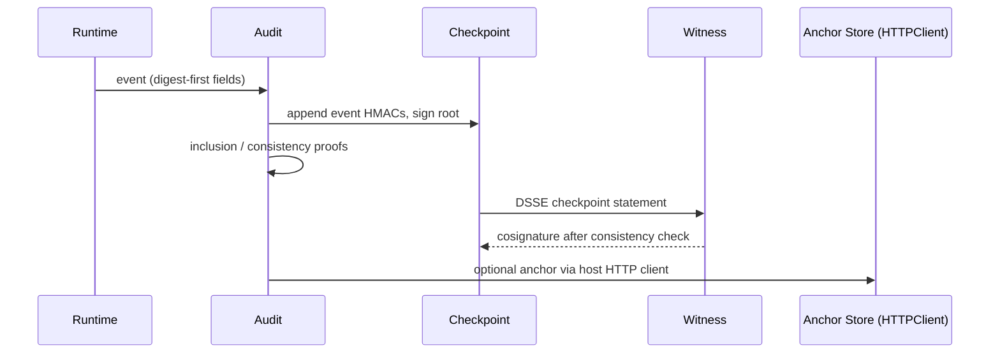

---
sigil_guard:
  id: "SP.05"
  title: "Audit And Release Provenance"
  domain: security
  status: implemented
  priority: critical
  created: "2026-07-01"
  updated: "2026-07-07"
  tags: ["audit", "merkle", "proofs", "witnessing", "privacy", "otel", "sbom", "release-provenance", "http-client", "v3"]
  depends_on: ["R.01", "R.02", "R.04", "R.07", "SP.01"]
---

# SP.05 - Audit And Release Provenance

## Executive Summary

V3 decisions produce privacy-preserving evidence that third parties can
verify after the fact. This spec adds RFC 9162-style inclusion and
consistency proofs over the existing domain-separated Merkle tree, optional
witness cosigning of DSSE checkpoint statements, and normative per-field
privacy classes (D10); the audit read/query API; the `sigilguard.*`
OpenTelemetry namespace resolution (D16); SLSA Build L3 release provenance
with the existing SPDX SBOM task (D15); and the `SigilGuard.HTTPClient`
behaviour replacing direct finch use in the HTTP anchor store (D9). The
`%SigilGuard.Audit{}` struct, `sign_event/3`, and every issued checkpoint
root remain unchanged (D17); every addition is additive.

## Business Value

- **Problem:** Proving anything about a checkpointed segment requires
  handing the verifier every event; a compromised operator can present
  forked chains; telemetry can leak what the chain avoids storing.
- **Solution:** O(log n) proofs against already-issued roots, m-of-n
  witness cosignatures, uniform privacy classes, verifiable releases.
- **Beneficiary:** Operators, auditors, regulated users, incident
  responders, CI, and the reference consumer (read/query API).
- **Impact:** Offline-checkable forensic evidence with zero re-issued
  checkpoints and zero new runtime dependencies.

## Technical Architecture

Evidence layers: (1) digest-first `%SigilGuard.Audit{}` events on the HMAC
chain; (2) signed Merkle checkpoints (existing record, the local RFC 9162
signed-tree-head equivalent); (3) inclusion/consistency proofs; (4) DSSE
checkpoint statements with witness cosignatures; (5) privacy-filtered OTel
and CloudEvents projections; (6) release provenance (SLSA, SBOM, and the
SP.01 `release` statement).



## Data Model

### Signed Audit Event

The v3 signed audit event is the existing `%SigilGuard.Audit{}` struct.
Its fields, `new_event/5`, `sign_event/3`, `verify_chain/3`,
`build_chain/2`, and `canonical_bytes/1` are frozen contracts (D17).

| Field | Type | Chain-signed | Description |
|-------|------|--------------|-------------|
| `id` | `String.t()` | yes | Random 16-byte lowercase-hex event id. |
| `type` | `String.t()` | yes | Event type, e.g. `"runtime.gate"`. |
| `actor` | `String.t()` | yes | Actor value after privacy classification. |
| `action` | `String.t()` | yes | Action name only, never raw arguments. |
| `result` | `String.t()` | yes | Verdict/result vocabulary value. |
| `timestamp` | `String.t()` | yes | ISO 8601 UTC, millisecond precision. |
| `metadata` | `map()` | no | Reserved evidence keys below. |
| `prev_hmac` | `String.t() \| nil` | link | Chain link to predecessor HMAC. |
| `hmac` | `String.t() \| nil` | derived | The event hash (HMAC-SHA256). |
| `event_type`, `actor_info`, `action_info`, `result_info` | struct \| nil | no | Optional typed mirrors; never signed, never projected. |

Reserved v3 `metadata` string keys (all optional): `"evidence"`
(`[{"kind": "checkpoint" | "export" | "anchor", "ref": string}]`, the
SP.01 evidence shape), `"decision_id"`, `"trace_id"`, `"span_id"`,
`"action_digest"`, `"payload_digest"`, `"context_digest"`,
`"manifest_digest"`, `"policy_digest"`, `"sandbox_id"`, `"decision"`
(verdict, reason, matched rule ids), `"scanner_summary"` (counts and
pattern names only), `"quarantine_ref"`. Because `metadata` is outside the
canonical bytes (D17), evidence refs are integrity-bound by the digests
they contain and by the DSSE-signed export layer, not by the chain HMAC;
this is a recorded consequence of freezing `sign_event/3`.

### Event Hash Field List (Exact, Ordered)

The event hash is the `hmac` field. Canonical bytes are compact JSON with
exactly these keys, in exactly this lexicographic order:

```
action, actor, id, result, timestamp, type
```

`metadata`, `prev_hmac`, `hmac`, and the `*_info` fields are excluded. The
hash is `HMAC-SHA256(chain_key, canonical_bytes <> chain_input)`, encoded
lowercase hex, where `chain_input` is the ASCII string `"genesis"` for the
first event and the predecessor's lowercase-hex `hmac` string otherwise.
SP.09 records these constants as normative literals.

### Canonical Example

```json
{
  "id": "00000000000000000000000000000001",
  "type": "runtime.gate",
  "actor": "fh1:<computed: HMAC-SHA256(field_hash_key, actor id)>",
  "action": "repo_file_write",
  "result": "block",
  "timestamp": "2026-07-02T12:00:00.000Z",
  "metadata": {
    "decision": {"matched_rules": ["repo.write.block"], "verdict": "block"},
    "decision_id": "<computed: 16-byte hex>",
    "evidence": [{"kind": "checkpoint", "ref": "<computed: digest>"}],
    "payload_digest": "<computed: sha256>"
  },
  "prev_hmac": null,
  "hmac": "<computed: lowercase-hex HMAC-SHA256>"
}
```

### Export Package DSSE Form

Externally shared checkpoint evidence is a DSSE envelope per SP.01
(payloadType exactly `application/vnd.sigilguard+json`, PAE, base64url,
duplicate-keyid rejection). The payload is the JCS-canonical checkpoint
statement below. This spec registers the non-statement predicate type
`https://sigilguard.dev/audit-checkpoint-state/v1`, following the pattern
SP.02 uses for `trust-bundle-state/v1`.

```json
{
  "_type": "https://in-toto.io/Statement/v1",
  "predicate": {
    "chain_id": "prod-agent-runtime-1",
    "generated_at": "2026-07-02T12:00:05.000Z",
    "merkle_root": "<computed: size-5 root, lowercase hex>",
    "profile": "sigil_guard_agent_trust/v1",
    "tree_size": "5"
  },
  "predicateType": "https://sigilguard.dev/audit-checkpoint-state/v1",
  "subject": [
    {"digest": {"sha256": "<computed: Checkpoint.digest/1>"}, "name": "checkpoint"}
  ]
}
```

`tree_size` is a JSON string per the SP.01 growable-counter rule;
`chain_id` is omitted when `nil`. The subject digest is
`Checkpoint.digest/1` over the unchanged local checkpoint record (kind
`sigil_guard.audit.checkpoint`, version 1), which stays valid exactly as
in 0.2.x: DSSE wrapping applies to exports and cosigning, never to local
storage. The export package keeps kind `sigil_guard.audit.export` version
1 and gains three optional keys: `"checkpoint_statement"` (the DSSE
envelope), `"inclusion_proofs"`, and `"consistency_proof"`. Packages
without them remain byte-identical to 0.2.x exports.

## Inclusion And Consistency Proofs

### Tree Construction (Normative Literals)

Proofs operate over the existing tree with no changes. Constants (also
recorded in SP.09):

```
LEAF(h)    = SHA-256("sigil-audit-leaf-v1:" || h)
NODE(l, r) = SHA-256("sigil-audit-node-v1:" || l || r)
EMPTY_ROOT = SHA-256("sigil-audit-empty-v1")
```

`h` is the event's `hmac` exactly as stored: 64 lowercase-hex ASCII bytes,
never the decoded 32 bytes. `l` and `r` are raw 32-byte hashes. Levels
pair left to right; an unpaired last node is promoted upward. R.04
verified computationally that this promotion construction and the RFC 9162
recursive construction produce identical roots for every size 1..256, so
the RFC proof algorithms apply to already-issued checkpoint roots
unchanged; implementations MAY use either construction and the vectors pin
equality. Roots and proof nodes serialize as 64-char lowercase hex. The
empty tree has no proofs; generation over an empty segment fails with
`{:error, :out_of_range}`.

### Proof Objects

Proof objects are closed: unknown keys, wrong types, non-64-char or
non-lowercase-hex entries, and sizes at or above 2^53 fail with
`{:error, :invalid_proof}`. `leaf_index` is zero-based; `audit_path` is
ordered leaf-to-root with at most `ceil(log2(tree_size))` entries;
`first_size`/`second_size` are the event counts of the older and newer
checkpoints.

```json
{"kind": "sigil_guard.audit.inclusion_proof", "version": 1,
 "leaf_index": 2, "tree_size": 5,
 "audit_path": ["<hex>", "<hex>", "<hex>"]}

{"kind": "sigil_guard.audit.consistency_proof", "version": 1,
 "first_size": 3, "second_size": 5,
 "proof_nodes": ["<hex>", "<hex>", "<hex>", "<hex>"]}
```

### Inclusion Proof Verification

Adapted from RFC 9162 section 2.1.3.2. Inputs: proof object, the event's
`hmac` string, and `merkle_root` from a trusted checkpoint whose
`event_count` equals `tree_size`.

1. If the proof object is malformed, fail `{:error, :invalid_proof}`.
2. If `leaf_index >= tree_size`, or the checkpoint `event_count` differs
   from `tree_size`, fail `{:error, :out_of_range}`.
3. Set `fn := leaf_index`, `sn := tree_size - 1`, `r := LEAF(hmac)`.
4. For each `p` in `audit_path` (decoded from hex), in order:
   1. If `sn == 0`, fail `{:error, :proof_verification_failed}`.
   2. If `fn` is odd, or `fn == sn`: set `r := NODE(p, r)`; then, if `fn`
      is even, right-shift `fn` and `sn` together until `fn` is odd or
      `fn == 0`.
   3. Otherwise set `r := NODE(r, p)`.
   4. Right-shift `fn` and `sn` one bit.
5. If `sn != 0`, fail `{:error, :proof_verification_failed}`.
6. If lowercase-hex `r` equals `merkle_root`, return `:ok`; otherwise fail
   `{:error, :proof_verification_failed}`.

### Consistency Proof Verification

Adapted from RFC 9162 section 2.1.4.2. Inputs: proof object plus
`first_root` and `second_root` from two trusted checkpoints.

1. If the proof object is malformed, fail `{:error, :invalid_proof}`.
2. If `first_size < 1` or `first_size > second_size`, fail
   `{:error, :out_of_range}`.
3. If `first_size == second_size`: `proof_nodes` MUST be empty (else
   `{:error, :invalid_proof}`); return `:ok` when the roots are equal,
   else `{:error, :inconsistent_tree}`.
4. If `proof_nodes` is empty, fail `{:error, :invalid_proof}`.
5. If `first_size` is an exact power of two, prepend the decoded
   `first_root` to `proof_nodes`.
6. Set `fn := first_size - 1`, `sn := second_size - 1`.
7. While `fn` is odd, right-shift `fn` and `sn` one bit each.
8. Set `fr` and `sr` to the first value of `proof_nodes`.
9. For each subsequent `c` in `proof_nodes`:
   1. If `sn == 0`, fail `{:error, :invalid_proof}`.
   2. If `fn` is odd, or `fn == sn`: set `fr := NODE(c, fr)` and
      `sr := NODE(c, sr)`; then, if `fn` is even, right-shift `fn` and
      `sn` together until `fn` is odd or `fn == 0`.
   3. Otherwise set `sr := NODE(sr, c)`.
   4. Right-shift `fn` and `sn` one bit.
10. If `sn != 0`, fail `{:error, :invalid_proof}`.
11. If lowercase-hex `fr` equals `first_root` and lowercase-hex `sr`
    equals `second_root`, return `:ok`; otherwise fail
    `{:error, :inconsistent_tree}`.

### Generation API

```elixir
defmodule SigilGuard.Audit.Proof do
  @spec inclusion([SigilGuard.Audit.t()], leaf_index :: non_neg_integer()) ::
          {:ok, map()} | {:error, :out_of_range | :unsigned_event}

  @spec verify_inclusion(proof :: map(), hmac :: String.t(), merkle_root :: String.t()) ::
          :ok | {:error, :invalid_proof | :out_of_range | :proof_verification_failed}

  @spec consistency([SigilGuard.Audit.t()], first_size :: pos_integer()) ::
          {:ok, map()} | {:error, :out_of_range | :unsigned_event}

  @spec verify_consistency(proof :: map(), first_root :: String.t(), second_root :: String.t()) ::
          :ok | {:error, :invalid_proof | :out_of_range | :inconsistent_tree}
end
```

Generation runs on the host holding the events (`second_size` for
`consistency/2` is `length(events)`); any unsigned event fails with
`{:error, :unsigned_event}` as `merkle_root/1` does today. Verification is
pure and needs only checkpoints. Because leaves are HMAC outputs, proofs
reveal only the target event's HMAC and unrelated sibling hashes; event
bodies never leave the host.

### Golden Vector: Five-Event Tree

Fixed inputs: chain HMAC key = the 32 ASCII bytes
`"sigil-guard-audit-proof-test-key"`; event `i` (i = 0..4) has `id` =
32-hex zero-padded `i + 1`, `type` `"runtime.gate"`, `actor`
`"spiffe://test.example.org/agents/proof-vector"`, `action`
`"proof_vector"`, `result` `"allow"`, `timestamp`
`2026-07-02T12:00:0i.000Z`; checkpoint signer = the SP.01 Ed25519 test
seed (`0x01..0x20`). Hash values are produced at fixture-generation time;
the structure below is exact and normative. With `Hi = LEAF(hmac_i)`:

```
level 3:               R5 = NODE(N0123, H4)
level 2:      N0123 = NODE(N01, N23)               H4 (promoted)
level 1:  N01 = NODE(H0, H1)  N23 = NODE(H2, H3)   H4 (promoted)
level 0:  H0        H1        H2        H3         H4
```

Roots by size: `root_1 = H0`, `root_2 = N01`, `root_3 = NODE(N01, H2)`,
`root_4 = N0123`, `root_5 = R5`. Inclusion proofs against `root_5`:

| `leaf_index` | `audit_path` | Length |
|--------------|--------------|--------|
| 0 | `[H1, N23, H4]` | 3 |
| 1 | `[H0, N23, H4]` | 3 |
| 2 | `[H3, N01, H4]` | 3 |
| 3 | `[H2, N01, H4]` | 3 |
| 4 | `[N0123]` | 1 |

Consistency proofs to `second_size` 5:

| `first_size` | `proof_nodes` | Note |
|--------------|---------------|------|
| 3 | `[H2, H3, N01, H4]` | Recomputes both `root_3` and `root_5`. |
| 4 | `[H4]` | Verifier prepends `root_4` (4 is a power of two). |
| 5 | `[]` | Empty proof; roots MUST be equal. |

Fixture convention (deterministic generator; regeneration MUST be
byte-identical; a property test additionally pins promotion/RFC shape
equality for all sizes 1..256):

```
test/fixtures/audit_proofs/
  events.json           # the 5 signed events (fixed inputs above)
  tree.json             # H0..H4, N01, N23, N0123, roots at sizes 1..5
  inclusion_5.json      # all 5 inclusion proofs against root_5
  consistency_3_5.json  # first_size 3 -> second_size 5
  consistency_4_5.json  # first_size 4 -> second_size 5
  checkpoint_5.json     # signed checkpoint at size 5
  expected.json         # inputs, hex values, statement + envelope bytes
```

## Witness Cosigning

A single-signer checkpoint proves nothing against its own signer. Witness
cosigning is optional, offline-compatible, and additive. The cosigning
target is the DSSE checkpoint statement above; the signed tuple is exactly
`(merkle_root, tree_size, generated_at)` in the predicate. Witnesses
append `{keyid, sig}` entries over identical PAE bytes and MUST NOT modify
the payload; duplicate keyids are rejected per SP.01. Before cosigning, a
witness MUST verify the operator signature against its trust material
and, when it holds a previously cosigned checkpoint for the same
`chain_id`, MUST verify a consistency proof from that checkpoint to this
one; a failed proof refuses the cosignature with the proof's error. With
no prior checkpoint, the witness records this one as its baseline
(trust-on-first-checkpoint, recorded). Threshold verification counts
distinct witness keyids from a named witness key set (host config or
trust-bundle role per SP.02's m-of-n vocabulary) whose signatures verify;
fewer than `m` fails with `{:error, :witness_threshold_not_met}`.
Unresolved keyids are tolerated per SP.01. Thresholds are opt-in:
unwitnessed single-signature checkpoints stay valid where no threshold
policy applies. Transport between host and witness is host-owned; an
air-gapped witness fed export packages satisfies the model.

```elixir
defmodule SigilGuard.Audit.Witness do
  @spec cosign(envelope :: map(), signer :: module(), opts :: keyword()) ::
          {:ok, envelope :: map()}
          | {:error,
             :invalid_envelope | :invalid_payload_type | :duplicate_keyid
             | :invalid_signature | :invalid_signer | :invalid_proof
             | :out_of_range | :inconsistent_tree}
  # opts: :keyid; :previous (%{statement: map(), consistency_proof: map()}).
  # When :previous is present the consistency proof MUST verify first.

  @spec verify_threshold(
          envelope :: map(),
          witness_keys :: %{String.t() => binary()},
          threshold :: pos_integer()
        ) ::
          {:ok, %{verified_keyids: [String.t()]}}
          | {:error, :witness_threshold_not_met | SigilGuard.Attestation.verify_error()}
end
```

## Privacy Classification (Normative)

Every field carries exactly one class: `clear` (verbatim), `hashed` (only
an HMAC-keyed digest is stored), `redacted` (fixed placeholder), `omitted`
(never enters the event). The classification is uniform across chain,
OTel, and CloudEvents surfaces: a field `hashed` in the chain MUST NOT
appear `clear` in any projection. Hashed form:
`"fh1:" <> lowercase-hex HMAC-SHA256(field_hash_key, value)` via
`SigilGuard.Audit.hash_field/2`. The field-hash key is host-supplied per
call (like the chain key; no new config key) and MUST differ from the
chain HMAC key. When a hashed-class field must be emitted and no
field-hash key is supplied, the exact placeholder `"redacted-v1"` is
stored instead (fail closed to redaction, never silent clear).

| Field | Chain | OTel | CloudEvents `data` |
|-------|-------|------|--------------------|
| `id` | clear | clear, opt-in (high cardinality) | clear (also the envelope `id`) |
| `type` | clear | clear | clear |
| `actor` | hashed | hashed (`sigilguard.actor.hash`), opt-in | hashed (same stored value) |
| `action` | clear (name only) | clear | clear |
| `result` | clear | clear | clear |
| `timestamp` | clear | omitted (span time carries it) | clear (also `time`) |
| `prev_hmac`, `hmac` | clear (derived) | omitted | clear |
| `metadata."evidence"` | clear (digest refs) | omitted | clear |
| `metadata."trace_id"`, `"span_id"` | clear | omitted (span context carries them) | clear via `traceparent` |
| `metadata` `*_digest` keys, `"decision_id"`, `"sandbox_id"`, `"quarantine_ref"` | clear (content digests/opaque ids; raw content omitted) | clear, opt-in | clear |
| `metadata."decision"`, `"scanner_summary"` | clear (bounded vocabulary, rule ids, counts) | clear | clear |
| Other host metadata keys | host-classified | omitted (allowlist) | omitted (allowlist) |
| Raw payloads, prompts, arguments, matched secret text | omitted | omitted | omitted |
| `event_type`, `actor_info`, `action_info`, `result_info` | follow their scalar twins | omitted | omitted |

Projections emit reserved metadata keys only; unknown host keys never
project. Hosts writing metadata MUST apply one of the four classes and
MUST NOT write raw secrets. Digests referenced by attestation subjects
(SP.01) are plain SHA-256 by necessity and are `clear`-class values.

### GDPR Stance (Digest-First)

- Article 17 erasure targets the host-side payload and quarantine stores
  where raw personal data lives. Chain HMACs and Merkle roots cover
  canonical event bytes, which erasure does not touch, so chain integrity
  and all issued proofs survive erasure by construction.
- Bare content hashes of identity data fall to dictionaries (Recital 26,
  WP29 anonymisation opinion): identity-bearing fields use the keyed
  `fh1:` form; high-sensitivity fields are `omitted` outright.
- Destroying the field-hash key is cryptographic erasure (NIST SP
  800-88r1): stored digests stay byte-identical and verifiable while the
  person linkage is severed. Because the field-hash key differs from the
  chain key, crypto-erasure never degrades chain verifiability.

## Audit Read And Query API

Read paths are pure: they MUST NOT write to any ETS table, store, or
event, and emit no telemetry. The `%SigilGuard.Audit{}` struct and
`sign_event/3` are unchanged (D17); these functions are additive on
`SigilGuard.Audit`.

```elixir
@spec tip([t()]) ::
        {:ok,
         %{index: non_neg_integer(), event_id: String.t(),
           hmac: String.t(), timestamp: String.t()}}
        | {:error, :empty_chain | :unsigned_event}

@spec query([t()], keyword()) ::
        {:ok, [t()]} | {:error, :out_of_range | :invalid_query}

@spec checkpoint_boundaries([t()], [SigilGuard.Audit.Checkpoint.t()]) ::
        {:ok,
         [%{checkpoint_digest: String.t(), tree_size: non_neg_integer(),
            first_index: non_neg_integer() | nil,
            last_index: non_neg_integer() | nil}]}
        | {:error, :checkpoint_mismatch | :invalid_query}
```

`tip/1` returns the last event's coordinates without verifying the chain
(verification stays in `verify_chain/3`); an empty list fails with
`:empty_chain`, an unsigned last event with `:unsigned_event`. `query/2`
options MUST be a keyword list and form a closed set; malformed lists and
unknown keys fail with `:invalid_query`:

| Option | Type | Semantics |
|--------|------|-----------|
| `:from_index` | `non_neg_integer()` | Inclusive, zero-based. `>= length(events)` fails with `:out_of_range`. |
| `:to_index` | `non_neg_integer()` | Inclusive. `>= length(events)` or `< :from_index` fails with `:out_of_range`. |
| `:id` | `String.t()` | Exact event id match. |
| `:type` | `String.t()` | Exact event type match. |
| `:from_time`, `:to_time` | ISO 8601 | Inclusive window on `timestamp`; unparsable values fail with `:invalid_query`. |

Filters compose with AND; results preserve chain order; an empty result is
`{:ok, []}`, never an error. `checkpoint_boundaries/2` locates each
checkpoint's `first_event_id`/`last_event_id` in the supplied segment and
checks the span length against `event_count`; any mismatch fails with
`:checkpoint_mismatch`. Empty checkpoints yield `nil` indices.

## Telemetry And OTel

### D16 Resolution: Attribute Namespace

The implemented 0.2.x attribute mapper emits the `sigil.*` prefix; this
spec's earlier draft used `sigil_guard.*`. Resolution: v3 adopts
`sigilguard.*` as the single OpenTelemetry attribute namespace. Rationale:
it is unambiguous, matches the package name as one token, and retires the
`sigil.*`/`sigil_guard.*` split in one move. Renaming is mechanical:
(1) replace the leading `sigil.` with `sigilguard.`; (2) drop the
`.security.` segment (redundant under an owned namespace); (3) apply the
exact-name exceptions below. Everything else follows rules 1-2 (for
example `sigil.security.verdict` becomes `sigilguard.verdict`;
`sigil.event`/`.component`/`.operation` and `sigil.measurement.<name>`
take the `sigilguard.` form).

| 0.2.x attribute | V3 attribute |
|-----------------|--------------|
| `sigil.actor` | `sigilguard.actor.hash` (hashed class) |
| `sigil.identity` | `sigilguard.identity.hash` (hashed class) |
| `sigil.confirmation.actor` | `sigilguard.confirmation.actor.hash` |
| `sigil.security.content_hash` | `sigilguard.payload.digest` (SP.01 subject vocabulary) |
| `sigil.registry.count` / `.endpoint` / `.source` | Removed; legacy remote-bundle path deleted (SP.12). |
| `sigil.envelope.status` / `.reason` | Removed; attestation spans emit `sigilguard.attestation.*` (SP.01). |
| `url.full` | `url.full` (unchanged; OTel semconv) |

### Attribute Cardinality And Sampling

| Attribute | Cardinality | Opt-in |
|-----------|-------------|--------|
| `sigilguard.profile`, `sigilguard.verdict`, `sigilguard.outcome`, `sigilguard.phase`, `sigilguard.origin`, `sigilguard.sink`, `sigilguard.trust_zone`, `sigilguard.trust_level`, `sigilguard.risk_level` | bounded enum | no |
| `sigilguard.event`, `sigilguard.component`, `sigilguard.operation` | bounded enum | no |
| `sigilguard.tool.name`, `sigilguard.mcp.server` | bounded per deployment | no |
| `sigilguard.rules.matched`, `sigilguard.hit_count`, `sigilguard.indicator_count`, `sigilguard.indicator_ids`, `sigilguard.scanner.*`, `sigilguard.repo_policy.*` | bounded (rule/pattern ids, counts) | no |
| `sigilguard.decision.id`, `sigilguard.actor.hash`, `sigilguard.identity.hash` | high cardinality | yes |
| `sigilguard.action.digest`, `sigilguard.payload.digest`, `sigilguard.context.digest`, `sigilguard.manifest.digest`, `sigilguard.policy.digest` | high cardinality (digests) | yes |
| `sigilguard.sandbox.id`, `sigilguard.quarantine.ref`, `sigilguard.audit.event_id`, `sigilguard.audit.anchor.digest`, `sigilguard.resource.uri` | high cardinality | yes |

The digest family uses the SP.01 subject form `sigilguard.<subject>.digest`
(dot-separated), so the mechanical rename of the `*_digest` metadata keys
yields `sigilguard.action.digest`, `sigilguard.payload.digest` (from
`content_hash`), `sigilguard.audit.anchor.digest`,
`sigilguard.trust_bundle.digest`, and `sigilguard.agent_trust.card_digest`;
the related `sigilguard.action.digest_error` is a bounded error reason. The
high-cardinality opt-in set is every emitted digest, hash, opaque id, or URI:
the table rows above plus `sigilguard.confirmation.actor.hash`,
`sigilguard.confirmation.nonce_hash`, `sigilguard.trust_bundle.digest`, and
`sigilguard.agent_trust.card_digest`.

`otel_attributes/4` gains `include_high_cardinality: boolean` (default
`false`): high-cardinality attributes are dropped unless opted in, so
metric pipelines stay bounded while span exporters can opt in;
`attach_otel_forwarder/3` forwards the same option. Sampling applies to the
telemetry projection only, never to the audit chain, which is complete by
construction; use parent-based sampling for `allow` verdicts and always
record `block`, `quarantine`, and `confirm` outcomes.

### Correlation And Optional OTel Integration

Correlation fields: `trace_id` and `span_id` (host-propagated, stored in
event metadata; inside an active span they are not duplicated as
attributes because the span context carries them) plus
`sigilguard.decision.id`, minted per gate decision and shared by the
decision span, the audit event, and attestation evidence refs. The
`[:sigil_guard, ...]` telemetry events remain the stable contract.
`opentelemetry_api` integration follows the Oban/Ecto optional-dependency
pattern (R.07): never a hard dep; `attach_otel_forwarder/3` stays the
seam; the documented forwarder uses `Code.ensure_loaded?/1` plus an
explicit config flag, and an enabled flag without the package present is
a typed startup error. The OTel `gen_ai.*` semantic conventions are
experimental: SigilGuard MUST NOT emit them by default and ships mapping
guidance only (`gen_ai.tool.name` maps from `sigilguard.tool.name`;
`gen_ai.operation.name` `execute_tool` corresponds to phase
`tool_request`).

### CloudEvents Projection

One complete example; `data` is the privacy-filtered signed event
(reserved keys only, classes applied). `source` is host-configured;
`urn:sigilguard:<deployment id>` is the recommended form. Trace context
uses the CloudEvents distributed tracing extension (`traceparent`).

```json
{
  "specversion": "1.0",
  "id": "00000000000000000000000000000001",
  "source": "urn:sigilguard:prod-agent-runtime-1",
  "type": "io.sigilguard.decision.v1",
  "time": "2026-07-02T12:00:00.000Z",
  "datacontenttype": "application/json",
  "traceparent": "00-<32-hex trace_id>-<16-hex span_id>-01",
  "data": {
    "id": "00000000000000000000000000000001",
    "type": "runtime.gate",
    "actor": "fh1:<computed>",
    "action": "repo_file_write",
    "result": "block",
    "timestamp": "2026-07-02T12:00:00.000Z",
    "metadata": {
      "decision": {"matched_rules": ["repo.write.block"], "verdict": "block"},
      "decision_id": "<computed>",
      "evidence": [{"kind": "checkpoint", "ref": "<computed>"}],
      "payload_digest": "<computed>"
    },
    "prev_hmac": null,
    "hmac": "<computed>"
  }
}
```

## Release Provenance (D15)

- **SBOM:** the existing `mix sigil_guard.sbom` task remains canonical and
  emits SPDX 2.3. Recorded rationale: the task exists and SPDX is what the
  tooling emits today; Elixir's own OpenChain-certified releases ship
  SPDX/CycloneDX SBOMs, so SPDX matches the language posture. CycloneDX
  output is an optional post-GA addition, not a v3 requirement.
- **SLSA Build L3:** the tagged-release workflow runs GitHub's
  `attest-build-provenance` action (workflow permissions `id-token:
  write`, `attestations: write`) with subjects = the Hex tarball and the
  SBOM file. The action emits an in-toto Statement with predicateType
  `https://slsa.dev/provenance/v1`; no bespoke provenance format exists.
- **Profile layer:** the release additionally signs an SP.01 `release`
  statement (`https://sigilguard.dev/attestation/release/v1`) whose
  `artifacts` list MUST include the tarball and SBOM `{name, sha256}`
  entries, binding the release into the same evidence model as runtime
  decisions.
- **CI verification:** the release workflow MUST verify before publish:

```bash
gh attestation verify sigil_guard-1.0.0.tar --repo refpath/sigil_guard
```

- **Rekor:** anchoring release attestations in the public Rekor
  transparency log is optional post-GA hardening; GitHub's attestation
  store satisfies v3. SBOM digest drift at verification fails the release
  with `:sbom_digest_mismatch`.

## SigilGuard.HTTPClient Behaviour (D9)

This behaviour exists for security and host-owned transport, not to avoid a
dependency (D9, R.07). CLAUDE.md rule 8 forbids network in core decision
paths, and the project charter puts transport ownership with the host; a
host-provided client satisfies both. Finch separately leaves the dependency
list in M6 (SP.12) because the legacy remote bundle path that consumed it is
deleted, not on dependency-purity grounds. The only sanctioned HTTP seam in
v3 is this behaviour; its sole consumer is the audit anchor HTTP store.
`SigilGuard.Audit.Anchor.Store.LocalFile` is unchanged.

```elixir
defmodule SigilGuard.HTTPClient do
  @type method :: :get | :post
  @type headers :: [{String.t(), String.t()}]
  @type response :: %{status: non_neg_integer(), headers: headers(), body: binary()}

  @callback request(
              method(),
              url :: String.t(),
              headers(),
              body :: binary() | nil,
              opts :: keyword()
            ) :: {:ok, response()} | {:error, atom()}
end
```

Contract per CLAUDE.md rule 8:

| Aspect | Rule |
|--------|------|
| Trust model | Anchor store puts/fetches only: optional, host-triggered, outside every scan/gate/policy/attestation decision path. Enforced by the no-network tests. |
| Resolution | Per-call `opts[:http_client]`, else app env `:http_client` (SP.01 config table), else fail. |
| Fail closed | HTTP store selected with no resolvable client, or a module not exporting `request/5`, fails at first use with `{:error, :http_client_not_configured}`; never a silent no-op. Boot validation of a configured module is owned by SP.01. |
| Timeout | The store passes its resolved `:timeout` (per-call option, default `5_000` ms; `:infinity` allowed) in `opts`. Adapters MUST honor it. |
| Retries | None in the store. A host adapter MAY retry internally within the timeout budget; anchor puts are idempotent by `anchor_digest` and fetches are read-only, so host retries are safe. |
| Failure | Adapter `{:error, reason}` surfaces as `{:error, {:http_client_error, reason}}`; adapter raises/exits are caught and surface as `{:error, {:http_client_error, :adapter_crash}}`. Non-2xx statuses keep the existing `{:error, {:http_error, status}}`. |
| Body cap | Responses over `:max_body_bytes` (default `1_048_576`) fail with `{:error, :response_too_large}`. |
| Receipt URL safety | Receipt-derived hostname URLs require an exact `:receipt_url_hosts` allowlist entry. Literal private, loopback, and link-local addresses fail unless `:allow_private_receipt_url` is explicitly true. Explicit host-configured fetch URLs remain host-owned. |
| Local log bound | Local JSONL fetch streams fixed-size chunks and rejects a line over `:max_line_bytes` (default `1_048_576`) with `{:error, :log_line_too_large}`. |
| Option validation | Anchor-store facades and adapters reject non-keyword option lists with `{:error, :invalid_options}` instead of raising. |

`SigilGuard.Audit.Anchor.Store.HTTP` converts to call the resolved client:
zero direct `Finch.` calls remain, the `SigilGuard.Finch` pool leaves the
application supervision tree with the dependency in M6, and every other
store behavior (endpoint contract, receipt normalization, WORM and
receipt-signature options, allowlisted receipt-URL enforcement) is
unchanged. A reference finch adapter ships as documentation only. In
addition, an optional `req`-based default anchor client MAY ship as an
optional dependency (guarded by `Code.ensure_loaded?/1`) for hosts that want
a batteries-included store without writing their own adapter; it is an option
a host opts into, never a core requirement.

## Module Map

| Path | Purpose |
|------|---------|
| `lib/sigil_guard/audit.ex` | Chain (frozen) + `tip/1`, `query/2`, `checkpoint_boundaries/2`, `hash_field/2`. |
| `lib/sigil_guard/audit/proof.ex` | Inclusion/consistency generation and verification. |
| `lib/sigil_guard/audit/witness.ex` | Checkpoint-statement cosigning and threshold verification. |
| `lib/sigil_guard/audit/checkpoint.ex` | Existing record + `to_statement/1` DSSE payload builder. |
| `lib/sigil_guard/audit/export.ex` | Optional statement/proof fields in export packages. |
| `lib/sigil_guard/http_client.ex` | The behaviour above. |
| `lib/sigil_guard/audit/anchor/store/http.ex` | Converted to `SigilGuard.HTTPClient`. |
| `lib/sigil_guard/telemetry.ex` | `sigilguard.*` map, cardinality opt-in, CloudEvents projection. |
| `lib/mix/tasks/sigil_guard.sbom.ex` | Canonical SPDX 2.3 SBOM task (unchanged). |
| `test/fixtures/audit_proofs/` | Golden proof vectors per the fixture convention. |

## Error Handling

SP.01's shared taxonomy applies by reference to every DSSE surface here
(`:invalid_envelope`, `:invalid_payload_type`, `:invalid_base64`,
`:duplicate_keyid`, `:unknown_key_id`, `:invalid_signature`,
`:pae_mismatch`, and related atoms). SP.05-owned atoms:

| Error | Trigger | Recovery | User Impact |
|-------|---------|----------|-------------|
| `:invalid_proof` | Malformed proof object (types, hex, unknown keys, path/size structure) | fix producer | proof rejected |
| `:proof_verification_failed` | Inclusion proof does not recompute the checkpoint root | treat event claim as tampered | tamper detected |
| `:inconsistent_tree` | Consistency proof fails between two checkpoints | treat newer chain as forked or truncated | fork/truncation detected |
| `:out_of_range` | `leaf_index >= tree_size`; `first_size` 0 or above `second_size`; query index outside the segment; empty-tree proof request | correct indices/sizes | call rejected |
| `:witness_threshold_not_met` | Fewer than `m` distinct witness keyids verify | gather cosignatures or fix witness set | checkpoint not witnessed |
| `:http_client_not_configured` | HTTP anchor store used with no resolvable `SigilGuard.HTTPClient` | configure `:http_client` | anchor op fails closed |
| `{:http_client_error, reason}` | Adapter error, crash, or exit | host inspects transport | anchor op fails |
| `:response_too_large` | Response body over `:max_body_bytes` | raise cap or fix service | anchor op fails |
| `:invalid_query` | Unknown query key or unparsable time filter | fix call | read fails |
| `:empty_chain`, `:unsigned_event` | `tip/1`/proof generation preconditions | supply signed events | read/generation fails |
| `:checkpoint_mismatch` | Boundary listing does not match the supplied segment (existing atom) | re-derive the segment | listing fails |
| `:anchor_mismatch`, `:sbom_digest_mismatch` | Existing 0.2.x semantics, unchanged | investigate | verification fails |

All other 0.2.x audit atoms (`:broken_chain`, `:invalid_checkpoint`,
`:invalid_export`, `:invalid_anchor`, `:digest_mismatch`, receipt errors)
are unchanged.

## Security Considerations

- Proofs expose only event HMACs and sibling hashes; bodies, digests, and
  metadata never leave the host. Proof objects are closed and fail closed.
- The `"sigil-audit-leaf-v1:"`, `"sigil-audit-node-v1:"`, and
  `"sigil-audit-empty-v1"` literals are frozen: changing them invalidates
  every issued checkpoint root.
- Witness cosignatures are meaningful only because witnesses verify
  consistency before signing; there is no cosign-without-check mode when
  `:previous` is supplied.
- The field-hash key MUST differ from the chain HMAC key so crypto-erasure
  never affects chain verification; projections are allowlist-only.
- The HTTP client is reachable exclusively from the anchor store; decision
  paths remain network-free and the test suite proves it.
- Release verification (`gh attestation verify`, SBOM digest check) runs
  before publish; a failed check blocks the release.

## Testing Strategy

| Test | Module | What It Verifies |
|------|--------|------------------|
| proof golden vectors | `Audit.ProofTest` | Five-event fixtures verify; regeneration byte-identical; shape equality for sizes 1..256. |
| proof tamper | `Audit.ProofTest` | Flipped path node yields `:proof_verification_failed`; malformed objects `:invalid_proof`; bad indices `:out_of_range`. |
| truncation/fork | `Audit.ProofTest` | Consistency between a truncated or forked tree and the original yields `:inconsistent_tree`. |
| witness threshold | `Audit.WitnessTest` | m-of-n passes at `m`; `m - 1` yields `:witness_threshold_not_met`; cosign with failing consistency proof is refused. |
| export tamper | `Audit.ExportTest` | Changed statement/proof fields rejected; absent optional keys keep 0.2.x byte-compatibility. |
| privacy + redaction | `Audit.PrivacyTest` | No raw secret fixture in events, OTel attributes, or CloudEvents data; hashed fields carry `fh1:`; placeholder exactly `"redacted-v1"`. |
| crypto-erasure | `Audit.PrivacyTest` | Destroying the field-hash key leaves chain, checkpoints, and proofs verifying. |
| read purity | `Audit.QueryTest` | `tip/1`/`query/2` mutate nothing; closed option set; `:out_of_range`/`:invalid_query` paths. |
| D17 conformance | consumer contracts suite | `%Audit{}` fields and `sign_event/3` byte-compatible with 0.2.x vectors. |
| no network | `Anchor.Store.HTTPTest` | No configured client yields `:http_client_not_configured`; zero `Finch.` references; decision paths never touch the client. |
| OTel mapping | `TelemetryTest` | Every attribute `sigilguard.*` or `url.full`; high-cardinality absent unless opted in; rename table covered. |
| SBOM verify | `Mix.Tasks.SigilGuard.SbomTest` | Digest verification catches drift (`:sbom_digest_mismatch`). |

## Acceptance Criteria

- [x] All five inclusion proofs and the 3-to-5, 4-to-5, and 5-to-5
      consistency vectors verify from `test/fixtures/audit_proofs/`;
      regeneration is byte-identical.
- [x] Property test proves promotion/RFC 9162 root equality for sizes
      1..256 under the frozen prefixes.
- [x] Each proof failure mode produces its named atom: `:invalid_proof`,
      `:proof_verification_failed`, `:inconsistent_tree`, `:out_of_range`.
- [x] Proofs verify against unmodified 0.2.x checkpoint roots (no
      re-rooting, no checkpoint re-issuance).
- [x] Witness threshold passes at `m` distinct verified keyids, fails
      below with `:witness_threshold_not_met`; cosigning refuses a failing
      consistency proof.
- [x] Privacy table enforced: no raw secret in any chain event, OTel
      attribute, or CloudEvents `data`; hashed fields use `fh1:`; missing
      field-hash key yields `"redacted-v1"`; key destruction leaves all
      verification green.
- [x] `tip/1`, `query/2`, `checkpoint_boundaries/2` are pure reads;
      out-of-range queries return `{:error, :out_of_range}`; the D17
      conformance suite stays green.
- [x] Every emitted OTel attribute uses `sigilguard.*` (or `url.full`);
      high-cardinality attributes require `include_high_cardinality:
      true`; the rename table is test-covered.
- [x] CloudEvents projection emits `specversion` `1.0`, type
      `io.sigilguard.decision.v1`, privacy-filtered `data` only.
- [x] The HTTP anchor store has zero direct `Finch.` calls and fails with
      `:http_client_not_configured` when no client resolves; LocalFile is
      unchanged.
- [x] The release workflow is configured to produce SLSA v1 provenance and
      the SPDX SBOM, run `gh attestation verify` before publish, and sign
      the SP.01 `release` statement over tarball + SBOM digests.
- [x] Every SP.05-owned error atom is produced by at least one test.

## Implementation Roadmap

Aligned with milestone M5 (the task list owns task IDs); the dependency
cut lands in M6 per SP.12.

- [x] M5: `SigilGuard.Audit.Proof` over the existing tree; golden vectors
      under `test/fixtures/audit_proofs/`; 1..256 equivalence property.
- [x] M5: `Checkpoint.to_statement/1`, DSSE checkpoint statements, witness
      cosigning, threshold verification.
- [x] M5: export package optional `checkpoint_statement`/proof fields.
- [x] M5: privacy enforcement: `hash_field/2`, `"redacted-v1"`,
      projection allowlists, crypto-erasure tests.
- [x] M5: read/query API plus D17 conformance coverage.
- [x] M5: `sigilguard.*` attribute rename with cardinality opt-in;
      CloudEvents projection.
- [x] M5: `SigilGuard.HTTPClient` behaviour and anchor-store conversion;
      no-network tests.
- [x] M5: release workflow: `attest-build-provenance`, SBOM attachment,
      `gh attestation verify` gate, SP.01 `release` statement.
- [x] M6: remove finch and the `SigilGuard.Finch` pool per SP.12;
      runtime-dependency assertion test.

## Success Metrics

| Metric | Target | Measurement |
|--------|--------|-------------|
| Tamper/fork detection | 100% for proof vectors | proof and export tests. |
| Privacy | zero raw secret fixtures in any surface | privacy test assertions. |
| Attribute namespace | single (`sigilguard.*` + `url.full`) | telemetry tests + local scan. |
| Release provenance | generated and verified by the tagged-release workflow | CI workflow. |
| Direct finch calls in audit code | zero | local scan (M5), dep-set assertion (M6). |
| Coverage | >= 95% | `mix test --cover`. |

## Sources

- [R.01 - Embedded Agent Trust Profile](../research/R.01-embedded-mcp-trust-profile.md)
- [R.02 - Attestation Envelope And Canonical Encoding](../research/R.02-attestation-envelope-and-canonical-encoding.md)
- [R.04 - Audit Proofs, Witnessing, And Privacy](../research/R.04-audit-proofs-witnessing-and-privacy.md)
- [R.07 - Runtime Dependency Selection, Detection Placement, And Interoperability](../research/R.07-runtime-dependencies-and-interoperability.md)
- [SP.01 - Agent Trust Profile](./SP.01-sigilguard-trust-profile.md)
- [RFC 9162 - Certificate Transparency Version 2.0](https://datatracker.ietf.org/doc/html/rfc9162)
- [RFC 9943 - SCITT Architecture](https://datatracker.ietf.org/doc/rfc9943/)
- [DSSE Protocol Specification v1.0](https://github.com/secure-systems-lab/dsse/blob/master/protocol.md)
- [RFC 8785 - JSON Canonicalization Scheme](https://www.rfc-editor.org/info/rfc8785)
- [C2SP tlog-cosignature specification](https://c2sp.org/tlog-cosignature)
- [transparency.dev witness implementation](https://github.com/transparency-dev/witness)
- [SLSA v1 specification levels](https://slsa.dev/spec/v1.2/levels)
- [SLSA Build Provenance](https://slsa.dev/spec/v1.2/build-provenance)
- [GitHub attest-build-provenance action](https://github.com/actions/attest-build-provenance)
- [GitHub artifact attestations / gh attestation verify](https://docs.github.com/en/actions/security-for-github-actions/using-artifact-attestations)
- [Sigstore Rekor](https://docs.sigstore.dev/logging/overview/)
- [SPDX Specification 2.3](https://spdx.github.io/spdx-spec/v2.3/)
- [CloudEvents Specification v1.0](https://github.com/cloudevents/spec/blob/v1.0.2/cloudevents/spec.md)
- [CloudEvents Distributed Tracing extension](https://github.com/cloudevents/spec/blob/main/cloudevents/extensions/distributed-tracing.md)
- [OpenTelemetry GenAI semantic conventions](https://opentelemetry.io/docs/specs/semconv/gen-ai/)
- [OpenTelemetry AI Agent Observability](https://opentelemetry.io/blog/2025/ai-agent-observability/)
- [GDPR Article 17 - Right to erasure](https://gdpr-info.eu/art-17-gdpr/)
- [GDPR Recital 26](https://gdpr-info.eu/recitals/no-26/)
- [NIST SP 800-88 Rev. 1 - Guidelines for Media Sanitization](https://csrc.nist.gov/pubs/pubs/sp/800/88/r1/final)
