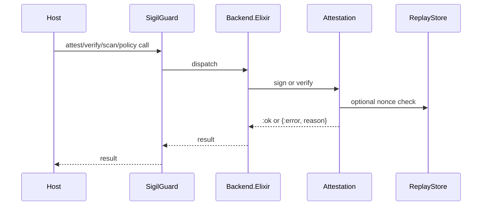

---
sigil_guard:
  id: "SP.06"
  title: "Envelope And Native Backend Transition Contracts"
  domain: security
  status: implemented/transition
  priority: high
  created: "2026-07-01"
  updated: "2026-07-07"
  tags: ["backend", "envelope", "compatibility", "replay", "signing"]
  depends_on: ["SP.01", "R.07"]
---

# SP.06 - Envelope And Native Backend Transition Contracts

## Executive Summary

This spec documents the completed transition away from verdict-only envelopes
and profile compatibility while retaining the native Elixir backend, signing
behaviour, and replay-protection lessons. Its status is
`implemented/transition`: the native backend remains in v3, while
`SigilGuard.Envelope` and `SigilGuard.Profile` are deleted public surfaces
mapped to Agent Trust attestations (SP.01) and historical fixtures.

## Business Value

- **Problem:** The library had stable envelope and backend behavior, but that
  behavior should not define the v3 public trust model.
- **Solution:** Keep the native backend, signer behaviour, and replay checks,
  while deleting verdict-only envelope/profile APIs and mapping migrations to
  Agent Trust Profile attestations.
- **Beneficiary:** Existing users migrating to v3 and future attestation work.
- **Impact:** Safer refactors and a clear migration boundary.

## Technical Architecture

### Overview

The public facade delegates to `SigilGuard.Backend.impl/0`, which always returns
the native Elixir backend. The backend composes scanner, redaction, and policy
operations without Rust or NIF dependency.

Historical envelope signing used deterministic canonical bytes, compact JSON,
Ed25519 signatures, ISO 8601 millisecond timestamps, and nonces. V3 reuses the
crypto, signer, replay, and adversarial-input lessons through
`SigilGuard.Attestation`, not through a public `SigilGuard.Envelope` module.

V3 keeps the native crypto, signing behaviour, replay lessons, and
adversarial-input handling. It does not keep verdict-only envelopes as a public
proof object.

### Data Flow

## Implemented Contracts

| Contract | Implemented By | Notes |
|----------|----------------|-------|
| Native backend only | `SigilGuard.Backend`, `SigilGuard.Backend.Elixir` | Unsupported backend atoms are rejected. |
| Attestation envelope | `SigilGuard.Attestation.Envelope` | DSSE envelope over JCS Statement payloads. |
| Signature algorithm | `SigilGuard.Signer.Ed25519`, `SigilGuard.Attestation` | Ed25519, base64url without padding. |
| Legacy envelope/profile removal | `RegistryRemovalTest`, `MIGRATING-1.0.md` | `SigilGuard.Envelope` and `SigilGuard.Profile` are not loadable in v3. |
| Replay protection | `SigilGuard.ReplayStore` | ETS identity/nonce TTL cache. |
| Public signing seam | `SigilGuard.Signer` | Behaviour for HSM/KMS/custom signers. |

## V3 Transition Rules

| Current Surface | V3 Action |
|-----------------|-----------|
| `SigilGuard.Backend` selection | Native Elixir remains the only available built-in backend; removed config keys are rejected. |
| `SigilGuard.Backend.Elixir` | Keep native implementation as the only runtime path. |
| `SigilGuard.Envelope` | Deleted; replace with `SigilGuard.Attestation` per SP.01. |
| `SigilGuard.Profile` compatibility matrix | Deleted; migration and historical fixtures document old forms. |
| `_sigil` metadata | Replace with `_agent_trust` (namespace rules in SP.08). |
| Legacy golden vectors | Move to `test/fixtures/historical/`; never v3 proof. |
| `SigilGuard.ReplayStore` | Retained in v3 as an internal seam (see below). |

The Envelope-to-Attestation field mapping is owned by SP.01's
"Migration: Envelope To Attestation" table, reproduced 1:1 in
`MIGRATING-1.0.md`. This spec MUST NOT duplicate that table; it only marks
the surfaces above as transition contracts.

All legacy golden vectors move to `test/fixtures/historical/` in v3 (D6),
including the rust-crate compatibility vectors currently at
`test/fixtures/historical/envelope_golden_vectors.sigil_protocol_0_1_5.json`.
Historical fixtures MUST NOT pass Agent Trust Profile checks.

`SigilGuard.ReplayStore` is retained in v3 as an internal seam; pluggable
replay stores are deferred post-GA because no consumer has asked for one and
the ETS semantics are load-bearing for confirmation single-use (SP.08).

### Known Consumers

The reference consumer is the only known production consumer of
`SigilGuard.Envelope` and has exactly two call sites. Both migrations MUST
be documented in `MIGRATING-1.0.md` (D17: the expected consumer diff is
these two call sites plus config removal).

| Consumer call site | V2 usage | V3 replacement |
|--------------------|----------|----------------|
| MCP client tool args | `Envelope.sign/3`, then `Map.put(args, "_sigil", envelope)` | `Attestation.sign/3`, then `Attestation.attach/2` (`_agent_trust`) |
| WebSocket auth | `Envelope.verify/2` | `Attestation.verify/3` |

## Data Model

### Historical Envelope

| Field | Type | Required | Description |
|-------|------|----------|-------------|
| `identity` | string | yes | Signing identity. |
| `verdict` | string | yes | Wire verdict formatted by profile. |
| `timestamp` | string | yes | ISO 8601 UTC timestamp with millisecond precision. |
| `nonce` | string | yes | 16 random bytes encoded as lowercase hex. |
| `signature` | string | yes | Ed25519 signature, base64url without padding. |
| `reason` | string | conditional | Required when signing blocked verdicts. |

This shape is retained only for migration documentation and historical
fixtures. V3 trust evidence uses SP.01 statements and DSSE envelopes.

## Module Map

| Module | Purpose |
|--------|---------|
| `lib/sigil_guard.ex` | Public facade. |
| `lib/sigil_guard/backend.ex` | Backend selection and rejection guard. |
| `lib/sigil_guard/backend/elixir.ex` | Native backend implementation. |
| `lib/sigil_guard/attestation.ex` | Agent Trust attestation API replacing envelopes. |
| `lib/sigil_guard/attestation/envelope.ex` | DSSE envelope helpers. |
| `lib/sigil_guard/replay_store.ex` | ETS replay cache. |
| `lib/sigil_guard/signer.ex` | Signing behaviour. |
| `lib/sigil_guard/signer/ed25519.ex` | Ed25519 signer. |
| `test/sigil_guard/backend_test.exs` | Backend behavior tests. |
| `test/sigil_guard/registry_removal_test.exs` | Removed envelope/profile APIs are not loadable. |
| `test/sigil_guard/replay_store_test.exs` | Replay cache tests. |
| `test/sigil_guard/signer_test.exs` | Signer behavior tests. |
| `test/sigil_guard/attestation/envelope_test.exs` | DSSE envelope compatibility and tamper tests. |

## Historical Error Handling

These atoms describe the removed envelope/profile surface for migration
evidence. Current attestation error semantics are owned by SP.01.

| Error | Type | Recovery | User Impact |
|-------|------|----------|-------------|
| `:invalid_envelope` | return tuple | reject | signature verification fails. |
| `:missing_field` | return tuple | reject | malformed envelope blocked. |
| `:invalid_verdict` | return tuple | reject | incompatible verdict rejected. |
| `:blocked_reason_required` | return tuple | reject | strict profile blocks missing reason. |
| `:stale_envelope` | return tuple | reject | stale request blocked. |
| `:replay_detected` | return tuple | reject | repeated nonce blocked. |
| `:invalid_signature` | return tuple | reject | tamper detected. |

## Security Considerations

- Attestation verification treats envelopes as untrusted wire input and must
  not raise on malformed maps or invalid base64.
- Replay checks are load-bearing for confirmation and attestation reuse.
- Trust Profile attestations reuse the historical lesson with typed payloads,
  canonical bytes, explicit expiry, and replay metadata.
- The NIF backend must not return as a hidden fallback.
- V3 should not include backend selection config because native Elixir is the
  only backend.

## Testing Strategy

| Test | Module | What It Verifies |
|------|--------|------------------|
| backend rejection | `BackendTest` | Unsupported backend selection fails cleanly. |
| removal assertions | `RegistryRemovalTest` | `SigilGuard.Envelope` and `SigilGuard.Profile` are deleted. |
| attestation vectors | `Attestation.GoldenVectorsTest` | Agent Trust fixtures supersede envelope vectors. |
| replay | `ReplayStoreTest` | Duplicate identity/nonce rejects when enabled. |
| signer | `SignerTest`, `Signer.Ed25519Test` | Ed25519 sign/verify behaviour. |

## Acceptance Criteria

- [x] Spec status reads `implemented/transition` here and in the spec
      catalogue (`docs/specs/README.md`).
- [x] The Envelope-to-Attestation mapping exists only in SP.01 and
      `MIGRATING-1.0.md`; this spec links to it and never restates it.
- [x] V3 moves every legacy vector, including the rust-crate vectors, to
      `test/fixtures/historical/`, and historical fixtures fail Agent Trust
      Profile verification.
- [x] Both reference-consumer call sites have a named v3 replacement in
      `MIGRATING-1.0.md`.
- [x] `SigilGuard.ReplayStore` survives v3 as an internal module; no
      pluggable replay-store behaviour ships at GA.

## Implementation Roadmap

- [x] Native Elixir backend is the built-in backend.
- [x] Unsupported NIF backend is rejected.
- [x] Public envelope/profile APIs are removed and replaced by Agent Trust
      attestations.
- [x] Replay store is implemented.
- [x] Golden vectors are checked in.
- [x] Add Agent Trust attestation vectors that supersede this public
      contract (M1, SP.01 fixture set).
- [x] Move legacy envelope and rust-crate vectors to
      `test/fixtures/historical/` (M6).
- [x] Remove public backend config and NIF references from v3 docs (M6).

## Success Metrics

| Metric | Target | Measurement |
|--------|--------|-------------|
| Removal tests | pass | `mix test test/sigil_guard/registry_removal_test.exs`. |
| Native backend | only supported built-in | `SigilGuard.Backend.available_backends/0`. |
| Coverage | >= 95% overall | `mix test --cover`. |

## Sources

- [SP.01 - SigilGuard Trust Profile](SP.01-sigilguard-trust-profile.md)
- [R.07 - Runtime Dependency Selection, Detection Placement, And Interoperability](../research/R.07-runtime-dependencies-and-interoperability.md)

## Envelope Construction Acceptance Criteria

`sign_many/2` and `add_signature/3` return
only envelopes satisfying the verifier's structural limits: unique normalized
key IDs, at most 64 signatures and the existing envelope input budget.
Duplicate IDs return `:duplicate_keyid`; capacity failures return
`:invalid_envelope`. Existing valid PAE bytes and signature order stay fixed.
Keys that collide after JSON normalization, including atom/string and
numeric/string spellings in envelope or signature objects, are ambiguous and
must be rejected. Unsupported key terms return a checked envelope error. Signing remains over opaque bytes; parsing a JSON
statement is the higher-level caller's responsibility.
