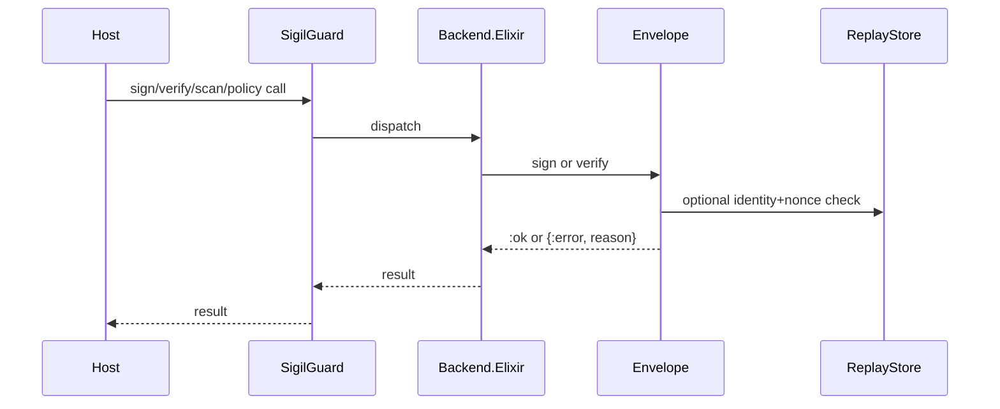

---
sigil_guard:
  id: "SP.06"
  title: "Envelope And Native Backend Transition Contracts"
  domain: security
  status: implemented/transition
  priority: high
  created: "2026-07-01"
  updated: "2026-07-02"
  tags: ["backend", "envelope", "compatibility", "replay", "signing"]
  depends_on: ["SP.01", "R.07"]
---

# SP.06 - Envelope And Native Backend Transition Contracts

## Executive Summary

This spec documents the implemented native Elixir backend, envelope signing,
profile compatibility, and replay-protection contracts. Its status is
`implemented/transition`: everything here ships in 0.2.x, but in v3 these are
transition contracts, not the target architecture. The native backend remains;
verdict-only envelopes and legacy profile handling move behind attestation
APIs (SP.01) or historical fixtures.

## Business Value

- **Problem:** The library already has stable envelope and backend behavior, but
  that behavior should not define the v3 public trust model.
- **Solution:** Treat the native backend, envelope bytes, profile handling, and
  replay checks as transition contracts while building Agent Trust Profile
  attestations.
- **Beneficiary:** Existing users migrating to v3 and future attestation work.
- **Impact:** Safer refactors and a clear migration boundary.

## Technical Architecture

### Overview

The public facade delegates to `SigilGuard.Backend.impl/0`, which always returns
the native Elixir backend. The backend composes scanner, redaction, envelope,
and policy operations without Rust or NIF dependency.

Envelope signing uses deterministic canonical bytes with lexicographic keys,
compact JSON, Ed25519 signatures, ISO 8601 millisecond timestamps, and 16-byte
hex nonces. Verification is adversarial-input safe and returns tagged errors
instead of raising.

V3 should reuse the native crypto, signing behaviour, replay lessons, and
adversarial-input handling. It should not keep verdict-only envelopes as the
primary public proof object.

### Data Flow

## Implemented Contracts

| Contract | Implemented By | Notes |
|----------|----------------|-------|
| Native backend only | `SigilGuard.Backend`, `SigilGuard.Backend.Elixir` | Unsupported backend atoms are rejected. |
| Envelope canonical bytes | `SigilGuard.Envelope.canonical_bytes/4` | Keys: identity, nonce, timestamp, verdict. |
| Signature algorithm | `SigilGuard.Envelope`, `SigilGuard.Signer.Ed25519` | Ed25519, base64url without padding. |
| Profile compatibility | `SigilGuard.Profile` | Lowercase and legacy title-case verdict handling. |
| Replay protection | `SigilGuard.ReplayStore` | ETS identity/nonce TTL cache. |
| Public signing seam | `SigilGuard.Signer` | Behaviour for HSM/KMS/custom signers. |

## V3 Transition Rules

| Current Surface | V3 Action |
|-----------------|-----------|
| `SigilGuard.Backend` selection | Keep only if useful internally; remove `backend` config. |
| `SigilGuard.Backend.Elixir` | Keep native implementation as the only runtime path. |
| `SigilGuard.Envelope` | Replace with `SigilGuard.Attestation` per SP.01. |
| `SigilGuard.Profile` compatibility matrix | Move to historical fixtures; remove from public docs. |
| `_sigil` metadata | Replace with `_agent_trust` (namespace rules in SP.08). |
| Legacy golden vectors | Move to `test/fixtures/historical/`; never v3 proof. |
| `SigilGuard.ReplayStore` | Retained in v3 as an internal seam (see below). |

The Envelope-to-Attestation field mapping is owned by SP.01's
"Migration: Envelope To Attestation" table, reproduced 1:1 in
`MIGRATING-3.0.md`. This spec MUST NOT duplicate that table; it only marks
the surfaces above as transition contracts.

All legacy golden vectors move to `test/fixtures/historical/` in v3 (D6),
including the rust-crate compatibility vectors currently at
`test/fixtures/historical/envelope_golden_vectors.sigil_protocol_0_1_5.json`.
Historical fixtures MUST NOT pass Agent Trust Profile checks.

`SigilGuard.ReplayStore` is retained in v3 as an internal seam; pluggable
replay stores are deferred post-GA because no consumer has asked for one and
the ETS semantics are load-bearing for confirmation single-use (SP.08).

### Known Consumers

The reference consumer is the only known production consumer of
`SigilGuard.Envelope` and has exactly two call sites. Both migrations MUST
be documented in `MIGRATING-3.0.md` (D17: the expected consumer diff is
these two call sites plus config removal).

| Consumer call site | V2 usage | V3 replacement |
|--------------------|----------|----------------|
| MCP client tool args | `Envelope.sign/3`, then `Map.put(args, "_sigil", envelope)` | `Attestation.sign/3`, then `Attestation.attach/2` (`_agent_trust`) |
| WebSocket auth | `Envelope.verify/2` | `Attestation.verify/3` |

## Data Model

### Envelope

| Field | Type | Required | Description |
|-------|------|----------|-------------|
| `identity` | string | yes | Signing identity. |
| `verdict` | string | yes | Wire verdict formatted by profile. |
| `timestamp` | string | yes | ISO 8601 UTC timestamp with millisecond precision. |
| `nonce` | string | yes | 16 random bytes encoded as lowercase hex. |
| `signature` | string | yes | Ed25519 signature, base64url without padding. |
| `reason` | string | conditional | Required when signing blocked verdicts. |

## Module Map

| Module | Purpose |
|--------|---------|
| `lib/sigil_guard.ex` | Public facade. |
| `lib/sigil_guard/backend.ex` | Backend selection and rejection guard. |
| `lib/sigil_guard/backend/elixir.ex` | Native backend implementation. |
| `lib/sigil_guard/envelope.ex` | Envelope canonicalization, sign, verify. |
| `lib/sigil_guard/profile.ex` | Compatibility profile definitions. |
| `lib/sigil_guard/replay_store.ex` | ETS replay cache. |
| `lib/sigil_guard/signer.ex` | Signing behaviour. |
| `lib/sigil_guard/signer/ed25519.ex` | Ed25519 signer. |
| `test/sigil_guard/backend_test.exs` | Backend behavior tests. |
| `test/sigil_guard/envelope_test.exs` | Envelope compatibility and tamper tests. |
| `test/sigil_guard/profile_test.exs` | Profile behavior tests. |

## Error Handling

| Error | Type | Recovery | User Impact |
|-------|------|----------|-------------|
| `:invalid_envelope` | return tuple | reject | signature verification fails. |
| `:missing_field` | return tuple | reject | malformed envelope blocked. |
| `:invalid_verdict` | return tuple | reject | incompatible verdict rejected. |
| `:blocked_reason_required` | return tuple | reject | strict profile blocks missing reason. |
| `:stale_envelope` | return tuple | reject | stale request blocked. |
| `:replay_detected` | return tuple | reject | repeated nonce blocked. |
| `:invalid_signature` | return tuple | reject | tamper detected. |

## Security Considerations

- Verification treats envelopes as untrusted wire input and must not raise on
  malformed maps or invalid base64.
- Replay checks are optional for compatibility tests but should be enabled at
  trust boundaries.
- New Trust Profile attestations should reuse the lesson, not necessarily the
  same shape: typed payload, canonical bytes, explicit expiry, replay metadata.
- The NIF backend must not return as a hidden fallback.
- V3 should not include backend selection config because native Elixir is the
  only backend.

## Testing Strategy

| Test | Module | What It Verifies |
|------|--------|------------------|
| backend rejection | `BackendTest` | Unsupported backend selection fails cleanly. |
| golden vectors | `EnvelopeTest` | Compatibility bytes and wire forms. |
| malformed envelope | `EnvelopeTest` | Bad input returns tagged errors. |
| replay | `EnvelopeTest` | Duplicate identity/nonce rejects when enabled. |
| profile matrix | `ProfileTest` | Verdict and lookup compatibility behavior. |

## Acceptance Criteria

- [ ] Spec status reads `implemented/transition` here and in both catalogue
      tables (`docs/README.md`, `docs/specs/README.md`).
- [ ] The Envelope-to-Attestation mapping exists only in SP.01 and
      `MIGRATING-3.0.md`; this spec links to it and never restates it.
- [ ] V3 moves every legacy vector, including the rust-crate vectors, to
      `test/fixtures/historical/`, and historical fixtures fail Agent Trust
      Profile verification.
- [ ] Both reference-consumer call sites have a named v3 replacement in
      `MIGRATING-3.0.md`.
- [ ] `SigilGuard.ReplayStore` survives v3 as an internal module; no
      pluggable replay-store behaviour ships at GA.

## Implementation Roadmap

- [x] Native Elixir backend is the built-in backend.
- [x] Unsupported NIF backend is rejected.
- [x] Envelope signing and verification are implemented.
- [x] Replay store is implemented.
- [x] Golden vectors are checked in.
- [ ] Add Agent Trust attestation vectors that supersede this public
      contract (M1, SP.01 fixture set).
- [ ] Move legacy envelope and rust-crate vectors to
      `test/fixtures/historical/` (M6).
- [ ] Remove public backend config and NIF references from v3 docs (M6).

## Success Metrics

| Metric | Target | Measurement |
|--------|--------|-------------|
| Compatibility tests | pass | `mix test test/sigil_guard/envelope_test.exs`. |
| Native backend | only supported built-in | `SigilGuard.Backend.available_backends/0`. |
| Coverage | >= 95% overall | `mix test --cover`. |

## Sources

- [SP.01 - SigilGuard Trust Profile](SP.01-sigilguard-trust-profile.md)
- [R.07 - Ecosystem Positioning, Dependencies, And Adoption](../research/R.07-ecosystem-positioning-dependencies-and-adoption.md)
