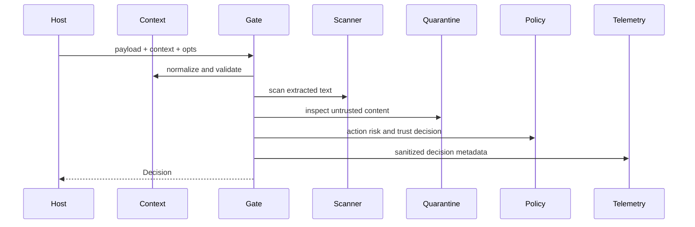

---
sigil_guard:
  id: "SP.07"
  title: "Runtime Gate And Streaming Contracts"
  domain: security
  status: implemented
  priority: high
  created: "2026-07-01"
  updated: "2026-07-07"
  tags: ["runtime", "scanner", "streaming", "quarantine", "telemetry"]
  depends_on: ["SP.01", "SP.04", "R.06"]
---

# SP.07 - Runtime Gate And Streaming Contracts

## Executive Summary

This spec documents the implemented runtime gate, context normalization,
decision struct, staged scanner integration, quarantine indicators, and streaming
sanitizer. This is the current boundary-aware enforcement layer used directly
and by MCP helpers. In v3 this foundation is rewired behind
`SigilGuard.Boundary` and `SigilGuard.BoundaryPolicy`. This spec also owns
two v3 contracts: the unified decision verdict enum (V3 Decision Contract)
and the consumer-facing stability guarantees that hold unchanged through
1.0.0 (Stability Guarantees).

## Business Value

- **Problem:** Tool and model boundaries need deterministic checks before data
  crosses from one trust zone to another.
- **Solution:** Normalize context, scan payloads, inspect quarantine indicators,
  evaluate policy, and emit decisions without leaking raw sensitive values.
- **Beneficiary:** Host applications embedding SigilGuard at runtime boundaries.
- **Impact:** Consistent allow/block/redact/confirm behavior across direct API
  calls, MCP helpers, and streams.

## Technical Architecture

### Overview

`SigilGuard.Runtime.Gate.evaluate/3` is the core source-to-sink decision point.
It accepts arbitrary payloads plus a `%SigilGuard.Context{}`, map, or keyword
context. It normalizes and validates the context, extracts text/action facts,
scans content, inspects quarantine indicators, optionally evaluates repo policy,
applies policy risk, and returns `%SigilGuard.Decision{}`.

`SigilGuard.Runtime.Stream` wraps the gate for chunked output. It keeps a
trailing holdback window so credentials or prompt-injection phrases split
across chunks are not emitted before the full match can be evaluated.

### Data Flow



## Implemented Contracts

| Contract | Implemented By | Notes |
|----------|----------------|-------|
| Boundary context | `SigilGuard.Context` | Phase, origin, sink, actor, identity, tool, server, resource, trust zone. |
| Decision result | `SigilGuard.Decision` | Verdict, action, reason, risk, hits, indicators, sanitized text, audit metadata. |
| Runtime gate | `SigilGuard.Runtime.Gate` | Main boundary evaluator. |
| Streaming sanitizer | `SigilGuard.Runtime.Stream` | Holdback window plus gate checks. |
| Secret scanner | `SigilGuard.Scanner`, `SigilGuard.Scanner.Pipeline` | Built-in patterns and staged validation/enrichment. |
| Quarantine indicators | `SigilGuard.Quarantine` | Prompt-injection and tool-poisoning indicators. |
| Telemetry | `SigilGuard.Telemetry` | Emits sanitized runtime metadata. |

## V3 Rewire

| Current Surface | V3 Action |
|-----------------|-----------|
| `SigilGuard.Context` | Replace or wrap with `SigilGuard.Boundary` normalized context. |
| `SigilGuard.Decision` | Unify verdict vocabulary and add typed fields per the V3 Decision Contract below. |
| `SigilGuard.Runtime.Gate` | Evaluate the boundary policy through `BoundaryPolicy.evaluate/2` (SP.04) as a decision contribution; the gate keeps extraction, scanning, quarantine inspection, output sanitization, confirmation, and decision assembly. See *Gate ↔ Kernel Delegation* below. |
| `SigilGuard.Runtime.Stream` | Keep holdback logic; bind stream chunks to payload/context digests. Property-test obligations live in SP.04's Streaming Property-Test Specification. |
| `SigilGuard.Quarantine` indicators | Become bundle-provided and pluggable; the current seven ship as built-in defaults. Contract owned by SP.04. |
| Runtime telemetry | Emit SP.05 decision attributes and no raw payloads. |

### Gate ↔ Kernel Delegation (Normative)

`SigilGuard.BoundaryPolicy` (SP.04) is the deterministic policy kernel. The gate
does not reimplement policy; it **composes the kernel's verdict as one
contribution** with the runtime-only signals it alone can observe. "Delegate
policy evaluation" (above) and SP.04's *V3 API Changes* ("`BoundaryPolicy.evaluate`
replaces `Policy.policy_verdict` as the central gate") mean the kernel is the
**central policy authority**, not that it is the sole verdict source — the gate
still owns scanning, quarantine inspection, and output assembly.

Per call, the gate:

1. **Extracts, scans, inspects (gate-owned).** Normalize `Context`; `Scanner.scan`
   (hits + a scanner-failure signal); `Quarantine.inspect` (verdict, indicators,
   sanitized text); optionally compile+evaluate `RepoPolicy` into
   `RepoPolicy.policy_facts/2`.
2. **Builds a `SigilGuard.Boundary`.** Bridge the `Context` phase to a lifecycle
   phase with `Lifecycle.from_context_phase/1`; carry `source`/`sink`/`trust_zone`/
   `trust_level`, the scanner `hits` (closed `:secret` category), and — only when
   the host supplied them — `tool` and `sandbox` (see *Sandbox default* below).
   Populate the three SP.01 digests from `Attestation.Digest.digests/4` (they are
   evidence, inert to the verdict) so `evidence_refs`/audit are grounded.
3. **Evaluates the kernel.** `BoundaryPolicy.evaluate(boundary, policy:,
   repo_facts:, on_sensitive:, hooks:, adaptive_detector:, hook_timeout_ms:)`
   contributes the policy-file `[rules]`, sandbox matrix, hook, adaptive, and the
   shared kernel invariants (untrusted-tool-request, secret→external-sink,
   repo-facts). Its unified verdict maps back to the v2 dual vocabulary and folds
   into the gate's `strongest_verdict` combination.
4. **Composes gate-owned signals.** The gate keeps the verdicts the kernel does not
   reproduce: scanner-failure (fail-closed block), quarantine gradations
   (`:blocked`/`:suspicious`) with the `tool_result`+`:model` confirm downgrade, the
   D17 risk×trust ladder (`SigilGuard.Policy.evaluate`), the broad sensitive-content
   rule (any hit category; `log`/`repo`/`tool` sinks; non-external redaction), and
   the repo-policy-compile-error block. The strongest contribution wins.
5. **Assembles (gate-owned).** Apply output sanitization to content the verdict
   permits, compute `content_hash`, enforce the confirmable action digest, and
   build the final `%Decision{}`.

Because `BoundaryPolicy` is *silent* wherever it would disagree with the broader
gate rules (it fires only on `:secret` hits to `[:external, :network]`, and never
on the gate's `%{id, severity}` quarantine indicators, which lack a `quarantine`
key), the composition is behavior-preserving; the M1.02 facade shapes
(`scan/1`, `scan_and_redact/1`, `policy_verdict/3`) are unaffected.

**Sandbox default.** The sandbox mismatch matrix (SP.04) is fail-closed by
construction, but in the runtime gate it is **opt-in by presence**: it applies at
`:tool_request`/`:tool_result` only when the boundary carries a `sandbox`
(isolation level) or a `tool` with a verified `manifest_digest`. A tool-phase
boundary with neither does not auto-quarantine, so hosts that do not declare
tool/sandbox context keep today's behavior; hosts that do declare it get the
full fail-closed matrix.

## V3 Decision Contract

This section is normative for v3 and owns the verdict enum that SP.01's
`predicate.verdict` and SP.04's policy kernel consume.

### Unified Verdict Enum

`Decision.action` already carries the five decision atoms; v3 promotes that
set to THE verdict vocabulary and retires the parallel dual vocabulary:

```elixir
@type verdict :: :allow | :block | :confirm | :redact | :quarantine
```

- The set is closed. New verdicts require a new profile version (SP.01).
- Strictness is totally ordered:
  `:allow < :redact < :confirm < :quarantine < :block`.
- SP.01's `predicate.verdict` is `Atom.to_string/1` of this enum; no other
  string forms exist in v3.

### Mapping From The V2 Dual Vocabulary

V2 decisions carry both `verdict` (`:allowed`, `:blocked`, or
`{:confirm, reason}`) and `action` atoms. V3 collapses each pair to one
verdict; when the members disagree in strictness, the stricter member wins.

| V2 `Decision.verdict` | V2 `Decision.action` | V3 verdict |
|-----------------------|----------------------|------------|
| `:allowed` | `:allow` | `:allow` |
| `:allowed` | `:redact` | `:redact` |
| `:blocked` | `:block` | `:block` |
| `{:confirm, reason}` | `:confirm` | `:confirm` |
| `{:confirm, reason}` | `:allow` or `:redact` | `:confirm` |
| `{:confirm, reason}` | `:quarantine` | `:quarantine` |
| `{:confirm, reason}` | `:require_approval` | `:confirm` |

The `:require_approval` row exists because v2 repo-policy approval paths
emit that atom even though it is outside the declared `action` type. V3
closes the enum: `:require_approval` maps to `:confirm` and the approval
reason moves into `matched_rules`.

Compatibility rule: the legacy `Decision.verdict` field remains available
and populated alongside the unified `Decision.action` enum in 1.0.0. It is
not a new decision source; callers should prefer `action` for v3 verdict
logic. The `SigilGuard.policy_verdict/3` facade vocabulary is unaffected;
see Stability Guarantees.

### New Typed Fields

V3 decisions MUST carry two new fields so verdicts are explainable and
evidence-linked without raw payloads:

| Field | Type | Description |
|-------|------|-------------|
| `matched_rules` | `[%{rule_id: String.t(), explanation: String.t()}]` | Every rule that contributed to the verdict; MAY be empty. Mirrors into SP.01's `predicate.matched_rules`, where `rule_id` is emitted as `id`. |
| `evidence_refs` | `[String.t()]` | Audit event ids and checkpoint digests supporting the decision (SP.05). Each ref becomes the `ref` value of a `predicate.evidence` entry in SP.01. |
| `effect` | `:allow \| :redact \| :quarantine \| nil` | The post-confirmation executable action, separated from the unified verdict. On a `:confirm` decision, `action` is the unified verdict `:confirm` while `effect` records what to execute once confirmation is accepted. On non-confirm decisions `effect` MAY mirror `action` or be `nil`. The confirmation dispatch (`ToolGateway`/`Base`) reads `effect`, not `action`, to decide what runs after acceptance; the confirmation token binding is unchanged (it never depended on `action`). |

Additionally, runtime decisions surface the boundary labels `source`, `sink`,
`trust_zone`, `actor`, `resource`, and `phase` so evidence is complete without
raw payloads.

## Stability Guarantees

These are the D17 consumer contracts. They are kept IDENTICAL through v3:
the reference consumer calls them as hard contracts, and the
consumer-contracts conformance suite asserts these shapes at every
milestone exit. They MUST NOT change in 1.0.0.

| Contract | Return shape (identical in v2 and v3) |
|----------|----------------------------------------|
| `SigilGuard.scan/1` | `{:ok, text} \| {:hit, [%{name: String.t(), ...}]}` |
| `SigilGuard.scan_and_redact/1` | binary |
| `SigilGuard.policy_verdict/3` | `:allowed \| :blocked \| {:confirm, String.t()}` |

- The `policy_verdict/3` vocabulary is a facade compatibility contract and
  is deliberately distinct from the unified Decision verdict enum above; it
  never changes.
- Hit maps MAY gain additive optional keys (`category`, `confidence`,
  `severity`, `span` per SP.04). Existing keys and value shapes never
  change, and `name` remains present and required.

## Data Model

### Context

| Field | Type | Required | Description |
|-------|------|----------|-------------|
| `phase` | atom | yes | Boundary phase such as tool request or tool result. |
| `origin` | atom | yes | Source of the data. |
| `sink` | atom | yes | Destination of the data. |
| `actor` | string or nil | no | Acting user/agent/system identity. |
| `identity` | string or nil | no | Signed or resolved identity. |
| `tool` | string or nil | no | Tool name. |
| `trust_level` | atom | yes | Caller trust level. |
| `trust_zone` | atom/string/nil | no | Deployment-defined zone. |

### Decision

| Field | Type | Required | Description |
|-------|------|----------|-------------|
| `verdict` | atom | yes | `:allowed`, `:blocked`, or confirm-shaped policy result. |
| `action` | atom | yes | `:allow`, `:block`, `:redact`, or `:confirm`. |
| `reason` | string | no | Operator-facing reason. |
| `risk_level` | atom | yes | `:low`, `:medium`, or `:high`. |
| `hits` | list | yes | Scanner hits. |
| `indicators` | list | yes | Quarantine indicators. |
| `sanitized_text` | string or nil | no | Redacted/quarantined output. |
| `audit_metadata` | map | yes | Raw-payload-free evidence metadata. |
| `matched_rules` | list | yes | Contributing rules (V3 Decision Contract). |
| `evidence_refs` | list | yes | Supporting audit/checkpoint refs (V3). |
| `effect` | atom or nil | no | Post-confirmation executable action (V3). |
| `source`, `sink`, `trust_zone`, `actor`, `resource` | atom/string or nil | no | Boundary labels on the decision (V3). |

The table above is the implemented struct. The V3 field additions (unified
verdict via `action`, `matched_rules`, `evidence_refs`, `effect`, and the
boundary labels) are normative in the V3 Decision Contract section.

## Module Map

| Module | Purpose |
|--------|---------|
| `lib/sigil_guard/context.ex` | Boundary context struct and text/action extraction. |
| `lib/sigil_guard/decision.ex` | Decision struct and helpers. |
| `lib/sigil_guard/runtime/gate.ex` | Runtime decision engine. |
| `lib/sigil_guard/runtime/stream.ex` | Chunk-safe streaming sanitizer. |
| `lib/sigil_guard/scanner.ex` | Scanner facade. |
| `lib/sigil_guard/scanner/pipeline.ex` | Candidate validation/enrichment pipeline. |
| `lib/sigil_guard/quarantine.ex` | Prompt-injection/tool-poisoning indicators. |
| `test/sigil_guard/runtime/gate_test.exs` | Runtime gate tests. |
| `test/sigil_guard/runtime/stream_test.exs` | Streaming sanitizer tests. |
| `test/sigil_guard/scanner/pipeline_test.exs` | Pipeline tests. |
| `test/sigil_guard/quarantine_test.exs` | Indicator tests. |

## Error Handling

| Error | Type | Recovery | User Impact |
|-------|------|----------|-------------|
| malformed context | blocked decision | fix caller context | request blocked. |
| invalid payload | blocked decision | pass supported payload | request blocked. |
| scanner failure | high-risk hit | inspect scanner config | fail closed. |
| invalid risk options | blocked decision | fix policy options | request blocked. |
| stream halt | halted stream state | drop/quarantine/request approval | no further chunks emitted. |

## Security Considerations

- Audit metadata must use hashes, counts, ids, and context values rather than
  raw sensitive payloads.
- Streaming emits only content outside the holdback window and never emits new
  content after a block/confirm decision.
- Quarantine checks are deterministic signals, not a replacement for policy.
- Invalid scanner or risk configuration fails closed.

## Testing Strategy

| Test | Module | What It Verifies |
|------|--------|------------------|
| external secret | `Runtime.GateTest` | Sensitive outbound data blocks/redacts. |
| malformed input | `Runtime.GateTest` | Bad context/payload fails closed. |
| quarantine | `QuarantineTest` | Prompt/tool indicators affect decisions. |
| split secret | `Runtime.StreamTest` | Chunk holdback prevents early leak. |
| pipeline confidence | `Scanner.PipelineTest` | Validation/enrichment outputs are stable. |
| consumer contracts | conformance suite | D17 shapes in Stability Guarantees hold at every milestone exit. |

## Acceptance Criteria

- [x] V3 `Decision.action` exposes the unified verdict enum
      `:allow | :block | :confirm | :redact | :quarantine`; the legacy
      `verdict` field remains populated for compatibility.
- [x] Every v2 `{verdict, action}` pair maps per the V3 Decision Contract
      table, exercised by tests; `:require_approval` never escapes the v3
      closed enum.
- [x] The legacy `Decision.verdict` field maps consistently from
      `Decision.action` and stays available in 1.0.0 for compatibility.
- [x] `matched_rules` and `evidence_refs` carry the typed shapes above, and
      their mirrors into SP.01's `predicate.matched_rules` and
      `predicate.evidence` are verified by tests.
- [x] `SigilGuard.scan/1`, `scan_and_redact/1`, and `policy_verdict/3`
      return shapes are byte-identical to v2, asserted by the
      consumer-contracts conformance test; hit-map extensions are additive
      only and `name` stays required.
- [x] `Runtime.Gate` delegates policy evaluation to
      `BoundaryPolicy.evaluate/1`, and quarantine indicators load from trust
      bundles with the seven built-ins as defaults (SP.04 contract).
- [x] Streaming holdback passes SP.04's Streaming Property-Test
      Specification, including split-secret vectors.

## Implementation Roadmap

- [x] Runtime gate implemented.
- [x] Context and decision structs implemented.
- [x] Quarantine indicators implemented.
- [x] Streaming sanitizer implemented.
- [x] Scanner pipeline implemented.
- [x] Expand property/vector tests for boundary holdback and source-to-sink
      policy per SP.04's Streaming Property-Test Specification (M4).
- [x] Rewire runtime gate to `Boundary` and `BoundaryPolicy` (M4).
- [x] Add `evidence_refs` and `matched_rules` to decisions (M4).
- [x] Keep `Decision.verdict` populated beside `Decision.action` for the
      1.0.0 compatibility contract.

## Success Metrics

| Metric | Target | Measurement |
|--------|--------|-------------|
| Streaming leaks | zero known vectors | `mix test test/sigil_guard/runtime/stream_test.exs`. |
| Runtime gate coverage | pass | `mix test test/sigil_guard/runtime/gate_test.exs`. |
| Overall coverage | >= 95% | `mix test --cover`. |

## Sources

- [SP.01 - SigilGuard Trust Profile](SP.01-sigilguard-trust-profile.md)
- [SP.04 - Boundary Scanner And Policy Kernel](SP.04-boundary-scanner-and-policy-kernel.md)
- [R.06 - Agentic Threat Model And Control Mapping](../research/R.06-agentic-threat-model-and-control-mapping.md)
