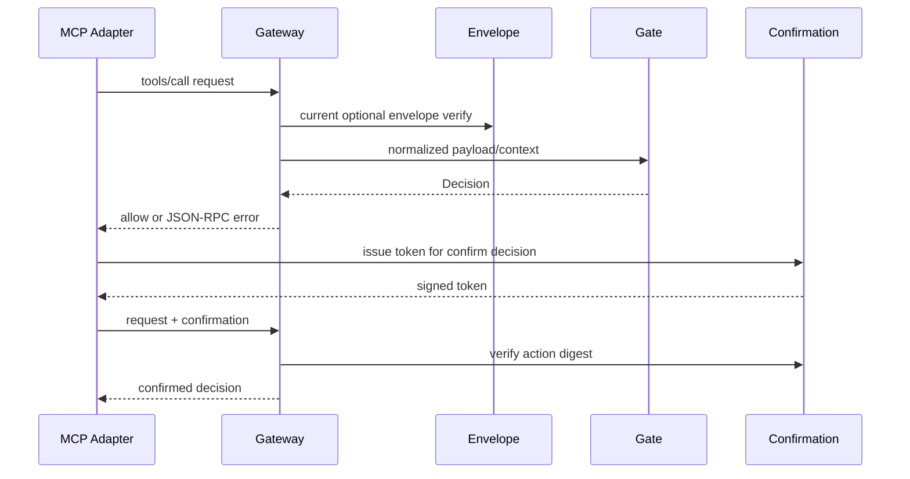

---
sigil_guard:
  id: "SP.08"
  title: "MCP Gateway And Confirmation Transition Contracts"
  domain: security
  status: implemented
  priority: high
  created: "2026-07-01"
  updated: "2026-07-02"
  tags: ["mcp", "gateway", "confirmation", "json-rpc", "action-digest"]
  depends_on: ["SP.01", "SP.03", "SP.07"]
---

# SP.08 - MCP Gateway And Confirmation Transition Contracts

## Executive Summary

This spec documents the implemented MCP-shaped gateway helpers and HMAC
confirmation token flow. Current behavior protects tool requests and results
with runtime-gate decisions, optional envelope verification, JSON-RPC errors,
and approval tokens bound to exact action digests. In v3, these helpers are
rewired to `ToolGateway`, `CapabilityManifest`, `_agent_trust`, and
`_agent_confirmation`. This spec additionally fixes three v3 contracts: the
confirmation claims delta, the reserved `_agent_*` metadata namespace with
its exact digest strip list, and the gateway facade function mapping (D14).

## Business Value

- **Problem:** Host MCP adapters need a stable guard contract without forcing
  SigilGuard to depend on a specific MCP package.
- **Solution:** Accept MCP-shaped maps, normalize request/result boundaries,
  delegate decisions to the runtime gate, and return either decisions or
  JSON-RPC-shaped errors.
- **Beneficiary:** MCP servers, clients, gateways, and host applications.
- **Impact:** Transport-agnostic MCP security with confirmation flows that
  cannot be replayed across different actions.

## Technical Architecture

### Overview

`SigilGuard.MCP.Gateway` is an adapter-neutral helper module. It understands
common JSON-RPC tool-call and result shapes, strips trust metadata from action
digests, labels the boundary context, delegates to `SigilGuard.Runtime.Gate`,
and currently can verify old envelope metadata.

`SigilGuard.Confirmation` issues HMAC-SHA256 tokens with canonical claims. A
token binds to payload, normalized context, actor, action, decision reason,
expiry, and nonce. Consumers can opt into single-use semantics through
`SigilGuard.ReplayStore`.

### Data Flow

## Implemented Contracts

| Contract | Implemented By | Notes |
|----------|----------------|-------|
| Request guard | `SigilGuard.MCP.Gateway.guard_request/3` | Returns decision. |
| Request wire helper | `guarded_request/3` | Returns `{:ok, decision}` or JSON-RPC error tuple. |
| Result guard | `guard_result/3` and result helpers | Tool-result to model boundary. |
| Signed request guard | signed helper functions | Verifies existing envelope metadata. |
| Confirmation token | `SigilGuard.Confirmation` | HMAC token bound to action digest. |
| Single-use option | `Confirmation.verify/5`, `ReplayStore` | `consume: true` rejects reuse. |
| Error response codes | `MCP.Gateway` | Block, confirm, and quarantine codes. |

## V3 Rewire

| Current Surface | V3 Action |
|-----------------|-----------|
| `SigilGuard.MCP.Gateway` | Permanent thin facade over `ToolGateway` (D14); see Gateway Function Mapping. |
| `_sigil` request metadata | Replace with `_agent_trust`; see Metadata Namespace. |
| `_sigil_confirmation` metadata | Replace with `_agent_confirmation`; see Metadata Namespace. |
| Optional envelope verification | Replace with `Attestation.verify/3` (SP.01). |
| Gateway-only tool trust | Bind to `CapabilityManifest` digest (SP.03). |
| HMAC confirmation claims | Keep action-digest lesson; bind to manifest and sandbox-aware context digests per the V3 Confirmation Claims Delta. |

## Data Model

### Confirmation Claims

| Field | Type | Required | Description |
|-------|------|----------|-------------|
| `v` | integer | yes | Token version. |
| `typ` | string | yes | Token type marker. |
| `alg` | string | yes | `HS256`. |
| `actor` | string | yes | Approving actor. |
| `action_digest` | string | yes | Digest over payload and context. |
| `decision` | string | yes | `confirm`. |
| `action` | string | yes | Decision action. |
| `reason` | string | yes | Decision reason. |
| `issued_at` | string | yes | ISO 8601 issue time. |
| `expires_at` | string | yes | ISO 8601 expiry. |
| `nonce` | string | yes | Replay nonce. |

## V3 Confirmation Claims Delta

This section is normative for v3 and records only the delta from the
implemented claims above. The authoritative, complete v3 claim set is SP.03's
"Claims (Authoritative v3 List)" table; the full confirmation lifecycle
(multi-step flows, issuance rules, error registry) is owned by SP.03's
Confirmation Lifecycle section. This table exists only to show the v2 → v3
change; it is not a competing claim list.

| Claim surface | V2 (implemented) | V3 (delta) |
|---------------|------------------|------------|
| `action_digest` | Digest over payload and normalized context. | Same binding intent; computed per SP.01's Digest Computation section. |
| `manifest_digest` | Absent. | New claim. Tokens MUST bind the SP.03 capability-manifest digest, so an approval dies with any tool-definition drift or rug pull. |
| Context binding | Context digest without sandbox fields. | The bound context digest MUST include `sandbox_id` and `isolation_level` per SP.01's Context Digest field list; an approval can never be replayed against another sandbox. |
| TTL | `:ttl_ms` option, default `300_000` ms. | Same default, aligned with `:attestation_ttl_ms` in SP.01's Replay And Expiry Semantics. |
| Single-use | Opt-in via `consume: true`. | Default. See below. |

Single-use is a deliberate v3 behavior change and MUST be called out in
`MIGRATING-3.0.md`: in v2, replay rejection requires passing
`consume: true`; in v3, every successful confirmation verification consumes
the token nonce in `SigilGuard.ReplayStore` by default, and a second
verification fails with `{:error, :replay_detected}`. `consume: false`
remains available as an explicit per-call opt-out for tests and dry runs
only.

## Metadata Namespace

The `_agent_*` key prefix is RESERVED for SigilGuard across all guarded
payloads. SigilGuard MAY define new `_agent_*` keys in future profile
versions, so hosts and tools MUST NOT define their own keys under that
prefix.

The exact digest strip list is fixed. Before any digest computation, these
keys MUST be removed in both atom and string form, at the payload root and
inside the map under `params` when present:

| Stripped key | Forms | Levels |
|--------------|-------|--------|
| `_agent_trust` | atom and string | payload root and `params` |
| `_agent_confirmation` | atom and string | payload root and `params` |
| `confirmation_token` | atom and string | payload root and `params` |

The normative strip algorithm is SP.01's Metadata Strip Rule (six keys, two
levels, never deeper); this table restates the list for gateway
implementers and MUST stay identical to SP.01. A digest computed with and
without attached metadata MUST be identical.

The legacy `_sigil` and `_sigil_confirmation` keys do not exist in v3: they
are not read, not stripped, and not special-cased, so a v3 digest treats
them as ordinary user content. There is no runtime shim or dual-read mode
(D6); mixed-traffic rollout guidance lives in `MIGRATING-3.0.md` only. The
in-repo M3-M5 transition dual-strips both prefixes until the M6 removal
wave; released 3.0.0 strips only the `_agent_*` list above.

## Gateway Function Mapping

`SigilGuard.MCP.Gateway` remains a permanent thin facade over
`SigilGuard.ToolGateway` (D14): it is not deprecated, and every helper keeps
its name and arity. Signed variants take `_agent_trust` attestations instead
of `_sigil` envelopes. `ToolGateway` signatures and the request/result
binding rules are owned by SP.03 (its gateway facade mapping and
Confirmation Lifecycle sections).

| V2 helper (name kept in v3) | V3 behavior |
|-----------------------------|-------------|
| `guard_request/3`, `guarded_request/3` | Delegate to `ToolGateway`; request binding adds capability-manifest verification per SP.03. |
| `guard_result/3`, `guarded_result/3`, `guarded_result_chunk/3` | Delegate to `ToolGateway`; result binding carries `request_action_digest` per SP.01's action-digest table. |
| `guard_signed_request/3`, `guarded_signed_request/3` | Verify `_agent_trust` attestations with `Attestation.verify/3` instead of `_sigil` envelope metadata. |
| `guard_confirmed_request/3`, `guarded_confirmed_request/3` | Verify `_agent_confirmation` tokens under the V3 Confirmation Claims Delta (manifest and sandbox binding, consume by default). |
| `guard_signed_confirmed_request/3`, `guarded_signed_confirmed_request/3` | Both of the above; the token actor MUST match the verified attestation actor id. |
| `guard_confirmed_result/3`, `guarded_confirmed_result/3` | Result-side confirmation under the same claims delta. |
| `issue_confirmation_token/5` | Name kept; issued claims gain `manifest_digest` and the sandbox-aware context digest. |
| `issue_signed_confirmation_token/5` | Verifies `_agent_trust` first and binds the token actor to the attestation actor id. |
| `issue_result_confirmation_token/5` | Result-side issuance under the claims delta. |

V3 renumbers the gateway rejection codes to `-32050..-32056`, owned by
SP.03's JSON-RPC error registry; this spec never mints codes and points to
that registry for every code. This is a breaking change from v0.2's
`-32001..-32003`, documented in `MIGRATING-3.0.md`.

## Module Map

| Module | Purpose |
|--------|---------|
| `lib/sigil_guard/mcp/gateway.ex` | MCP-shaped guard helpers. |
| `lib/sigil_guard/confirmation.ex` | Action-bound confirmation tokens. |
| `lib/sigil_guard/runtime/gate.ex` | Underlying boundary decision engine. |
| `lib/sigil_guard/envelope.ex` | Current envelope verification; v3 replaces with attestations. |
| `lib/sigil_guard/replay_store.ex` | Optional confirmation nonce consumption. |
| `test/sigil_guard/mcp/gateway_test.exs` | Gateway request/result/signed/confirmation tests. |
| `test/sigil_guard/confirmation_test.exs` | Token signing, expiry, digest, replay tests. |

## Error Handling

| Error | Type | Recovery | User Impact |
|-------|------|----------|-------------|
| blocked decision | JSON-RPC error | change request or policy | tool not executed. |
| confirm required | JSON-RPC error | issue approval token | caller must approve. |
| quarantine | JSON-RPC error or sanitized result | inspect tool output | unsafe output withheld. |
| invalid envelope | blocked decision | fix signature/key/profile | signed request rejected. |
| invalid token | return tuple or blocked decision | issue fresh token | confirmation rejected. |
| digest mismatch | return tuple | use token for exact payload/context | replay across action fails. |
| expired token | return tuple | issue fresh token | confirmation rejected. |

## Security Considerations

- Confirmation tokens intentionally ignore transport metadata fields when
  computing the payload digest so tokens bind to the actual tool action, not
  wrapper fields.
- Signed confirmation flow binds the token actor/identity to the verified
  envelope identity.
- HMAC keys must be at least 16 bytes.
- SP.03 attestations replace envelope verification while preserving
  confirmation digest binding.
- V3 tokens bind manifest and sandbox identity, so an approval cannot
  survive tool-definition drift and cannot cross sandboxes (SP.01 Digest
  Computation).
- Consume-by-default removes the silent replay window that v2 left open
  when callers forgot `consume: true`.

## Testing Strategy

| Test | Module | What It Verifies |
|------|--------|------------------|
| request block | `MCP.GatewayTest` | Sensitive request returns JSON-RPC error. |
| result sanitize | `MCP.GatewayTest` | Unsafe result is blocked/redacted. |
| signed request | `MCP.GatewayTest` | Envelope identity binds to context. |
| confirmation issue | `ConfirmationTest` | Confirmable decision creates token. |
| digest mismatch | `ConfirmationTest` | Token cannot approve changed payload/context. |
| consume replay | `ConfirmationTest` | Single-use token rejects reuse. |

## Acceptance Criteria

- [ ] V3 tokens carry `manifest_digest` and a context digest that includes
      `sandbox_id` and `isolation_level`; tampering with either fails
      verification.
- [ ] Default token TTL is `300_000` ms; expired tokens are rejected.
- [ ] Single-use is the default: verifying the same token twice fails with
      `{:error, :replay_detected}` without any option, and `consume: false`
      opts out per call. The behavior change is documented in
      `MIGRATING-3.0.md`.
- [ ] `_agent_trust`, `_agent_confirmation`, and `confirmation_token` (atom
      and string forms, payload root and `params` level) are stripped before
      every digest, and digests are identical with and without them,
      mirroring SP.01's strip-rule tests.
- [ ] Released 3.0.0 gives `_sigil` and `_sigil_confirmation` no special
      handling anywhere under `lib/`.
- [ ] Every helper in the Gateway Function Mapping keeps its v2 name and
      arity on the `MCP.Gateway` facade and delegates to `ToolGateway`.
- [ ] Gateway rejection codes are `-32050..-32056` per SP.03's registry, and
      no code outside that registry is emitted.

## Implementation Roadmap

- [x] MCP request guard implemented.
- [x] MCP result guard implemented.
- [x] Signed request helpers implemented.
- [x] Confirmation token binding implemented.
- [x] Single-use replay option implemented.
- [ ] Replace signed request helpers with SP.03 tool-manifest attestations
      (M3).
- [ ] Replace metadata keys with `_agent_trust` and `_agent_confirmation`;
      dual-strip through M3-M5, `_sigil*` removal in M6.
- [ ] Flip confirmation single-use to consume-by-default with manifest and
      sandbox binding (M3).
- [ ] Rewire facade delegation to `ToolGateway` (M3, D14).

## Success Metrics

| Metric | Target | Measurement |
|--------|--------|-------------|
| Gateway tests | pass | `mix test test/sigil_guard/mcp/gateway_test.exs`. |
| Confirmation tests | pass | `mix test test/sigil_guard/confirmation_test.exs`. |
| Digest tamper | rejected | confirmation negative tests. |

## Sources

- [SP.01 - SigilGuard Trust Profile](SP.01-sigilguard-trust-profile.md)
- [SP.03 - MCP Attestation Gateway](SP.03-mcp-attestation-gateway.md)
- [SP.07 - Runtime Gate And Streaming Contracts](SP.07-runtime-gate-and-streaming-contracts.md)
