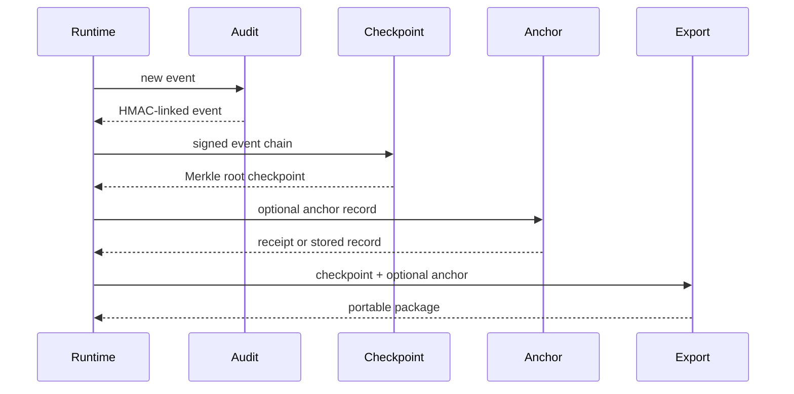

---
sigil_guard:
  id: "SP.09"
  title: "Audit Chain And Anchor Contracts"
  domain: security
  status: implemented
  priority: high
  created: "2026-07-01"
  updated: "2026-07-07"
  tags: ["audit", "hmac", "merkle", "anchor", "export"]
  depends_on: ["R.04", "SP.05"]
---

# SP.09 - Audit Chain And Anchor Contracts

## Executive Summary

This spec documents SigilGuard's implemented audit evidence layer: HMAC-linked
events, checkpoint Merkle roots, external anchor records, anchor store
behaviours, signed receipts, and portable export packages. SP.05 defines where
the system should go next; this spec captures what exists now and what v3 should
extend.

## Business Value

- **Problem:** Security decisions need tamper-evident evidence, but raw event
  bodies should not be pushed into external systems by default.
- **Solution:** Keep local HMAC-linked audit events and export signed checkpoint
  evidence with optional external anchors.
- **Beneficiary:** Operators, incident responders, and host applications that
  need audit integrity without leaking raw sensitive data.
- **Impact:** Detect modification, insertion, deletion, reordering, and anchored
  truncation of audit chains.

## Technical Architecture

### Overview

`SigilGuard.Audit` creates and verifies local HMAC-SHA256 event chains. Each
event HMAC incorporates canonical event bytes and the previous HMAC. This
detects modifications inside the retained sequence, while checkpoint/export
modules provide truncation evidence by summarizing chain segments into signed
Merkle roots.

Anchor modules let deployments persist checkpoint root evidence to append-only
or WORM-like systems. The HTTP adapter verifies strict remote receipts when
configured. The local-file adapter supports deterministic local development and
tests.

### Data Flow



## Normative Constants

The literals below are normative for every SigilGuard audit chain and
checkpoint. They are fixed by the shipped implementation
(`lib/sigil_guard/audit.ex`, `lib/sigil_guard/audit/checkpoint.ex`) and MUST
NOT change in v3: changing any of them would invalidate the HMAC or Merkle
root of every already-issued chain segment and checkpoint (R.04).

| Constant | Normative literal | Used By |
|----------|-------------------|---------|
| Chain genesis marker | `"genesis"` | First-event HMAC input suffix in `SigilGuard.Audit`. |
| Merkle leaf prefix | `"sigil-audit-leaf-v1:"` | Leaf hash input in `SigilGuard.Audit.Checkpoint`. |
| Merkle node prefix | `"sigil-audit-node-v1:"` | Interior node hash input. |
| Empty-root input | `"sigil-audit-empty-v1"` | Root input for a zero-event checkpoint. |
| Checkpoint kind | `"sigil_guard.audit.checkpoint"` | Checkpoint record `kind` field. |
| Checkpoint algorithm | `"sha256-merkle-v1"` | Checkpoint record `algorithm` field. |
| Checkpoint signature algorithm | `"Ed25519"` | Checkpoint `signature.algorithm` field. |

### Event Canonical Bytes

Event canonical bytes are compact JSON with lexicographic key order over
exactly six fields, as implemented by `SigilGuard.Audit.canonical_bytes/1`:

```
{"action":...,"actor":...,"id":...,"result":...,"timestamp":...,"type":...}
```

`metadata`, `prev_hmac`, `hmac`, and the optional structured fields
(`event_type`, `actor_info`, `action_info`, `result_info`) are excluded from
the preimage and MUST stay excluded; adding, removing, or reordering a
preimage field is a chain-breaking change.

### Chain And Tree Definitions

With `hex(...)` meaning lowercase hex encoding:

```
hmac_1 = hex(HMAC-SHA-256(key, canonical_bytes(event_1) || "genesis"))
hmac_n = hex(HMAC-SHA-256(key, canonical_bytes(event_n) || hmac_(n-1)))
```

The previous HMAC is concatenated as its lowercase-hex string, never as raw
bytes. The checkpoint Merkle tree is computed over those event HMAC strings:

```
leaf_i   = SHA-256("sigil-audit-leaf-v1:" || hmac_i)
node     = SHA-256("sigil-audit-node-v1:" || left || right)
root([]) = SHA-256("sigil-audit-empty-v1")
```

`left` and `right` are raw 32-byte child digests; an unpaired last node is
promoted to the next level, never duplicated; `merkle_root` is the
lowercase-hex encoding of the root. R.04 verifies that this promotion tree
is shape-identical to the RFC 9162 construction, so the string prefixes
serve as leaf/node domain separation and already-issued checkpoint roots are
valid inclusion/consistency proof targets without re-rooting.

## Implemented Contracts

| Contract | Implemented By | Notes |
|----------|----------------|-------|
| Event chain | `SigilGuard.Audit` | HMAC-SHA256 linked event chain. |
| Chain verification | `verify_chain/3` | Supports genesis and continuation anchors. |
| Checkpoint | `SigilGuard.Audit.Checkpoint` | Merkle root over event HMACs. |
| Anchor record | `SigilGuard.Audit.Anchor` | External root evidence. |
| Anchor store behaviour | `SigilGuard.Audit.Anchor.Store` | Pluggable persistence. |
| HTTP anchor store | `Store.HTTP` | Strict receipt verification option. |
| Local file anchor store | `Store.LocalFile` | JSONL local store. |
| Receipt | `Anchor.Receipt` | Signed remote anchor receipt helper. |
| Export package | `SigilGuard.Audit.Export` | Checkpoint plus optional anchor package. |

## V3 Extensions (Owned By SP.05)

SP.09 records what exists plus the normative constants above; every v3
extension below is specified by
[SP.05](SP.05-audit-and-release-provenance.md). This spec only points.

| Extension | One-line Summary | SP.05 Section |
|-----------|------------------|---------------|
| Inclusion/consistency proofs | O(log n) RFC 9162-style proofs over the existing tree; prefixes and issued roots unchanged. | Inclusion And Consistency Proofs. |
| Witness cosigning | Checkpoint exports as DSSE envelopes; independent witnesses append signatures, verified against m-of-n thresholds. | Witness Cosigning. |
| Privacy classification | Per-field `clear \| hashed \| redacted \| omitted` tables over the signed audit event, plus the GDPR digest-first stance. | Privacy Classification. |
| Read/query API | `Audit.tip/1` and `Audit.query/2`; reads MUST never mutate the chain. | Audit Read And Query API. |
| Anchor-store HTTP conversion | `Store.HTTP` consumes a host-provided client instead of finch (D9). | `SigilGuard.HTTPClient` Behaviour. |
| Signed audit events | Canonical `Audit.Event` decision records with an exact `event_hash` field list. | Signed Audit Events. |
| Telemetry correlation | OTel decision attributes, trace/span correlation, cardinality and sampling guidance (D16). | Telemetry And OTel Guidance. |

The v3 event-type vocabulary (`SigilGuard.Audit.EventType`) renames the legacy
`SigilInterception` type to the neutral `ScannerInterception`, retiring the
`sigil` idiom from the emitted names. Because the chain HMAC and Merkle leaf
cover the event's `type` **value**, not a known-name enum, historical events
signed under the old string verify unchanged - names are data, not structure.

## Data Model

### Audit Event

| Field | Type | Required | Description |
|-------|------|----------|-------------|
| `id` | string | yes | Event id. |
| `type` | string | yes | Event type. |
| `actor` | string | yes | Actor id or label. |
| `action` | string | yes | Action label. |
| `result` | string | yes | Result label. |
| `metadata` | map | yes | Additional evidence. |
| `timestamp` | string | yes | Event timestamp. |
| `prev_hmac` | string or nil | no | Previous event HMAC. |
| `hmac` | string or nil | no | Event HMAC. |

### Checkpoint

| Field | Type | Required | Description |
|-------|------|----------|-------------|
| `kind` | string | yes | Checkpoint kind marker. |
| `version` | integer | yes | Schema version. |
| `event_count` | integer | yes | Number of events covered. |
| `first_event_id` | string | yes | First event in segment. |
| `last_event_id` | string | yes | Last event in segment. |
| `first_hmac` | string | yes | First event HMAC. |
| `last_hmac` | string | yes | Last event HMAC. |
| `merkle_root` | string | yes | Root over event HMACs. |
| `signature` | map | no | Ed25519 checkpoint provenance. |

## Module Map

| Module | Purpose |
|--------|---------|
| `lib/sigil_guard/audit.ex` | HMAC event chain. |
| `lib/sigil_guard/audit/checkpoint.ex` | Merkle checkpoints and signatures. |
| `lib/sigil_guard/audit/anchor.ex` | Anchor record create/verify. |
| `lib/sigil_guard/audit/anchor/receipt.ex` | Signed remote receipts. |
| `lib/sigil_guard/audit/anchor/store.ex` | Anchor persistence facade. |
| `lib/sigil_guard/audit/anchor/store/http.ex` | HTTP append-only/WORM adapter. |
| `lib/sigil_guard/audit/anchor/store/local_file.ex` | JSONL local adapter. |
| `lib/sigil_guard/audit/export.ex` | Portable export package. |
| `test/sigil_guard/audit*_test.exs` | Audit chain, checkpoint, anchor, export tests. |

## Error Handling

| Error | Type | Recovery | User Impact |
|-------|------|----------|-------------|
| `{:broken, index}` | return tuple | inspect chain at index | chain rejected. |
| `:invalid_events` | return tuple | pass signed chain | checkpoint/export fails. |
| `:missing_signature` | return tuple | sign or disable requirement | verification fails. |
| `:invalid_anchor` | return tuple | fix anchor shape | export verification fails. |
| `:anchor_mismatch` | return tuple | inspect external record | external proof rejected. |
| request/receipt errors | return tuple | retry or fail closed | anchor write/read fails. |

## Security Considerations

- The HMAC chain cannot detect tail truncation without an external stored tip or
  checkpoint/anchor evidence.
- Checkpoints sign and anchor root evidence, not raw audit event bodies.
- Export verification validates structure before digesting, avoiding crashes on
  hostile package shapes.
- HTTP anchor receipts must bind root, digest, issuer, and signature in strict
  mode.

## Testing Strategy

| Test | Module | What It Verifies |
|------|--------|------------------|
| chain tamper | `AuditTest` | Modification or reordering breaks verification. |
| checkpoint root | `CheckpointTest` | Merkle root and signature verification. |
| anchor record | `AnchorTest` | Anchor digest/root validation. |
| receipt | `ReceiptTest` | Signed remote receipt verification. |
| HTTP store | `HTTPTest` | Strict response and receipt handling. |
| export | `ExportTest` | Package shape, anchor, signature, digest checks. |

## Acceptance Criteria

- [x] A constants test pins the exact literals `"genesis"`,
      `"sigil-audit-leaf-v1:"`, `"sigil-audit-node-v1:"`, and
      `"sigil-audit-empty-v1"` against the implementation.
- [x] A golden test pins event canonical bytes to the six-field compact
      JSON form above; adding, removing, or reordering a field fails it.
- [x] A fixed-input chain and checkpoint golden vector (known key, events,
      HMACs, `merkle_root`) stays byte-stable across releases.
- [x] Every V3 extension row above resolves to a named SP.05 section; SP.09
      defines no proof, witness, privacy, query, or HTTP behavior itself.

## Implementation Roadmap

- [x] HMAC audit chain implemented.
- [x] Merkle checkpoint implemented.
- [x] Anchor record implemented.
- [x] HTTP and local-file anchor stores implemented.
- [x] Export package implemented.
- [x] Add inclusion/consistency proof helpers described by SP.05.
- [x] Add signed event export mode described by SP.05.
- [x] Add privacy classification for clear, hashed, redacted, and omitted fields.
- [x] Add telemetry correlation fields for trace/span ids.

## Success Metrics

| Metric | Target | Measurement |
|--------|--------|-------------|
| Audit tests | pass | `mix test test/sigil_guard/audit_test.exs test/sigil_guard/audit`. |
| Export tamper | rejected | export negative tests. |
| Coverage | >= 95% overall | `mix test --cover`. |

## Sources

- [R.04 - Audit Proofs, Witnessing, And Privacy](../research/R.04-audit-proofs-witnessing-and-privacy.md)
- [SP.05 - Audit And Release Provenance](SP.05-audit-and-release-provenance.md)
