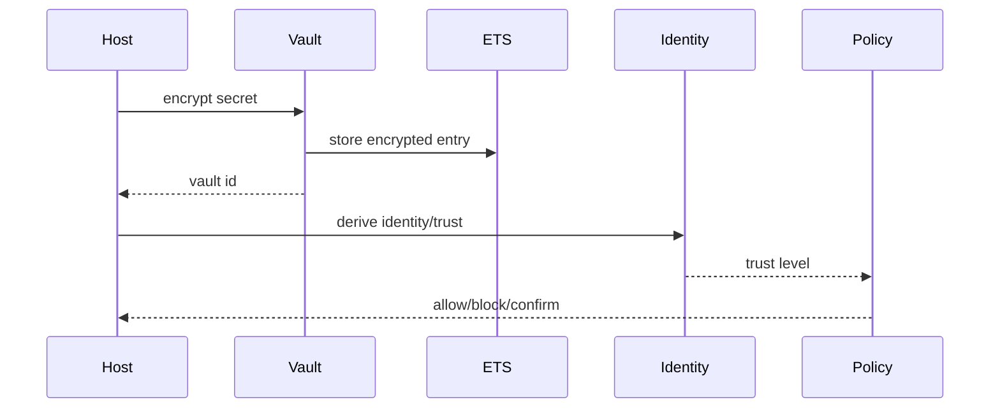

---
sigil_guard:
  id: "SP.10"
  title: "Vault And Identity Contracts"
  domain: security
  status: implemented
  priority: medium
  created: "2026-07-01"
  updated: "2026-07-02"
  tags: ["vault", "identity", "trust-level", "aes-gcm", "spiffe", "trust-mapping"]
  depends_on: ["R.05", "SP.01"]
---

# SP.10 - Vault And Identity Contracts

## Executive Summary

This spec documents the implemented vault behaviour, in-memory AES-256-GCM
vault, identity provider behaviour, and trust-level hierarchy. These modules are
small but define important extension seams for host applications. In v3, host
identity remains host-owned; SigilGuard only normalizes actor/issuer claims for
trust bundles, attestations, and policy decisions. This update records the v3
actor/issuer identity shape (R.05), a config-driven trust-mapping core default,
the hardened vault callback contract, and complete field tables for
`Vault.Entry` and `Identity.Binding`.

## Business Value

- **Problem:** Host apps need a clean seam for secret storage and identity trust
  without forcing SigilGuard to own the host's auth or KMS.
- **Solution:** Provide behaviours and local development implementations with
  explicit limitations.
- **Beneficiary:** Host applications integrating SigilGuard into existing auth,
  KMS, vault, or session systems.
- **Impact:** Secrets can be referenced by vault id and trust levels can drive
  policy without embedding host-specific auth logic.

## Technical Architecture

### Overview

`SigilGuard.Vault` is a behaviour with `encrypt/2`, `decrypt/1`, and
`exists?/1`. `SigilGuard.Vault.InMemory` implements the behaviour with a
singleton GenServer, private ETS table, AES-256-GCM encryption, per-entry IVs,
and sensitive process status redaction.

`SigilGuard.Identity` is a behaviour plus trust-level utility module. Trust
levels are monotonic: `:low < :medium < :high`. Host applications provide the
actual identity and binding semantics.

### Data Flow



## Implemented Contracts

| Contract | Implemented By | Notes |
|----------|----------------|-------|
| Vault behaviour | `SigilGuard.Vault` | Encrypt/decrypt/exists callbacks. |
| In-memory vault | `SigilGuard.Vault.InMemory` | AES-256-GCM, private ETS, singleton process. |
| Vault entry shape | `SigilGuard.Vault.Entry` | Struct for encrypted secret metadata. |
| Identity behaviour | `SigilGuard.Identity` | identity/trust/bindings callbacks. |
| Trust ordering | `SigilGuard.Identity` | `:low`, `:medium`, `:high`. |
| Identity binding shape | `SigilGuard.Identity.Binding` | Provider credential and trust-level struct. |

## V3 Boundary

| Current Surface | V3 Action |
|-----------------|-----------|
| Host identity provider | Keep as behaviour; do not require DID/VC infrastructure. |
| Trust levels | Keep as coarse policy signal; allow bundle policy to add zones/scopes. |
| Vault refs | Use refs in attestations/audit without exporting raw secret material. |
| Identity binding | Normalize into Agent Trust `actor` and `issuer` maps. |
| Production vault | Remain host-provided; core ships only development-safe behaviour/default. |

## Actor And Issuer Identity Shape

This section records decision D2 (R.05) as it applies to the identity seam.
The rules below govern every actor and issuer string SigilGuard normalizes
into attestations, trust bundles, audit evidence, and policy decisions.

- **SPIFFE-shaped strings are RECOMMENDED.** The recommended actor/issuer
  form is `spiffe://trust-domain/workload-identifier`. Shape validation
  applies only when a string claims the `spiffe://` scheme; validation is
  pure string work and MUST NOT require network access.
- **Arbitrary opaque strings are ACCEPTED.** Host principals
  (`host:operator:42`), service accounts, email-shaped subjects, and
  opaque session ids remain valid actor values permanently. A string earns
  no privilege and suffers no penalty for its format alone.
- **`did:key` is OPTIONALLY accepted.** It is the one offline-verifiable DID
  method: the identifier embeds the public key, so SigilGuard MAY use the
  embedded key for signature verification when a bundle or host designates
  that issuer. Resolution-bound DID methods (`did:web`, ledger-backed) are
  rejected for core; hosts resolve them externally and hand SigilGuard the
  resulting keys.
- **Claims are carried opaquely.** The core never derives trust from claim
  semantics. Trust flows only through exact-match rules, declared pattern
  rules (next section), or the host-owned `SigilGuard.Identity` behaviour.
  Verifiable-credential material stays in opaque `credential_refs`.
- **Delegation chains take the RFC 8693 act-claim shape:** an ordered list,
  one entry per hop, each hop `{actor, optional evidence reference}`. Chains
  are digest-bound and order-preserving inside attestations and semantically
  opaque to the core. Chain validation rules (maximum depth, trust
  derivation across hops) are owned by SP.13.
- Normalization returns strings and MUST NOT create atoms from external
  identity input (CLAUDE.md rule 7).

## Config-Driven Trust Mapping

Hosts repeatedly hand-roll actor-to-trust maps (the reference consumer's
identity mapper is the production example), so v3 ships a small core
default. It is a convenience, not a new seam: the `SigilGuard.Identity`
behaviour remains the full-power extension point, and existing behaviour
implementations such as the reference consumer's identity mapper keep
working unchanged (hard contract D17).

```elixir
config :sigil_guard,
  trust_mappings: [
    {"spiffe://prod/*", :high},
    {"user:*", :medium}
  ]
```

Rules:

- `:trust_mappings` is an ordered list of `{pattern, trust_level}` pairs.
  Evaluation is first-match-wins over the list order.
- The pattern grammar is closed: a pattern is an exact string match, or a
  single trailing `*` making it a prefix match. No other wildcard position,
  no `?`, no `**`, and no regex are permitted.
- `trust_level` MUST be one of the closed set `:low`, `:medium`, `:high`.
- No matching pattern yields `:low`.
- The key belongs to the v3 closed configuration set validated by
  `SigilGuard.Config.validate!/0` (SP.01, V3 Configuration Surface); this
  spec owns its semantics. A malformed entry (non-tuple, non-string
  pattern, wildcard in a non-trailing position, trust level outside the
  closed set) raises `SigilGuard.ConfigError` at boot.

```elixir
defmodule SigilGuard.Identity.Static do
  @behaviour SigilGuard.Identity

  @spec trust_level(actor :: String.t()) :: SigilGuard.Identity.trust_level()
  # Returns the trust level of the first :trust_mappings entry whose
  # pattern matches the actor string (exact match, or prefix match for a
  # trailing "*"). Returns :low when no entry matches or none are
  # configured. Pure string comparison; never creates atoms.

  # identity/1 returns the actor string unchanged; bindings/1 returns [].
end
```

Anything beyond this grammar (mid-string wildcards, role lookups, session
state) belongs in a host `SigilGuard.Identity` implementation; a richer
mapping DSL is explicitly parked post-1.0.0.

## Vault Behaviour Contract

The `SigilGuard.Vault` behaviour is a hard v3 compatibility contract (D17):
callback names, arities, and return shapes are unchanged. This section
hardens the semantics implementations MUST satisfy.

| Callback | Arguments | Returns | Error Atoms |
|----------|-----------|---------|-------------|
| `encrypt/2` | `plaintext :: binary()`, `description :: String.t()` | `{:ok, vault_id}` with a unique opaque string id | `{:error, :vault_unavailable}` when the backend cannot be reached; implementation-specific reasons only after the canonical set. |
| `decrypt/1` | `vault_id :: String.t()` | `{:ok, plaintext :: binary()}` with the original bytes | `{:error, :not_found}` (no entry), `{:error, :decryption_failed}` (entry exists but key/tag/AEAD failure), `{:error, :vault_unavailable}`. |
| `exists?/1` | `vault_id :: String.t()` | `true` when an entry exists, `false` otherwise, including unknown ids | none; MUST NOT raise on unknown ids. |

- **Canonical error atoms.** Implementations MUST map backend failures onto
  `:not_found`, `:decryption_failed`, and `:vault_unavailable` before
  introducing custom reasons. `:decryption_failed` matches the shipped
  `Vault.InMemory` atom and is not renamed in v3.
- **Concurrency.** Callbacks MUST be safe for concurrent callers from any
  process; implementations MUST NOT require caller-side serialization.
  `Vault.InMemory` serializes internally through its singleton GenServer.
- **Idempotency.** `exists?/1` MUST be read-only and side-effect free:
  repeated calls with the same id return the same result absent intervening
  writes, and MUST NOT extend TTLs, refresh leases, or mutate entries.
- **No leakage.** Error reasons, logs, and telemetry MUST NOT contain
  plaintext or key material. Vault ids are opaque and safe to carry as
  vault refs in attestations and audit evidence.
- **Master key.** `:vault_master_key` (base64-encoded 32 bytes) is the
  config key per SP.01's V3 Configuration Surface, consumed by
  `Vault.InMemory` with precedence: the `:master_key` start option, then
  the application env, then a random per-boot key. A configured key gives
  stable key material, never persistence.

### Key Rotation Guidance

For durable implementations (KMS, HashiCorp Vault, Ecto):

- **Versioned master keys.** Each ciphertext MUST record the master-key
  version that encrypted it, embedded in the opaque ciphertext binary or
  stored alongside it. Decryption selects the key by recorded version; new
  encryptions always use the newest version.
- **Re-encrypt-on-read.** When `decrypt/1` succeeds under an old key
  version, the implementation SHOULD re-encrypt under the current version
  and persist the result, converging the store without a stop-the-world
  migration.
- **Retire keys only when unreferenced.** An old key version MUST remain
  decryptable until no entry references it. Destroying a still-referenced
  version is cryptographic erasure of those entries and MUST be a
  deliberate operator action, never rotation fallout.
- Backend mapping: AWS/GCP KMS via key aliases and native rotation;
  HashiCorp Vault transit via key versions, `min_decryption_version`, and
  the rewrap endpoint (re-encrypt without plaintext exposure); Ecto via a
  key-version column plus re-encrypt-on-read.

## Data Model

### Vault Entry

`SigilGuard.Vault.Entry` is the portable shape for an encrypted secret.
Struct fields are nilable at construction time; a populated entry carries
the first four fields.

| Field | Type | Required | Description |
|-------|------|----------|-------------|
| `id` | `SigilGuard.Vault.vault_id()` | yes | Opaque unique vault identifier; the built-in backend emits `"vault_"` plus 32 lowercase hex characters. Safe to reference in attestations and audit evidence. |
| `ciphertext` | binary | yes | Opaque encrypted secret bytes. AEAD parameters (IV, tag) and key-version markers are backend-internal and MUST live inside or alongside this opaque value; the contract only promises that `decrypt/1` recovers the plaintext. |
| `description` | string | yes | Human-readable label; the only metadata `list_entries/0` exposes. MUST NOT contain the secret. |
| `created_at` | string | yes | ISO 8601 timestamp when the entry was created. |
| `tags` | list of strings | no | Optional categorization labels; defaults to `[]`. |

### Identity Binding

`SigilGuard.Identity.Binding` links a provider credential to a trust level.
In v3, bindings normalize into the Agent Trust `actor` map
(`{"id": ..., "trust_level": ...}`, SP.01) without gaining new fields.

| Field | Type | Required | Description |
|-------|------|----------|-------------|
| `provider` | string | yes | Host-defined identity provider name, e.g. `"google"`, `"eidas"`, `"did:key"`. Vocabulary is host-owned. |
| `id` | string | yes | Provider-specific identity string. SPIFFE-shaped RECOMMENDED, opaque strings ACCEPTED, `did:key` optional, per the identity shape section above. |
| `trust_level` | atom | yes | Trust granted by this binding; closed set `:low`, `:medium`, `:high`. |
| `bound_at` | string | yes | ISO 8601 timestamp when the binding was established. |

## Module Map

| Module | Purpose |
|--------|---------|
| `lib/sigil_guard/vault.ex` | Vault behaviour and facade. |
| `lib/sigil_guard/vault/in_memory.ex` | AES-256-GCM ETS-backed vault. |
| `lib/sigil_guard/vault/entry.ex` | Vault entry struct. |
| `lib/sigil_guard/identity.ex` | Identity behaviour and trust utilities. |
| `lib/sigil_guard/identity/binding.ex` | Identity binding struct. |
| `lib/sigil_guard/identity/static.ex` | Config-driven trust mapping (v3, this spec). |
| `test/sigil_guard/vault_test.exs` | Vault encryption, errors, key config tests. |
| `test/sigil_guard/identity_test.exs` | Trust ordering tests. |
| `test/sigil_guard/identity/binding_test.exs` | Binding struct tests. |

## Error Handling

| Error | Type | Recovery | User Impact |
|-------|------|----------|-------------|
| `:not_found` | return tuple | use valid vault id | decrypt/delete fails. |
| `:decryption_failed` | return tuple | inspect key/entry corruption | secret unavailable. |
| invalid master key | start error | configure 32-byte key | vault process does not start. |
| invalid options | start error | pass keyword opts | vault process does not start. |
| invalid trust atom | raise via map fetch | use closed trust vocabulary | caller bug. |
| `:vault_unavailable` | return tuple | retry or degrade per host policy | secret temporarily unavailable. |
| invalid `:trust_mappings` entry | boot error (`SigilGuard.ConfigError`) | fix pattern or trust level | application does not start. |

## Security Considerations

- `SigilGuard.Vault.InMemory` is encrypted in memory but not durable. Entries
  are lost on restart.
- A configured master key provides stable key material, not persistence.
- The vault process marks itself sensitive and redacts master key status.
- Production deployments should implement `SigilGuard.Vault` over a durable
  KMS, HSM, database, or external vault.
- Trust level semantics are host-defined. SigilGuard only provides ordering.

## Testing Strategy

| Test | Module | What It Verifies |
|------|--------|------------------|
| round trip | `VaultTest` | Secrets decrypt to original bytes. |
| corruption | `VaultTest` | Bad tag fails with `:decryption_failed`. |
| key config | `VaultTest` | Master key validation and config path. |
| delete/list | `VaultTest` | Entry lifecycle. |
| trust ordering | `IdentityTest` | Monotonic trust hierarchy. |

## Acceptance Criteria

- [ ] SPIFFE shape validation applies only to strings claiming the
      `spiffe://` scheme; opaque strings pass through byte-identical.
- [ ] `did:key` actor/issuer values verify offline; no identity test
      performs network access.
- [ ] `Identity.Static.trust_level/1` is table-tested: first-match-wins,
      exact and trailing-`*` patterns only, `:low` for no match and for an
      empty or absent `:trust_mappings` config.
- [ ] Malformed `:trust_mappings` entries raise `SigilGuard.ConfigError` at
      boot.
- [ ] A behaviour reference implementation mirroring the reference
      consumer's identity mapper compiles and passes against the v3
      `SigilGuard.Identity` behaviour unchanged (D17 conformance).
- [ ] Vault negative tests produce `:not_found`, `:decryption_failed`, and
      `:vault_unavailable`; a concurrent-caller test exercises all three
      callbacks; `exists?/1` is proven side-effect free.
- [ ] No audit or telemetry export contains vault plaintext or key
      material.

## Implementation Roadmap

- [x] Vault behaviour implemented.
- [x] In-memory AES-256-GCM vault implemented.
- [x] Identity behaviour implemented.
- [x] Trust-level utilities implemented.
- [ ] Add Trust Profile guidance for binding identity keys and vault refs.
- [ ] Add Agent Trust actor/issuer normalization guidance.
- [ ] Add tests that audit/telemetry exports never include raw vault contents.
- [ ] Implement `SigilGuard.Identity.Static` config-driven trust mapping.
- [ ] Land vault contract negative, concurrency, and rotation-guidance tests.

## Success Metrics

| Metric | Target | Measurement |
|--------|--------|-------------|
| Vault tests | pass | `mix test test/sigil_guard/vault_test.exs`. |
| Identity tests | pass | `mix test test/sigil_guard/identity_test.exs`. |
| Durable vault | host-provided | behaviour implementation outside core. |

## Sources

- [R.05 - Actor Identity, Delegation, And A2A](../research/R.05-actor-identity-delegation-and-a2a.md)
- [SP.01 - Agent Trust Profile](SP.01-sigilguard-trust-profile.md)
- [SPIFFE ID Standard](https://github.com/spiffe/spiffe/blob/main/standards/SPIFFE-ID.md)
- [RFC 8693 - OAuth 2.0 Token Exchange](https://datatracker.ietf.org/doc/html/rfc8693)
