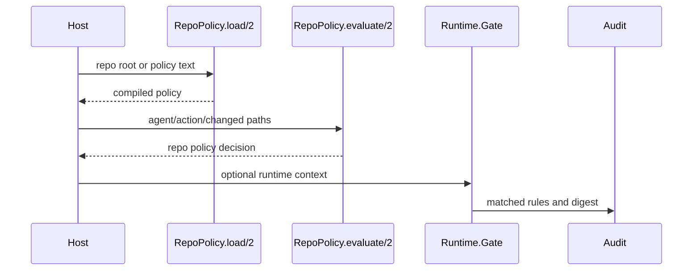

---
sigil_guard:
  id: "SP.11"
  title: "Repo Policy Kernel Contracts"
  domain: security
  status: implemented
  priority: high
  created: "2026-07-01"
  updated: "2026-07-02"
  tags: ["repo-policy", "deterministic-policy", "paths", "governance"]
  depends_on: ["SP.02", "SP.04"]
---

# SP.11 - Repo Policy Kernel Contracts

## Executive Summary

This spec documents the implemented deterministic repo policy kernel. The kernel
evaluates actor/action/path facts against ordered path rules and returns
`allow`, `require_approval`, or `block` with rule ids, unmatched paths, and a
canonical digest. In v3, repo policy becomes one source of facts for
`BoundaryPolicy`.

## Business Value

- **Problem:** Agent-authored repo changes need deterministic preflight
  governance independent of model judgment.
- **Solution:** Compile data policies, validate safe relative paths, match rules
  deterministically, and return explainable decisions.
- **Beneficiary:** Host apps, CI integrations, and repo automation using
  SigilGuard around generated changes.
- **Impact:** Safer file modifications with auditable path-level reasons.

## Technical Architecture

### Overview

Policies are data, not code. They can be compiled from maps, keyword lists, or
a small line-oriented format. The evaluator normalizes agent/action/path facts,
rejects unsafe paths, applies rule precedence, tracks unmatched paths, and
returns a `%SigilGuard.RepoPolicy.Decision{}`.

Decision precedence is conservative:

1. `:block`
2. `:require_approval`
3. `:allow`

If a path is unmatched, the policy default applies.

### Data Flow



## Implemented Contracts

| Contract | Implemented By | Notes |
|----------|----------------|-------|
| Policy compile | `SigilGuard.RepoPolicy.compile/1` | Map/keyword input. |
| Line parser | `SigilGuard.RepoPolicy.parse/1` | `default`, `allow`, `require_approval`, `block`. |
| File loader | `load/2`, `find_file/2`, `load_file/2` | Safe candidates and max size. |
| Evaluator | `evaluate/2` | Agent/action/path context. |
| Decision struct | `SigilGuard.RepoPolicy.Decision` | Verdict, reason, paths, rules, digest. |
| Runtime integration | `SigilGuard.Runtime.Gate` | Repo policy can raise runtime risk. |

## V3 Rewire

| Current Surface | V3 Action |
|-----------------|-----------|
| Repo policy decision | Feed into `BoundaryPolicy` as the policy-facts map below. |
| `require_approval` | Map to Agent Trust `confirm` verdict. |
| Policy file digest | Include in boundary decisions and audit evidence. |
| Old policy filenames | Replaced per V3 Policy Filenames (D13); legacy names fail with `:legacy_policy_filename`. |
| Repo path facts | Include in action/context digests for attestations. |

## V3 Policy Filenames (D13)

This section records decision D13 normatively. D13 is jointly owned with
SP.04, which records the same filename set in its Policy File Schema
section; the two specs MUST NOT diverge. The names are package-name-derived
and keep the sigil idiom.

The v3 default candidate set, searched in this exact order with the first
existing file winning (the same precedence style as the current loader):

1. `SIGILGUARD_POLICY`
2. `.sigilguard-policy`
3. `.sigilguard/policy`
4. `.github/sigilguard-policy`

Legacy filename handling is fail-closed:

- When no v3 candidate exists, the loader MUST probe the legacy names
  (`SIGIL_POLICY`, `.sigil-policy`, `.sigil/policy`,
  `.github/sigil-policy`) in the same order. If one exists, `find_file/2`
  and `load/2` MUST return
  `{:error, {:legacy_policy_filename, legacy_path, replacement}}` naming
  the found legacy path and its v3 replacement filename. Legacy files are
  never parsed and never silently ignored.
- Legacy detection runs before v3 candidate selection. A legacy file present
  alongside a v3 policy still fails closed; there is no silent coexistence
  path.
- The legacy check applies before an explicit `:candidates` override as well.
  Explicit candidates may add non-default v3 paths, but they do not authorize
  old `SIGIL` filenames as fallbacks.

Migration table (reproduced 1:1 in `MIGRATING-3.0.md`):

| V2 Filename | V3 Filename |
|-------------|-------------|
| `SIGIL_POLICY` | `SIGILGUARD_POLICY` |
| `.sigil-policy` | `.sigilguard-policy` |
| `.sigil/policy` | `.sigilguard/policy` |
| `.github/sigil-policy` | `.github/sigilguard-policy` |

### Bundle-Carried Repo Policy Rules

Trust bundles (SP.02) MAY embed repo-policy rules under a `repo_policy`
section. Rule semantics are identical to the file grammar: agent, action,
path glob, decision.

```json
{
  "repo_policy": {
    "version": 1,
    "default": "require_approval",
    "rules": [
      {
        "id": "org-protect-secrets",
        "decision": "block",
        "agents": ["*"],
        "actions": ["*"],
        "paths": ["priv/secrets/**"],
        "message": "Organization baseline: secrets are never agent-writable"
      }
    ]
  }
}
```

| Field | Constraint |
|-------|------------|
| `version` | Integer `1`. |
| `default` | `"allow"`, `"require_approval"`, or `"block"`; optional, defaults to `"require_approval"`. |
| `rules[].id` | Optional string; defaults to `"rule_<index>"`. Merged rule ids are prefixed `bundle:` so `matched_rules` entries stay unambiguous. |
| `rules[].decision` | `"allow"`, `"require_approval"`, or `"block"`. |
| `rules[].agents`, `rules[].actions` | Non-empty arrays of exact strings or `"*"`. |
| `rules[].paths` | Non-empty arrays of safe relative globs (`*`, `?`, `**`); absolute paths and traversal are rejected by the same normalization as file rules. |
| `rules[].message` | Optional operator-facing string. |

Bundle rules MUST compile through the same `RepoPolicy.compile/1` pipeline
as file rules; an invalid `repo_policy` section fails bundle load with the
existing typed reasons (`:invalid_rule`, `:invalid_policy`).

Composition with file rules is deterministic, and file rules take
precedence, decided per path:

1. A path matched by at least one file rule is decided by file rules alone.
2. A path matched by no file rule is decided by bundle rules.
3. A path matched by neither takes the file policy default when a policy
   file exists, else the bundle default, else the built-in
   `require_approval`.
4. Per-path outcomes combine into the overall verdict with the existing
   ranking: `block` beats `require_approval` beats `allow`.

Why file rules win: repo-local intent wins. The policy file is committed,
reviewed, and versioned inside the governed repository, so it is the most
specific declaration of intent; bundle rules are the organization-wide
baseline for repositories that have not declared local policy. Hosts that
need non-overridable organization mandates MUST enforce them at the
`BoundaryPolicy` layer (SP.04), not through bundle repo-policy rules.

## Policy Facts For Boundary Decisions

In v3 the repo policy kernel contributes exactly this map to
`BoundaryPolicy` (SP.04). Field names are grounded on
`SigilGuard.RepoPolicy.Decision`.

```elixir
%{
  verdict: :allow | :require_approval | :block,
  matched_rules: [%{rule_id: String.t(), explanation: String.t()}],
  unmatched_paths: [String.t()],
  policy_file_digest: String.t(),
  default_decision: :allow | :require_approval | :block
}
```

| Field | Source | Description |
|-------|--------|-------------|
| `verdict` | `Decision.verdict` | Kernel verdict; `require_approval` maps to the profile `confirm` verdict downstream (SP.07). |
| `matched_rules` | `Decision.matched_rule_ids` plus rule messages | One entry per matched rule id, in rule order. `rule_id` is the stable id: `"rule_<index>"` from `compile/1`, `"line_<n>"` from the line parser, `bundle:`-prefixed for bundle rules, or the explicit `:id`. `explanation` is the rule `message`, else the decision `reason`. Feeds `predicate.matched_rules[].id`/`.explanation` in `repo_change` attestations (SP.01). |
| `unmatched_paths` | `Decision.unmatched_paths` | Paths governed by the default, verbatim. |
| `policy_file_digest` | `RepoPolicy.digest/1` | Lowercase-hex SHA-256 of canonical compiled-policy bytes. Distinct from `Decision.digest`, which digests the decision itself; both are audit evidence. |
| `default_decision` | Compiled policy `default` | The default that applied, or would apply, to unmatched paths. |

## Data Model

### Rule

| Field | Type | Required | Description |
|-------|------|----------|-------------|
| `id` | string | yes | Stable rule id. |
| `decision` | atom | yes | `:allow`, `:require_approval`, or `:block`. |
| `agents` | list | yes | Exact ids or `*`. |
| `actions` | list | yes | Exact action names or `*`. |
| `paths` | list | yes | Safe relative globs. |
| `message` | string or nil | no | Operator-facing reason. |
| `index` | integer | yes | Rule order. |

### Decision

| Field | Type | Required | Description |
|-------|------|----------|-------------|
| `verdict` | atom | yes | `:allow`, `:require_approval`, or `:block`. |
| `reason` | string | yes | Explanation. |
| `agent` | string or nil | no | Normalized agent. |
| `action` | string | yes | Normalized action. |
| `changed_paths` | list | yes | Normalized safe paths. |
| `matched_rule_ids` | list | yes | Applied rule ids. |
| `unmatched_paths` | list | yes | Paths governed by default. |
| `digest` | string | yes | Canonical decision digest. |

## Module Map

| Module | Purpose |
|--------|---------|
| `lib/sigil_guard/repo_policy.ex` | Compile, parse, load, evaluate, canonicalize. |
| `lib/sigil_guard/repo_policy/decision.ex` | Decision struct. |
| `lib/sigil_guard/runtime/gate.ex` | Integrates repo policy into runtime risk. |
| `test/sigil_guard/repo_policy_test.exs` | Policy parser/evaluator/path safety tests. |
| `test/sigil_guard/runtime/gate_test.exs` | Runtime integration tests. |

## Error Handling

| Error | Type | Recovery | User Impact |
|-------|------|----------|-------------|
| `:invalid_policy` | return tuple | fix policy shape | policy not loaded. |
| `:invalid_rule` | return tuple | fix rule | policy not loaded. |
| `:invalid_path` | block decision or return tuple | use safe relative path | change blocked. |
| `:policy_too_large` | return tuple | reduce file size | policy load fails. |
| `:not_found` | return tuple | provide policy | caller can use defaults. |
| `{:legacy_policy_filename, legacy, replacement}` | return tuple | rename the file to the named v3 filename | policy load fails closed. |

## Security Considerations

- Absolute paths and traversal are rejected before rule matching.
- Rules match exact agent/action strings or `*`; no dynamic atom creation from
  external policy input is required.
- `:block` always outranks weaker decisions.
- Policy is deterministic and should be auditable by decision digest.
- This is a preflight guard, not a replacement for human review or CI tests.

## Testing Strategy

| Test | Module | What It Verifies |
|------|--------|------------------|
| parse policy | `RepoPolicyTest` | Line-oriented format compiles. |
| path safety | `RepoPolicyTest` | Absolute/traversal paths reject. |
| precedence | `RepoPolicyTest` | Block outranks approval and allow. |
| default handling | `RepoPolicyTest` | Unmatched paths apply default. |
| runtime risk | `Runtime.GateTest` | Repo policy affects runtime verdict/risk. |

## Acceptance Criteria

- [x] The loader searches `SIGILGUARD_POLICY`, `.sigilguard-policy`,
      `.sigilguard/policy`, `.github/sigilguard-policy` in that exact order
      and loads the first existing file.
- [x] Each of the four legacy filenames, present without any v3 candidate,
      yields `{:error, {:legacy_policy_filename, legacy, replacement}}`
      naming its v3 replacement; nothing is parsed or silently ignored.
- [x] An explicit `:candidates` option does not bypass the legacy-name check.
- [ ] The policy-facts map contains exactly the five specified keys, and
      `policy_file_digest` differs from `Decision.digest` for the same
      evaluation.
- [ ] Bundle-carried rules reject absolute and traversal paths through the
      shared normalization; a file `allow` beats a bundle `block` on the
      same path; a path matched only by a bundle rule is decided by it; and
      merged bundle rule ids carry the `bundle:` prefix in `matched_rules`.
- [x] The filename migration table is reproduced 1:1 in `MIGRATING-3.0.md`.

## Implementation Roadmap

- [x] Policy compile and parser implemented.
- [x] Safe file loader implemented.
- [x] Deterministic evaluator implemented.
- [x] Decision digest implemented.
- [x] Runtime integration implemented.
- [ ] Implement bundle-carried repo policy rules and composition (schema above).
- [x] Implement the D13 filename candidates and the `:legacy_policy_filename` error.
- [ ] Emit the policy-facts map to `BoundaryPolicy` and audit metadata.

## Success Metrics

| Metric | Target | Measurement |
|--------|--------|-------------|
| Repo policy tests | pass | `mix test test/sigil_guard/repo_policy_test.exs`. |
| Unsafe paths | blocked | path safety tests. |
| Determinism | stable digest | canonical decision tests. |

## Sources

- [SP.02 - Embedded Trust Bundles](SP.02-embedded-trust-bundles.md)
- [SP.04 - Boundary Scanner And Policy Kernel](SP.04-boundary-scanner-and-policy-kernel.md)
