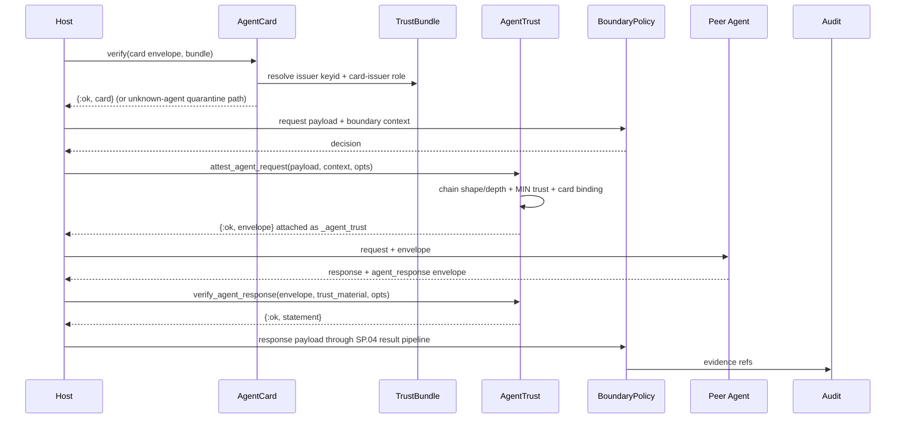

---
sigil_guard:
  id: "SP.13"
  title: "Agent-To-Agent Trust Statements"
  domain: security
  status: implemented
  priority: high
  created: "2026-07-02"
  updated: "2026-07-07"
  tags: ["a2a", "agent-cards", "delegation", "asi07", "agent-trust", "v3"]
  depends_on: ["R.05", "R.06", "SP.01", "SP.02", "SP.03"]
---

# SP.13 - Agent-To-Agent Trust Statements

## Executive Summary

Multi-agent systems have no embedded trust layer: agent cards and
inter-agent messages cross process and organization boundaries with none of
the digest and signing discipline v3 gives tool manifests and tool calls.
This spec makes agent cards DSSE-signed capability-manifest analogs verified
against bundle-declared issuers, and fills in the `agent_request` /
`agent_response` statement types (D7) with peer identity, card digests,
capabilities, and RFC 8693 act-claim-shaped delegation chains. SP.03 stays
tool-focused; SP.13 owns the agent-to-agent surface. The motivating threat
class is OWASP ASI07, insecure inter-agent communication (R.06, TM.10).

## Business Value

- **Problem:** Peer agents are trusted by transport reachability. Cards are
  unauthenticated supply-chain input, delegation history is unverifiable,
  and hosts hand-roll signing: the reference consumer already
  Ed25519-JWS-signs A2A v1.0 cards with SigilGuard's `Signer.Ed25519` for
  lack of a first-class surface.
- **Solution:** One card schema with a normative digest, DSSE signing
  through the SP.01 shared code path, typed peer statements, and
  deterministic delegation validation with a fail-closed unknown-agent
  default.
- **Beneficiary:** Agent runtimes (including the reference consumer),
  orchestrators supervising sub-agents, auditors reconstructing cross-agent
  incidents.
- **Impact:** A2A impersonation and delegation abuse become verifiable
  failures instead of silent trust; the reference consumer's JWS card
  signing migrates to DSSE through a mechanical 1:1 mapping.

## Technical Architecture

### Overview

Two artifacts, one validation discipline. The **agent card** is to an agent
what a capability manifest is to a tool: signed metadata that steers a
counterpart's behavior - supply-chain input, never trusted context (R.05).
The **agent statements** are SP.01 attestations whose predicates extend the
core with peer identity, card binding, and delegation evidence. Exchange
roles are fixed: the *requester* invokes a capability on the *responder*;
the governing card is always the responder's, exactly as the manifest for
`tool_request`/`tool_result` is always the tool's. Trust chains from the
bundle: bundle-declared issuers sign cards, cards list the agent's own keys,
and agent keys sign that agent's attestations. Agent keys never appear
directly in the bundle.

### Data Flow



### Architectural Patterns

| Pattern | Used | Justification |
|---------|------|---------------|
| GenServer | no | Card and statement verification are pure functions. |
| Behaviour | yes | `SigilGuard.Signer` signs; `SigilGuard.Identity` resolves per-hop trust. |
| ETS | yes | SP.01 `ReplayStore` replay scope applies to agent statements. No card cache in v3; hosts memoize verified cards. |
| Telemetry | yes | Spans and quarantine events under `[:sigil_guard, :agent_trust, ...]`. |

## Agent Card As Capability-Manifest Analog

### Card Fields (Normative)

The card is a closed-schema map: unknown keys at the top level or inside
`capabilities`/`public_keys` entries fail with `{:error, :invalid_agent_card}`.
Timestamps use the SP.01 ISO 8601 UTC millisecond format; sorted lists sort
ascending by raw byte comparison.

| Field | Type | Required | Description |
|-------|------|----------|-------------|
| `kind` | string | yes | Exactly `sigil_guard_agent_card`; domain separator. |
| `schema_version` | string | yes | Exactly `"1"` for this spec. |
| `agent_id` | string | yes | The agent's own identity; SPIFFE-shaped URI recommended, opaque accepted (R.05). Binds `peer_agent.id` in peer statements. |
| `name` | string | yes | Human-readable agent name; display only, never a trust key. |
| `description` | string | no | Steers counterpart model behavior; signed supply-chain input. |
| `version` | string | yes | Agent implementation/card revision, e.g. `"2.1.0"`. |
| `provider` | string | yes | Operator identity; same shape rules as `agent_id`. |
| `endpoints` | list | yes | Absolute endpoint URI strings, sorted; MAY be empty for in-process agents. |
| `capabilities` | list | yes | Non-empty `{"name": string, "description": string?}` maps, sorted by `name`; duplicate names fail with `:invalid_agent_card`. |
| `protocols` | list | yes | Non-empty opaque protocol identifiers, sorted, e.g. `"a2a/1.0"`. |
| `public_keys` | list | yes | Non-empty `{"algorithm": "ed25519", "keyid": string, "public_key": string}` maps, sorted by `keyid`. `public_key` is base64url (no padding) of the raw 32-byte key; `keyid` MUST equal the SP.01 `"sha256:" <> hex` derivation of that key, else `:invalid_agent_card`. These keys verify the agent's own attestations. |
| `scopes` | list | no | Scope strings, sorted; omitted when absent. |
| `trust_zone` | string | yes | `trusted`, `semi_trusted`, or `untrusted` (closed `SigilGuard.Context` enum); bounded by issuer trust. |
| `issued_at` | string | yes | Card issuance time. |
| `expires_at` | string | yes | MUST be later than `issued_at`, else `:invalid_agent_card`. |

### Card Digest

`card_digest` is the lowercase-hex SHA-256 over the compact JCS bytes
(SP.01 JCS constraints) of the normalized card map. The exact preimage key
set, in JCS order: `agent_id`, `capabilities`, `description` (when present),
`endpoints`, `expires_at`, `issued_at`, `kind`, `name`, `protocols`,
`provider`, `public_keys`, `schema_version`, `scopes` (when present),
`trust_zone`, `version`. Absent optional fields are omitted, never `null`
(SP.01 normalization). The card map never contains signature material:
unlike A2A v1.0's embedded `signatures` member, which the JWS flow strips
before signing, the DSSE envelope carries signatures externally, so no strip
step exists.

### Card Signing And Verification

Cards are DSSE envelopes with payloadType `application/vnd.sigilguard+json`,
PAE, and the keyid convention exactly as defined in SP.01's Attestation
Envelope And Canonical Encoding section. Like the trust bundle (SP.02), the
card is a non-Statement DSSE payload: the payload bytes are the JCS card
bytes, discriminated by `kind`. Verification order is normative:

1. Envelope structure, `payloadType`, base64 decode, duplicate-keyid check
   (SP.01 shared atoms).
2. Keyid resolution against the trust bundle's identity-issuer declarations
   (SP.02): unresolvable keyid fails with `:unknown_key_id`; a resolved key
   lacking the bundle role that authorizes agent-card issuance (including
   self-signed cards by undeclared keys) fails with `:untrusted_issuer`.
3. Ed25519 over PAE (`:invalid_signature` on failure).
4. Parse the payload, validate the card schema, re-encode the parsed card
   with JCS, and require byte equality with the decoded payload; divergence
   (unsorted lists, non-canonical emission) fails with `:invalid_agent_card`.
5. Freshness: `now > expires_at + skew` or `issued_at > now + skew` fails
   with `:card_expired`, using SP.01 `:max_skew_ms` semantics.

`card_digest` is then the SHA-256 of the verified payload bytes. Card trust
comes from the bundle, never from the transport that delivered the card.

### Card-Issuer Role In The Trust Bundle (Normative)

`AgentCard.verify/3` accepts either a plain `%{keyid => public_key}` map or a
verified `%SigilGuard.TrustBundle{}` as `trust_material`. The two forms fix the
step-2 resolution above:

- **Plain map.** Every entry is an authorized card issuer directly (the host has
  pre-resolved trust). A signature whose keyid is absent from the map fails
  `:unknown_key_id`. Because the host chose each key, no `:untrusted_issuer`
  distinction arises for this form.
- **Trust bundle.** Card-issuer keys are the keyids of the bundle **delegate
  role named `"agent_card"`**, resolved through the bundle `keys` map (SP.02).
  This reuses the existing role/keys machinery: `roles.delegates` already
  carries arbitrary uniquely-named roles, and the SP.02 schema already requires
  every role keyid to appear in `keys` with `keyid == "sha256:" <> hex` of the
  raw key. Resolution: a signing keyid absent from the bundle `keys` map fails
  `:unknown_key_id`; a keyid present in `keys` but not listed in the
  `"agent_card"` delegate role (an undeclared key, a self-signed card by a
  non-issuer, or a bundle with no `"agent_card"` role) fails `:untrusted_issuer`.

The `"agent_card"` role is distinct from SP.02's `identity_issuers` section,
which carries trusted actor id strings for per-actor trust-level resolution
(SP.10) and is used by the delegation-chain MIN-trust derivation below, not by
card-signature verification. Agent keys (a card's own `public_keys`) never
appear in the bundle; only issuer keys do, via this role.

### Canonical Example And Golden Vectors

Fixed vector inputs, disjoint from SP.01's signer seed: issuer Ed25519 seed
bytes `0x21..0x40`, agent-key seed bytes `0x41..0x60`, `issued_at`
`2026-07-02T12:00:00.000Z`, `expires_at` `2026-08-01T12:00:00.000Z`. Shown
pretty-printed with keys in JCS order; fixtures store compact bytes; every
`<computed: ...>` value is produced at fixture-generation time.

```json
{
  "agent_id": "spiffe://prod.example.org/agents/research-peer",
  "capabilities": [
    {"description": "Summarize a document set", "name": "summarize"},
    {"description": "Web research with citations", "name": "web_research"}
  ],
  "endpoints": ["https://agents.example.org/research-peer/a2a"],
  "expires_at": "2026-08-01T12:00:00.000Z",
  "issued_at": "2026-07-02T12:00:00.000Z",
  "kind": "sigil_guard_agent_card",
  "name": "research-peer",
  "protocols": ["a2a/1.0"],
  "provider": "spiffe://prod.example.org/operators/platform-team",
  "public_keys": [
    {"algorithm": "ed25519", "keyid": "<computed: sha256:...>", "public_key": "<computed: base64url raw 32 bytes>"}
  ],
  "schema_version": "1",
  "scopes": ["research:read"],
  "trust_zone": "semi_trusted",
  "version": "2.1.0"
}
```

DSSE envelope around it:

```json
{
  "payload": "<computed: base64url of the compact JCS card bytes>",
  "payloadType": "application/vnd.sigilguard+json",
  "signatures": [
    {"keyid": "<computed: sha256:... of the issuer key>", "sig": "<computed: base64url Ed25519 over PAE>"}
  ]
}
```

Fixture convention, mirroring SP.01's set:

```
test/fixtures/agent_cards/
  research_peer.card.json      # exact compact JCS card payload bytes
  research_peer.envelope.json  # DSSE envelope, compact, keys in JCS order
  research_peer.expected.json  # seeds, timestamps, card_digest, both keyids,
                               # payload/PAE SHA-256s, signature (base64url)
```

The generator MUST be deterministic; committed fixtures are a frozen
contract, and changing their bytes requires a `schema_version` bump.

### Migration From Host JWS Card Signing

The reference consumer signs A2A v1.0 cards with Ed25519 JWS (RFC 7515) and
verifies capability-registry entries with `Ed25519.verify/3`, reusing
SigilGuard's signer keypair. The DSSE form is additive: the JWS path keeps
working against A2A v1.0 peers, the same keypair signs both forms, and the
consumer migrates when adopting v3. The mapping is 1:1:

| Host JWS (RFC 7515) surface | SigilGuard DSSE surface |
|-----------------------------|-------------------------|
| Protected header `alg: "EdDSA"` | None; the profile fixes Ed25519, removing algorithm agility (SP.01). |
| Protected header `kid` | `signatures[0].keyid` (`"sha256:" <> hex` convention). |
| Payload: base64url of card JSON with `signatures` member stripped | `payload`: base64url of the JCS card bytes; no `signatures` member ever exists in the card. |
| Signing input `BASE64URL(header) || "." || BASE64URL(payload)` | PAE bytes per SP.01: `DSSEv1 31 application/vnd.sigilguard+json <len> <payload>`. |
| `signature`: base64url Ed25519 | `signatures[0].sig`: base64url (no padding) Ed25519 over PAE. |
| Verify key pinned in host config | keyid resolved through bundle-declared card issuers (SP.02). |

## Agent Request And Agent Response Predicates

Both predicates carry every SP.01 core field unchanged (`profile`, `actor`,
`resource`, `boundary`, `verdict`, `matched_rules`, `nonce`, `issued_at`,
`expires_at`, `evidence`); `tool` MUST be absent. SP.01 owns the digest
rules and already fixes the `agent_request`/`agent_response` action-digest
rows (`peer_agent` + `capability` + `arguments` / `request_action_digest`),
the shared context-digest field list, and manifest applicability: for both
types the `manifest` subject is the responder's `card_digest`, omitted when
no verified card is bound. predicateType URIs are
`https://sigilguard.dev/attestation/agent_request/v1` and
`https://sigilguard.dev/attestation/agent_response/v1` (SP.01 registry).

Payloads are protocol-neutral maps; hosts adapt A2A/ACP messages into them,
placing protocol specifics (task ids, message parts) under `arguments` or
`result`. Request payload shape: `peer_agent` (string, required),
`capability` (string, required), `arguments` (map, optional),
`delegation_chain` (list, optional). Response payload shape: `peer_agent`
(string, required), `capability` (string, required), `status` (string,
required, exactly `ok` or `error`), `result` (any payload class, optional).
`peer_agent` always names the responder (callee), so the `agent_response`
action digest is producer-independent: requester-side local evidence and a
responder-produced envelope for the same exchange yield the same action
digest - the audit join key together with `request_action_digest`.

### agent_request Predicate Extension Fields

| Field | Type | Required | Description |
|-------|------|----------|-------------|
| `peer_agent` | map | yes | `{"id": string, "card_digest": string}`. `id` MUST equal payload `peer_agent` and, when a card is bound, the card's `agent_id`. `card_digest` (lowercase-hex-64) is omitted when no verified card is bound; then `verdict` MUST be `quarantine` or `block`. |
| `peer_trust` | string | yes | `low`, `medium`, or `high` per Delegation-Chain Validation; `low` when no verified card. |
| `capability` | string | yes | Invoked capability; MUST equal payload `capability` and match a `capabilities[].name` of the bound card, else `{:error, :unknown_capability}`. |
| `delegation_chain` | list | no | Verbatim normalized mirror of the payload chain; omitted when the payload carries none. |

### agent_response Predicate Extension Fields

| Field | Type | Required | Description |
|-------|------|----------|-------------|
| `peer_agent` | map | yes | Same shape and rules as `agent_request`. |
| `peer_trust` | string | yes | Same derivation as `agent_request`. |
| `capability` | string | yes | MUST equal the originating request's capability. |
| `request_action_digest` | string | yes | Lowercase-hex-64 back-reference to the `agent_request` action digest; also feeds this statement's action digest (SP.01 row), so a forged back-reference fails recomputation with `:digest_mismatch`. |
| `status` | string | yes | Exactly `ok` or `error`, sourced from payload `status`; anything else fails with `:invalid_payload`. |
| `quarantined` | boolean | yes | `true` when the producer's boundary decision for the response payload carried one or more quarantine indicators, regardless of final verdict. |

`delegation_chain` is `agent_request`-only; its presence in an
`agent_response` predicate fails with `{:error, :invalid_payload}`. The
result content is bound through the Statement `payload` subject digest (no
separate predicate field). Responders SHOULD set `resource.audience` (SP.01
core) to the requester's identity so a response cannot be replayed to a
different requester without a digest mismatch.

## Delegation-Chain Validation

The chain takes the RFC 8693 `act`-claim shape flattened to a list and is
semantically opaque to the core (R.05): no hop semantics are evaluated
beyond these rules.

1. **Shape.** An ordered list of hop maps with exactly `"actor"` (non-empty
   string, required) and `"evidence"` (opaque reference string, optional;
   omitted when absent). Any other key, empty `actor`, or non-map hop fails
   with `{:error, :invalid_payload}`. Producers MUST omit the field when
   there are no hops; an explicit empty list fails with
   `{:error, :invalid_payload}` so "no delegation" has one encoding.
2. **Order convention.** Element 0 is the outermost RFC 8693 `act` (the
   current acting agent); ascending indexes are deeper nesting (earlier
   delegations). Documented for producers, never interpreted by the core.
3. **Digest binding, order-preserving.** RFC 8785 sorts object members
   only; array order is preserved, so chain order is covered by the payload
   digest and the DSSE signature over the predicate mirror. Whenever a
   payload is supplied, verification MUST compare the JCS bytes of the
   normalized payload chain against those of `predicate.delegation_chain`;
   any reorder, insertion, drop, edit, or one-sided presence fails with
   `{:error, :delegation_chain_tampered}`.
4. **Depth.** Chain length MUST NOT exceed the per-call
   `:max_delegation_depth` (positive integer, default `8`); exceeding it
   fails with `{:error, :delegation_too_deep}`. Deliberately not an
   application-env key: the SP.01 closed config surface is unchanged.
5. **Trust derivation.** Effective peer trust is the MIN over
   {resolve(card `agent_id`), resolve(each hop `actor`)} under the
   `SigilGuard.Identity` ordering `:low < :medium < :high`, where
   `resolve/1` is the host-owned `Identity` behaviour when configured, else
   bundle/config actor-pattern rules (SP.10), else `:low`. The result never
   exceeds any resolved level (never escalates) and is recorded as
   `peer_trust`.
6. **Unknown peer, fail closed.** A peer with no valid card, or whose card
   fails issuer verification, is unknown. Default: the attested verdict
   MUST be `quarantine` (a `block` decision verdict stays `block`),
   `peer_trust` is `low`, `peer_agent.card_digest` and the `manifest`
   subject are omitted, and `matched_rules` gains
   `{"id": "agent.unknown_peer.quarantine", "explanation": "no
   bundle-declared issuer matched the peer card"}`. Policy MAY strengthen
   to `block`; nothing may weaken to `allow` without a verified card. With
   `require_peer_card: true` the flow returns `{:error, :unknown_agent}`
   instead of attesting.

The effective trust zone for peer-originated content is the verified card's
`trust_zone`; absent a verified card it is `untrusted`. Hosts MUST NOT
assign a more trusted zone than the card declares.

## Threat Mapping

Rows copied from R.06's control mapping (its row numbers); TM.10 is this
spec's M5 test family, with row 19 shared with TM.12.

| R.06 row | Attack | ASI class | SP.13 control | Claim | Test |
|----------|--------|-----------|---------------|-------|------|
| 12 | A2A impersonation | ASI07, ASI10 | Card DSSE signature + bundle-declared issuer verification; identity binds only through a verified card's `agent_id` | mitigates | TM.10 |
| 13 | A2A delegation abuse | ASI03, ASI07 | Chain digest binding + mirror comparison, max depth, MIN-trust derivation (never escalates) | mitigates | TM.10 |
| 20 | Rogue agents outside envelope | ASI10 | Unknown/unbundled agents quarantine at the boundary; audit records out-of-envelope actions | detects-at-boundary | TM.10 |
| 19 | Cascading agent failures | ASI08 | Per-hop attestation + chain evidence reconstruct propagation paths; no automatic containment | partial (evidence-only) | TM.12 |
| - | Cross-agent injection via response payloads | ASI01, ASI07 | `agent_response` payloads route through the SP.04 boundary pipeline exactly like tool results (result-phase scanner, sink-aware output contracts); a valid envelope never exempts scanning | mitigates | TM.10 |

Host-owned exclusions (no SP.13 claim covers them, per R.06): transport
authentication (mTLS, OAuth flows, token issuance), agent discovery, and
session management. SigilGuard binds the resulting identity, audience, and
resource strings into statements; it never performs those protocols.

## Public API Sketch

Error atoms are defined in Error Handling below or in the SP.01 shared
taxonomy. Trailing-default `opts` make `sign/2` and `verify/2` callable as
written.

```elixir
defmodule SigilGuard.AgentCard do
  @type card :: map()
  @type trust_material ::
          %{optional(String.t()) => binary()} | SigilGuard.TrustBundle.t()
  @type card_error :: :invalid_agent_card | :unsupported_number_range
  @type verify_error ::
          :invalid_envelope | :invalid_payload_type | :invalid_base64
          | :duplicate_keyid | :missing_trust_bundle | :unknown_key_id
          | :untrusted_issuer | :invalid_signature | :invalid_agent_card
          | :card_expired

  @spec new(map()) :: {:ok, card()} | {:error, card_error()}
  # Validates the field table; normalizes keys and sorted lists.

  @spec digest(card()) :: {:ok, String.t()} | {:error, card_error()}
  # Lowercase-hex SHA-256 over the compact JCS bytes of the normalized card.

  @spec sign(card(), signer :: module(), opts :: keyword()) ::
          {:ok, envelope :: map()} | {:error, card_error() | :invalid_signer}
  # opts \\ []; :keyid defaults to the derived "sha256:<hex>" form. The
  # signer implements SigilGuard.Signer and holds a card-issuer key.

  @spec verify(envelope :: map(), trust_material(), opts :: keyword()) ::
          {:ok, card()} | {:error, verify_error()}
  # opts \\ []; :now, :max_skew_ms (SP.01 semantics). Follows the Card
  # Signing And Verification order, including the JCS byte-equality check.
end
```

```elixir
defmodule SigilGuard.AgentTrust do
  @type attest_error ::
          SigilGuard.AgentCard.verify_error()
          | :unknown_agent | :unknown_capability | :card_digest_mismatch
          | :delegation_too_deep | :delegation_chain_tampered
          | SigilGuard.Attestation.sign_error()
          | SigilGuard.Attestation.from_decision_error()

  @spec attest_agent_request(payload :: map(),
          SigilGuard.Context.t() | map(), opts :: keyword()) ::
          {:ok, envelope :: map()} | {:error, attest_error()}
  # opts: :signer (required), :decision (required SP.04 kernel Decision;
  # verdict preserved except the unknown-peer quarantine override),
  # :peer_card (card or DSSE envelope; envelopes verify first against
  # :trust_material), :trust_material, :require_peer_card (default false),
  # :max_delegation_depth (default 8), :ttl_ms, :now, :nonce, :evidence.
  # Order: card verify -> agent_id binding (mismatch -> :unknown_agent) ->
  # capability declared -> chain shape/depth/mirror -> MIN trust -> verdict
  # override -> from_decision(statement_type: :agent_request) -> sign.
  # Context phase is :tool_request; the explicit statement type wins (SP.01).

  @spec attest_agent_response(payload :: map(),
          SigilGuard.Context.t() | map(), opts :: keyword()) ::
          {:ok, envelope :: map()} | {:error, attest_error()}
  # Mirror for the response boundary (context phase :tool_result). opts
  # additionally require :request_action_digest; :status reads payload
  # "status"; quarantined derives from the decision's quarantine
  # indicators; no chain is accepted. Producers: the responder in mutual
  # deployments, or the requester as local boundary evidence when the peer
  # attaches no envelope.

  @spec verify_agent_response(envelope :: map(),
          SigilGuard.AgentCard.trust_material(), opts :: keyword()) ::
          {:ok, statement :: map()}
          | {:error, attest_error() | SigilGuard.Attestation.verify_error()}
  # opts: :request_action_digest (required; absent -> :invalid_payload),
  # :peer_card, :payload, :max_delegation_depth, :max_skew_ms, :now,
  # :replay, :replay_ttl_ms. Order: verify a :peer_card envelope -> merge
  # its public_keys into keyid resolution -> Attestation.verify/3 (SP.01
  # order; the back-reference feeds action-digest recomputation) ->
  # statement_type :agent_response (else :invalid_payload) ->
  # peer_agent.id equals card agent_id (else :unknown_agent) ->
  # peer_agent.card_digest and manifest subject equal the recomputed card
  # digest (else :card_digest_mismatch / :manifest_digest_mismatch) ->
  # card freshness (:card_expired) -> status/quarantined shape
  # (:invalid_payload). Verification never exempts the payload from the
  # SP.04 result pipeline.
end
```

Inbound `agent_request` verification on the responder side composes the
same primitives (`AgentCard.verify/3`, `Attestation.verify/3`, the chain
rules above); a dedicated inbound-request helper is deliberately not part
of the v3 surface.

## Module Map

| Path | Purpose |
|------|---------|
| `lib/sigil_guard/agent_card.ex` | Card schema, normalization, digest, DSSE sign/verify. |
| `lib/sigil_guard/agent_trust.ex` | Attest/verify helpers, delegation validation, trust derivation. |
| `lib/sigil_guard/attestation/digest.ex` | SP.01-owned; already implements the agent statement digest rows. |
| `test/sigil_guard/agent_card_test.exs` | Card schema, digest, tamper, expiry, issuer tests. |
| `test/sigil_guard/agent_trust_test.exs` | Helper, chain, quarantine, back-reference tests. |
| `test/sigil_guard/threat_model/` | TM.10 family modules (naming owned by the M5 task list). |
| `test/fixtures/agent_cards/` | Golden card vectors. |
| `test/fixtures/agent_trust/agent_request/`, `.../agent_response/` | Statement vectors (SP.01 fixture set). |

## Integration Points

| System | Integration | Direction | Protocol |
|--------|-------------|-----------|----------|
| Host app | `AgentCard` + `AgentTrust` helpers | inbound | Elixir API |
| Attestation (SP.01) | statement build, sign, verify, digests | internal | Elixir API |
| TrustBundle (SP.02) | card-issuer roles, keyid resolution | internal | Elixir API |
| Boundary pipeline (SP.04) | response payloads through the result pipeline | internal | Elixir API |
| Audit (SP.05) | evidence refs on agent statements | internal | Elixir API |

SP.03 owns the tool surface and points here for A2A; no SP.13 code path
crosses the tool gateway.

## Telemetry And Observability

| Event | Type | Metadata | Purpose |
|-------|------|----------|---------|
| `[:sigil_guard, :agent_trust, :card_verify, :start \| :stop \| :exception]` | span | `%{result: :ok \| :error, error: atom() \| nil}` | Card verification latency and failure class. |
| `[:sigil_guard, :agent_trust, :attest, :start \| :stop \| :exception]` | span | `%{statement_type: atom(), result: :ok \| :error, error: atom() \| nil}` | Attest helper outcome. |
| `[:sigil_guard, :agent_trust, :verify, :start \| :stop \| :exception]` | span | `%{statement_type: atom(), result: :ok \| :error, error: atom() \| nil}` | Response verification outcome. |
| `[:sigil_guard, :agent_trust, :quarantine]` | event | `%{reason: atom(), card_digest: String.t() \| nil}` | Unknown-peer visibility; low cardinality. |

## Error Handling

Spec-local atoms below; SP.01's shared taxonomy (`:invalid_envelope`,
`:invalid_payload_type`, `:invalid_base64`, `:duplicate_keyid`,
`:missing_trust_bundle`, `:unknown_key_id`, `:invalid_signature`,
`:digest_mismatch`, `:manifest_digest_mismatch`, `:expired_attestation`,
`:replay_detected`, `:invalid_payload`, `:unsupported_number_range`,
`:invalid_signer`) applies by reference.

| Error | Trigger | Recovery | User Impact |
|-------|---------|----------|-------------|
| `:invalid_agent_card` | card violates the field table: missing/retyped field, unknown key, wrong `kind`, unsorted or duplicate list entries, keyid derivation mismatch, `expires_at <= issued_at`, or JCS re-encoding does not reproduce the payload bytes | fix and re-sign the card | peer not trusted |
| `:card_digest_mismatch` | `peer_agent.card_digest` or a caller-expected digest differs from the verified card's recomputed digest | re-verify against the current card | statement rejected |
| `:unknown_agent` | `peer_agent` identity does not match the bound card's `agent_id`, or `require_peer_card: true` with no verified card | supply the peer's current card; declare its issuer in the bundle | request/response rejected |
| `:card_expired` | `now > expires_at + skew` or `issued_at > now + skew` for the card | obtain a re-issued card | peer not trusted |
| `:delegation_too_deep` | chain length exceeds `:max_delegation_depth` (default 8) | shorten the chain or raise the per-call limit deliberately | request rejected |
| `:delegation_chain_tampered` | payload chain and predicate mirror differ in JCS bytes (reorder, insert, drop, edit, one-sided presence) | reject; investigate tamper | request rejected |
| `:untrusted_issuer` | card signature key resolves in the bundle but lacks the card-issuer role, or the card is self-signed by an undeclared key | declare the issuer in the bundle | card rejected; peer quarantines |
| `:unknown_capability` | invoked capability not declared in the verified card's `capabilities` | invoke a declared capability or re-issue the card | request rejected |

## Security Considerations

- Cards are supply-chain input even when verified: `name` and `description`
  steer counterpart models, so card text entering model context MUST cross
  the SP.04 ingress pipeline like any untrusted content.
- A card's `trust_zone` is only as trustworthy as its bundle-declared
  issuer, and hosts never raise it; unknown peers are `untrusted` and
  quarantine by default (fail closed, R.06 rows 12 and 20).
- Issuer keys and agent keys are separate roles: a compromised agent key
  cannot mint cards, and a compromised issuer is revocable through the
  bundle (SP.02 revocations) without rotating agent keys.
- Delegation chains are carried opaquely; beyond the closed hop shape, no
  parsing of attacker-controlled claim semantics occurs.
- Replay reuses SP.01's `{actor, nonce}` scope; replaying a response to a
  different requester additionally breaks `resource.audience` and
  `request_action_digest` binding.
- A valid agent envelope never bypasses scanning: response payloads always
  route through the SP.04 result pipeline before reaching model context.
- Transport authentication, discovery, and session management are
  host-owned; SP.13 claims nothing about them.

## Testing Strategy

| Test | Module | What It Verifies |
|------|--------|------------------|
| card golden vector | `AgentCardTest` + conformance | `research_peer.card.json` signs to `research_peer.envelope.json` and verifies back byte-identically. |
| card tamper | `AgentCardTest` | flipped payload byte fails `:invalid_signature`; non-canonical bytes fail `:invalid_agent_card`; edited card fails `:card_digest_mismatch` where bound. |
| expired card | `AgentCardTest` | expiry and future-dating fail `:card_expired` exactly at the skew boundaries. |
| issuer role | `AgentCardTest` | undeclared or role-lacking issuer fails `:untrusted_issuer`. |
| unknown-agent quarantine | `AgentTrustTest` | no card yields verdict `quarantine`, `peer_trust` `low`, omitted `card_digest`/`manifest`; `require_peer_card: true` yields `:unknown_agent`. |
| chain reorder | `AgentTrustTest` | reordered/inserted/dropped/edited payload hops against the signed mirror fail `:delegation_chain_tampered`. |
| depth limit | `AgentTrustTest` | 9 hops fail `:delegation_too_deep` at default 8; custom limits honored. |
| trust-MIN derivation | `AgentTrustTest` | property: `peer_trust` never exceeds any resolved hop or card level; unresolvable actors floor at `:low`. |
| back-reference | `AgentTrustTest` | wrong `:request_action_digest` fails `:digest_mismatch`. |
| pipeline routing | `AgentTrustTest` | a verified response envelope does not bypass the SP.04 result pipeline. |
| JWS migration parity | `AgentCardTest` | one keypair signs the JWS and DSSE forms; each verifies under its own verifier per the mapping table. |
| threat family | `test/sigil_guard/threat_model/` | TM.10 rows with negative, tamper, replay, expiration, malformed-input cases. |

## Acceptance Criteria

- [x] `AgentCard.new/1`, `digest/1`, `sign/2,3`, `verify/2,3` implement the
      field table; the card golden vector round-trips byte-identically from
      `test/fixtures/agent_cards/`.
- [x] Every spec-local error atom is produced by at least one test.
- [x] Unknown-peer attestation carries verdict `quarantine`, `peer_trust`
      `low`, no `card_digest`/`manifest` subject; no code path allows an
      unverified peer.
- [x] Chain tamper matrix (reorder, insert, drop, edit, one-sided) fails
      `:delegation_chain_tampered`; depth 9 fails `:delegation_too_deep`.
- [x] `agent_request`/`agent_response` statements pass
      `TrustProfile.validate/1` and round-trip their SP.01 golden vectors.
- [x] `verify_agent_response/3` enforces back-reference, card binding, and
      status/quarantined shape in the documented order.
- [x] Response payloads provably route through the SP.04 result pipeline
      after envelope verification.
- [x] The JWS-to-DSSE mapping is validated by a shared-keypair parity test.
- [x] TM.10 threat-family modules are green with rule-9 case coverage.
- [x] Telemetry events fire per the table.

## Implementation Roadmap

Milestone-adjacent placement; the task list owns task IDs.

- [x] M1-adjacent: `agent_request`/`agent_response` predicate extensions
      and digest wiring land with the SP.01 statement work.
- [x] M3-adjacent: `SigilGuard.AgentCard` with card fixtures and bundle
      issuer-role verification.
- [x] M3-adjacent: `SigilGuard.AgentTrust` helpers, delegation validation,
      quarantine default, capability binding.
- [x] M3-adjacent: route verified response payloads through the SP.04
      result pipeline.
- [x] M5-adjacent: TM.10 threat-family suite, conformance vectors, JWS
      parity test.

## Success Metrics

| Metric | Target | Measurement |
|--------|--------|-------------|
| Coverage | >= 95% | `mix test --cover`. |
| Card golden vector | byte-stable across OTP/Elixir releases | conformance suite in CI matrix. |
| Fail-open paths for unknown peers | zero | negative-test review of every attest/verify path. |
| Error taxonomy | every spec-local atom exercised | coverage review. |
| TM.10 family | green before 1.0.0 | M5 gate. |
| Host card migration | mechanical via the mapping table | JWS/DSSE parity test + `MIGRATING-1.0.md` review. |

## Sources

- [R.05 - Actor Identity, Delegation, And A2A](../research/R.05-actor-identity-delegation-and-a2a.md)
- [R.06 - Agentic Threat Model And Control Mapping](../research/R.06-agentic-threat-model-and-control-mapping.md)
- [A2A Protocol Repository (agent cards)](https://github.com/a2aproject/A2A)
- [RFC 8693 - OAuth 2.0 Token Exchange](https://datatracker.ietf.org/doc/html/rfc8693)
- [RFC 7515 - JSON Web Signature](https://datatracker.ietf.org/doc/html/rfc7515)
- [DSSE Protocol Specification v1.0](https://github.com/secure-systems-lab/dsse/blob/master/protocol.md)
- [OWASP Top 10 for Agentic Applications 2026 (ASI07)](https://genai.owasp.org/resource/owasp-top-10-for-agentic-applications-for-2026/)
