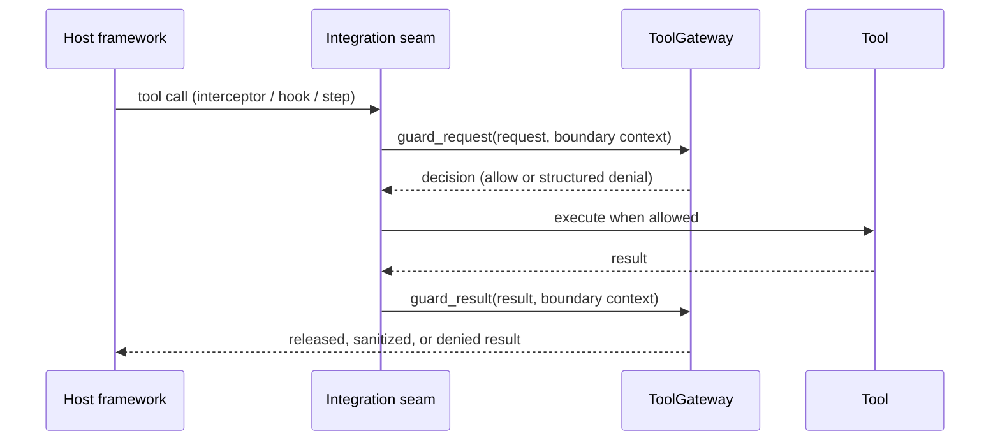

---
sigil_guard:
  id: "SP.14"
  title: "Ecosystem Integrations And Interoperability"
  domain: interoperability
  status: implemented
  priority: high
  created: "2026-07-02"
  updated: "2026-08-19"
  tags: ["integrations", "interoperability", "livebooks", "openssf", "tier-1", "v3"]
  depends_on: ["R.06", "R.07"]
---

# SP.14 - Ecosystem Integrations And Interoperability

## Executive Summary

An embedded gate is only reachable where a host framework exposes an
insertion point, so the interoperability surface determines whether the
runtime can be applied at all (R.07). This spec fixes the Tier 1 integration
contracts (hermes_mcp, Jido, LangChain plus ReqLLM, Tidewave), the Tier 2
watchlist, and the documentation artifacts, each with acceptance criteria.

## Business Value

- **Problem:** A correct security runtime nobody wires into hermes_mcp,
  Jido, or LangChain protects nothing; v3 needs a documented interoperability
  surface.
- **Solution:** Per-target integration contracts at the `ToolGateway` seam
  plus reproducible documentation and release artifacts (R.07).
- **Beneficiary:** Hosts on Tier 1 frameworks, and evaluators who judge a
  security library by its docs, evidence, and supply-chain posture.
- **Impact:** SigilGuard is installable at every major Elixir agent/tool
  boundary with validated guides, and every published claim stays inside
  the R.06 claim levels.

## Technical Architecture

### Overview

Integrations ship as ExDoc guides plus pinned illustrative modules under
`examples/`. SigilGuard MUST take zero hard dependencies on any target; the
host framework owns the extension point, SigilGuard supplies the verdict.
Insertion points are `SigilGuard.ToolGateway.guard_request/2` before tool
execution and `SigilGuard.ToolGateway.guard_result/2` before a result
reaches the model (SP.03). Denials surface as `%SigilGuard.Decision{}`
values the host maps onto its framework's error shape.

### Data Flow



### Architectural Patterns

| Pattern | Used | Justification |
|---------|------|---------------|
| GenServer | no | Guides and examples add no processes to the library. |
| Behaviour | no | Host frameworks own the extension points. |
| ETS | no | Touched only through the public APIs the guides call. |
| Telemetry | yes | Existing `[:sigil_guard, ...]` families only. |

## Integration Contracts

**Pinned-version validation (all targets).** Every Tier 1 guide MUST record
a pinned target version and pass this manual procedure before publication
and after every edit: create a scratch project outside the repo, add
`{:sigil_guard, path: ...}` plus the pinned target dependency, copy the
guide's code blocks verbatim, and pass `mix compile --warnings-as-errors`;
record the validation date and pin in the guide header. CI-maintained
example applications are explicitly deferred post-GA (R.07); this manual
compile check is the v3 gate. All sketches below are illustrative.

### Tier 1: hermes_mcp

- **Mechanism:** interceptors (the MCP SEP-1763 extension model) for
  pre/post tool-call gating, plus middleware/plug placement so HTTP
  transports can also gate at the Plug layer. `anubis_mcp` shares the
  extension model and is covered as a test-only compile variant of this
  guide, not a separate guide.
- **Insertion:** `guard_request/2` pre-invocation, `guard_result/2`
  post-invocation.

```elixir
# Illustrative only; validate against the pinned hermes_mcp release.
defmodule MyApp.GuardInterceptor do
  alias SigilGuard.{Decision, ToolGateway}

  # after_tool_call/2 mirrors this with guard_result/2, origin: :tool,
  # sink: :model, and phase: :tool_result.
  def before_tool_call(req, ctx) do
    context = [phase: :tool_request, origin: :model, sink: :tool, tool: ctx.tool_name]

    case ToolGateway.guard_request(req, context) do
      %Decision{verdict: :allow} -> {:cont, req}
      %Decision{verdict: :redact, sanitized_text: text} -> {:cont, text}
      %Decision{} = denied -> {:halt, denied}
    end
  end
end
```

### Tier 1: Jido

- **Mechanism:** tool-wrapper / pre-execution hook around Jido actions.
- **Insertion:** `guard_request/2` in the action's before-run hook; the
  Jido agent identity MUST thread into the boundary context as `actor`.

```elixir
# Illustrative only; validate against the pinned jido release.
defmodule MyApp.GuardedAction do
  use Jido.Action, name: "guarded_action"

  def on_before_run(params, context) do
    boundary = [phase: :tool_request, origin: :model, sink: :tool,
                tool: "guarded_action", actor: context[:agent_id]]

    case SigilGuard.ToolGateway.guard_request(params, boundary) do
      %SigilGuard.Decision{verdict: :allow} -> {:ok, params}
      %SigilGuard.Decision{} = denied -> {:error, {:blocked_by_policy, denied.reason}}
    end
  end
end
```

### Tier 1: LangChain Elixir And ReqLLM

- **Mechanism:** composable gating step wrapping tool execution; the ReqLLM
  variant appears in the same guide as a Req-style pipeline step.
- **Insertion:** `guard_request/2` before the wrapped function runs,
  `guard_result/2` before its output re-enters the chain.

```elixir
# Illustrative only; validate against the pinned langchain release.
defmodule MyApp.GuardedTool do
  alias SigilGuard.{Decision, ToolGateway}

  # Result side: pipe `fun` output through ToolGateway.guard_result/2.
  def wrap(%LangChain.Function{function: fun, name: name} = tool) do
    %{tool | function: fn args, chain_ctx ->
      context = [phase: :tool_request, origin: :model, sink: :tool, tool: name]

      case ToolGateway.guard_request(args, context) do
        %Decision{verdict: :allow} -> fun.(args, chain_ctx)
        %Decision{} = denied -> {:error, "blocked by policy: #{denied.reason}"}
      end
    end}
  end
end
```

### Tier 1: Tidewave

- **Mechanism:** gating guide for Tidewave's runtime-introspection MCP tools
  (`project_eval`, `get_ecto_schemas`, and peers) - the tool class that most
  needs gating (R.07). A guard plug runs ahead of the Tidewave plug; the
  shipped example policy classifies tools by action: eval tools map to
  `eval`, repo/file mutation to `modify`, introspection reads to `read`.
- **Insertion:** `guard_request/2` on `tools/call` bodies with `sink: :exec`
  and `trust_zone: :untrusted`.

```elixir
# Illustrative only; validate against the pinned tidewave release.
# Mounted ahead of the Tidewave plug (dev only); imports Plug.Conn.
defmodule MyAppWeb.TidewaveGuard do
  @behaviour Plug
  def init(opts), do: opts

  def call(%Plug.Conn{body_params: %{"method" => "tools/call"} = body} = conn, _opts) do
    context = [phase: :tool_request, origin: :model, sink: :exec,
               tool: get_in(body, ["params", "name"]), trust_zone: :untrusted]

    case SigilGuard.ToolGateway.guard_request(body["params"], context) do
      %SigilGuard.Decision{verdict: :allow} -> conn
      %SigilGuard.Decision{} = denied -> conn |> resp(403, denied.reason) |> halt()
    end
  end

  def call(conn, _opts), do: conn
end
```

```text
# examples/tidewave/policy.sigilguard - shipped illustrative example
default require_approval
block agent:* action:eval **
require_approval agent:* action:modify lib/** priv/** config/**
allow agent:* action:read **
```

### Per-Target Acceptance

Each row is additional to the pinned-version validation procedure.

| Target | Acceptance |
|--------|------------|
| hermes_mcp | Interceptor and middleware/plug placements both shown; anubis_mcp compile variant passes; denials map onto the SP.03 JSON-RPC error registry. |
| Jido | Denial surfaces as a Jido action error without raising; `actor` is populated from the agent identity. |
| LangChain/ReqLLM | Request and result sides both gated; the ReqLLM pipeline-step variant appears in the same guide. |
| Tidewave | Shipped policy blocks eval-class tools, requires approval for repo writes, allows schema/doc reads; guide states Tidewave is dev-only and the guard is defense in depth, not a production-exposure fix. |

For MCP-facing targets, the guide MUST disclose the adapter version that was
compiled and MUST NOT imply that dependency supports MCP `2026-07-28`.
Modern adapters pass the selected protocol version to SigilGuard, retain MRTR
state/input responses in the guarded message, and keep discovery,
subscriptions, header serialization, transport authorization, and MCP Apps
rendering host-owned (SP.16).

### Tier 2 Watchlist

Tracked without guides until the promotion criteria hold; promotion adds a
guide under the same contract.

| Target | State (R.07, accessed 2026-07-02) | Promotion criteria |
|--------|-----------------------------------|--------------------|
| `ex_mcp` | ~3.8k downloads, release candidate | 1.0 published and API stable for one minor cycle. |
| Vancouver | pre-0.1 | 0.1 published with a documented extension point. |
| `mcp_sse` | niche transport | A named consumer requests a guide, or downloads pass `llm_guard`'s. |

## Documentation And Release Artifacts

### ExDoc Artifacts

- `guides/cheatsheet.cheatmd` MUST cover gate verdicts, the policy grammar,
  attestation sign/verify calls, and the confirmation flow, and MUST render
  through `mix docs` without warnings.
- `guides/threat-model.md` MUST be rendered from R.06: the control-mapping
  table, claim-level definitions, and host-owned exclusions reproduced in
  substance, with no claim exceeding its R.06 claim level.
- Documentation coverage MUST be 100% as enforced by `mix doctor`.

### Livebooks

The conference-ready tutorial track ships under `notebooks/`. Every `.livemd`
has a Run in Livebook badge and the reader-facing `notebooks/README.md`
provides self-study, 45-minute talk, and 90-minute workshop paths.

| Notebook | Demonstrates |
|----------|--------------|
| `notebooks/quick-start.livemd` | Install, first scan, gate verdicts, redaction. |
| `notebooks/policy-and-lethal-trifecta.livemd` | Boundary policy plus the R.06 row-10 trifecta rule, executable. |
| `notebooks/audit-export-and-proofs.livemd` | Chain, proofs, witnesses, anchors, exports, CloudEvents, evidence refs, and OSCAL observations. |
| `notebooks/hermes-integration.livemd` | The interceptor contract against an in-notebook stub client. |
| `notebooks/threat-scenarios.livemd` | Tool poisoning, rug pulls, schema injection, stale approval, and confused authority. |
| `notebooks/agent-trust-gateway.livemd` | Manifest pinning, structured action binding, confirmation, DSSE attestation, tamper, and replay. |
| `notebooks/ai-agent-under-attack.livemd` | Deterministic replay plus optional live ReqLLM tool proposals through the identical guarded tool loop. |
| `notebooks/runtime-streaming-and-telemetry.livemd` | Chunk-safe streaming, lifecycle hooks, adaptive signals, telemetry, and OTel attribute projection. |
| `notebooks/trust-bundles-identity-and-vault.livemd` | Offline bundle verification, pattern sections, cache/quarantine behavior, identity ordering, and the vault seam. |
| `notebooks/agent-to-agent-trust.livemd` | Signed agent cards, capability and delegation binding, unknown-peer quarantine, and result rescanning. |
| `notebooks/mcp-v2-and-apps.livemd` | MCP `2026-07-28`, MRTR structured binding, result shaping, and pinned MCP Apps resources. |

Each livebook MUST execute top-to-bottom via `Mix.install` with zero network
access from a repository checkout. Local execution reuses the repository
configuration and lockfile; a Run in Livebook import falls back to the
published `sigil_guard` Hex package. The M7 validation script runs every
deterministic code cell in a network-denied environment and fails on any error.
The AI notebook MUST default to a deterministic proposal replay and MUST keep
the optional live provider call outside the security authority path. The
hermes notebook MUST NOT fetch `hermes_mcp`: it exercises the interceptor
contract against a stub shaped like the pinned interface, and real wiring lives
in the ExDoc guide.

### SECURITY.md

`SECURITY.md` at the repo root MUST state:

- **Supported versions:** latest 1.x minor; the final 0.2.x release gets
  security fixes for six months after 1.0.0 GA.
- **Disclosure:** GitHub private vulnerability reporting on the repository;
  no public issues for suspected vulnerabilities.
- **Response SLO:** acknowledge in 72 hours, triage verdict in 7 days, fix
  or public advisory in 90 days.
- **Signer compromise:** pointer to SP.02's emergency rotation ceremony as
  the canonical runbook.

### Maintainer-Owned Release Handoff

The OpenSSF Best Practices badge and any external publication material are
maintainer-owned release actions. They are not source-tree acceptance items
and must not be fired by agents. Any published claim must stay within the
evidence levels defined in R.06.

## Data Model

No new data model. Integrations consume the existing
`%SigilGuard.Decision{}` and boundary-context vocabulary (SP.01, SP.04);
documentation and release artifacts are the files listed in the module map.

## Module Map

| Path | Purpose |
|------|---------|
| `guides/cheatsheet.cheatmd` | ExDoc cheatsheet. |
| `guides/threat-model.md` | Threat-model guide rendered from R.06. |
| `guides/integrations/*.md` | Four Tier 1 guides (hermes_mcp, jido, langchain, tidewave). |
| `examples/` | Pinned illustrative modules and the Tidewave policy. |
| `notebooks/README.md` | Tutorial catalog, capability coverage, talk plans, and AI-demo operating notes. |
| `notebooks/*.livemd` | The executable tutorial track. |
| `SECURITY.md` | Disclosure policy and runbook pointer. |

## Integration Points

| System | Integration | Direction | Protocol |
|--------|-------------|-----------|----------|
| hermes_mcp / Jido / LangChain / ReqLLM | seam calls `ToolGateway` | inbound | Elixir API |
| Tidewave | guard plug ahead of the Tidewave plug | inbound | Plug/HTTP |
| bestpractices.dev | badge checklist | outbound | maintainer-owned manual process |

## Telemetry And Observability

| Event | Type | Metadata | Purpose |
|-------|------|----------|---------|
| existing `[:sigil_guard, ...]` families | span/event | existing metadata | Integrations observe through the standard families; no new event families. |

## Error Handling

Guides are documentation; validation failures are guide-level gates, not
runtime errors. N/A rows are intentional.

| Error | Type | Recovery | User Impact |
|-------|------|----------|-------------|
| guide fails pinned compile | docs validation | fix guide or re-pin | n/a (pre-publish gate) |
| livebook cell fails or touches network | docs validation | fix notebook | n/a (pre-publish gate) |
| runtime denial in an integration | `%SigilGuard.Decision{}` | host maps it per guide | tool call blocked per policy |
| new runtime error atoms | n/a | n/a | none introduced by this spec |

## Security Considerations

- Every example MUST fail closed: no sketch may swallow a non-allow verdict.
- Pinned versions bound each guide's supply-chain claim; unpinned examples
  are validation failures.
- Livebooks MUST run offline so no security tutorial normalizes remote
  fetching.
- Published material MUST NOT exceed R.06 claim levels; `out-of-scope` rows
  MUST NOT be softened into prevention claims.
- The Tidewave guide MUST NOT present gating as a substitute for keeping
  Tidewave out of production.

## Testing Strategy

| Test | Module | What It Verifies |
|------|--------|------------------|
| livebook execution | M7 validation script | every notebook runs top-to-bottom offline via local-path `Mix.install`. |
| guide compile | pinned-version procedure | every Tier 1 guide compiles with warnings as errors at its pin. |
| anubis variant | pinned-version procedure | the hermes guide compiles against `anubis_mcp` (test-only). |
| docs render | `mix docs` | cheatsheet, guides, and threat-model guide render without warnings. |
| doc coverage | `mix doctor` | 100% documentation coverage. |
| MCP revision contract | guide review + gateway tests | adapter protocol era is explicit; modern result/MRTR and Apps responsibilities follow SP.16. |

## Acceptance Criteria

- [x] Four Tier 1 guides exist, each pinned and passing the compile
      procedure, plus every Per-Target Acceptance row.
- [x] `guides/cheatsheet.cheatmd` covers gate verdicts, policy grammar,
      attestation calls, and the confirmation flow.
- [x] All five livebooks execute top-to-bottom offline in the validation run.
- [x] `SECURITY.md` contains supported versions, channel, SLO, and the SP.02
      runbook pointer.
- [x] `guides/threat-model.md` matches R.06 claim levels exactly.
- [x] `mix doctor` reports 100% documentation coverage.
- [x] OpenSSF badge work, announcement copy, listing submissions, CFP text,
      publish, tags, and pushes are maintainer-owned handoff items, not
      agent-owned source-tree acceptance.

## Implementation Roadmap

Aligned with task milestone M7 (the task list owns task IDs); publish-gated
items are maintainer-owned release handoff.

- [x] M7: cheatsheet, threat-model guide, and doc-coverage enforcement.
- [x] M7: four Tier 1 guides plus `examples/` with pinned validation records.
- [x] M7: eleven Livebook tutorials plus the offline execution validation script.
- [x] M7: SECURITY.md and documentation gates completed.
- [x] M8/GA: leave tags, pushes, and publication to the maintainer.

## Success Metrics

| Metric | Target | Measurement |
|--------|--------|-------------|
| Hexdocs completeness | 100% docs, all guides render | `mix doctor` + `mix docs`. |
| Livebook pass rate | 11/11 offline | M7 validation script. |
| Tier 1 guide validity | 4/4 compile at pins | pinned-version records. |
| OpenSSF badge | maintainer-owned release handoff | bestpractices.dev project page. |
| Claim discipline | zero claims beyond R.06 | docs review against the control map. |

## Sources

- [R.06 - Agentic Threat Model And Control Mapping](../research/R.06-agentic-threat-model-and-control-mapping.md)
- [R.07 - Runtime Dependency Selection, Detection Placement, And Interoperability](../research/R.07-runtime-dependencies-and-interoperability.md)
- [Hex: hermes_mcp](https://hex.pm/packages/hermes_mcp)
- [Hex: anubis_mcp](https://hex.pm/packages/anubis_mcp)
- [Hex: jido](https://hex.pm/packages/jido)
- [Hex: langchain](https://hex.pm/packages/langchain)
- [Hex: req_llm](https://hex.pm/packages/req_llm)
- [Tidewave MCP setup](https://hexdocs.pm/tidewave/mcp.html)
- [SEP-1763: Interceptors for Model Context Protocol](https://github.com/modelcontextprotocol/modelcontextprotocol/issues/1763)
- [MCP Interceptors Working Group charter](https://modelcontextprotocol.io/community/working-groups/interceptors)
- [OpenSSF Best Practices badge](https://www.bestpractices.dev/)
- [Livebook](https://livebook.dev/)

## Structured Adapter Acceptance Criteria

Planned guide corrections preserve the complete original value on `:allow`.
Scanner text is not a replacement for an MCP object or tool argument map.
The generic examples must refuse `:redact` before dispatch unless the host
implements an explicit transformation preserving its schema and validates the
transformed value. Returning unchanged arguments after a redaction decision
is forbidden. Behavior tests must exercise actual guide modules with clean
structured data, sensitive inputs and denial paths, in addition to compiling
the supported optional frameworks in isolated consumers. Core dependencies
remain Jason, NimbleOptions and Telemetry only.
