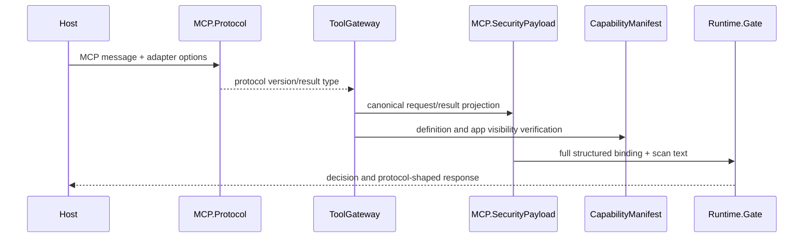

---
sigil_guard:
  id: "SP.16"
  title: "MCP v2 (2026-07-28) And Apps Contracts"
  domain: security
  status: implemented
  priority: critical
  created: "2026-07-31"
  updated: "2026-07-31"
  tags: ["mcp", "mrtr", "mcp-apps", "manifest", "confirmation", "json-rpc"]
  depends_on: ["R.08", "SP.03", "SP.08"]
---

# SP.16 - MCP v2 (`2026-07-28`) And Apps Contracts

## Executive Summary

This spec aligns SigilGuard's transport-neutral gateway with MCP v2
(`2026-07-28`). It defines canonical structured action binding, legal JSON-RPC
errors, result discrimination, MRTR handling, capability-manifest v2, app
caller visibility, and UI-resource verification without moving transport,
authorization, discovery, or rendering into core.

## Business Value

- **Problem:** The pre-release gateway can approve structurally changed actions
  and emits wire shapes that conflict with final MCP `2026-07-28`.
- **Solution:** Canonical security payloads and explicit protocol/Apps
  validation at the embedded boundary.
- **Beneficiary:** Hosts embedding SigilGuard around MCP clients, servers, or
  agent tool loops.
- **Impact:** Exact argument tampering is rejected; modern MCP responses are
  conformant; UI-origin execution has a policy boundary.

## Technical Architecture

### Overview

`MCP.SecurityPayload` strips SigilGuard guard metadata, JSON-RPC correlation
fields, and non-authorizing operational metadata while retaining complete
structured method/params or result values. The selected protocol revision is
bound separately; client capabilities and unknown extension metadata remain
bound. `MCP.Protocol` extracts the protocol version and shapes successful
results. `ToolGateway` applies manifest and app visibility checks before the
runtime gate. `MCP.AppResource` verifies bounded UI bytes and declared
capabilities while the host remains responsible for HTML validation, rendering,
and browser enforcement.

### Data Flow

### Architectural Patterns

| Pattern | Used | Justification |
|---------|------|---------------|
| GenServer | no | Protocol parsing and verification are pure. |
| Behaviour | no | Host seams already exist at the gateway boundary. |
| ETS | no | No protocol session state is introduced. |
| Telemetry | yes | Existing MCP request/result events carry added metadata. |

## Data Model

### Canonical MCP Security Payload

| Field | Type | Required | Description |
|-------|------|----------|-------------|
| `kind` | string | yes | `request` or `result`. |
| `method` | string or null | request | JSON-RPC method. |
| `protocol_version` | string or null | yes | Bound protocol revision when known. |
| `payload` | JSON value | yes | Complete params/result after the fixed metadata strip rule. |

JSON-RPC `id`, `request_id`, and `jsonrpc` are excluded because they are
correlation/encoding fields; MCP MRTR requires a new id on retry. Method,
parameter keys, numbers, booleans, null, `inputResponses`, and `requestState`
are retained. Progress, trace, logging, subscription-correlation, and display
identity metadata are not approval input. Protocol version is extracted and
bound separately. Client capabilities and unknown extension metadata remain
inside `payload` because they may change request behavior.

### Capability Manifest v2

The format marker is `sigil_guard_capability_manifest/v2`. In addition to the
SP.03 fields it binds optional `title`, `icons`, and normalized UI metadata
(`resource_uri`, sorted `visibility`). Their canonical digests participate in
the manifest preimage. `input_schema` continues to bind `x-mcp-header` bytes
and now accepts annotations only on fields statically reachable through
`properties`-only chains. Header names must be HTTP token characters,
case-insensitively unique, and mapped from `boolean`, `integer`, or `string`
fields. Sensitive parameter exposure fails closed.

Icon entries are closed maps whose sources are HTTPS URLs or valid image data
URLs. Optional MIME types are restricted to `image/*`; sizes are unique `any`
or positive `WxH` tokens; themes are `light` or `dark`. SigilGuard validates
the annotation subset it consumes, while the host remains responsible for full
JSON Schema 2020-12 validation and JavaScript-safe integer enforcement on
runtime values.

### App Resource Verification

UI resources require a `ui://` URI, `text/html;profile=mcp-app`, exactly one
`text` or Base64 `blob` content field, an expected SHA-256 digest by default,
supported CSP origin syntax, and requested permission/dedicated-domain subsets
allowed by host options. Content is bounded to 1 MiB by default. Verification
options are closed, duplicate keys fail, and dedicated domains use a
host-defined format with exact allowlist matching. `domain` and `prefersBorder`
are validated and preserved. Verification never fetches or renders the
resource.

## Module Map

| Module | Purpose |
|--------|---------|
| `lib/sigil_guard/mcp/protocol.ex` | Protocol version and result shaping. |
| `lib/sigil_guard/mcp/security_payload.ex` | Canonical MCP action/result projection. |
| `lib/sigil_guard/mcp/app_resource.ex` | UI resource digest/CSP/permission validation. |
| `lib/sigil_guard/tool_gateway.ex` | Manifest, MRTR, and app visibility enforcement. |
| `lib/sigil_guard/tool_gateway/base.ex` | MCP-shaped runtime responses. |
| `lib/sigil_guard/capability_manifest.ex` | Manifest v2 and header validation. |
| `lib/sigil_guard/context.ex` | `:app` origin normalization. |

## Integration Points

| System | Integration | Direction | Protocol |
|--------|-------------|-----------|----------|
| Host MCP adapter | passes message and optional `protocol_version` | inbound/outbound | MCP |
| Host renderer | calls `AppResource.verify/2` before rendering | inbound | MCP Apps |
| Host authorization | supplies actor/server/resource/audience context | inbound | host-owned |

## Telemetry And Observability

Existing `[:sigil_guard, :mcp, :request]` and result/gate events add
`protocol_version`, `mcp_result_type`, and `origin` where available. Raw
request state, input responses, HTML, and header values never enter telemetry.
The consolidated MCP event is emitted only after the top-level gateway has
attached protocol/result classification, including on pre-gate denials. The
protocol and result-type OTel attributes are high-cardinality and therefore
require `include_high_cardinality: true` in metric/span projections.

## Error Handling

| Error | Type | Recovery | User Impact |
|-------|------|----------|-------------|
| `-31990..-31984` | JSON-RPC error | inspect existing status/data fields | application-defined denial outside the reserved server-error band |
| `-32602` | host protocol error | include valid required per-request metadata | malformed request rejected |
| `-32020` | host transport error | resolve header/value mismatch in the adapter | MCP-reserved; never emitted by SigilGuard |
| `-32021` | host protocol error | declare the capability required by the operation | MCP-reserved; never emitted by SigilGuard |
| `-32022` | host protocol error | negotiate a supported date revision | MCP-reserved; never emitted by SigilGuard |
| `:invalid_header_annotation` | manifest error | fix schema annotation | tool withheld |
| `:sensitive_header_param` | manifest error | remove header annotation | tool withheld |
| `:app_visibility_denied` | gateway denial | expose tool to caller deliberately | call blocked |
| `:app_server_mismatch` | gateway denial | bind correct server connection | call blocked |
| `:invalid_app_resource` | resource error | fix resource shape/MIME/URI | resource withheld |
| `:missing_resource_digest` | resource error | pin expected digest | resource withheld |
| `:resource_digest_mismatch` | resource error | review and re-pin bytes | resource withheld |
| `:resource_too_large` | resource error | reduce content or review `:max_bytes` | resource withheld |
| `:domain_not_allowed` | resource error | adjust host allowlist after review | resource withheld |
| `:permission_not_allowed` | resource error | grant explicitly or remove request | resource withheld |
| `:invalid_options` | integration error | correct the closed option list | resource withheld |

## Security Considerations

- Approval binding is over structured canonical JSON, never extracted text.
- JSON-RPC ids do not confer authority and are intentionally excluded.
- `requestState` is opaque untrusted server data, not a capability; every retry
  is re-evaluated and bound with its input responses.
- `serverInfo` is self-reported display metadata and never establishes the
  trusted `mcp_server`.
- Cache `ttlMs` is freshness guidance, not trust or manifest lifetime.
- MCP `HeaderMismatch` (`-32020`) belongs to the host transport adapter;
  SigilGuard validates annotations but does not construct or compare headers.
- Missing required metadata (`-32602`), missing client capabilities (`-32021`),
  and unsupported protocol revisions (`-32022`) belong to the host protocol
  adapter.
- Only the exact `2026-07-28` revision selects v2 behavior; unknown future
  revisions must be added deliberately after protocol negotiation support.
- App-only tools are hidden from model callers and require an app caller on the
  same trusted server boundary.
- The stable Apps extension predates MCP v2 examples. The host maps its
  negotiated extension capability into v2 request metadata and discovery.
- HTML5 validation, rendering, browser origins, CSP and Permissions Policy,
  authorization, and `subscriptions/listen` delivery remain host-owned.

## Testing Strategy

| Test | Module | What It Verifies |
|------|--------|------------------|
| structured tamper | `MCP.SecurityPayloadTest` | number, boolean, key, state, and response changes alter digests |
| metadata stability | `MCP.SecurityPayloadTest` | ids, tracing, and SigilGuard metadata do not alter approval digest |
| semantic metadata | `MCP.SecurityPayloadTest` | client capabilities and vendor extensions alter approval digests |
| modern result | gateway tests | `resultType` is inserted/preserved only for the exact v2 revision |
| MRTR | gateway tests | input-required results and retries retain semantics |
| error registry | gateway tests | exact `-31990..-31984` mapping |
| manifest v2 | manifest tests | title/icons/UI/header drift and malformed annotations fail |
| app visibility | gateway tests | model/app and cross-server cases fail closed |
| UI resource | app resource tests | digest, size, domain, permission, URI, MIME, wildcard, and malformed-option cases |

## Implementation Roadmap

- [x] Implement protocol and security-payload modules.
- [x] Rewire both gateways and renumber errors.
- [x] Implement manifest v2 and app visibility.
- [x] Implement UI-resource verification.
- [x] Update docs, migration, fixtures, integrations, and release metadata.
- [x] Run the complete release gate.

## Success Metrics

| Metric | Target | Measurement |
|--------|--------|-------------|
| Structural tamper rejection | 100% | focused property/regression tests |
| Modern wire conformance | 100% named cases | gateway tests |
| Coverage | >= 95% | `mix test --cover` |
| Runtime dependencies | unchanged | `mix deps` and package audit |
| Core network calls | zero | no-network sweep |

## Sources

- [R.08](../research/R.08-mcp-2026-07-28-and-apps-security.md)
- [MCP 2026-07-28 key changes](https://modelcontextprotocol.io/specification/2026-07-28/changelog)
- [MCP request metadata](https://modelcontextprotocol.io/specification/2026-07-28/basic)
- [MCP tools](https://modelcontextprotocol.io/specification/2026-07-28/server/tools)
- [MCP Apps specification](https://github.com/modelcontextprotocol/ext-apps/blob/main/specification/2026-01-26/apps.mdx)
