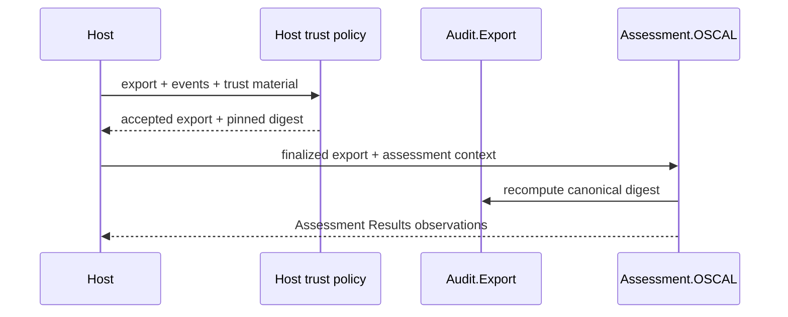

---
sigil_guard:
  id: "SP.17"
  title: "External Assessment Projection"
  domain: security
  status: implemented
  priority: high
  created: "2026-08-15"
  updated: "2026-08-15"
  tags: ["oscal", "assessment", "audit", "evidence", "interoperability"]
  depends_on: ["R.10", "SP.05"]
---

# SP.17 - External Assessment Projection

## Executive Summary

This spec defines a pure, optional projection from a finalized SigilGuard audit
export and host-owned assessment context into OSCAL Assessment Results v1.2.3.
It emits evidence-backed observations only. It never infers findings, risks, or
control satisfaction, never mutates the export, and performs no network or
clock access.

## Business Value

- **Problem:** External assessment tooling does not consume SigilGuard's native
  audit package, while a naive conversion could overstate system compliance.
- **Solution:** A schema-conformant observation projection with an externally
  pinned evidence digest, exact reviewed-control scope, deterministic identity,
  and machine-readable loss markers.
- **Beneficiary:** Host applications and assessors that already own the OSCAL
  Assessment Plan, System Security Plan, control mappings, and trust policy.
- **Impact:** SigilGuard evidence becomes referencable by OSCAL tooling without
  weakening or changing existing evidence and Agent Trust contracts.

## Technical Architecture

### Overview

`SigilGuard.Assessment.OSCAL.project/2` accepts a finalized
`SigilGuard.Audit.Export` map and a closed atom-keyed context map. The adapter
validates the export shape, recomputes its canonical SHA-256 digest, compares it
with the host's pinned digest, validates the assessment context, and returns an
OSCAL JSON-shape map.

The evidence `href` MUST resolve to the exact bytes returned by
`Audit.Export.canonical_bytes/1`. The adapter cannot dereference the URI, so the
host is responsible for publishing those bytes without reformatting them. This
makes the OSCAL `rlink` hash a hash of the referenced resource, rather than only
a semantic-content digest.

The adapter is a serializer and integrity-binding check, not an assessor. The
host decides which controls were reviewed and supplies every observation and
its control associations. The adapter does not inspect raw audit events, copy
actors or payloads, derive a verdict, or verify the host's complete checkpoint,
anchor, witness, or chain policy.

### Data Flow



### Architectural Patterns

| Pattern | Used | Justification |
|---------|------|---------------|
| GenServer | no | Projection is deterministic and stateless. |
| Behaviour | no | The host passes context directly; no side effect is abstracted. |
| ETS | no | The adapter stores no identity or assessment state. |
| Telemetry | no | A pure document conversion must not leak assessment metadata. |
| Network | no | URI references are serialized and never dereferenced. |

## Public API

```elixir
@spec project(Audit.Export.t(), context()) ::
        {:ok, assessment_results()} | {:error, project_error()}
def project(export, context)
```

The function is total over arbitrary terms. It returns an error tuple rather
than raising for malformed exports, malformed context, unsupported keys, or
non-canonicalizable export content.

## Input Data Model

All context maps are closed and use the atom keys listed below. String-keyed
maps and unknown keys return `{:error, :invalid_context}`. No external string
is converted to an atom.

### Root Context

| Field | Type | Required | Description |
|-------|------|----------|-------------|
| `:assessment_results_uuid` | UUIDv4/v5 string | yes | Stable host-owned identity for the Assessment Results document. |
| `:assessment_plan_href` | locator URI-reference string | yes | Governing Assessment Plan. Must identify a distinct absolute, network-path, absolute-path, or relative-path resource; fragment/query-only references are rejected because the adapter does not embed an Assessment Plan. |
| `:title` | non-empty single-line string | yes | Document metadata title. |
| `:version` | trimmed non-empty string | yes | Host-owned document version. |
| `:last_modified` | UTC ISO 8601 string | yes | Metadata timestamp; no current time is generated. |
| `:result` | result context | yes | Scope, collection window, and observations. |
| `:evidence` | evidence context | yes | Finalized export location and pinned digest. |

### Result Context

| Field | Type | Required | Description |
|-------|------|----------|-------------|
| `:title` | non-empty single-line string | yes | Result title. |
| `:description` | non-empty string | yes | Result description. |
| `:start` | UTC ISO 8601 string | yes | Evidence collection start. |
| `:end` | UTC ISO 8601 string | no | Collection end; must not precede `:start`. |
| `:reviewed_controls` | non-empty list of unique OSCAL token strings | yes | Exact controls selected by the host. `include-all` is never generated. |
| `:observations` | non-empty observation list | yes | Host-authorized observations. |

### Evidence Context

| Field | Type | Required | Description |
|-------|------|----------|-------------|
| `:href` | locator URI-reference string | yes | Location of the exact `Audit.Export.canonical_bytes/1` output; fragment/query-only references are rejected because the adapter does not embed the export bytes. |
| `:digest` | 64-character lowercase SHA-256 hex | yes | Expected `Audit.Export.digest/1`; mismatch fails. |
| `:media_type` | trimmed non-empty string | no | Defaults to `application/json`. |
| `:description` | non-empty string | no | Defaults to a neutral evidence description. |

### Observation Context

| Field | Type | Required | Description |
|-------|------|----------|-------------|
| `:description` | non-empty string | yes | Human-readable host observation. |
| `:collected` | UTC ISO 8601 string | yes | Must fall within the result collection window. |
| `:control_ids` | non-empty unique token list | yes | Must be a subset of `:reviewed_controls`. |
| `:subjects` | non-empty subject list | yes | Host-owned UUID references to the assessed system elements. |
| `:title` | non-empty single-line string | no | Observation title. |
| `:expires` | UTC ISO 8601 string | no | Must be later than `:collected`. |
| `:methods` | unique list of method atoms | no | `:test`, `:examine`, `:interview`, or `:unknown`; defaults to `[:test]`. |
| `:sigilguard` | closed local-property map | no | Optional contextual labels; never assessment conclusions. |

A subject has required `:uuid` and `:type`; optional `:title` is single-line.
Allowed types are `:component`, `:inventory_item`, `:location`, `:party`,
`:user`, and `:resource`.

The optional `:sigilguard` map accepts only `:verdict`, `:risk_level`,
`:phase`, and `:sink`, each as a trimmed non-empty string. These values are
supplied by the host and emitted as private-namespace properties. The adapter
never derives them and exposes no `:claim`, finding state, or
assessment-result field.

## Output Data Model

The returned map has root key `"assessment-results"` and `"oscal-version"`
exactly `"1.2.3"`. It contains one result with:

- explicit `reviewed-controls/control-selections/include-controls` entries;
- one OSCAL observation for each host observation;
- no `findings`, `risks`, or result-level assessment `attestations`; and
- one back-matter resource referenced by every observation.

The back-matter resource contains an `rlink` with the evidence `href`, media
type, and `SHA-256` hash of `Audit.Export.canonical_bytes/1`.
`relevant-evidence.description` describes the export; it never stores verdict
or claim data.

### SigilGuard Property Namespace

All local properties use `https://sigilguard.dev/ns/oscal`.

Metadata always contains:

| Name | Value |
|------|-------|
| `projection-profile` | `assessment-observation/v1` |
| `authoritative-artifact` | `sigil_guard.audit.export` |
| `verification` | `host-policy-required` |
| `loss` | one entry each for `signature-binding`, `actor-binding`, `issuance-time-binding`, and `assessment-conclusion` |

Each observation contains one `control-id` property per associated control and
the optional host-supplied `verdict`, `risk-level`, `phase`, and `sink`
properties. These properties are labels in the SigilGuard namespace, not OSCAL
finding states.

### Deterministic UUIDs

The host root UUID is preserved. Child identifiers use UUIDv5 with that UUID as
the namespace:

- resource: `"resource:" <> export_digest`;
- result: `"result:" <> JCS(result context plus export digest)`; and
- observation: `"observation:" <> zero_based_index <> ":" <>
  JCS(projected observation content without its UUID)`.

UUIDv5 version and variant bits follow RFC 9562. The same export and context
produce byte-equivalent JSON data; no random source, process state, clock, or
application environment participates.

## Module Map

| Module | Purpose |
|--------|---------|
| `lib/sigil_guard/assessment/oscal.ex` | Closed context validation, digest binding, deterministic UUIDs, and Assessment Results projection. |
| `lib/sigil_guard/audit/export.ex` | Existing canonical export digest; consumed without modification. |
| `test/sigil_guard/assessment/oscal_test.exs` | Semantic, malformed, tamper, expiry, privacy, and compatibility tests. |
| `test/fixtures/oscal/assessment-results-observation.json` | OSCAL v1.2.3-schema-validated golden output. |

## Integration Points

| System | Integration | Direction | Protocol |
|--------|-------------|-----------|----------|
| Host trust policy | verifies native evidence and pins digest before projection | inbound | Elixir API |
| Assessment Plan / SSP owner | supplies plan reference, reviewed controls, subjects, and observations | inbound | host context |
| OSCAL tooling | consumes returned map or encoded JSON | outbound | OSCAL Assessment Results v1.2.3 |

The host may encode the returned map with Jason. SigilGuard does not write a
file, dereference a URI, publish an artifact, or register it with a service.

## Error Handling

| Error | Cause | Recovery |
|-------|-------|----------|
| `:invalid_export` | wrong export shape, non-JSON content, invalid UTF-8, or atom/string key collision | finalize a valid `Audit.Export` first |
| `:invalid_context` | wrong map type, unknown keys, missing fields, malformed text, subject, or local property | supply the closed context contract |
| `:invalid_uuid` | root or subject is not UUIDv4/v5 | supply a valid stable UUID |
| `:invalid_timestamp` | timestamp is not UTC ISO 8601 or violates ordering/window rules | correct the host collection times |
| `:invalid_uri` | plan/evidence locator is malformed, empty, or fragment/query-only | supply a distinct RFC 3986 locator URI reference |
| `:invalid_digest` | expected digest is not lowercase SHA-256 hex | supply `Audit.Export.digest/1` output |
| `:export_digest_mismatch` | finalized export bytes differ from the pinned digest | reject and investigate tampering/stale context |
| `:invalid_reviewed_controls` | empty, duplicate, or malformed control list | provide exact unique OSCAL tokens |
| `:invalid_observation` | empty observations, duplicate methods/subjects, or malformed observation | correct the host observation |
| `:unknown_control` | an observation names a control outside result scope | add it deliberately to reviewed scope or remove the association |

## Security Considerations

- The expected export digest is mandatory and compared before output is built.
- The digest is exactly SHA-256 over `Audit.Export.canonical_bytes/1`; hosts
  must publish those exact bytes at the evidence reference.
- Projection never authenticates the host or substitutes for
  `Audit.Export.verify/3`, audit-chain HMAC verification, signature thresholds,
  anchors, or witness policy.
- No finding or control-satisfaction state is accepted as input or emitted.
- Exact reviewed controls are required; `include-all` is forbidden.
- Each observation must identify its controls and assessed subjects explicitly.
- Actor and raw audit metadata are not read, preventing accidental identity or
  payload disclosure from the aggregate export.
- Loss markers remain in the emitted document and state that signature, actor,
  issuance-time, and assessment-conclusion bindings are absent.
- URI references are data only. Fragment/query-only locators are rejected, and
  the adapter performs no HTTP, filesystem, or other dereference.
- Export content is prevalidated as unambiguous JSON data before the existing
  export digest function runs; duplicate normalized keys and runtime terms are
  rejected.
- Closed atom-keyed maps avoid dynamic atom creation and silently ignored
  security options.
- Timestamp checks use supplied values only; there is no hidden real-clock
  dependency.

## Testing Strategy

| Test | What It Verifies |
|------|------------------|
| golden projection | exact deterministic fixture and OSCAL v1.2.3 schema conformance |
| observation-only | findings, risks, assessment attestations, and satisfaction states are absent |
| digest tamper | changed export with pinned old digest fails |
| malformed matrix | invalid maps, unknown keys, UTF-8, UUIDs, locator URIs, digests, controls, subjects, methods, and labels fail closed |
| scope matrix | observation controls must be within the exact reviewed set |
| time/expiry matrix | reversed windows, out-of-window collection, and stale expiry fail |
| privacy | raw actor, payload, and unknown export metadata are never copied |
| deterministic replay | repeated calls return equal output and stable UUIDv5 values; the pure adapter has no replay state to bypass |
| compatibility | export input and digest are unchanged; legacy export fixtures remain byte-equivalent |
| totality | arbitrary terms return tagged errors without raising |
| recursive property | generated nested Erlang terms cannot make `project/2` raise or return an untagged result |

## Implementation Roadmap

- [x] Correct R.10 and record the observation-only authority boundary.
- [x] Implement the closed context and digest-binding adapter.
- [x] Add deterministic UUIDv5 identity and private loss properties.
- [x] Add the golden fixture and focused security/compatibility tests.
- [x] Validate the fixture against the official OSCAL v1.2.3 JSON Schema.
- [x] Run the repository quality gates.

## Success Metrics

| Metric | Target | Measurement |
|--------|--------|-------------|
| False assessment conclusions | zero emitted fields | focused absence tests |
| Digest mismatch acceptance | zero | tamper matrix |
| Determinism | identical output for identical input | repeat/golden tests |
| Existing export changes | zero bytes/API changes | compatibility tests and diff review |
| Runtime dependencies/network | zero added | dependency and no-network review |
| Coverage | >= 95% repository-wide | `mix test --cover` |

## Sources

- [R.10](../research/R.10-external-assessment-formats-and-evidence-projection.md)
- [OSCAL v1.2.3 metaschema sources](https://github.com/usnistgov/OSCAL/tree/v1.2.3/src/metaschema)
- [OSCAL Assessment Results model](https://pages.nist.gov/OSCAL/learn/concepts/layer/assessment/assessment-results/)
- [RFC 9562: Universally Unique IDentifiers](https://www.rfc-editor.org/rfc/rfc9562.html)
