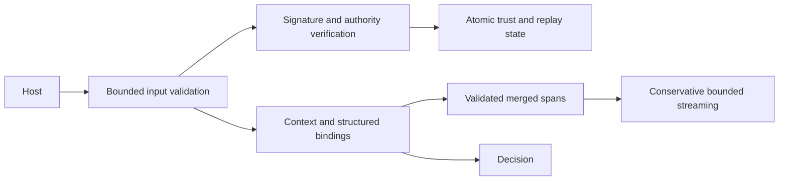

---
sigil_guard:
  id: "SP.18"
  title: "Security Audit Remediation"
  domain: security
  status: implemented
  priority: critical
  created: "2026-09-06"
  updated: "2026-09-06"
  tags: [security, audit, remediation]
  depends_on: ["SP.01", "SP.02", "SP.07"]
---

# SP.18 - Security Audit Remediation

## Executive Summary

Harden trust, policy, replay, streaming and verification with deterministic
regression evidence. Keep the three runtime dependencies, native Elixir implementation,
local trust bootstrap, host-owned transports and v3 envelopes.

## Business Value

Prevent unauthorized trust updates, revoked issuers, replay, policy bypass and
credential disclosure. Make maintenance, packaging and performance evidence
reproducible without suggesting that scanner heuristics solve prompt injection.

## Technical Architecture

Authority is pinned on the first host-trusted bundle. At an unchanged root
version, keys and role authorizations must match the pin. Rotation authenticates
the new root key material with both root quorums; any delegated authority not
carried in the rotation must be authorized by the new root signing the successor
bundle. A bundle delegate cannot appoint its own replacement. Verification and
cache acceptance are serialized in a node-local load transaction; cache transitions also
protect direct verified-snapshot callers.

Replay durations cover the complete UTC acceptance window, including skew and
the inclusive expiry boundary. Caller TTLs can extend this duration only. ETS
expiry uses monotonic time. Quota updates are atomic and expired identities are
reclaimed. Diagnostic retention and untrusted work have explicit budgets.

The v3 normalization bytes remain unchanged. Nil-valued map entries in signed
application payloads are rejected as ambiguous; optional profile/context fields
continue their specified omission rules. This narrows accepted inputs instead
of silently giving existing signatures a different meaning. Lists retain JSON
null. MCP scan text includes object keys; signed structure stays separate.

A finite regex holdback is not proof that an incomplete unbounded match is safe.
Streaming must retain incomplete candidates or conservatively buffer until end
of input, with a fail-closed byte budget. Emitted text must contain complete UTF-8
codepoints. Whole-buffer matching remains the authority for final emission.

## Data Model

No new signed data model. Internal state may add retention/capacity metadata.
New runtime options and helper APIs require docs and specs. Error atoms should
reuse existing malformed-input categories where their meaning applies.

## Module Map

| Paths | Responsibility |
|---|---|
| `lib/sigil_guard/trust_bundle/{verify,cache,quarantine}.ex` | Authority continuity, atomic acceptance, bounded diagnostics |
| `lib/sigil_guard/agent_card.ex` | Issuer role, expiry, threshold and revocations |
| `lib/sigil_guard/{hooks,replay_store,policy}.ex` | Module loading, monotonic retention, atomic quotas |
| `lib/sigil_guard/attestation/{digest,envelope}.ex` | Unambiguous payloads and bounded signature work |
| `lib/sigil_guard/runtime/{gate,stream}.ex` | Complete boundary context and conservative emission |
| `lib/sigil_guard/{scanner,patterns}.ex` | Validated spans and explicit pattern selection |
| `lib/sigil_guard/canonical/jcs.ex` | Correct finite floats and malformed terms |
| `lib/sigil_guard/mcp/security_payload.ex` | Key and value scan projection |
| `mix.exs`, `mix.lock`, `.github/workflows/`, `bin/`, `bench/` | Dependency, package, mutation and benchmark evidence |

## Error Handling

Malformed or ambiguous signed payloads fail with `:invalid_payload`. Unauthorized
bundle authority changes fail with `:invalid_bundle_format`; revoked card issuers
fail closed. Streams emit no further bytes on invalid UTF-8, resource exhaustion,
block or confirmation. Invalid configured hooks are not silently skipped.

## Security Considerations

Actor, phase, origin, sink, trust zone and actual action/payload bindings must
reach policy evaluation. Tool names are policy facts, not proof of a verified
manifest or side effects. Cached revocations cannot be undone during a boot.
Bounded stores never evict live replay entries to make space. Root pinning and
cross-boot persistence remain host obligations. No hosted permission or repository
visibility changes are part of remediation.

## Testing Strategy

Keep deterministic regressions for the security invariants. Preserve existing
signed vectors; cover tamper, malformed data, expiry/skew, cold module loading,
concurrent state transitions, Unicode byte partitions and overlapping matches.
Run independent finite-float vectors, bounded mutation campaigns, unpacked Hex
consumer checks and the supported Elixir/OTP matrix. Maintain >=95% coverage.

## Implementation Roadmap

The M11 checklist in `docs/tasks/sigil-tasks.md` tracks each finding. Run the
canonical quality gates before logical commits; document remaining external-only
checks and advisory exceptions without treating them as passing evidence.

## Sources

- [SP.01 published digest contracts](SP.01-sigilguard-trust-profile.md)
- [SP.02 bundle authority](SP.02-embedded-trust-bundles.md)
- [SP.07 streaming contract](SP.07-runtime-gate-and-streaming-contracts.md)

## Mutation Tool Equivalence Accounting

Muex 0.9.1 reports three survivors in the unchanged verdict implementation
that are equivalent over its closed five-atom input domain: map-entry order,
swapping `strongest/2` parameters, and using `>` instead of `>=` when both
branches return the same atom for equal ranks. Ranks themselves remain public
integers 0..4; new tests must kill endpoint mutations.

The verdict gate reports these three as equivalent, never as killed. An exact
SHA-256 of the complete source plus exact original/mutated fragments binds the
proof to this implementation; any change requires review. Other survivors,
timeouts, empty runs and invalid results lacking compiler diagnostics fail.
The behavioral mutation score remains 100%. This replaces the raw Muex exit
status in the canonical gate because that status counts proven equivalents as
failures. Invalid compiler mutations remain separately counted and reported.
