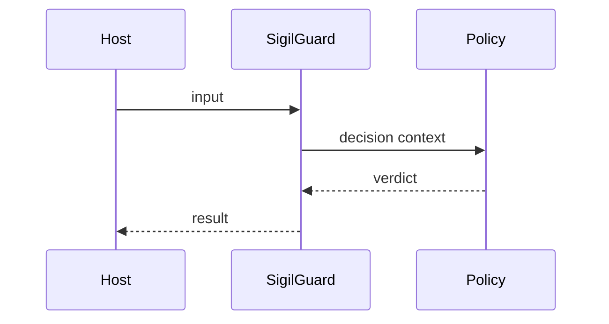

---
sigil_guard:
  id: "[PREFIX].[NUMBER]"
  title: "[Title]"
  domain: security
  status: draft
  priority: medium
  created: "[YYYY-MM-DD]"
  updated: "[YYYY-MM-DD]"
  tags: []
  depends_on: []
---

# [PREFIX].[NUMBER] - [Title]

## Executive Summary

[One to three sentences describing what this spec defines and why it matters.]

## Business Value

- **Problem:** [What is broken or missing.]
- **Solution:** [What this spec delivers.]
- **Beneficiary:** [Who benefits.]
- **Impact:** [Measurable outcome.]

## Technical Architecture

### Overview

[High-level approach and design decisions.]

### Data Flow

### Architectural Patterns

| Pattern | Used | Justification |
|---------|------|---------------|
| GenServer | no | |
| Behaviour | yes | |
| ETS | no | |
| Telemetry | yes | |

## Data Model

| Field | Type | Required | Description |
|-------|------|----------|-------------|
| `id` | `String.t()` | yes | |

## Module Map

| Module | Purpose |
|--------|---------|
| `lib/sigil_guard/...` | |
| `test/sigil_guard/...` | |

## Integration Points

| System | Integration | Direction | Protocol |
|--------|-------------|-----------|----------|
| Host app | | inbound | Elixir API |

## Telemetry And Observability

| Event | Type | Metadata | Purpose |
|-------|------|----------|---------|
| `[:sigil_guard, ...]` | event | `%{}` | |

## Error Handling

| Error | Type | Recovery | User Impact |
|-------|------|----------|-------------|
| `:invalid_input` | return tuple | reject | caller handles |

## Security Considerations

- **Authentication:**
- **Authorization:**
- **Input validation:**
- **Data protection:**
- **Replay resistance:**

## Testing Strategy

| Test | Module | What It Verifies |
|------|--------|------------------|
| happy path | | |
| tamper path | | |
| malformed input | | |

## Implementation Roadmap

- [ ] Step 1:
- [ ] Step 2:
- [ ] Step 3:

## Success Metrics

| Metric | Target | Measurement |
|--------|--------|-------------|
| Coverage | >= 95% | `mix test --cover` |

## Sources

- [Research note](../research/)
