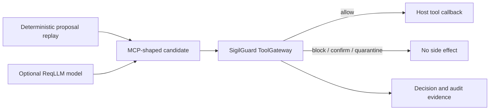

# SigilGuard Livebook Tutorials

These notebooks teach SigilGuard as a security boundary, not as a bag of API
calls. The running example is an Elixir agent that reads useful but untrusted
content, proposes tool calls, and occasionally tries to move data somewhere it
should not. We start with one deterministic decision and finish with signed,
portable evidence for the complete tool and agent lifecycle.

Every chapter is executable. Code cells assert the important outcomes so a
change in the library cannot quietly turn a security lesson into stale prose.
The repository validates the whole track offline with:

```bash
mix sigil.livebook_check
```

## Choose A Route

For self-study, follow the chapters in this order:

1. [Quick Start](quick-start.livemd) — scan a payload and make the first
   boundary decision.
2. [Policy And The Lethal Trifecta](policy-and-lethal-trifecta.livemd) — turn
   source, sink, sensitivity, and trust into policy data.
3. [An AI Agent Under Attack](ai-agent-under-attack.livemd) — put a real or
   replayed model proposal behind an enforceable tool boundary.
4. [The Agent Trust Gateway](agent-trust-gateway.livemd) — pin the tool,
   approve the exact action, and sign the evidence.
5. [Threat Scenarios](threat-scenarios.livemd) — exercise poisoning, rug pull,
   schema injection, and stale approval defenses.
6. [MCP v2 And MCP Apps](mcp-v2-and-apps.livemd) — preserve structured MCP
   semantics and verify browser-facing resources.
7. [Runtime, Streaming, And Telemetry](runtime-streaming-and-telemetry.livemd)
   — stop split secrets, add deny-side extensions, and observe safely.
8. [Trust Bundles, Identity, And Vault](trust-bundles-identity-and-vault.livemd)
   — operate local trust material and host-owned secrets.
9. [Agent-To-Agent Trust](agent-to-agent-trust.livemd) — authenticate peer
   capabilities without trusting peer content.
10. [Audit Export And Proofs](audit-export-and-proofs.livemd) — build the
    evidence chain, proofs, anchor record, and OSCAL observation.
11. [Hermes Integration Stub](hermes-integration.livemd) — place the same gate
    in an MCP framework seam without adding a framework dependency.

The chapters are deliberately small enough to run independently. Each one
reintroduces the context it needs rather than relying on hidden notebook state.

## A 45-Minute Conference Talk

The strongest talk is a story about authority. A model can propose; it cannot
authorize itself.

| Time | Notebook | Beat |
|------|----------|------|
| 0–5 min | Quick Start | Show the five actions and explain the boundary tuple. |
| 5–17 min | AI Agent Under Attack | Let the model see a poisoned result. Reveal the proposed tool call, then stop it before the callback. |
| 17–29 min | Agent Trust Gateway | Pin the manifest, issue exact approval, attach signed evidence, then change one byte. |
| 29–35 min | Runtime, Streaming, And Telemetry | Split a credential across chunks and show why holdback matters. |
| 35–42 min | Audit Export And Proofs | Verify one event without replaying the whole log and project a bounded assessment observation. |
| 42–45 min | Quick Start summary | Return to the claim: useful AI, deterministic authority, signed evidence. |

The code cells marked **On stage** are the reveal points. Evaluate the setup
cells before the room arrives, collapse implementation-heavy sections, and
keep the deterministic AI replay ready even when you intend to use a provider.

## A 90-Minute Workshop

Run Quick Start, Policy, AI Agent Under Attack, Agent Trust Gateway, Threat
Scenarios, and Audit in full. Use MCP v2/Apps, runtime extensions, bundles, and
A2A as choose-your-own-depth exercises. Ask attendees to change one boundary
dimension at a time and predict the decision before evaluating the cell.

Good exercises are deliberately adversarial:

- Change only the sink from `:model` to `:external`.
- Alter the approved payload after a confirmation token is issued.
- Move a tool manifest from read-only to network-capable.
- Split a secret at a different byte boundary.
- Reorder one delegation hop.
- Change the audit event selected by an inclusion proof.

## How The AI Demo Works

The AI chapter has two planners and one authority path:



Without a provider key, the notebook replays a fixed worst-case proposal and
runs entirely offline. To use a live OpenAI model, add `OPENAI_API_KEY` as a
Livebook secret and reevaluate the setup cell. Livebook exposes it to notebook
code as `LB_OPENAI_API_KEY`; the notebook then installs the pinned ReqLLM
version and asks the model for a tool proposal. The provider call may vary — a
responsible model can refuse the poisoned instruction — but the fixed replay
still proves the denial path on every run.

This separation is intentional. A conference demo should make the
non-deterministic part interesting, not make the security conclusion
non-deterministic. The model never owns the callback and ReqLLM never executes
the demo tool automatically. The host extracts the proposal, constructs the
request, asks SigilGuard, and dispatches only `:allow`.

Never paste a provider key into a code cell or commit notebook output that
contains one. Livebook's secret store is the expected path. The demo payloads
use documented synthetic credentials.

## What The Track Covers

| Capability group | Primary chapter |
|------------------|-----------------|
| Scanner, redaction, quarantine, decisions, contexts, verdict ordering | Quick Start |
| Boundary policy files, repo policy, output contracts, lethal trifecta | Policy And The Lethal Trifecta |
| Model proposals and safe tool dispatch | An AI Agent Under Attack |
| Capability manifests, ToolGateway, confirmations, attestations, JCS/DSSE, replay | The Agent Trust Gateway |
| Tool poisoning, schema injection, rug pulls, confused authority | Threat Scenarios |
| MCP `2026-07-28`, MRTR, structured security payloads, MCP Apps resources | MCP v2 And MCP Apps |
| Chunk-safe streams, lifecycle hooks, adaptive detector seam, telemetry, OTel mapping | Runtime, Streaming, And Telemetry |
| Offline trust bundles, cache and quarantine, pattern sets, identity, AES-256-GCM vault | Trust Bundles, Identity, And Vault |
| Agent cards, peer capability binding, delegation, unknown-peer quarantine | Agent-To-Agent Trust |
| HMAC chains, checkpoints, inclusion/consistency proofs, witnesses, anchors, exports, CloudEvents, OSCAL | Audit Export And Proofs |
| Transport contexts and framework interception | Hermes Integration Stub |

Host-owned concerns remain host-owned in the tutorials: transport negotiation,
OAuth, complete JSON Schema validation, browser sandbox/CSP construction,
durable vault storage, external audit-anchor HTTP, and provider credentials.
The notebooks show SigilGuard's seam for each concern without pretending the
library operates the surrounding system.

## Dependency Modes

From a repository checkout, setup cells install the local project and reuse
its `config/config.exs` and `mix.lock`. When a Run in Livebook badge imports a
single notebook and the checkout is not present, the same setup falls back to
`{:sigil_guard, "~> 1.0"}` from Hex. This is the distinction recommended by
Livebook's package-tutorial guidance and keeps local development reproducible
without breaking the badge path.

The optional live AI path is the only chapter that adds a provider library.
It pins ReqLLM to the version used to write and rehearse the talk. The normal
offline validation never installs it and never performs network I/O.

## Rehearsal Checklist

- Run `mix sigil.livebook_check` from a clean checkout.
- Open the exact Git revision you will present and evaluate the talk path once
  from top to bottom.
- If using live AI, verify the Livebook secret and model access, then keep the
  replay mode as the immediate fallback.
- Clear outputs containing provider responses before publishing a recording or
  sharing the notebook.
- Increase editor and output font sizes before screen sharing.
- Do not attach the notebook runtime to a production node for a conference
  demo; all examples are designed for Livebook's standalone runtime.

## Primary Documentation Used

- [Livebook: documentation with `Mix.install`](https://livebook.hexdocs.pm/use_cases.html)
- [Livebook: shared secrets](https://livebook.hexdocs.pm/shared_secrets.html)
- [Livebook: runtimes](https://livebook.hexdocs.pm/runtime.html)
- [ReqLLM: getting started and tool calling](https://req-llm.hexdocs.pm/getting-started-3.html)
- [ReqLLM: canonical tool-call data structures](https://req-llm.hexdocs.pm/data-structures.html)
